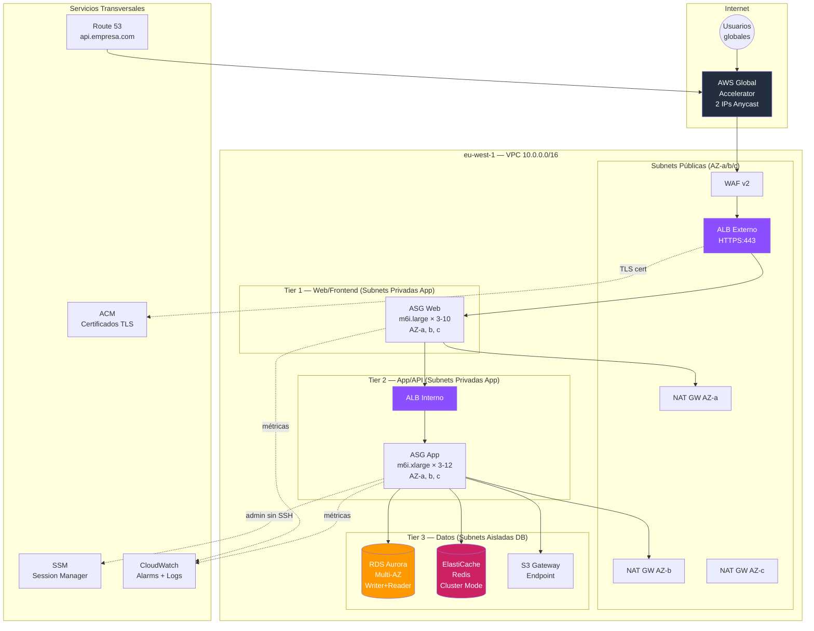
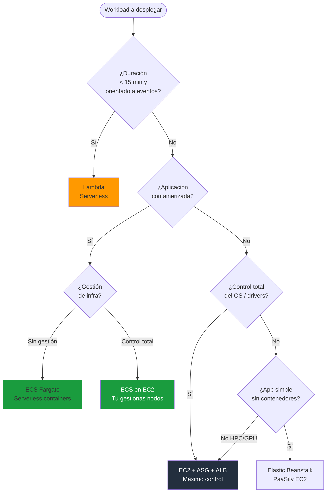
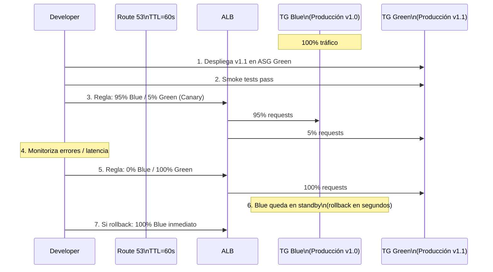
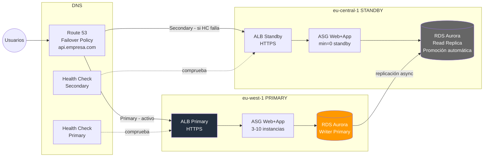
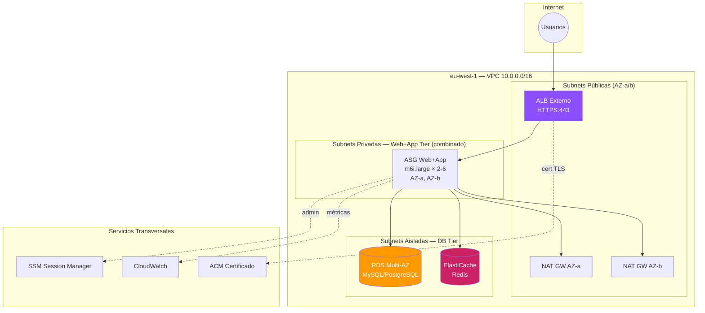

# AWS EC2 Compute — SA Associate: Mapa Conceptual Completo

> **Objetivo**: Dominar compute basado en EC2 para arquitecturas 2-tier y 3-tier.
> **Nivel**: AWS Solutions Architect Associate (SAA-C03).
> **Variables asumidas**: Región=`eu-west-1` | Tráfico=`500 RPS` | SLO p95=`200ms`

---

## Índice

1. [EC2 vs ECS/Fargate vs Lambda: árbol de decisión](#1-ec2-vs-ecsfargate-vs-lambda-árbol-de-decisión)
2. [Parte A — Mindmap jerárquico](#2-parte-a--mindmap-jerárquico)
3. [Parte B — Diagramas Mermaid + AWS Diagrams PNG](#3-parte-b--diagramas-mermaid) (3-tier, árbol decisión, Blue/Green, Multi-Region, **2-tier**)
4. [EC2: internals y configuración](#4-ec2-internals-y-configuración)
   - 4.5 [Placement Groups](#45-placement-groups)
   - 4.6 [Instance Metadata Service (IMDSv2)](#46-instance-metadata-service-imdsv2)
5. [Auto Scaling Group: mecánica completa](#5-auto-scaling-group-mecánica-completa)
   - 5.5 [Instance Refresh](#55-instance-refresh-actualización-gradual-de-ami)
6. [Elastic Load Balancing: ALB vs NLB](#6-elastic-load-balancing-alb-vs-nlb)
7. [Route 53: políticas de routing](#7-route-53-políticas-de-routing)
8. [Global Accelerator: cuándo y por qué](#8-global-accelerator-cuándo-y-por-qué)
9. [Patrones arquitectónicos](#9-patrones-arquitectónicos)
10. [Seguridad y redes](#10-seguridad-y-redes)
11. [Coste y optimización](#11-coste-y-optimización)
12. [Ejemplo E2E 1: Fintech — Plataforma de pagos](#12-ejemplo-e2e-1-fintech--plataforma-de-pagos)
13. [Ejemplo E2E 2: E-Commerce — Marketplace](#13-ejemplo-e2e-2-e-commerce--marketplace)
14. [Ejemplo E2E 3: Healthcare — Sistema clínico](#14-ejemplo-e2e-3-healthcare--sistema-clínico)
15. [Checklist de examen y exam traps](#15-checklist-de-examen-y-exam-traps)

---

## 1. EC2 vs ECS/Fargate vs Lambda: árbol de decisión

```
¿Cuál plataforma de compute usar?
│
├── ¿El workload es orientado a eventos / corta duración (<15 min)?
│   └── Sí → Lambda (serverless, pago por invocación)
│
├── ¿Es una aplicación containerizada?
│   ├── ¿Sin gestión de infraestructura?
│   │   └── ECS Fargate o EKS Fargate
│   └── ¿Control total del OS / GPU / networking avanzado?
│       └── ECS EC2 o EKS EC2
│
├── ¿Aplicación tradicional (no containerizada)?
│   ├── ¿Necesitas control del OS, kernel, drivers?
│   │   └── EC2 → tu caso (SAA-C03 foco principal)
│   └── ¿Web app sin gestión de infra (simple)?
│       └── Elastic Beanstalk (abstrae EC2 + ASG + ALB)
│
└── ¿Workload de alto rendimiento computacional (HPC)?
    └── EC2 con Cluster Placement Group + EFA
```

### Cuándo EC2 + ASG + ELB es la respuesta correcta en el examen

| Señal en el enunciado | Servicio adecuado |
|----------------------|-------------------|
| "migrar aplicación existente sin refactorizar" | EC2 |
| "control total del sistema operativo" | EC2 |
| "aplicación stateful que requiere sesiones persistentes" | EC2 + ALB (sticky sessions) |
| "necesita GPU / instancias bare metal" | EC2 |
| "cargas de trabajo con picos predecibles e impredecibles" | EC2 + ASG |
| "alta disponibilidad multi-AZ con balanceo de carga" | EC2 + ASG + ALB |
| "microservicios en contenedores sin gestionar servidores" | ECS Fargate |
| "funciones event-driven cortas" | Lambda |

---

## 2. Parte A — Mindmap jerárquico

```
EC2 COMPUTE (SAA-C03)
│
├── 1. EC2 INSTANCE
│   ├── AMI
│   │   ├── AWS managed (Amazon Linux 2023, Windows, Ubuntu)
│   │   ├── AWS Marketplace (software preinstalado)
│   │   ├── Custom AMI (golden image: OS + app + config)
│   │   └── AMI cross-region copy (disaster recovery)
│   │
│   ├── Familias de instancias
│   │   ├── t3/t4g   → Burstable (dev, bajo coste, CPU credits)
│   │   ├── m5/m6i   → General purpose (web servers, app servers)
│   │   ├── c5/c6i   → Compute optimized (CPU-intensive, web front-end)
│   │   ├── r5/r6i   → Memory optimized (in-memory DB, Redis, JVM)
│   │   ├── i3/i4i   → Storage optimized (OLTP, high IOPS local NVMe)
│   │   └── p3/g4    → Accelerated (ML, GPU, media encoding)
│   │
│   ├── User Data
│   │   ├── Script bash ejecutado en primer boot (root)
│   │   ├── Solo 1 vez (a menos que cloud-init configured)
│   │   └── Usos: instalar paquetes, clonar repo, configurar agente
│   │
│   ├── Storage
│   │   ├── EBS (block storage, persistente)
│   │   │   ├── gp3: $0.08/GB, 3K IOPS base, hasta 16K IOPS independiente
│   │   │   ├── gp2: $0.10/GB, IOPS ligados al tamaño (3 IOPS/GB)
│   │   │   ├── io2: alta persistencia IOPS, Multi-Attach, <1ms latencia
│   │   │   ├── st1: throughput HDD, big data, secuencial
│   │   │   └── sc1: cold HDD, archivos de bajo acceso
│   │   ├── EFS (NFS compartido, multi-AZ, multi-instancia)
│   │   │   ├── Standard: $0.30/GB, acceso frecuente
│   │   │   └── Infrequent Access: $0.025/GB + $0.01/GB acceso
│   │   └── Instance Store (NVMe local, ephemeral, máximo rendimiento)
│   │       └── Datos perdidos si la instancia para/termina
│   │
│   ├── ENI (Elastic Network Interface)
│   │   ├── 1 ENI primaria por defecto por instancia
│   │   ├── ENIs adicionales: múltiples IPs, múltiples SGs
│   │   └── ENI "failover": mover Elastic IP entre instancias
│   │
│   ├── Placement Groups
│   │   ├── Cluster   → misma rack, latencia mínima, HPC, 1 sola AZ
│   │   ├── Spread    → racks distintos, máx 7/AZ, instancias críticas
│   │   └── Partition → grupos aislados, Hadoop/Kafka/Cassandra
│   │
│   └── IMDS (Instance Metadata)
│       ├── IMDSv1: sin token → vulnerable a SSRF
│       └── IMDSv2: token TTL → requerido para hardening PCI/CIS
│
├── 2. AUTO SCALING GROUP
│   ├── Launch Template (recomendado) vs Launch Configuration (legacy)
│   │   └── Launch Template soporta: mezcla Spot+OnDemand, versiones
│   │
│   ├── Políticas de escalado
│   │   ├── Target Tracking → "mantén CPU al 60%"  [más simple]
│   │   ├── Step Scaling → reglas escalonadas por alarmas CloudWatch
│   │   ├── Scheduled → escalado por horario predecible
│   │   └── Predictive → ML anticipa carga futura [habilitar manualmente]
│   │
│   ├── Health checks
│   │   ├── EC2 health check → solo fallo de hardware/hypervisor
│   │   └── ELB health check → fallo a nivel de aplicación (recomendado)
│   │
│   ├── Lifecycle hooks
│   │   ├── pending:wait → antes de pasar a InService (instalación/configuración)
│   │   └── terminating:wait → antes de terminar (drain, logs, deregistrar)
│   │
│   ├── Termination policies
│   │   ├── Default: AZ más poblada → instancia con LC más antigua
│   │   ├── OldestLaunchTemplate, NewestInstance, ClosestToNextHour
│   │   └── Custom termination policy con Lambda
│   │
│   └── Capacidad
│       ├── min / desired / max
│       ├── Warm pools (instancias pre-iniciadas, reduce cold start)
│       └── Mixed instances (On-Demand base + Spot resto)
│
├── 3. ELASTIC LOAD BALANCING
│   ├── ALB (Application Load Balancer) — Layer 7
│   │   ├── HTTP/HTTPS/HTTP2/gRPC
│   │   ├── Routing basado en: path (/api/*), host (api.empresa.com),
│   │   │   headers, query params, source IP, methods
│   │   ├── Target groups: instancias EC2, IPs, Lambda, ALB (via NLB)
│   │   ├── Sticky sessions (cookie AWSALB, duración configurable)
│   │   ├── WAF integration (L7 protection)
│   │   └── Weighted target groups (Canary/Blue-Green)
│   │
│   ├── NLB (Network Load Balancer) — Layer 4
│   │   ├── TCP/UDP/TLS
│   │   ├── Ultra-low latency (~100μs vs ~1ms ALB)
│   │   ├── IPs estáticas (1 por AZ) — Elastic IP asignable
│   │   ├── Preserva IP origen del cliente (no X-Forwarded-For)
│   │   ├── Soporta millones de requests/segundo
│   │   └── PrivateLink endpoint (exponer servicios a otras VPCs)
│   │
│   ├── GWLB (Gateway Load Balancer) — Layer 3
│   │   └── Para appliances de red de terceros (firewalls, IDS/IPS)
│   │
│   └── Comparativa ALB vs NLB
│       ├── ALB → apps web, microservicios, WAF, path routing
│       └── NLB → gaming UDP, SMTP, custom TCP, IPs estáticas, PrivateLink
│
├── 4. ROUTE 53
│   ├── Routing Policies
│   │   ├── Simple → un registro, una IP (o múltiples IPs sin health check)
│   │   ├── Weighted → porcentaje de tráfico a cada endpoint (A/B, Canary)
│   │   ├── Failover → primary + secondary con health check (active-passive)
│   │   ├── Latency → enruta al recurso de menor latencia (multi-region)
│   │   ├── Geolocation → por país/continente (GDPR, contenido localizado)
│   │   ├── Geoproximity → con bias, desviar tráfico entre regiones
│   │   └── Multivalue → hasta 8 IPs saludables (no sustituye a ELB)
│   │
│   ├── Health Checks
│   │   ├── HTTP/HTTPS/TCP endpoint checks
│   │   ├── Calculated (combina múltiples checks)
│   │   └── CloudWatch Alarm (para recursos sin IP pública)
│   │
│   └── DNS TTL
│       ├── TTL alto (86400s) → menos queries, cambios lentos
│       └── TTL bajo (60s) → cambios rápidos, más consultas ($)
│           └── Antes de Blue/Green: bajar TTL 24h antes
│
└── 5. GLOBAL ACCELERATOR
    ├── 2 IPs anycast estáticas → entra en red AWS en el edge más cercano
    ├── Tráfico viaja por backbone privado AWS (no internet)
    ├── Failover automático en <30s (vs minutos con DNS TTL)
    ├── Soporta TCP y UDP (no solo HTTP)
    └── Cuándo usar GA vs CloudFront vs Route 53
        ├── GA: TCP/UDP no-HTTP, IPs fijas, failover ultra-rápido
        ├── CloudFront: HTTP cacheable (imágenes, JS, CDN)
        └── Route 53: multi-region con TTL aceptable, geo-routing
```

---

## 3. Parte B — Diagramas Mermaid + AWS Diagrams PNG

### B.1 Arquitectura 3-Tier completa (eu-west-1, 500 RPS)



> **AWS Diagram (PNG):** [3tier-ec2-architecture.png](generated-diagrams/3tier-ec2-architecture.png)

---

### B.2 Árbol de decisión: EC2 vs ECS vs Lambda



---

### B.3 Blue/Green con ALB Target Groups



> **AWS Diagram (PNG):** [blue-green-deployment.png](generated-diagrams/blue-green-deployment.png)

---

### B.4 Multi-Region Active-Passive con Route 53 Failover



> **AWS Diagram (PNG):** [multi-region-active-passive.png](generated-diagrams/multi-region-active-passive.png)

---

### B.5 Arquitectura 2-Tier (eu-west-1, <200 RPS)



> **AWS Diagram (PNG):** [2tier-ec2-architecture.png](generated-diagrams/2tier-ec2-architecture.png)

---

## 4. EC2: internals y configuración

### 4.1 AMIs: Golden Image Pattern

```
Proceso de Golden AMI (recomendado para producción):

1. Base AMI (Amazon Linux 2023)
   └──► EC2 temporal de "bake"
         ├── Instalar OS patches
         ├── Instalar agentes: CloudWatch, SSM, Datadog
         ├── Instalar runtime: Java 21, Node 20, Python 3.12
         ├── Hardening: CIS benchmarks
         └── Crear snapshot → Custom AMI (Golden Image)
               └──► Launch Template referencia esta AMI
                     └──► ASG usa el Launch Template

Ventaja: instances inician en <60s (vs 3-5 min con user-data instalando todo)
Exam trap: Golden AMI se crea UNA vez; user-data para configuración dinámica
```

### 4.2 Familias de instancias: cuándo cada una

| Familia | CPU:RAM | Caso de uso principal | Exam keywords |
|---------|---------|----------------------|---------------|
| t3/t4g | Variable | Dev, bajo tráfico | "bajo coste", "no producción", "burst" |
| m6i/m7i | 1:4 | Web servers, app servers 500 RPS | "general purpose", "balanced" |
| c6i/c7i | 1:2 | Rendering, batch, front-end | "CPU intensive", "computación" |
| r6i/r7i | 1:8 | In-memory DB, JVM heap grande | "memory intensive", "caché en memoria" |
| i4i | NVMe local | OLTP, alto IOPS bajo latencia | "storage intensive", "NoSQL", "Cassandra" |
| p3/g4dn | GPU | ML inference, video encoding | "GPU", "machine learning", "CUDA" |

### 4.3 EBS: elección correcta

```
gp3  → Estándar para la mayoría de workloads
        3,000 IOPS gratuitos, puedes subir IOPS sin aumentar tamaño
        Exam: "migrar de gp2 a gp3 para reducir costes con mismo rendimiento"

gp2  → Legacy. No usar en nuevas implementaciones.
        IOPS = 3 × GB (min 100, max 16,000)
        Exam trap: si necesitas 10,000 IOPS con gp2 necesitas 3,333 GB

io2  → Aplicaciones críticas: Oracle, SAP HANA
        Hasta 64,000 IOPS, durabilidad 99.999%
        Multi-Attach: varios EC2 leen/escriben el mismo volumen (cluster)

st1  → Hadoop, log processing, data warehouse
        Throughput: hasta 500 MB/s, precio bajo, no booteable

sc1  → Backups, archivos fríos
        El más barato de EBS, no booteable
```

### 4.4 EFS vs EBS vs Instance Store

| | EFS | EBS | Instance Store |
|--|-----|-----|----------------|
| Tipo | NFS (compartido) | Block (exclusivo) | NVMe local |
| Persistencia | Permanente | Permanente | **Efímero** |
| Multi-AZ | Sí | No (AZ-locked) | No |
| Multi-instancia | Sí | Solo io2 Multi-Attach | No |
| Performance | Bueno | Mejor | Máximo |
| Precio | $0.30/GB | $0.08/GB (gp3) | Incluido en instancia |
| Caso de uso | Shared file system, CMS, WordPress | Boot volume, DB data | Caché temporal, buffers |

---

### 4.5 Placement Groups

```
TRES TIPOS DE PLACEMENT GROUPS (muy alto nivel):

┌──────────────┬─────────────────────────────┬─────────────┬────────────┐
│ Tipo         │ Colocación física           │ Límite/AZ   │ Multi-AZ   │
├──────────────┼─────────────────────────────┼─────────────┼────────────┤
│ Cluster      │ Mismo rack, mismo host      │ Sin límite* │ No (1 AZ)  │
│ Spread       │ Racks completamente distintos│ 7 instancias│ Sí         │
│ Partition    │ Partitions aisladas (HW sep)│ 7 partitions│ Sí         │
└──────────────┴─────────────────────────────┴─────────────┴────────────┘
*Cluster: recomendado <10 instancias del mismo tipo para garantizar capacidad

CLUSTER PLACEMENT GROUP:
  Objetivo: latencia mínima entre instancias, throughput máximo
  Red: hasta 10 Gbps con Enhanced Networking (ENA), 25 Gbps con EFA
  Caso de uso: HPC, MPI, simulaciones financieras, ML training distribuido
  Limitación: si el rack falla → TODAS las instancias del grupo pueden verse afectadas
  Exam keyword: "HPC", "MPI", "latencia μs entre nodos", "10/25 Gbps red interna"
  Exam trap: Cluster PG solo puede estar en UNA AZ; no sobrevive fallo de AZ

SPREAD PLACEMENT GROUP:
  Objetivo: máxima tolerancia a fallos de hardware individual
  Garantía: cada instancia está en hardware diferente (rack/host distintos)
  Límite: MÁXIMO 7 instancias por AZ por grupo
  Caso de uso: instancias críticas que deben sobrevivir independientemente
              (Zookeeper ensemble, controladores, instancias de control plane)
  Exam keyword: "instancias críticas aisladas", "tolerancia a fallo hardware"
  Exam trap: Spread PG tiene límite de 7 instancias por AZ → para >7 usa Partition

PARTITION PLACEMENT GROUP:
  Objetivo: aislar grupos de instancias big data (fallo de rack afecta solo 1 partition)
  Partitions: hasta 7 por AZ, cada partition en hardware físico separado
  Instancias por grupo: hasta cientos (sin límite práctico por instancia)
  Metadata: las instancias conocen su partition ID via IMDS → Hadoop/Kafka lo usan
  Caso de uso: HDFS, HBase, Kafka, Cassandra, cualquier sistema con rack-awareness
  Exam keyword: "Hadoop", "Kafka", "HDFS", "rack-awareness", "partition isolation"
  Exam trap: Partition PG a diferencia de Spread permite >7 instancias por AZ
```

---

### 4.6 Instance Metadata Service (IMDSv2)

```
IMDS: servicio HTTP local disponible SOLO desde dentro de la instancia
  URL: http://169.254.169.254/latest/meta-data/
  No requiere IAM, no requiere internet → es un servicio del hypervisor

QUÉ EXPONE (relevante para examen):
  instance-id, ami-id, instance-type, availability-zone
  local-ipv4, public-ipv4, mac address
  iam/security-credentials/<nombre-del-role>  ← credenciales temporales del Role
  user-data                                   ← el script de lanzamiento
  placement/region, placement/availability-zone

IMDSv1 (legacy — inseguro):
  Acceso sin token, simple GET:
    curl http://169.254.169.254/latest/meta-data/iam/security-credentials/my-role

  Vulnerabilidad SSRF: si la aplicación tiene un bug SSRF, un atacante puede
  hacer que el servidor haga ese curl por él y robar las credenciales del IAM Role

IMDSv2 (token-based — recomendado):
  Paso 1: obtener token con PUT (requiere header especial → SSRF no puede hacer PUT)
    TOKEN=$(curl -s -X PUT "http://169.254.169.254/latest/api/token" \
      -H "X-aws-ec2-metadata-token-ttl-seconds: 21600")

  Paso 2: usar token en GET
    curl -s -H "X-aws-ec2-metadata-token: $TOKEN" \
      http://169.254.169.254/latest/meta-data/iam/security-credentials/my-role

  Por qué es más seguro: SSRF típico solo puede hacer GET, no PUT con headers custom
  → El atacante no puede obtener el token de sesión

CÓMO FORZAR IMDSv2 (para hardening):
  Via Launch Template → Metadata options → "HTTP tokens": required
  Via CLI post-lanzamiento:
    aws ec2 modify-instance-metadata-options \
      --instance-id i-xxxx \
      --http-tokens required \
      --http-endpoint enabled

Exam trap: "mejorar seguridad de credenciales IAM en instancias expuestas a SSRF" → forzar IMDSv2
Exam trap: IMDSv2 es recomendado por CIS Benchmark, obligatorio en algunas auditorías PCI-DSS
Exam trap: IMDSv2 NO requiere acceso a internet ni VPC Endpoint → es un servicio del hypervisor
```

---

## 5. Auto Scaling Group: mecánica completa

### 5.1 Políticas de escalado comparadas

```
TARGET TRACKING (recomendado para 500 RPS / p95=200ms):
  Métrica: ALBRequestCountPerTarget = 50 requests/instancia
  → ASG añade/quita instancias para mantener esa métrica
  → Simple, AWS gestiona el cooldown, reactivo

STEP SCALING (control granular):
  Alarma CPU > 70% durante 2 min → +2 instancias
  Alarma CPU > 90% durante 1 min → +4 instancias
  Alarma CPU < 30% durante 5 min → -1 instancia
  → Más control, más configuración

SCHEDULED SCALING (picos predecibles):
  Lunes-Viernes 8:00 → desired=10
  Lunes-Viernes 20:00 → desired=3
  Black Friday 00:00 → desired=50
  → Perfecto para e-commerce con patrones conocidos

PREDICTIVE SCALING (pro-activo):
  ML analiza últimas 2 semanas de métricas
  Pre-escala ANTES de que llegue el tráfico
  → Requiere al menos 24h de historial para activar
```

### 5.2 Lifecycle Hooks en detalle

```
CICLO DE VIDA COMPLETO DE UNA INSTANCIA EN ASG:

Pending ──► [pending:wait] ──► pending:proceed ──► InService ──► [terminating:wait] ──► terminating:proceed ──► Terminated
                │                                                        │
                ▼                                                        ▼
        Lambda/SQS notificado                                   Lambda/SQS notificado
        Acciones en launch:                                     Acciones en terminate:
        - Instalar software adicional                           - Deregister del service discovery
        - Registrar en CMDB                                     - Flush de logs pendientes
        - Warm up caché                                         - Notificar a otros servicios
        - Completar con: CONTINUE                               - Snapshot de estado
        Timeout por defecto: 3600s                              Completar con: CONTINUE/ABANDON
```

### 5.3 Health Checks: cuál elegir

```
EC2 Health Check (default):
  Solo detecta: instancia stopped, terminated, impaired (hardware fallo)
  NO detecta: aplicación crasheada pero instancia running, OOM, deadlock
  Exam trap: si la aplicación falla pero EC2 está "running" → ASG NO reemplaza

ELB Health Check (recomendado):
  ALB hace GET /health cada 30s a cada instancia
  Si falla → ALB deja de enviar tráfico → ASG marca instancia Unhealthy → REEMPLAZA
  Esto es lo que quieres en producción

Configuración recomendada:
  health_check_type = "ELB"
  health_check_grace_period = 300  # Dar tiempo a la app para iniciar
```

### 5.4 Warm Pools (reducir latencia de escalado)

```
Sin Warm Pool:
  Alarma dispara → Launch EC2 → boot OS → instalar software → register LB → InService
  Tiempo total: 3-10 minutos → tráfico mal distribuido durante ese tiempo

Con Warm Pool:
  Instancias pre-lanzadas en estado Stopped (pre-configuradas, AMI golden)
  Cuando alarma dispara → Start instancia ya configurada → InService en 30-60s

  Coste: EBS de las instancias stopped (no se paga compute)

  Ideal para: spikes súbitos, aplicaciones con cold start lento (JVM, .NET)
```

---

### 5.5 Instance Refresh (actualización gradual de AMI)

```
PROBLEMA: tienes ASG con 10 instancias corriendo la AMI v1.0.
          Quieres actualizar a v1.1 (nueva golden AMI) sin downtime.

SIN INSTANCE REFRESH — opciones manuales:
  Opción A: Terminar todas las instancias → ASG las relanza con nueva AMI
            Problema: downtime garantizado durante el reemplazo
  Opción B: Escalar a 20, terminar las 10 viejas manualmente
            Problema: coste doble durante la transición, proceso manual y propenso a error
  Opción C: Confiar en que el escalado natural renueve instancias
            Problema: puede tardar semanas; no hay garantía de renovación completa

CON INSTANCE REFRESH:
  → ASG reemplaza instancias gradualmente respetando disponibilidad mínima
  → Completamente gestionado, sin intervención manual

Configuración clave:
  MinHealthyPercentage: 90   → siempre al menos 9/10 instancias sanas durante el proceso
  InstanceWarmup:       300  → segundos para que nueva instancia arranque y pase health checks
  SkipMatching:         true → omite instancias ya en la versión objetivo (más rápido)
  CheckpointPercentages: [50] → pausa opcional al 50% para validación manual antes de continuar

FLUJO COMPLETO:
  1. Actualizar Launch Template → nueva versión con AMI v1.1
  2. Iniciar Instance Refresh:
       aws autoscaling start-instance-refresh \
         --auto-scaling-group-name mi-asg \
         --preferences MinHealthyPercentage=90,InstanceWarmup=300

  3. ASG selecciona instancias viejas de a 1-2 (respetando MinHealthyPercentage)
  4. Termina instancia vieja → lanza nueva con AMI v1.1 → espera warmup → health check OK
  5. Si CheckpointPercentages: pausa automática → notifica → espera tu signal CONTINUE
  6. Repite hasta que todas las instancias corran AMI v1.1

ESTADOS DEL REFRESH:
  Pending → InProgress → [Waiting] → Successful | Cancelled | Failed

ROLLBACK:
  Instance Refresh NO hace rollback automático si hay errores en la app
  Estrategia: actualizar LT a AMI v1.0 y lanzar un nuevo Instance Refresh
  (las instancias ya actualizadas a v1.1 serán reemplazadas por v1.0)

Exam trap: "actualizar todas las instancias de un ASG a nueva AMI sin downtime" → Instance Refresh
Exam trap: Instance Refresh NO hace rollback automático → otro refresh con AMI anterior
Exam trap: SkipMatching=true evita reemplazar instancias ya en la versión correcta del LT
```

---

## 6. Elastic Load Balancing: ALB vs NLB

### 6.1 ALB: características clave para el examen

```
LISTENERS:
  Puerto 80 → Redirect a 443 (siempre configurar esto)
  Puerto 443 → Forward con reglas

REGLAS DE ROUTING (orden de evaluación de mayor a menor prioridad):
  IF host = api.empresa.com AND path = /admin/* → TG-Admin
  IF path = /api/v2/*                           → TG-APIv2
  IF header X-Beta-User = true                  → TG-Beta (Canary)
  Default action:                               → TG-Main

TARGET GROUPS:
  Type      │ Target                    │ Caso de uso
  ──────────┼───────────────────────────┼────────────────────────
  Instance  │ EC2 instance-id           │ ASG, la mayoría de casos
  IP        │ IP privada (ENI)          │ Contenedores, on-premises (DX)
  Lambda    │ ARN de función            │ Serverless backend
  ALB       │ ALB ARN (via NLB→ALB)    │ PrivateLink con WAF

STICKINESS (session affinity):
  Duration-based: cookie AWSALB (generada por ALB), 1s a 7 días
  Application-based: cookie personalizada de tu app
  Exam trap: stickiness puede causar distribución desigual de carga
```

### 6.2 NLB: cuándo es la respuesta correcta

```
Señales en el enunciado del examen → NLB:
  - "protocolo TCP/UDP personalizado"
  - "necesita IP estática o Elastic IP por AZ"
  - "preservar IP de origen del cliente sin X-Forwarded-For"
  - "millones de conexiones por segundo"
  - "gaming, VoIP, SMTP, FTP"
  - "exponer servicio vía AWS PrivateLink"
  - "latencia de microsegundos"

Señales → ALB (no NLB):
  - "HTTP/HTTPS/gRPC"
  - "routing basado en path o host"
  - "WAF integration"
  - "Canary deployment"
  - "Lambda como backend"
```

### 6.3 Health checks de ALB

```
Configuración recomendada para app 500 RPS / p95 200ms:

health_check {
  path                = "/health"        # Endpoint rápido, sin DB query
  protocol            = "HTTP"
  port                = "traffic-port"
  healthy_threshold   = 2               # 2 checks OK → healthy
  unhealthy_threshold = 3               # 3 checks fail → unhealthy
  interval            = 10              # Check cada 10 segundos
  timeout             = 5               # Timeout por check
  matcher             = "200"           # Solo 200 es OK (no 200-399)
}

Exam trap: si usas matcher "200-499" los 404/403 parecen sanos → falsos positivos
Exam trap: el /health endpoint NO debe hacer queries a la DB (hace el health check lento)
```

---

## 7. Route 53: políticas de routing

### 7.1 Tabla comparativa de políticas

| Política | Descripción | Caso de uso | Health Check |
|----------|-------------|-------------|--------------|
| **Simple** | Un registro → una o más IPs (random) | Un recurso, testing | No (o limitado) |
| **Weighted** | % de tráfico a cada endpoint | A/B testing, Canary, migración gradual | Opcional |
| **Failover** | Primary activo, secondary en espera | Active-Passive multi-región | **Requerido** |
| **Latency** | Enruta al recurso con menor latencia medida | Active-Active multi-región | Recomendado |
| **Geolocation** | Por país o continente | GDPR, idioma, regulación | Recomendado |
| **Geoproximity** | Por proximidad geográfica con bias ajustable | Rebalanceo manual entre regiones | Recomendado |
| **Multivalue** | Hasta 8 IPs saludables, devuelve conjunto | Distribución básica sin ELB | **Requerido** |
| **IP-based** | Por CIDR del cliente | ISP-specific routing, costes | No |

### 7.2 Casos de uso concretos

```
WEIGHTED para Canary (Blue/Green con DNS):
  registro "v1" → ALB Blue,  peso 95
  registro "v2" → ALB Green, peso 5
  → 5% del tráfico a la versión nueva
  → Con TTL=60s, los cambios tardan 60s en propagar
  Exam trap: siempre bajar TTL 24-48h ANTES para acelerar propagación

FAILOVER para Active-Passive:
  Primary  → ALB eu-west-1     (health check requerido)
  Secondary → ALB eu-central-1 (activado si primary falla)
  Health check: evalúa /health del ALB, timeout 10s, 3 fallos = failover
  Tiempo de failover: ~30-90s (TTL + health check intervals)

LATENCY para Active-Active multi-región:
  eu-west-1 → ALB Europa
  us-east-1 → ALB America
  ap-southeast-1 → ALB Asia-Pacific
  → Cada usuario enruta al más cercano automáticamente
  → Con health checks: si una región falla, tráfico se redistribuye

GEOLOCATION para compliance GDPR:
  EU → ALB eu-west-1 (datos en Europa)
  US → ALB us-east-1 (datos en EEUU)
  Default → ALB us-east-1 (si no hay match de país)
  Exam trap: Geolocation no enruta por latencia, solo por país/continente
```

---

## 8. Global Accelerator: cuándo y por qué

### 8.1 Cómo funciona

```
Sin Global Accelerator (internet público):
  Usuario Madrid → ISP Movistar → backbone internet → múltiples saltos → ALB eu-west-1
  Latencia: ~40ms pero variable, sujeto a congestión internet

Con Global Accelerator:
  Usuario Madrid → Edge Location Madrid (anycast 1.2.3.4) → backbone AWS → ALB eu-west-1
  Latencia: ~20ms, estable, red privada de AWS desde el primer salto

Mejora típica: 60% en p99 latency, especialmente en regiones alejadas
```

### 8.2 Global Accelerator vs CloudFront vs Route 53

```
┌─────────────────┬───────────────────┬───────────────────┬───────────────────┐
│ Criterio        │ Global Accelerator │ CloudFront        │ Route 53          │
├─────────────────┼───────────────────┼───────────────────┼───────────────────┤
│ Caching         │ No                │ Sí (edge caching) │ No                │
│ Protocolos      │ TCP, UDP, HTTP     │ HTTP/HTTPS        │ Cualquiera (DNS)  │
│ IPs estáticas   │ Sí (2 anycast)    │ No (IPs dinámicas)│ No                │
│ Failover        │ <30s              │ Minutos (DNS TTL) │ Minutos (DNS TTL) │
│ Use case        │ Gaming, VoIP, APIs│ Webs, imágenes    │ Routing complejo  │
│ Precio          │ $0.025/GB + $18/m │ $0.0085/10k req  │ $0.50/zona/mes    │
└─────────────────┴───────────────────┴───────────────────┴───────────────────┘

Regla de examen:
  "IPs estáticas + failover rápido + multi-región" → Global Accelerator
  "cachear contenido + CDN + HTTP" → CloudFront
  "routing por geolocalización/latencia" → Route 53
```

---

## 9. Patrones arquitectónicos

### 9.1 2-Tier: Web/App + DB

```
Cuándo: aplicaciones internas simples, MVP, aplicaciones con <200 RPS

┌──────────────────────────────────────────────────────────────────┐
│                        INTERNET / USUARIOS                       │
└──────────────────────────────────┬───────────────────────────────┘
                                   │
                                   ▼
                        ┌──────────────────────┐
                        │  ALB Externo HTTPS    │  ← subnets públicas
                        │  ACM cert TLS         │    eu-west-1a/b
                        └──────────┬───────────┘
                                   │
              ┌────────────────────┼────────────────────┐
              ▼                    ▼                    ▼
    ┌────────────────┐   ┌────────────────┐   ┌────────────────┐
    │  EC2 Web+App   │   │  EC2 Web+App   │   │  EC2 Web+App   │
    │  m6i.large     │   │  m6i.large     │   │  m6i.large     │
    │  AZ-a          │   │  AZ-b          │   │  (opcional AZ-c│
    └───────┬────────┘   └───────┬────────┘   └───────┬────────┘
            │                   │                     │
            └───────────────────┼─────────────────────┘
                                │
                                ▼
                    ┌─────────────────────┐
                    │   RDS Multi-AZ      │  ← subnets aisladas
                    │   Writer (AZ-a)     │
                    │   Standby (AZ-b)    │
                    └─────────────────────┘
                                +
                    ┌─────────────────────┐
                    │  ElastiCache Redis  │
                    └─────────────────────┘

VENTAJAS:
  + Menos componentes → más simple de operar
  + Menor coste (sin ALB interno)
  + Menos latencia intra-capa

DESVENTAJAS:
  - No puedes escalar web y app independientemente
  - Si la app necesita más CPU, escalas la web también (innecesario)
```

### 9.2 3-Tier: Web + App + DB

```
Cuándo: producción, separación de responsabilidades, escalado independiente por tier

┌──────────────────────────────────────────────────────────────────┐
│                        INTERNET / USUARIOS                       │
└──────────────────────────────────┬───────────────────────────────┘
                                   │
                              ┌────▼─────┐
                              │  WAF v2  │  ← opcional, recomendado
                              └────┬─────┘
                                   │
                        ┌──────────▼───────────┐
                        │  ALB Externo HTTPS    │  ← subnets públicas
                        │  path: /api/* /web/*  │    NAT GW por AZ
                        └──────────┬────────────┘
                                   │
              ┌────────────────────┼────────────────────┐
              ▼                    ▼                    ▼
    ┌────────────────┐   ┌────────────────┐   ┌────────────────┐
    │  EC2 Web Tier  │   │  EC2 Web Tier  │   │  EC2 Web Tier  │
    │  m6i.large     │   │  m6i.large     │   │  m6i.large     │
    │  AZ-a (web)    │   │  AZ-b (web)    │   │  AZ-c (web)    │
    └───────┬────────┘   └───────┬────────┘   └───────┬────────┘
            │                   │                     │
            └───────────────────┼─────────────────────┘
                                │
                        ┌───────▼───────────┐
                        │  ALB Interno HTTP  │  ← solo accesible desde Web tier
                        │  SG: solo SG-Web   │
                        └───────┬────────────┘
                                │
              ┌─────────────────┼─────────────────┐
              ▼                 ▼                 ▼
    ┌──────────────┐  ┌──────────────┐  ┌──────────────┐
    │ EC2 App Tier │  │ EC2 App Tier │  │ EC2 App Tier │
    │ m6i.xlarge   │  │ m6i.xlarge   │  │ m6i.xlarge   │
    │ AZ-a (app)   │  │ AZ-b (app)   │  │ AZ-c (app)   │
    └───────┬──────┘  └───────┬──────┘  └───────┬──────┘
            └────────────────┬┘─────────────────┘
                             │
             ┌───────────────┼──────────────────┐
             ▼               ▼                  ▼
  ┌───────────────┐  ┌───────────────┐  ┌──────────────┐
  │ RDS Aurora    │  │ ElastiCache   │  │    S3 via    │
  │ Multi-AZ      │  │ Redis Cluster │  │ GW Endpoint  │
  │ Writer AZ-a   │  │ (sesiones,    │  │ (assets,     │
  │ Reader AZ-b   │  │  caché)       │  │  backups)    │
  └───────────────┘  └───────────────┘  └──────────────┘

Para 500 RPS / p95 200ms en eu-west-1:
  Web tier: m6i.large × 3 (min) → 10 (max), Target Tracking CPU=60%
  App tier: m6i.xlarge × 3 (min) → 12 (max), Target Tracking ALBRequestCount=50/target
  DB: RDS Aurora Multi-AZ (writer eu-west-1a + reader eu-west-1b)
```

### 9.3 Blue/Green Deployment

```
Opción A: Route 53 Weighted (lento, depende de TTL)
  1. Baja TTL a 60s (24-48h antes)
  2. Despliega v1.1 en nueva infraestructura
  3. Pesa 5% tráfico a v1.1 (Canary)
  4. Monitoriza errores, latencia
  5. Si ok: sube gradualmente 10%, 25%, 50%, 100%
  6. Si fallo: vuelve 0% en 60s (TTL)
  Ventaja: granularidad de % cualquiera
  Desventaja: TTL, usuarios pueden ver ambas versiones en misma sesión

Opción B: ALB Weighted Target Groups (rápido, sin DNS)
  1. TG-Blue (v1.0): regla forward weight=95
     TG-Green (v1.1): regla forward weight=5
  2. Monitoriza CloudWatch / X-Ray
  3. Si ok: weight TG-Green=100, TG-Blue=0
  4. Si fallo: weight TG-Blue=100, instantáneo
  Ventaja: instantáneo, sin TTL
  Desventaja: instancias Blue siguen corriendo hasta confirmar (coste)

Rollback timing:
  Route 53 Weighted: ~TTL (60s configurado)
  ALB Target Group:  Instantáneo (<1s)
```

### 9.4 Multi-AZ (base de toda arquitectura de producción)

```
REGLA: Siempre mínimo 2 AZs, recomendado 3 AZs en eu-west-1

ASG Multi-AZ:
  AZ-a: 1-4 instancias
  AZ-b: 1-4 instancias
  AZ-c: 1-4 instancias
  → Si AZ-a falla, ASG auto-reequilibra en AZ-b y AZ-c (RebalanceAction)

RDS Multi-AZ:
  Writer: eu-west-1a
  Standby: eu-west-1b (sincrónico, no sirve reads)
  → Failover automático en 60-120s si writer falla
  → Exam trap: el standby de RDS Multi-AZ NO sirve lecturas (usa Read Replicas para eso)

ELB Multi-AZ:
  ALB/NLB siempre distribuyen tráfico entre AZs configuradas
  Cross-zone load balancing: activado por defecto en ALB, configurable en NLB
  → Exam trap: si cross-zone está desactivado en NLB, el tráfico se distribuye
    por AZ (50/50 aunque una tenga más instancias)
```

### 9.5 Multi-Region: Active-Passive vs Active-Active

```
ACTIVE-PASSIVE (DR / Failover):
  Escenario: "RTO=4h, RPO=1h" o "región secundaria en caliente"

  Primaria (eu-west-1): ASG min=3, tráfico normal
  Secundaria (eu-central-1): ASG min=0 o 1 (warm standby)
  Route 53 Failover: Health check en primary → si falla, tráfico va a secondary

  RDS: Read Replica cross-region en eu-central-1
       Si failover: promover Read Replica a Writer (5-10 min)

  Tiempo de failover total: ~5-15 minutos (DNS + RDS promotion)
  Coste standby: mínimo si ASG min=0 (pero warm standby min=1 es más rápido)

ACTIVE-ACTIVE (multi-region):
  Escenario: "usuarios globales", "latencia <100ms en cualquier región"

  Primaria (eu-west-1): ASG activo, sirve Europa
  Secundaria (us-east-1): ASG activo, sirve América
  Route 53 Latency: cada usuario va a la región más cercana

  Dato: DynamoDB Global Tables (sync en ms) o Aurora Global Database (1s RPO)

  Complejidad: gestión de estados, conflictos de escritura
  Coste: el doble de infraestructura activa

  Exam trap: Active-Active requiere que la DB soporte escritura multi-región
             RDS Read Replicas NO sirven: son solo lectura
             Usar: DynamoDB Global Tables, Aurora Global Database, o app-level sharding
```

---

## 10. Seguridad y redes

### 10.1 VPC Design mínimo para 3-Tier (eu-west-1)

```
VPC: 10.0.0.0/16

Subnets Públicas (ALB externo, NAT GW):
  10.0.1.0/24  eu-west-1a
  10.0.2.0/24  eu-west-1b
  10.0.3.0/24  eu-west-1c

Subnets Privadas Web (ASG Web Tier):
  10.0.11.0/24 eu-west-1a
  10.0.12.0/24 eu-west-1b
  10.0.13.0/24 eu-west-1c

Subnets Privadas App (ASG App Tier):
  10.0.21.0/24 eu-west-1a
  10.0.22.0/24 eu-west-1b
  10.0.23.0/24 eu-west-1c

Subnets Aisladas DB (RDS, ElastiCache):
  10.0.31.0/24 eu-west-1a
  10.0.32.0/24 eu-west-1b
  10.0.33.0/24 eu-west-1c
```

### 10.2 Security Groups: configuración mínima

```
SG-ALB-Externo:
  Inbound:  0.0.0.0/0 → TCP 443 (HTTPS)
            0.0.0.0/0 → TCP 80  (redirect a 443)
  Outbound: SG-EC2-Web → TCP 8080 (o puerto de la app)

SG-EC2-Web (instancias ASG Web):
  Inbound:  SG-ALB-Externo → TCP 8080
            SG-Bastion/SSM  → TCP 22 (si usas bastion, pero mejor SSM)
  Outbound: SG-ALB-Interno → TCP 8080
            NAT GW (implícito via route table) → TCP 443 (updates, APIs externas)

SG-ALB-Interno:
  Inbound:  SG-EC2-Web → TCP 8080
  Outbound: SG-EC2-App → TCP 8080

SG-EC2-App:
  Inbound:  SG-ALB-Interno → TCP 8080
  Outbound: SG-RDS → TCP 3306 (MySQL) o 5432 (PostgreSQL)
            SG-Cache → TCP 6379 (Redis)
            VPC Endpoint → HTTPS 443 (Secrets Manager, S3, SSM)

SG-RDS:
  Inbound:  SG-EC2-App → TCP 3306/5432
  Outbound: (vacío, RDS no inicia conexiones)

SG-ElastiCache:
  Inbound:  SG-EC2-App → TCP 6379
  Outbound: (vacío)
```

### 10.3 TLS Termination con ACM

```
Flujo TLS:
  Browser → [TLS] → ALB (termina TLS con cert ACM) → [HTTP/HTTPS] → EC2

  ACM gestiona:
    - Emisión y renovación automática de certificados
    - Solo funciona con ALB, NLB, CloudFront, API Gateway (NO EC2 directo)

  Re-encryption (end-to-end TLS):
    Browser → [TLS] → ALB → [TLS interno] → EC2 (con cert auto-firmado)
    Necesario para compliance estricto (HIPAA, PCI-DSS nivel alto)
    Coste: más CPU en EC2, mayor complejidad

  Exam trap: ACM NO puede exportarse a EC2 directamente.
             Para EC2: importa tu propio certificado o usa certbot.
```

### 10.4 SSM Session Manager vs Bastion Host

```
BASTION HOST (legacy):
  ✗ EC2 extra corriendo 24/7 (~$15-30/mes para t3.micro)
  ✗ Gestión de claves SSH (rotación, distribución)
  ✗ SG abierto en SSH desde IPs de desarrolladores (riesgo)
  ✗ Parchear y mantener otro servidor

SSM SESSION MANAGER (moderno, recomendado):
  ✓ Sin EC2 extra, sin clave SSH
  ✓ Autenticación por IAM (MFA, roles)
  ✓ Audit trail en CloudTrail y S3
  ✓ Funciona sin IP pública ni SG abierto
  ✓ Funciona en instancias privadas (via VPC Endpoint o NAT)

  Requisitos:
    - IAM Role con AmazonSSMManagedInstanceCore
    - SSM Agent instalado (viene en Amazon Linux 2/2023, Windows Server)
    - Conectividad a endpoints SSM:
        Opción A: NAT Gateway (instancias privadas con salida internet)
        Opción B: VPC Endpoints (ssm, ssmmessages, ec2messages) → sin NAT

Exam trap: "conectar a instancias privadas sin SSH sin Bastion" → SSM Session Manager
```

### 10.5 VPC Endpoints para EC2 (ahorro en costes y seguridad)

```
Endpoints recomendados para una arquitectura EC2 típica:

Interface Endpoints (costo ~$7/mes/AZ):
  com.amazonaws.eu-west-1.ssm          → SSM Session Manager
  com.amazonaws.eu-west-1.ssmmessages  → SSM Session Manager
  com.amazonaws.eu-west-1.ec2messages  → SSM Session Manager
  com.amazonaws.eu-west-1.secretsmanager → Credenciales DB
  com.amazonaws.eu-west-1.logs         → CloudWatch Logs
  com.amazonaws.eu-west-1.monitoring   → CloudWatch Metrics
  com.amazonaws.eu-west-1.ecr.api      → Si usas ECR (containers)
  com.amazonaws.eu-west-1.ecr.dkr      → Si usas ECR

Gateway Endpoints (GRATIS):
  com.amazonaws.eu-west-1.s3           → S3 (backups, assets)
  com.amazonaws.eu-west-1.dynamodb     → DynamoDB

Ahorro real: Sin endpoints, todo este tráfico pasa por NAT GW a $0.045/GB
Con endpoints: solo el tráfico a APIs externas pasa por NAT GW
```

---

## 11. Coste y optimización

### 11.1 Modelos de compra EC2

| Modelo | Coste relativo | Compromiso | Ideal para |
|--------|---------------|------------|------------|
| **On-Demand** | 100% | Ninguno | Dev, testing, cargas variables |
| **Savings Plans Compute** | ~34% descuento | 1 año (sin compromiso de instancia) | Baseline producción, flexibilidad de región/familia |
| **Savings Plans EC2** | ~42% descuento | 1 año + región + familia | Baseline estable, familia conocida |
| **Reserved Instances** | ~40% descuento | 1 año, región+tipo fijo | DB, instancias inamovibles |
| **Spot Instances** | ~70% descuento | Interrupción con 2 min aviso | Batch, procesamiento, workers tolerantes |
| **Dedicated Host** | 200-400% | Por host | Licencias BYOL (Windows, Oracle), compliance |

### 11.2 Estrategia de compra para 500 RPS (producción)

```
RECOMENDACIÓN PARA NUESTRO CASO (eu-west-1, 500 RPS):

Baseline 3 instancias m6i.xlarge (siempre activas):
  → Savings Plans Compute 1 año: ~$95/mes por instancia (vs $140 On-Demand)
  → Ahorro: $135/mes = $1,620/año

Capacidad variable (3-12 instancias adicionales):
  → On-Demand para escalar predeciblemente
  → Spot para workers batch (si aplica)
  → NUNCA Spot para el tier web o app que sirve usuarios en tiempo real
    (interrupción = downtime para esos usuarios)

Spot sí tiene sentido para:
  - Cola de procesamiento de imágenes (e-commerce)
  - Batch de informes financieros nocturnos (fintech)
  - Procesamiento de datos médicos no urgentes (healthcare)
```

### 11.3 Principales cost drivers y cómo reducirlos

```
1. NAT GATEWAY DATA PROCESSING ($0.045/GB)
   Problema: tráfico S3, ECR, SSM pasa por NAT
   Solución: VPC Endpoints (Gateway gratis para S3/DynamoDB, Interface para el resto)
   Ahorro estimado: 60-80% del coste NAT en arquitecturas con S3

2. ALB LCUs (Load Capacity Units)
   Coste: $0.008 por LCU-hora (en eu-west-1)
   1 LCU = 25 nuevas conexiones/s | 3,000 activas | 1 GB/h | 1,000 reglas evaluadas
   500 RPS ≈ ~2-3 LCUs/h ≈ $0.016-$0.024/h ≈ $12-17/mes
   Optimización: no excesivas reglas en ALB, usar target groups eficientemente

3. DATA TRANSFER CROSS-AZ ($0.01/GB)
   Problema: ALB en AZ-a enruta a instancia en AZ-b → $0.01/GB
   Con cross-zone load balancing (activado por defecto en ALB): se cobra este cross-AZ
   Mitigación:
     - NLB: desactivar cross-zone (cada AZ enruta solo a sus instancias)
     - ALB: asumir el coste o diseñar para locality (sticky sessions por AZ)
   Para 500 RPS: el coste es bajo, prioriza la disponibilidad sobre este ahorro

4. EBS gp2 vs gp3
   gp2: $0.10/GB, IOPS = 3×GB (sobreprovisionas GB para conseguir IOPS)
   gp3: $0.08/GB, IOPS independiente hasta 16,000
   Migración: si tienes gp2 con > 1,333 GB solo por IOPS → migra a gp3
   Ahorro típico: 20% en el volumen + reduces tamaño si era oversized

5. SNAPSHOTS EBS
   Coste: $0.05/GB-mes
   Optimización: lifecycle policy → retener solo últimos N snapshots
   Para 500 GB boot volumes: $25/mes si haces snapshot diario y no limpias
```

---

## 12. Ejemplo E2E 1: Fintech — Plataforma de pagos

**Contexto**: Procesador de pagos B2B. 500 RPS en horario de negocio (8:00-20:00), picos 3x al cierre de mes. Regulación PCI-DSS. Datos en Europa obligatorio (GDPR). Comunicación con sistema bancario on-premises.

### Arquitectura

```
Internet / Clientes
    │
    ▼
┌─────────────────────────────────────────────────────────────────────┐
│  CloudFront + WAF (L7: bloquear países fuera de EU, rate limiting)  │
└─────────────────────────────────────────────────────────────────────┘
    │
    ▼
┌─────────────────────────────────────────────────────────────────────┐
│  ALB Externo (eu-west-1) — HTTPS:443, cert ACM, access logs → S3    │
│  Reglas: /api/v2/* → TG-API-v2 | default → TG-API-v1               │
└─────────────────────────────────────────────────────────────────────┘
    │
    ▼ [SG: solo desde ALB]
┌─────────────────────────────────────────────────────────────────────┐
│  ASG API Tier — m6i.xlarge, 3 AZs                                   │
│  Política: Target Tracking ALBRequestCount=50/target               │
│  Scheduled: 8:00 desired=6, 20:00 desired=3                         │
│  Golden AMI: Java 21, Spring Boot, agents (SSM, CW, Datadog)        │
│  Secrets: DB password en Secrets Manager (auto-rotate 30 días)      │
└─────────────────────────────────────────────────────────────────────┘
    │                    │                    │
    ▼ [SG: solo app]     ▼ [SG: solo app]    ▼ [via endpoint]
 RDS Aurora          ElastiCache          Secrets Manager
 Multi-AZ            Redis 6.x             Interface Endpoint
 Writer AZ-a         (sesiones, rate        (sin internet)
 Reader AZ-b         limit tokens)
 (reads reports)
    │
    ▼ (replicación async)
 RDS Read Replica
 eu-central-1 (DR)
    │
    ▼
    Direct Connect (DX)
    10 Gbps a CPD bancario
    (PCI-DSS requiere enlace dedicado, no internet)
```

### Decisiones justificadas

| Decisión | Justificación |
|----------|---------------|
| **Direct Connect (no VPN)** | PCI-DSS requiere red dedicada para datos de tarjetas; VPN pasa por internet público |
| **Geolocation Route 53 → EU only** | GDPR: datos de pagos europeos no pueden salir de EU; bloquear otras regiones |
| **Scheduled Scaling** | Carga predecible (8-20h laborables); Predictive Scaling como complemento |
| **Secrets Manager con auto-rotate** | PCI-DSS req 8: rotación regular de credenciales |
| **ALB access logs → S3** | PCI-DSS req 10: logging de todo acceso a recursos del cardholder data environment |
| **gp3 con IOPS elevado** | Latencia p95 < 200ms requiere IOPS alto en volumes de la aplicación; gp3 permite configurar IOPS sin sobreprovisionamiento de GB |
| **No Spot en API tier** | Interrupción de instancia = transacción de pago fallida = pérdida económica y reputacional |
| **TLS re-encryption (end-to-end)** | PCI-DSS req 4: cifrado en tránsito en TODOS los segmentos, incluyendo interno |

### Costes estimados (mes)

```
ALB Externo:       ~$25 (LCUs para 500 RPS)
ASG m6i.xlarge ×6: ~$300 (Savings Plans 1 año)
RDS Aurora Multi-AZ: ~$150
ElastiCache r6g.large: ~$80
NAT Gateway ×3:    ~$100 + $20 datos (reducido por VPC Endpoints)
Direct Connect hosted: ~$300 (1 Gbps hosted connection eu-west-1)
─────────────────────────────
Total estimado:    ~$1,000/mes
```

---

## 13. Ejemplo E2E 2: E-Commerce — Marketplace

**Contexto**: Marketplace con tráfico variable. Base: 200 RPS. Picos en Black Friday: 2,000 RPS. Catálogo de 500,000 productos. Latencia objetivo p95 < 200ms. Sin regulación especial de red. Checkout con Stripe (API externa).

### Arquitectura

```
Internet (compradores globales)
    │
    ▼
Global Accelerator (2 IPs anycast estáticas)
    │
    ├──────────────────────────────────────────────────────────►
    │                                                         eu-central-1
    ▼                                                         (Active-Active)
CloudFront + WAF
(cachea: imágenes, catálogo, assets estáticos → 80% cache hit)
    │
    ▼ (solo requests dinámicos llegan al ALB)
ALB Externo eu-west-1 (HTTPS)
├── /api/checkout/* → TG-Checkout (instancias c6i.large, compute-optimized)
├── /api/catalog/*  → TG-Catalog  (instancias r6i.large, memory-optimized, cacheado)
├── /api/search/*   → TG-Search   (OpenSearch via Interface Endpoint)
└── /static/*       → S3 (redirect → S3 via CloudFront)
    │
    ▼
ASG Principal — m6i.large, 3 AZs
  Políticas combinadas:
    - Scheduled: 23 Nov 00:00 → desired=20 (pre-Black Friday)
    - Predictive Scaling: habilitar semana anterior
    - Target Tracking: CPU=60% para el resto del año
    - Warm Pool: 5 instancias pre-lanzadas (reduce tiempo de escalado de 5min a 30s)
    │
    ├──► RDS Aurora Serverless v2 (escala 2→32 ACUs auto)
    │    (Serverless para absorber picos sin over-provisioning)
    ├──► ElastiCache Redis Cluster (catálogo cacheado, sesiones, carrito)
    └──► S3 via Gateway Endpoint (imágenes, facturas, exportaciones)
         (ahorra ~$150/mes en NAT Gateway para tráfico S3)
```

### Decisiones justificadas

| Decisión | Justificación |
|----------|---------------|
| **Global Accelerator** | Compradores globales (US, EU, Asia); IPs estáticas permiten whitelisting en corporate firewalls; failover <30s si una región cae |
| **CloudFront frente al ALB** | 80% del tráfico son imágenes/catálogo; cache en edge → ALB solo recibe 20% → menor coste ALB y menor carga en EC2 |
| **Aurora Serverless v2** | Pico Black Friday 10× es impredecible a nivel de DB; Serverless escala en segundos (vs 15 min para escalar instancia RDS) |
| **Warm Pool** | Black Friday: escalar de 3 a 20 instancias sin warm pool = 15-20 min con instancias lentas. Con warm pool = 30-60s |
| **Target Groups separados por servicio** | Checkout es CPU-bound (crypto para pagos) → c6i; Catalog es memory-bound (objetos grandes en memoria) → r6i; escala y coste independientes |
| **Gateway Endpoint para S3** | 500,000 productos × imágenes = cientos de GB/día. Sin endpoint: $0.045/GB vía NAT. Con endpoint: gratis |
| **Spot para batch nocturno** | Generación de informes, re-indexación de catálogo, exportaciones → tolerante a interrupciones → 70% ahorro |

### Costes estimados (mes normal, no Black Friday)

```
CloudFront:           ~$50 (según tráfico)
Global Accelerator:   ~$45 ($18 fijo + tráfico)
ALB:                  ~$20 (LCUs reducidas por CloudFront)
ASG m6i.large ×3-8:   ~$150 (Savings Plans)
Aurora Serverless v2: ~$100 (base; escala automática)
ElastiCache r6g.large:~$80
NAT Gateway ×3:       ~$120 (reducido por Gateway Endpoint S3)
S3 (imágenes):        ~$30
─────────────────────────────
Total mes normal:     ~$600/mes
Black Friday (1 día): +$200 (escala automática, pago por uso)
```

---

## 14. Ejemplo E2E 3: Healthcare — Sistema clínico

**Contexto**: HIS (Hospital Information System) para cadena de clínicas. 50 RPS normales, 200 RPS en horas pico. Datos de pacientes (PHI). Regulación HIPAA. Médicos acceden desde hospital y desde casa (VPN). Integración con laboratorios on-premises. Sin latencia crítica (<500ms aceptable).

### Arquitectura

```
Médicos (hospital) ──► Client VPN (OpenVPN) ──────────────────────────────────┐
Médicos (casa) ───────► Client VPN (auth AD) ────────────────────────────────┐ │
                                                                              ▼ ▼
                                                              VPC Healthcare 10.0.0.0/16
                                                                      │
                             Internet (admin portal)                  │
                                    │                                 │
                                    ▼                                 ▼
                         ALB Externo (solo admin)          ALB Interno (aplicación clínica)
                         IP bloqueada: solo VPN IPs          Solo acceso desde Client VPN
                                    │                                 │
                                    ▼                                 ▼
                         ASG Admin (t3.medium ×2)    ASG Clínico (m6i.large ×3-8, 2 AZs)
                                                              │
                          ┌───────────────────────────────────┤
                          │                                   │
                          ▼                                   ▼
               RDS Aurora Multi-AZ                   ElastiCache Redis
               (datos PHI, cifrado KMS)              (sesiones de médico)
               Backup diario → S3 cifrado            NO almacena PHI
                          │
                          ▼ (replicación síncrona)
                    Aurora Standby (AZ-b)
                    Failover automático <120s

    Integración on-premises:
    Laboratorios CPD ──────────► Site-to-Site VPN ──────────► VPC
    (HL7 mensajes)                (backup DX)                 Subnets privadas
    Laboratorios CPD ──────────► Direct Connect (primario)    Instancias HL7 processor
```

### Decisiones justificadas

| Decisión | Justificación |
|----------|---------------|
| **Client VPN para médicos** | HIPAA: acceso a PHI solo desde conexión autenticada y cifrada; elimina riesgo de acceso por internet sin autenticación fuerte |
| **ALB interno sin exposición directa a internet** | PHI nunca transita internet directamente; toda la app clínica es interna (solo admin portal en internet) |
| **Sin Spot instances** | PHI workloads: una interrupción durante una guardia médica es inaceptable; On-Demand o Reserved |
| **KMS cifrado en RDS + EBS + S3** | HIPAA Security Rule: PHI debe estar cifrado en reposo; KMS con CMK propio para auditoría |
| **VPC Flow Logs habilitados** | HIPAA req: registro de todo acceso a recursos que contienen PHI |
| **SSM Session Manager (no Bastion)** | Sin SSH abierto; todo acceso administrativo via IAM + auditado en CloudTrail (HIPAA audit controls) |
| **Aurora 2 AZs (no 3)** | 50 RPS normal, baja carga; 2 AZs es suficiente para HA; coste justificado por criticidad pero sin exceso |
| **Direct Connect + VPN backup** | Integración con laboratorios: HL7 es protocolo sensible; DX garantiza latencia predecible; VPN como backup si DX falla |

### Costes estimados (mes)

```
Client VPN:          ~$70 ($0.10/h endpoint + conexiones)
ALB Interno:         ~$15
ASG m6i.large ×3:    ~$90 (Reserved 1 año)
RDS Aurora Multi-AZ: ~$120
KMS keys:            ~$5
NAT Gateway ×2:      ~$70 (2 AZs)
VPC Endpoints (SSM, Secrets, Logs): ~$50
Site-to-Site VPN:    ~$36 ($0.05/h)
Direct Connect hosted 1G: ~$200
─────────────────────────────
Total estimado:      ~$700/mes
```

---

## 15. Checklist de examen y exam traps

### 15.1 Palabras clave → respuesta correcta

| Keyword en enunciado | Respuesta |
|---------------------|-----------|
| "alta disponibilidad", "multi-AZ" | ASG + ALB + RDS Multi-AZ |
| "escalado automático ante picos" | Auto Scaling Group (Target Tracking) |
| "balanceo de carga HTTP/HTTPS" | ALB |
| "balanceo TCP/UDP o IPs estáticas" | NLB |
| "bloquear IP específica maliciosa" | NACL (tiene DENY; SG no tiene DENY) |
| "sin gestionar claves SSH" | SSM Session Manager |
| "certificado TLS gestionado" | ACM + ALB |
| "acceso privado a S3 desde VPC" | Gateway Endpoint (gratis) |
| "acceso privado a Secrets Manager" | Interface Endpoint |
| "migración gradual de tráfico entre versiones" | Route 53 Weighted O ALB Weighted TG |
| "failover automático entre regiones" | Route 53 Failover + Health Check |
| "latencia mínima para usuarios globales TCP" | Global Accelerator |
| "caché de contenido estático CDN" | CloudFront |
| "workloads batch tolerante a interrupciones" | Spot Instances |
| "baseline predecible en producción" | Savings Plans o Reserved Instances |
| "almacenamiento compartido entre varias EC2" | EFS |
| "IOPS muy altos con latencia <1ms" | EBS io2 |
| "datos temporales de máximo rendimiento" | Instance Store (ephemeral) |

### 15.2 Exam Traps Top 30

#### Grupo A: Auto Scaling

| # | Trap | Respuesta |
|---|------|-----------|
| 1 | ASG con health check EC2 no reemplaza instancias con app crasheada | Debes configurar `health_check_type = ELB` para que el ASG use los health checks del ALB |
| 2 | El cooldown de Target Tracking no es configurable igual que Step Scaling | Target Tracking tiene su propio algoritmo de cooldown (simple) |
| 3 | Warm Pool instancias en Stopped no consumen EC2 compute pero sí EBS | Coste: solo el volumen EBS de las instancias stopped |
| 4 | Lifecycle hook en `pending:wait`: si no haces heartbeat, la instancia avanza después del timeout (1h) | Siempre completa con `CONTINUE` o `ABANDON` desde tu Lambda |
| 5 | "desired=0" no elimina el ASG | Reduce instancias a 0 pero el ASG sigue existiendo |

#### Grupo B: Load Balancing

| # | Trap | Respuesta |
|---|------|-----------|
| 6 | ALB reemplaza la IP origen del cliente por su propia IP | La IP real del cliente viene en header `X-Forwarded-For` |
| 7 | NLB preserva la IP origen SIN header X-Forwarded-For | La instancia ve la IP del cliente directamente |
| 8 | Cross-zone load balancing está activado por defecto en ALB (no se puede desactivar) y en NLB es opcional | En NLB desactivarlo ahorra costes cross-AZ |
| 9 | ALB sticky sessions garantizan el mismo target, no la misma AZ | Si el target en AZ-a muere, el cliente puede ir a AZ-b con una nueva cookie |
| 10 | Un target group puede estar registrado en múltiples ALBs pero la stickiness es por ALB | |

#### Grupo C: Route 53

| # | Trap | Respuesta |
|---|------|-----------|
| 11 | Multivalue Answer NO es un load balancer | Devuelve hasta 8 IPs, el cliente elige; no hay health checks por conexión |
| 12 | Geolocation routing sin registro "Default" → usuarios no mapeados reciben NXDOMAIN | Siempre añade un registro Default |
| 13 | Route 53 Latency routing NO mide latencia en tiempo real | Usa datos históricos de latencia por región; no es instantáneo |
| 14 | Failover policy requiere health check obligatorio en el registro Primary | Sin health check, el failover no funciona |
| 15 | Bajar TTL a 60s tarda en propagarse: los resolvers cachean el TTL previo | Cambiar TTL 24-48h antes de una migración Blue/Green |

#### Grupo D: EBS y Storage

| # | Trap | Respuesta |
|---|------|-----------|
| 16 | gp2: aumentar IOPS = aumentar tamaño del volumen (3 IOPS/GB) | gp3: IOPS configurables independientemente del tamaño |
| 17 | Instance Store se pierde cuando la instancia se PARA (stop) o TERMINA | Solo persiste mientras la instancia está RUNNING |
| 18 | EBS volumen solo puede estar en UNA AZ (mismo AZ que la instancia) | Para multi-AZ: EFS (NFS) o replicación a nivel de app |
| 19 | EBS Multi-Attach (io2) solo permite múltiples instancias lectoras en el mismo AZ | Las instancias Y el volumen deben estar en el mismo AZ |
| 20 | Snapshot de EBS se puede usar en otra AZ PERO primero debes crear un volumen desde el snapshot en la AZ destino | No montas directamente el snapshot |

#### Grupo E: Seguridad y costes

| # | Trap | Respuesta |
|---|------|-----------|
| 21 | ACM no permite exportar el certificado privado para instalarlo en EC2 | Solo funciona con servicios que se integran directamente: ALB, NLB, CloudFront, API GW |
| 22 | Gateway Endpoint solo para S3 y DynamoDB (no Secrets Manager, no SSM) | Para otros servicios: Interface Endpoint |
| 23 | Gateway Endpoint es GRATIS; Interface Endpoint tiene coste (~$7/mes/AZ) | |
| 24 | Spot Instances se interrumpen con 2 minutos de aviso, NO inmediatamente | Puedes usar el lifecycle hook para hacer cleanup en esos 2 minutos |
| 25 | Savings Plans Compute son más flexibles que EC2 Instance Savings Plans | Compute aplica a EC2, Fargate y Lambda; EC2 IS solo aplica a EC2 de la región/familia especificada |

#### Grupo F: Placement Groups, IMDSv2 e Instance Refresh

| # | Trap | Respuesta |
|---|------|-----------|
| 26 | Cluster Placement Group solo puede estar en UNA AZ | Si quieres HA multi-AZ con bajo latencia entre nodos → usa múltiples PG Cluster (uno por AZ) + aplicación que gestiona la topología |
| 27 | Spread Placement Group tiene límite de 7 instancias por AZ | Para más de 7 instancias con aislamiento hardware → usa Partition Placement Group |
| 28 | Launch Configuration está deprecada (no usar en nuevas implementaciones) | LT soporta: AMIs actuales, gp3, mezcla Spot+On-Demand, IMDSv2 required. LC no tiene soporte a nuevas features → siempre Launch Template |
| 29 | IMDSv1 vulnerable a SSRF: si la app tiene un bug de tipo Server-Side Request Forgery, el atacante puede robar credenciales del IAM Role | Mitigación: forzar IMDSv2 via Launch Template (http-tokens: required). IMDSv2 requiere un PUT previo con header → SSRF básico no puede obtener el token |
| 30 | Instance Refresh no hace rollback automático ante errores de la aplicación | El Refresh puede terminar con status "Successful" aunque la app esté fallando. Debes monitorizar con CloudWatch y lanzar un segundo Refresh con la AMI anterior si quieres rollback |

---

### 15.3 Resumen visual: árbol de decisión completo

```
¿Qué necesita la arquitectura?
│
├── Compute
│   ├── Stateless, event-driven, <15min → Lambda
│   ├── Contenedores sin infra → ECS Fargate
│   └── Control OS, legado, stateful → EC2 + ASG
│
├── Load Balancing
│   ├── HTTP/HTTPS/gRPC, routing path/host → ALB
│   ├── TCP/UDP, IPs fijas, PrivateLink → NLB
│   └── Appliances de red → GWLB
│
├── DNS Routing
│   ├── A/B, Canary % → Weighted
│   ├── Active-Passive DR → Failover
│   ├── Menor latencia multi-región → Latency
│   ├── Regulación GDPR/geográfica → Geolocation
│   └── Máximo rendimiento global TCP → Global Accelerator
│
├── Storage
│   ├── Boot volume, normal → EBS gp3
│   ├── IOPS extremo → EBS io2
│   ├── Compartido multi-instancia → EFS
│   └── Caché temporal máx rendimiento → Instance Store
│
├── Seguridad
│   ├── Bloquear IPs (DENY) → NACL
│   ├── Firewall por recurso → Security Group
│   ├── TLS managed → ACM + ALB
│   └── Admin sin SSH → SSM Session Manager
│
└── Coste
    ├── Baseline 24/7 → Savings Plans
    ├── Picos ocasionales → On-Demand
    └── Batch tolerante → Spot
```

---

*Siguiente paso recomendado: [Lab 01 — ASG + ALB desde cero en eu-west-1](../../labs/)*
*Ver también: [scenarios/](../../scenarios/) para escenarios de examen interactivos.*
*Relacionado: [../vpc/concept-map/vpc-sa-associate-concept-map.md](../../vpc/concept-map/vpc-sa-associate-concept-map.md)*
