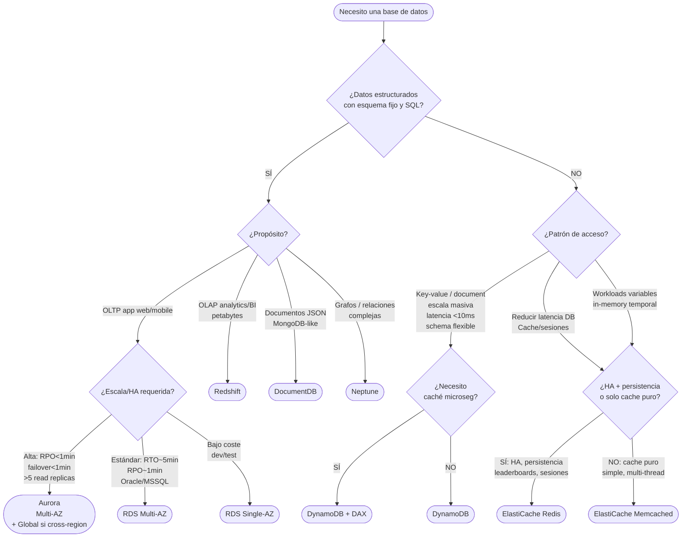
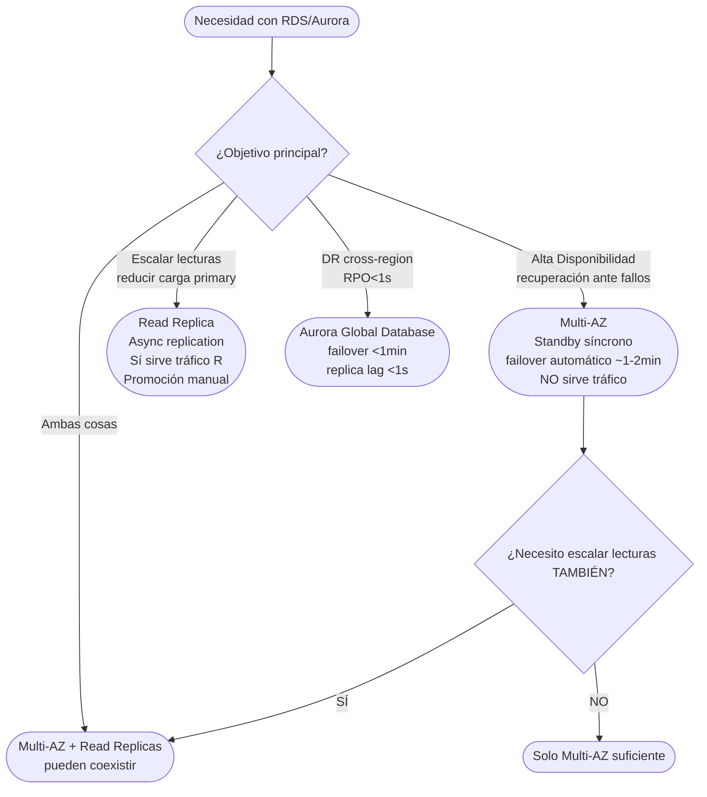
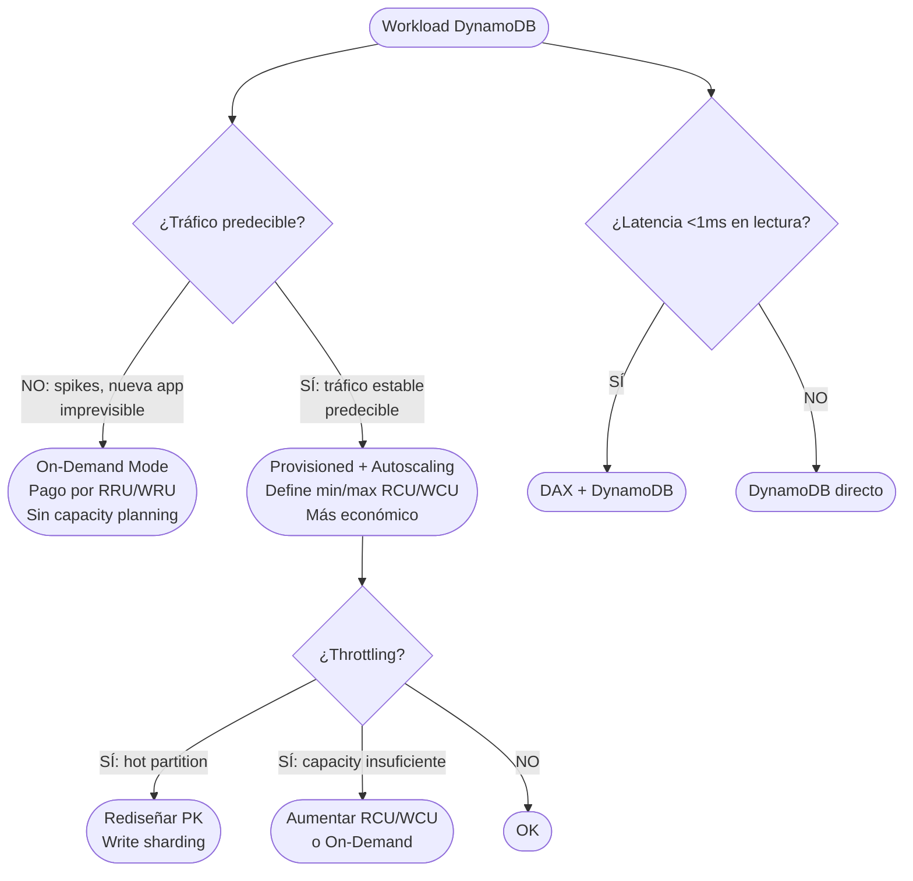

# AWS Databases — SA Associate: Concept Map (SAA-C03)

> **Objetivo**: Mapa conceptual exhaustivo de Databases en AWS para el examen SAA-C03.
> **Nivel**: AWS Solutions Architect Associate.
> **Enfoque**: árbol de decisión + internals + exam traps + casos end-to-end.
> **Región de referencia**: eu-west-1 | RTO objetivo: 5 min | RPO objetivo: 1 min

---

## Índice

1. [Mindmap jerárquico](#1-mindmap-jerárquico)
2. [Árbol de decisión — cuándo elegir qué](#2-árbol-de-decisión--cuándo-elegir-qué)
3. [RDS y Aurora — lo esencial para examen](#3-rds-y-aurora--lo-esencial-para-examen)
4. [DynamoDB — lo esencial](#4-dynamodb--lo-esencial)
5. [ElastiCache — Redis y Memcached](#5-elasticache--redis-y-memcached)
6. [Servicios distractores (Redshift, DocumentDB, Neptune)](#6-servicios-distractores-redshift-documentdb-neptune)
7. [Integraciones muy SAA](#7-integraciones-muy-saa)
8. [Coste y optimización](#8-coste-y-optimización)
9. [Diagramas Mermaid — árboles de decisión](#9-diagramas-mermaid--árboles-de-decisión)
10. [Casos end-to-end (Fintech / E-commerce / Healthcare)](#10-casos-end-to-end-fintech--e-commerce--healthcare)
11. [Checklist de examen y palabras clave](#11-checklist-de-examen-y-palabras-clave)

---

## 1. Mindmap jerárquico

```
AWS DATABASES (SAA-C03)
│
├── RELACIONAL (SQL / ACID)
│   ├── RDS
│   │   ├── Engines: MySQL · PostgreSQL · MariaDB · Oracle · SQL Server
│   │   ├── Multi-AZ (HA) ────── standby síncrono, failover ~1-2 min
│   │   ├── Read Replicas ────── async, hasta 15, cross-region posible
│   │   ├── Backups ─────────── automáticos (0-35 días) + snapshots manuales
│   │   ├── PITR ────────────── hasta 5 min precisión
│   │   ├── Storage ─────────── gp2/gp3/io1, autoscaling storage
│   │   └── Seguridad ───────── SG, subnets privadas, KMS, Secrets Mgr
│   │
│   └── Aurora
│       ├── Engines: MySQL-compatible · PostgreSQL-compatible
│       ├── Storage ─────────── distribuido 6 copias en 3 AZ, auto-grow hasta 128 TB
│       ├── Cluster ─────────── 1 primary (W) + hasta 15 replicas (R)
│       ├── Multi-AZ nativo ─── HA por diseño (no "modo", es la arquitectura)
│       ├── Aurora Serverless ─ v2: scale continuo vCPU, ideal workloads variables
│       ├── Global Database ─── replica cross-region <1s lag, failover en <1 min
│       ├── Backtrack ────────── rebobinar sin restore (solo MySQL)
│       └── Performance Insights ── análisis de cargas de DB
│
├── NO-RELACIONAL / NOSQL
│   ├── DynamoDB
│   │   ├── Modelo ──────────── key-value + document (JSON)
│   │   ├── Partition key / Sort key ── diseño crítico
│   │   ├── Capacity ────────── On-Demand | Provisioned + autoscaling
│   │   ├── GSI / LSI ───────── índices secundarios globales / locales
│   │   ├── TTL ─────────────── expiración automática de ítems
│   │   ├── Streams ─────────── CDC, trigger Lambda
│   │   ├── Global Tables ───── multi-region active-active
│   │   ├── DAX ─────────────── caché in-memory, latencia microsegundos
│   │   └── Transacciones ───── ACID multi-ítem (TransactWrite/Get)
│   │
│   └── ElastiCache
│       ├── Redis
│       │   ├── Estructura ────── strings, hashes, lists, sets, sorted sets
│       │   ├── Persistencia ──── RDB + AOF (durabilidad)
│       │   ├── Replication Group ─ 1 primary + hasta 5 replicas
│       │   ├── Multi-AZ ──────── failover automático
│       │   ├── Cluster Mode ON ── sharding horizontal (múltiples shards)
│       │   └── Casos ──────────── sessions, leaderboards, rate limiting, cache
│       │
│       └── Memcached
│           ├── Estructura ──── solo key-value simple
│           ├── Sin persistencia, sin replicación
│           ├── Multi-threaded ── escala vertical muy bien
│           └── Casos ──────────── cache puro, objetos grandes, simple
│
├── DISTRACTORES SAA (saber cuándo NO)
│   ├── Redshift ─── OLAP, data warehouse, columnar, petabytes, NO transacciones
│   ├── DocumentDB ─ MongoDB-compatible, documentos JSON, managed
│   └── Neptune ──── grafos (RDF/Property Graph), relaciones complejas
│
└── INTEGRACIONES
    ├── VPC endpoints ── acceso privado sin internet (DynamoDB Gateway EP)
    ├── Lambda ── triggers Streams/SQS, acceso RDS via RDS Proxy
    ├── Secrets Manager ── rotación automática de credenciales RDS/Aurora
    ├── CloudWatch ── métricas: FreeStorageSpace, CPUUtilization, ReadLatency
    └── S3 ── backups/exports (Aurora → S3, DynamoDB → S3 Parquet)
```

---

## 2. Árbol de decisión — cuándo elegir qué

### 2.1 La pregunta inicial: ¿SQL o NoSQL?

```
¿Necesitas transacciones ACID completas, JOINs complejos,
esquema rígido predefinido, o ya tienes SQL existente?
│
├── SÍ ──► ¿Cuánto volumen y qué disponibilidad?
│          │
│          ├── Workload OLTP estándar, RTO ~5min, equipo ya usa MySQL/PG
│          │   └──► RDS Multi-AZ (MySQL/PostgreSQL/MariaDB)
│          │
│          ├── Necesitas MAYOR throughput, menor latencia,
│          │   storage que crece solo, o HA máxima (<1min failover)
│          │   └──► Aurora (MySQL-compat o PG-compat)
│          │
│          └── Workload ANALÍTICO (BI, reporting, petabytes)
│              └──► Redshift  ← DISTRACTOR clásico en preguntas OLTP
│
└── NO ──► ¿Cuál es el patrón de acceso?
           │
           ├── Key-value / document, escala masiva, latencia <10ms,
           │   esquema flexible, no JOINs
           │   └──► DynamoDB
           │
           ├── Caché (reducir latencia de DB), session store,
           │   datos temporales en memoria
           │   └──► ElastiCache (Redis si necesitas persistencia/HA,
           │                      Memcached si solo caché puro simple)
           │
           ├── Documentos JSON (MongoDB-like), consultas flexibles
           │   └──► DocumentDB  ← solo si la pregunta menciona MongoDB
           │
           └── Grafos, relaciones complejas (redes sociales, fraud detection)
               └──► Neptune
```

### 2.2 RDS vs Aurora — la decisión

```
¿Ya tienes licencia Oracle/SQL Server?
│
├── SÍ ──► RDS (Oracle o SQL Server) — Aurora solo soporta MySQL/PG
│
└── NO ──► Comparar:

    CRITERIO                    RDS                    AURORA
    ────────────────────────────────────────────────────────────
    Failover automático         ~1-2 min (Multi-AZ)    <30s
    Read Replicas               hasta 5 (mismo engine) hasta 15
    Storage growth              manual o autoscaling   automático hasta 128 TB
    Cross-region replication    Read Replica manual    Global Database (<1s lag)
    Precio                      menor                  ~20-30% más
    Serverless                  NO                     Aurora Serverless v2
    Backtrack (sin restore)     NO                     SÍ (MySQL-compat)
    Multi-master                NO                     NO (Aurora v2 no)
    ────────────────────────────────────────────────────────────

    ¿RTO < 1min o RPO < 1min o escala >5 read replicas?
    └──► Aurora

    ¿Coste mínimo, workload pequeño, motor específico (Oracle/MSSQL)?
    └──► RDS
```

### 2.3 DynamoDB vs RDS — la decisión clave del examen

```
PISTA EN PREGUNTA              RESPUESTA CORRECTA
─────────────────────────────────────────────────
"escala a millones de usuarios"    DynamoDB
"latencia de milisegundos"         DynamoDB
"esquema flexible"                 DynamoDB
"serverless, sin gestionar DB"     DynamoDB
"JOINs entre tablas"               RDS/Aurora
"transacciones complejas multi-tabla" RDS/Aurora (o DynamoDB Transactions si es simple)
"ya tienen MySQL/PostgreSQL"       RDS/Aurora
"reporting SQL sobre datos"        RDS/Aurora o Redshift
"gaming leaderboard"               DynamoDB + DAX  o  ElastiCache Redis
"carrito de compras, sesiones"     DynamoDB o ElastiCache
```

### 2.4 ElastiCache: Redis vs Memcached

```
¿Necesitas alguna de estas features?
  - Persistencia (sobrevivir reinicios)
  - Pub/Sub, Lua scripting
  - Sorted sets (leaderboards)
  - Replicación y failover automático (HA)
  - Cluster mode (sharding)
│
├── SÍ a cualquiera ──► Redis
│
└── NO a todas ──► Memcached
    (solo si: cache puro, multi-threaded, simplicidad máxima,
     no necesitas HA ni persistencia)
```

---

## 3. RDS y Aurora — lo esencial para examen

### 3.1 Multi-AZ vs Read Replicas — la trampa más frecuente

```
┌──────────────────────────────────────────────────────────────────────┐
│                        MULTI-AZ                                      │
│                                                                      │
│  Primary (AZ-a) ──── sync replication ──── Standby (AZ-b)          │
│       │                                         │                   │
│   Lee/Escribe                              Solo replica              │
│       │                                    NO acepta tráfico         │
│       └── Failover automático en ~1-2 min si primary falla          │
│                                                                      │
│  PROPÓSITO: ALTA DISPONIBILIDAD (HA)                                │
│  NO mejora la performance de lectura — standby está inactivo        │
└──────────────────────────────────────────────────────────────────────┘

┌──────────────────────────────────────────────────────────────────────┐
│                      READ REPLICAS                                   │
│                                                                      │
│  Primary ──── async replication ──► RR-1 (R)                       │
│                                 ──► RR-2 (R)                       │
│                                 ──► RR-3 (R) (cross-region)        │
│                                                                      │
│  PROPÓSITO: ESCALADO DE LECTURA (performance)                       │
│  NO es failover automático — debes promover manualmente             │
│  Lag posible (async) → datos ligeramente desactualizados            │
│  Casos: reportes, analytics, reducir carga del primary              │
└──────────────────────────────────────────────────────────────────────┘

REGLA DE ORO:
  Multi-AZ = HA/Availability (el standby no sirve tráfico)
  Read Replica = Performance/Scaling (sí sirve tráfico, solo lectura)

TRAMPA EXAM: "necesito HA Y escalar lecturas"
  → Multi-AZ + Read Replicas (pueden coexistir)
  → En Aurora: el cluster ya tiene ambas cosas integradas
```

### 3.2 Backups, Snapshots y PITR

```
TIPO              QUIÉN        RETENCIÓN      CUÁNDO SE BORRA
──────────────────────────────────────────────────────────────────
Automated Backup  AWS          1-35 días      Al terminar la instancia
                               (configurable) (por defecto)
Manual Snapshot   Tú           Indefinida     Solo cuando tú lo borras
PITR              Basado en    Misma que      —
                  auto-backup  auto-backup

PITR (Point-in-Time Recovery):
  - Restaura a cualquier segundo dentro de la ventana de retención
  - Precisión: hasta 5 minutos (RDS) / 1 segundo (Aurora)
  - Crea una NUEVA instancia de DB (no restaura in-place)
  - Aurora: también Backtrack (no crea nueva instancia, rebobina)

EXAM TRAPS:
  ✗ "Deshabilité automated backup, ¿puedo hacer PITR?" → NO
  ✗ "Borré la instancia, ¿puedo usar automated backup?" → NO (se borran)
      Excepción: Aurora retiene backups aunque borres la instancia (configurable)
  ✓ Para retener backups tras borrar → tomar snapshot manual ANTES

AURORA BACKTRACK (solo MySQL-compat):
  - Rebobina la DB a un momento anterior SIN crear nueva instancia
  - Ventana configurable (max 72h, tiene coste)
  - Útil: "revert" de una query accidental sin downtime de restore
```

### 3.3 Storage y Performance

```
STORAGE TYPE    IOPS            CUÁNDO USAR
───────────────────────────────────────────────────────────────
gp2             3 IOPS/GB       Workloads estándar, económico
                (burst hasta 3K)
gp3             3K-16K IOPS     Recomendado: IOPS desacopladas del tamaño
                (configurable)
io1/io2         hasta 64K IOPS  Alto rendimiento, latencia <1ms constante
                (provisioned)   (OLTP intensivo, producción crítica)

AURORA STORAGE:
  - Distribuido automáticamente en 6 copias en 3 AZs
  - Crece en incrementos de 10 GB automáticamente hasta 128 TB
  - No eliges tipo de storage (AWS lo gestiona)
  - Escrituras confirmadas cuando 4/6 nodos escriben (quorum)
  - Lecturas: 3/6 nodos (quorum)

STORAGE AUTOSCALING (RDS):
  - Habilitado con Maximum Storage Threshold
  - Sube automáticamente cuando <10% libre
  - Nunca baja (solo sube)

CONEXIONES Y POOLING:
  RDS Proxy:
    - Pool de conexiones entre app y RDS/Aurora
    - Crítico para Lambda (muchas conexiones efímeras → "too many connections")
    - Reduce overhead de auth, mejora failover (<30s con proxy)
    - Integración con Secrets Manager/IAM auth
    - EXAM: "Lambda conecta a RDS y hay errores de conexión" → RDS Proxy
```

### 3.4 Seguridad en RDS/Aurora

```
CAPA              MECANISMO
──────────────────────────────────────────────────────────────────────
Red               Subnets privadas (DB Subnet Group, sin ruta a internet)
                  Security Groups (solo permitir puerto desde app-SG)
Cifrado en tránsito  SSL/TLS (forzar con parameter group)
Cifrado en reposo    KMS (habilitar al crear — NO se puede activar después
                     en instancia existente; workaround: snapshot → restore cifrado)
Autenticación     User/password (rotación via Secrets Manager)
                  IAM DB Authentication (MySQL/PG): token firmado IAM, 15 min
                  → EXAM: "sin passwords hardcodeadas en código" → IAM Auth
Secrets           Secrets Manager: rotación automática each N días
                  Parameter Store: alternativa sin rotación automática
Audit             CloudTrail para API calls
                  Database Activity Streams (Aurora) → Kinesis → SIEM

EXAM TRAPS:
  ✗ "Encriptar RDS existente no cifrada" → NO se puede in-place
      → Tomar snapshot → copiar snapshot con cifrado → restore
  ✓ RDS en subnet privada + SG restrictivo es configuración mínima de seguridad
  ✓ IAM auth solo disponible para MySQL y PostgreSQL (no Oracle, MSSQL)
```

### 3.5 Aurora — features adicionales clave

```
AURORA GLOBAL DATABASE:
  ─────────────────────────────────────────────────────
  Región primaria (R/W) ──── replication <1s ──► Región secundaria (R only)
                                                  ▲
                                            Failover manual en <1 min
                                            (promueve secundaria a primaria)

  Casos: DR cross-region con RPO <1s, lecturas locales en otra región
  EXAM: "necesito RPO cerca de 0 cross-region" → Aurora Global Database

AURORA SERVERLESS v2:
  - Escala automáticamente entre min y max ACUs (Aurora Capacity Units)
  - Escala en segundos (no minutos como v1)
  - Ideal: workloads impredecibles, dev/test, SaaS multi-tenant
  - Billingpor ACU-hora (más económico para workloads variables)
  - EXAM: "workload variable/impredecible, quiero managed sin capacity planning" → Aurora Serverless v2

AURORA REPLICAS vs RDS READ REPLICAS:
  Aurora: misma capa de storage compartida → lag ~10ms (casi 0)
  RDS: storage separado, replica via binlog → lag variable (100ms-seconds)
```

---

## 4. DynamoDB — lo esencial

### 4.1 Modelo de datos y diseño de claves

```
TABLA DYNAMODB
──────────────────────────────────────────────────────────────────────
Item = fila (hasta 400 KB)
Partition Key (PK) = hash → determina la partición física
Sort Key (SK) = rango → opcional, permite queries range

REGLAS DE DISEÑO:
  ✓ PK con ALTA CARDINALIDAD → distribución uniforme de datos
  ✗ PK con BAJA CARDINALIDAD (ej: status=active/inactive) → HOT PARTITION

HOT PARTITION:
  Problema: una partición recibe >60% del tráfico
  Causas: PK mal elegida (fecha, status, país)
  Síntoma: ProvisionedThroughputExceededException o throttling en hot items
  Solución:
    1. Distribuir PK: añadir sufijo random al PK (write sharding)
    2. Rediseñar esquema de acceso
    3. DAX para aliviar lecturas

EJEMPLO DE DISEÑO CORRECTO:
  ✗ PK = "USER_TYPE" (solo 3 valores → hot partition)
  ✓ PK = "USER_ID" (millones de usuarios → distribución uniforme)

ONE TABLE DESIGN (patrón avanzado):
  - Una sola tabla para múltiples entidades
  - PK genérico (ej: PK="USER#123", SK="PROFILE")
  - PK="USER#123", SK="ORDER#456" → misma tabla, query eficiente
```

### 4.2 Capacity Modes

```
ON-DEMAND MODE:
  ─────────────────────────────────────────────
  - AWS escala automáticamente sin límite
  - Pago por RRU/WRU (Read/Write Request Units)
  - 1 RRU = 1 strongly consistent read de ≤4 KB
  - 1 WRU = 1 write de ≤1 KB
  - Ideal: tráfico imprevisible, spikes, nuevas apps
  - Coste: ~6-7x más caro por RU que provisioned a max

PROVISIONED MODE:
  ─────────────────────────────────────────────
  - Defines RCU/WCU (Read/Write Capacity Units)
  - 1 RCU = 1 strongly consistent read/s de ≤4 KB
           = 2 eventually consistent reads/s de ≤4 KB
  - 1 WCU = 1 write/s de ≤1 KB
  - AUTOSCALING: define min/max y target utilization (ej: 70%)
  - BURST: consume burst capacity (token bucket) para picos cortos
  - Ideal: tráfico predecible, coste optimizado

THROTTLING:
  Causa: superar RCU/WCU o hot partition
  Señal: ThrottledRequests CloudWatch metric
  Soluciones:
    1. Aumentar capacidad (provisioned) o cambiar a on-demand
    2. DAX (caché, reduce lecturas a DynamoDB)
    3. Rediseñar PK (si hot partition)
    4. Implementar exponential backoff en la app

CÁLCULO MENTAL PARA EXAMEN:
  Leer ítem de 8 KB:
    Strongly consistent: 8/4 = 2 RCU
    Eventually consistent: 8/4 / 2 = 1 RCU
  Escribir ítem de 3 KB:
    3/1 = 3 WCU (redondear arriba al KB)
```

### 4.3 GSI y LSI

```
┌──────────────────────────────────────────────────────────────────────┐
│  LSI (Local Secondary Index)                                         │
│  ──────────────────────────                                          │
│  - Mismo PK que la tabla base, SK diferente                         │
│  - Creado SOLO al crear la tabla (no se puede añadir después)       │
│  - Comparte capacidad con la tabla base                             │
│  - Máximo 5 por tabla                                               │
│  - Soporte strong consistency                                        │
│  - Proyección: KEYS_ONLY, INCLUDE, ALL                              │
│                                                                      │
│  USO: "necesito ordenar/filtrar por otro atributo dentro del mismo PK" │
└──────────────────────────────────────────────────────────────────────┘

┌──────────────────────────────────────────────────────────────────────┐
│  GSI (Global Secondary Index)                                        │
│  ──────────────────────────                                          │
│  - PK y SK completamente diferentes de la tabla base                │
│  - Se puede añadir después de crear la tabla                        │
│  - Tiene su propia capacidad (RCU/WCU separados)                    │
│  - Máximo 20 por tabla (ajustable)                                  │
│  - Solo eventually consistent                                        │
│  - Proyección: KEYS_ONLY, INCLUDE, ALL                              │
│                                                                      │
│  USO: "necesito query/filtro por un atributo completamente diferente" │
└──────────────────────────────────────────────────────────────────────┘

EXAM TRAPS:
  ✗ "Necesito strong consistency en un GSI" → IMPOSIBLE, solo EC
  ✗ "Añadir LSI a tabla existente" → IMPOSIBLE
  ✓ "Buscar usuarios por email (no por user_id)" → GSI con PK=email
  ✓ "Coste de GSI" → proyección ALL = replica todos los datos, más caro
```

### 4.4 TTL, Streams y Global Tables

```
TTL (Time To Live):
  - Atributo numérico con timestamp Unix epoch (segundos)
  - DynamoDB borra ítems expirados en ~48h (no exacto)
  - No consume WCU la eliminación
  - Casos: sesiones, datos temporales, logs con expiración
  - EXAM: "limpiar datos automáticamente sin consumir capacidad" → TTL

DYNAMODB STREAMS:
  ─────────────────────────────────────────────
  - Registro de cambios (insert/update/delete) en orden
  - Retención: 24 horas
  - Integración nativa con Lambda (trigger)
  - Casos: CDC, replicación, notificaciones, audit trail
  - EXAM: "ejecutar Lambda cuando un ítem cambie en DynamoDB" → Streams

GLOBAL TABLES:
  ─────────────────────────────────────────────
  Región EU-WEST-1 ◄──── replicación multi-master ────► Región US-EAST-1
                   ◄─────────────────────────────────►

  - Active-active: writes en cualquier región
  - Requiere DynamoDB Streams (habilitado automáticamente)
  - Conflicto: "last writer wins" (timestamp)
  - RPO ~0 entre regiones (replicación async, segundos)
  - EXAM: "app global con escrituras en múltiples regiones" → Global Tables
  - EXAM: "multi-region active-active DB" → Global Tables o Aurora Global (si SQL)
```

### 4.5 DAX (DynamoDB Accelerator)

```
App ──► DAX Cluster (in-memory, microsegundos) ──► DynamoDB (milisegundos)
         │
         └── Cache: item cache + query cache

CUÁNDO SÍ DAX:
  ✓ Latencia de lectura < 1ms (microsegundos)
  ✓ Read-heavy workloads (reducir RCU en DynamoDB)
  ✓ Leaderboards, gaming, producto más vendido
  ✓ Hot items (mismo ítem leído millones de veces)

CUÁNDO NO DAX:
  ✗ Write-heavy (DAX no ayuda con escrituras)
  ✗ Datos que cambian muy frecuentemente (cache invalidation costosa)
  ✗ Queries que necesitan strong consistency (DAX devuelve eventually consistent)
  ✗ Solo para ElastiCache ya en uso → no combines innecesariamente

DAX vs ElastiCache PARA DYNAMODB:
  DAX: específico para DynamoDB, API compatible, transparente
  ElastiCache: genérico, requiere lógica de caché en la app
  EXAM: si la pregunta menciona DynamoDB + caché → DAX primero
```

---

## 5. ElastiCache — Redis y Memcached

### 5.1 Redis — arquitectura y features

```
MODOS DE DESPLIEGUE:
──────────────────────────────────────────────────────────────
Cluster Mode DISABLED (Replication Group):
  - 1 primary shard + hasta 5 replicas
  - Todos los datos en un solo shard
  - Failover automático si hay replicas (Multi-AZ)
  - Max data: limitado por RAM de la instancia

Cluster Mode ENABLED (Sharded):
  - Hasta 500 nodos (shards × replicas)
  - Datos distribuidos entre shards (hash slots)
  - Cada shard tiene 1 primary + hasta 5 replicas
  - Escala horizontal: añadir/quitar shards en caliente
  - Recomendado para datasets grandes o alta throughput

ESTRUCTURA:
  Primary ──► escribe y lee
  Replica ──► solo lectura (read scaling)
            ──► puede promover a primary (failover)

FAILOVER:
  - Si primary falla: replica se promueve automáticamente (~60s)
  - DNS apunta automáticamente al nuevo primary
  - Aplicaciones deben reconectarse
```

### 5.2 Patrones de caché con ElastiCache

```
CACHE-ASIDE (Lazy Loading):
  ───────────────────────────────────────────────────────────
  App → Busca en ElastiCache
    ├── HIT: devuelve dato (rápido)
    └── MISS:
         App → Busca en DB
         App → Escribe en ElastiCache
         App → Devuelve dato al cliente

  Pros: solo cachea lo que se pide, fallo de caché no falla app
  Contras: primer acceso siempre lento (cache miss), datos pueden stale

WRITE-THROUGH:
  ───────────────────────────────────────────────────────────
  App → Escribe en DB
  App → Escribe en ElastiCache (siempre actualizado)

  Pros: caché siempre fresca, reads rápidas
  Contras: write penalty (doble escritura), datos nunca accedidos también se cachean

SESSION STORE:
  ───────────────────────────────────────────────────────────
  EC2/ECS instancia A → Token → ElastiCache (TTL)
  EC2/ECS instancia B → Lee mismo token (sin sticky sessions)

  Caso SAA clásico:
    "App en ASG (múltiples instancias) pierde sesión al escalar"
    → Externalizar sesiones a ElastiCache Redis con TTL

LEADERBOARD / SORTED SET (solo Redis):
  Redis Sorted Set: ZADD scores 100 "player1" / ZRANGE → clasificación
  Caso: rankings en tiempo real, gaming, puntuaciones

RATE LIMITING (solo Redis):
  INCR + EXPIRE: contador por IP/usuario, ventana de tiempo
  Caso: throttling de API, prevención de abuso
```

### 5.3 Redis vs Memcached — tabla comparativa

```
FEATURE                     REDIS              MEMCACHED
──────────────────────────────────────────────────────────────
Estructuras de datos        Ricas (listas,     Solo string K/V
                            sets, hashes, etc.)
Persistencia                SÍ (RDB + AOF)     NO
Replicación                 SÍ                 NO
Multi-AZ / failover         SÍ                 NO
Cluster (sharding)          SÍ (cluster mode)  SÍ (client-side)
Pub/Sub                     SÍ                 NO
Lua scripting               SÍ                 NO
Sorted sets (leaderboard)   SÍ                 NO
Multi-threaded              NO (single-thread) SÍ
Uso de memoria              Mayor overhead     Menor overhead
Caso de uso principal       HA cache, sessions Pure cache, simple

REGLA SAA: Si la pregunta menciona CUALQUIER feature avanzada → Redis
           Solo "caché simple sin estado, multi-thread importante" → Memcached
```

### 5.4 ElastiCache — Seguridad

```
Red:             Subnets privadas, Security Groups
En tránsito:     TLS (Redis sí; Memcached también desde reciente versión)
En reposo:       KMS (Redis sí; Memcached NO)
Autenticación:   Redis AUTH (password) o Redis RBAC (usuarios/roles, Redis 6+)
                 Memcached SASL (limitado)

EXAM: "cifrar datos en ElastiCache en reposo" → Redis (no Memcached)
```

---

## 6. Servicios distractores (Redshift, DocumentDB, Neptune)

### 6.1 Amazon Redshift — cuándo SÍ y cuándo NO

```
QUÉ ES:  Data Warehouse columnar, OLAP, para analytics sobre petabytes

CUÁNDO SÍ (Redshift):
  ✓ "analizar terabytes/petabytes de datos históricos"
  ✓ "BI, dashboards, reportes complejos con agregaciones"
  ✓ "ETL + consultas SQL analíticas"
  ✓ "cargar datos desde S3 (Redshift Spectrum)"
  ✓ "data warehouse existente, migración desde on-prem"

CUÁNDO NO (Redshift) — TRAMPA EXAM:
  ✗ "transacciones OLTP" → RDS/Aurora
  ✗ "alta disponibilidad con failover rápido" → RDS Multi-AZ
  ✗ "base de datos de una app web" → RDS/DynamoDB
  ✗ "baja latencia para usuarios finales" → DynamoDB/ElastiCache

Redshift Spectrum: queries SQL directamente sobre S3 (no carga datos)
Redshift Serverless: sin gestionar clusters, pago por uso
```

### 6.2 Amazon DocumentDB — cuándo SÍ y cuándo NO

```
QUÉ ES:  MongoDB-compatible, base de datos documental JSON, managed

CUÁNDO SÍ (DocumentDB):
  ✓ "migrar workload MongoDB a AWS sin cambiar código"
  ✓ "base de datos documental JSON con queries flexibles"
  ✓ "catálogos de productos, CMS, perfiles de usuario"

CUÁNDO NO:
  ✗ "necesito MongoDB open-source features 100%" → usar MongoDB Atlas o EC2
  ✗ "relacional con JOINs" → RDS/Aurora
  ✗ "key-value a escala masiva" → DynamoDB

EXAM: si la pregunta NO menciona MongoDB ni documentos JSON → no es DocumentDB
```

### 6.3 Amazon Neptune — cuándo SÍ y cuándo NO

```
QUÉ ES:  Base de datos de grafos, soporta Property Graph (Gremlin) y RDF (SPARQL)

CUÁNDO SÍ (Neptune):
  ✓ "redes sociales" (amigos de amigos, recomendaciones)
  ✓ "detección de fraude" (relaciones entre cuentas/transacciones)
  ✓ "knowledge graphs"
  ✓ "cualquier pregunta que mencione 'grafos' o 'relaciones complejas'"

CUÁNDO NO:
  ✗ Todo lo demás — Neptune es muy específico
  ✗ "relaciones en SQL (foreign keys)" → RDS, no es lo mismo

EXAM TRAP: "detectar fraude con patrones" podría ser Neptune (grafos) o
           SageMaker (ML). Si dice "relaciones entre entidades" → Neptune.
```

---

## 7. Integraciones muy SAA

### 7.1 VPC y acceso privado a bases de datos

```
ARQUITECTURA CORRECTA (sin internet):

  ┌─── VPC ───────────────────────────────────────────────────┐
  │                                                            │
  │  Public Subnet          Private Subnet (App)              │
  │  ┌──────────┐           ┌──────────────────┐              │
  │  │   ALB    │ ──────►  │  EC2 / ECS / Lambda│             │
  │  └──────────┘           └────────┬─────────┘              │
  │                                  │                         │
  │                    Private Subnet (DB)                     │
  │                    ┌──────────────────────┐               │
  │                    │   RDS / Aurora        │               │
  │                    │   ElastiCache         │               │
  │                    └──────────────────────┘               │
  │                                                            │
  └────────────────────────────────────────────────────────────┘

DYNAMODB: No está en VPC → acceder via Gateway VPC Endpoint
  - Gateway Endpoint: DynamoDB y S3 (gratis, a nivel de route table)
  - Interface Endpoint: otros servicios (ENI, tiene coste)

EXAM: "Lambda/EC2 en VPC privada necesita acceder a DynamoDB sin internet"
  → Gateway VPC Endpoint para DynamoDB

RDS PROXY:
  Lambda ──► RDS Proxy (pool) ──► RDS/Aurora
  - Reduce conexiones abiertas a DB
  - Failover más rápido (<30s)
  - IAM auth + Secrets Manager integration
  EXAM: "Lambda se conecta a RDS, error Too many connections" → RDS Proxy
```

### 7.2 Lambda y bases de datos

```
LAMBDAS + RDS:
  Problema: Lambda escala a miles de instancias → miles de conexiones DB
  Solución: RDS Proxy entre Lambda y RDS/Aurora

LAMBDAS + DYNAMODB:
  Nativo: SDK de DynamoDB, sin proxy necesario
  DynamoDB Streams → Lambda trigger (CDC, procesamiento en tiempo real)

LAMBDAS + ELASTICACHE:
  Lambda en VPC puede conectar a ElastiCache en VPC
  Warm connections: mantener conexión Redis entre invocaciones (handler scope)

EXAM: "procesamiento de datos en tiempo real cuando cambia DB"
  DynamoDB → Streams → Lambda (caso clásico)
```

### 7.3 Monitoring y CloudWatch

```
MÉTRICAS CLAVE RDS/AURORA:
  FreeStorageSpace          → alarma si < umbral (quedarse sin disco)
  CPUUtilization            → alta CPU = queries lentas o need scale up
  DatabaseConnections       → cercano al max → RDS Proxy o instancia más grande
  ReadLatency/WriteLatency  → latencia de I/O
  ReplicaLag                → lag de Read Replica (si > umbral, datos stale)
  BurstBalance              → para gp2 storage (si 0 → throttling)

MÉTRICAS CLAVE DYNAMODB:
  ConsumedReadCapacityUnits/ConsumedWriteCapacityUnits
  ThrottledRequests          → problema de capacity o hot partition
  SuccessfulRequestLatency   → latencia por operación
  SystemErrors               → errores internos (raro, contactar support)

MÉTRICAS CLAVE ELASTICACHE:
  CacheHitRate               → % hits (alto = bueno, >80% objetivo)
  CacheMisses                → misses totales
  Evictions                  → ítems borrados por falta de memoria → subir nodo
  CurrConnections            → conexiones actuales
  FreeableMemory             → si baja → escalar instancia
  ReplicationLag             → lag replica→primary

ALARMS:
  FreeStorageSpace < 2GB → acción
  ReplicaLag > 30s → investigar
  ThrottledRequests > 0 → revisar capacity
```

### 7.4 Backup a S3 y DR patterns

```
RDS/AURORA → S3:
  - Automated backups: almacenados en S3 (gestionado por AWS, no visible)
  - Snapshots manuales: exportar snapshot a S3 (Parquet) para análisis
  - Aurora: export to S3 (sin afectar performance de producción)

DYNAMODB → S3:
  - DynamoDB Export to S3 (Parquet/DynamoDB JSON)
  - No consume RCU
  - Útil para: análisis con Athena, backup long-term, auditoría

DR PATTERNS:

  BACKUP & RESTORE (RTO horas, RPO horas):
    S3 snapshots + restore manual
    Más barato, mayor RTO/RPO

  PILOT LIGHT (RTO 10-30min, RPO minutos):
    Región secundaria con DB replicada pero instancias app paradas
    On failover: arrancar instancias y apuntar DNS

  WARM STANDBY (RTO 2-5min, RPO segundos):
    Región secundaria con DB + app en mínimo (small instances)
    On failover: escalar app, promover DB

  MULTI-SITE ACTIVE/ACTIVE (RTO ~0, RPO ~0):
    Aurora Global Tables + Route53 Latency routing o Global Accelerator
    Coste máximo, disponibilidad máxima

EXAM: mapear el requisito (RTO/RPO) al patrón correcto
  RTO=5min, RPO=1min → Warm Standby o Aurora Global Database
```

---

## 8. Coste y optimización

### 8.1 Drivers de coste principales

```
SERVICIO        DRIVER PRINCIPAL               OPTIMIZACIÓN
──────────────────────────────────────────────────────────────────────
RDS             Instancia ($/hora)             Reserved Instances (1-3 años, 30-60% desc.)
                Multi-AZ (doble instancia)     ¿Realmente necesitas Multi-AZ en dev?
                Storage ($/GB-mes)             gp3 > gp2 (más IOPS/$ al mismo precio)
                Read Replicas (instancia extra) Compartir carga vs eliminar si no se usan

Aurora          ~20-30% más caro que RDS        Valor: mayor HA, menos ops
                Storage: $/GB-mes consumed     Solo pagas por datos reales (no provisionado)
                IO requests: $/millón (RDS mode) Aurora I/O Optimized: precio plano, sin IO $/req
                Serverless v2: $/ACU-hora      Ahorra en workloads variables (0.5 ACU min)

DynamoDB        On-Demand: $/RRU y $/WRU       Cambiar a Provisioned si tráfico predecible
                Provisioned: $/RCU y $/WCU     Autoscaling bien configurado
                GSI: capa extra de storage     Proyección mínima (KEYS_ONLY si posible)
                Global Tables: 2x writes       Solo en regiones necesarias
                DynamoDB Accelerator: $/nodo   Evitar si write-heavy o datos muy cambiantes

ElastiCache     Nodos ($/hora por node type)   Reserved Nodes (1-3 años)
                Multi-AZ: nodo replica extra   Cluster Mode para distribuir vs nodos grandes
                Memcached: más barato que Redis Si no necesitas features Redis → Memcached

Redshift        Nodos RA3 (storage-compute sep) Reserved Instances, pause/resume
                Serverless: $/RPU              Solo para cargas variables

REGLAS PRÁCTICAS:
  1. Dev/Test: RDS Single-AZ + snapshots (no Multi-AZ, ahorra 50%)
  2. Prod OLTP: Aurora Multi-AZ + Reserved (mejor TCO que RDS a largo plazo)
  3. DynamoDB: On-Demand para arranque, Provisioned+autoscaling para producción estable
  4. ElastiCache: Reserved Nodes si uso continuo >1 año
  5. Aurora I/O Optimized: si I/O > 25% del coste total de Aurora
```

### 8.2 Optimización sin romper requisitos

```
ESCENARIO                     SOLUCIÓN ECONÓMICA          TRAMPA A EVITAR
──────────────────────────────────────────────────────────────────────────────
"reporting lento en DB prod"  Read Replica para reports   Poner queries en primary
"DB dev cara"                 RDS Single-AZ + stop/start   Mantener Multi-AZ en dev
"DynamoDB caro, tráfico fijo" Provisioned + autoscaling    Dejar en On-Demand
"ElastiCache grande en prod"  Reserved Nodes 1 año        On-Demand siempre
"Backups costosos"            Reducir retención automated   Borrar snapshots manuales
                              a mínimo + snapshots manual
                              cuando necesitas más
"Aurora storage caro"         I/O Optimized si I/O-heavy   RDS en workloads I/O pesados
"Muchas RR no usadas"         Eliminar RR ociosas          Mantener por si acaso
```

---

## 9. Diagramas Mermaid — árboles de decisión

### 9.1 Árbol de decisión principal



### 9.2 Árbol RDS Multi-AZ vs Read Replica



### 9.3 Árbol DynamoDB capacity y acceso



---

## 10. Casos end-to-end (Fintech / E-commerce / Healthcare)

### 10.1 Caso Fintech — Plataforma de pagos (HA máxima)

**Contexto**: Startup de pagos en eu-west-1. 50K TPS en picos. Regulación: datos en EU. RTO=1min, RPO=0.

```
REQUISITOS                    SOLUCIÓN                    JUSTIFICACIÓN
─────────────────────────────────────────────────────────────────────────────
Transacciones ACID             Aurora PostgreSQL           ACID, JOINs, esquema rígido
HA: RTO<1min, RPO~0           Aurora Multi-AZ             Failover <30s, 6 copias
                                                           en 3 AZs, quorum writes
Escalar lecturas (saldos)     Aurora Read Replicas x3     Consultas de saldo solo leen
                               (Multi-AZ + RR coexisten)
DR cross-region (regulatorio) Aurora Global Database      Replica <1s a eu-central-1
                               + eu-central-1 secondary    Failover manual <1min
Credenciales seguras          Secrets Manager             Rotación automática cada 30d
Acceso sin internet           DB en Private Subnet        Sin IGW, solo app-SG → DB-SG
Múltiples conexiones Lambda   RDS Proxy                   Pool conexiones, IAM auth
Sesiones de usuario           ElastiCache Redis           TTL por sesión, Multi-AZ
Historial transacciones fría  S3 Export (Parquet)         Athena para análisis
Monitoring                    CloudWatch: ReplicaLag,     Alarm si lag > 5s o
                              FreeStorageSpace, CPU        storage < 5GB
```

**Arquitectura**:
```
Internet ──► ALB (public) ──► ECS Fargate (private subnet, eu-west-1)
                              │
                              ├──► RDS Proxy ──► Aurora PostgreSQL (primary, eu-west-1a)
                              │                   Aurora Read Replicas (eu-west-1b/c)
                              │                   ↓ Global Database sync
                              │                   Aurora Secondary (eu-central-1) [DR]
                              │
                              └──► ElastiCache Redis (cluster mode off, Multi-AZ)
                                   ElastiCache Replica (eu-west-1b)

VPC Endpoints: ninguno necesario (todo en VPC privada)
Secrets Manager: credenciales Aurora, rotación 30d
CloudWatch Alarms → SNS → PagerDuty
```

**Decisiones clave**:
- Aurora vs RDS: Aurora por RPO~0 (quorum writes), failover <30s, Global Database
- Redis vs Memcached: Redis por TTL nativo, persistencia, Multi-AZ
- RDS Proxy: Lambda payment processor escala a miles de instancias
- Global Database (no Active-Active): regulatorio exige primario en EU, secundario DR

---

### 10.2 Caso E-commerce — Tienda online (escala y coste)

**Contexto**: E-commerce mediano, eu-west-1. Black Friday: 100x tráfico normal. RTO=5min, RPO=5min.

```
COMPONENTE           DB ELEGIDA              RAZÓN
──────────────────────────────────────────────────────────────────────
Catálogo productos   DynamoDB (On-Demand)    Esquema flexible (SKUs variables)
                                             Escala automática Black Friday
Carrito de compras   DynamoDB (On-Demand)    Key=userId, TTL=7d, sin JOINs
Sesiones usuario     ElastiCache Redis       TTL, comparte entre instancias ASG
                     (Cluster Mode OFF)
Pedidos / pagos      Aurora MySQL            ACID, JOINs (pedido→línea→producto)
                     Multi-AZ                HA en proceso de pago
Recomendaciones      ElastiCache Redis       Sorted Sets (trending products)
                     DAX                     Caché DynamoDB para catálogo
Análisis ventas      Redshift Serverless     Queries históricas, BI dashboard
                     (S3 ← Aurora export)
Búsqueda productos   OpenSearch              Full-text search (fuera de scope aquí)
```

**Arquitectura DynamoDB Streams (notificaciones)**:
```
DynamoDB (Orders table)
  └── Streams → Lambda → SNS → SES/Push notification
                       → SQS → Fulfillment service
```

**Optimización de coste**:
```
DynamoDB:    On-Demand en Black Friday, volver a Provisioned en enero
Aurora:      Reserved Instance 1 año (ahorro ~40%)
ElastiCache: Reserved Nodes 1 año para Redis (ahorro ~35%)
Redshift:    Serverless = pago solo cuando hay queries (BI team work hours)
```

**Decisiones clave**:
- DynamoDB On-Demand: imprevisible en Black Friday, auto-escala sin capacity planning
- Aurora solo para pedidos: ACID obligatorio, no reemplazable por DynamoDB
- DAX para catálogo: mismo ítem (producto estrella) leído millones de veces
- Redshift Serverless: equipo BI no trabaja 24/7, no vale un cluster siempre up

---

### 10.3 Caso Healthcare — Historia Clínica Electrónica (compliance + DR)

**Contexto**: Hospital eu-west-1. Datos sensibles (GDPR + HIPAA-like). RTO=5min, RPO=1min. Datos no pueden salir de EU.

```
COMPONENTE                DB ELEGIDA              RAZÓN
──────────────────────────────────────────────────────────────────────
Historia clínica (HCE)    Aurora PostgreSQL        ACID, esquema estructurado
                          Multi-AZ (AZ-a + AZ-b)  HA quirúrgica, failover <30s
Imágenes DICOM            S3 (no DB)              Objetos binarios → S3 correcto
Resultados laboratorio    DynamoDB                Key=patientId+testId, rápido
                                                  Esquema flexible por tipo test
                          (Provisioned + autoscaling) Tráfico predecible en horas laborables
Caché dashboard médico    ElastiCache Redis        Datos paciente en ronda médica
                          (Cluster Mode OFF)       TTL=30min, reduce carga Aurora
Auditoría accesos         Aurora + CloudTrail      GDPR: quién accedió a qué
Backup largo plazo        S3 Glacier              Retención 10 años (regulatorio)
DR (secundaria EU)        Aurora Global Database   Réplica en eu-central-1 (Frankfurt)
                          eu-central-1             Datos permanecen en EU
```

**Seguridad (capas)**:
```
Capa 1 — Red:          DB en Private Subnet, no ruta a internet
                       SG: solo app-tier SG → DB-SG:5432
Capa 2 — Cifrado tránsito: SSL/TLS forzado (parameter group)
Capa 3 — Cifrado reposo:   KMS CMK (customer-managed key, rotación 1 año)
                           DynamoDB: KMS CMK también
                           ElastiCache Redis: KMS at-rest
Capa 4 — Autenticación:    IAM DB Auth + Secrets Manager rotación 30d
                           NO passwords hardcodeadas
Capa 5 — Auditoría:        Database Activity Streams (Aurora) → Kinesis → S3
                           CloudTrail para API calls
                           CloudWatch Logs Insights para queries de auditoría
```

**RPO=1min con Aurora Multi-AZ**:
```
Primary (eu-west-1a) ──── sync write ────► Standby (eu-west-1b)
                                            ↑ ACK requerido
Escritura confirmada solo cuando AMBOS nodos persisten → RPO~0 en misma región
Aurora Global: eu-west-1 → eu-central-1, lag <1s → RPO=1s cross-region
```

**Decisiones clave**:
- Aurora vs DynamoDB para HCE: esquema relacional (tablas normalizadas), ACID vital en registro médico
- DynamoDB para lab results: esquema variable (distintos tipos de test), acceso por patientId simple
- KMS CMK (no AWS managed): requisito compliance tener control total de la clave
- Aurora Global solo EU: GDPR prohíbe transferir datos fuera de UE

---

## 11. Checklist de examen y palabras clave

### 11.1 Palabras clave → servicio correcto

```
PALABRA/FRASE EN PREGUNTA                      SERVICIO
──────────────────────────────────────────────────────────────────────
"ACID", "JOINs", "relacional", "SQL"           RDS o Aurora
"MySQL", "PostgreSQL", "MariaDB" existente     RDS (mismo engine)
"RPO/RTO <1min", "failover <30s"               Aurora Multi-AZ
">5 read replicas", "15 read replicas"         Aurora
"cross-region replication <1s"                 Aurora Global Database
"Oracle", "SQL Server"                         RDS (Aurora no los soporta)
"Backtrack" (rebobinar DB)                     Aurora MySQL
"escala a millones", "latencia <10ms"          DynamoDB
"serverless sin gestionar", "schema flexible"  DynamoDB
"key-value", "NoSQL"                           DynamoDB (o ElastiCache para caché)
"leaderboard", "ranking", "sorted set"         ElastiCache Redis
"sesiones de usuario", "session store"         ElastiCache Redis
"caché de DB", "reducir latencia lectura"      ElastiCache (cache-aside) o DAX
"Lambda + RDS", "too many connections"         RDS Proxy
"DynamoDB caché microsegundos"                 DAX
"datos expiran", "limpiar automáticamente"     DynamoDB TTL
"cambio en DynamoDB trigger Lambda"            DynamoDB Streams
"multi-region active-active NoSQL"             DynamoDB Global Tables
"multi-region active-active SQL"               Aurora Global Database
"analytics", "BI", "data warehouse", "petabytes" Redshift
"MongoDB", "documentos JSON"                   DocumentDB
"grafos", "redes sociales", "fraud graph"      Neptune
"sin internet a DynamoDB desde VPC"            Gateway VPC Endpoint
"credenciales rotación automática"             Secrets Manager
"cifrar RDS en reposo sin recrearla"           IMPOSIBLE → snapshot → copy encrypted → restore
"OLAP vs OLTP"                                 Redshift vs RDS/Aurora
"workload variable, sin capacity planning SQL" Aurora Serverless v2
```

### 11.2 Trampas y distractores clásicos SAA

```
TRAMPA                                         RESPUESTA CORRECTA
──────────────────────────────────────────────────────────────────────
"Multi-AZ mejora la performance de lectura"    FALSO: standby no sirve tráfico
"Read Replica tiene failover automático"       FALSO: promoción es manual
"Puedo añadir LSI después de crear la tabla"  FALSO: solo al crear
"GSI soporta strong consistency"              FALSO: solo eventually consistent
"DAX ayuda con workloads write-heavy"         FALSO: DAX solo mejora lecturas
"ElastiCache Memcached soporta replicación"   FALSO: no tiene replicación
"Puedo habilitar cifrado en RDS existente"    FALSO: snapshot → copy → restore
"Aurora es igual que RDS Multi-AZ"           FALSO: Aurora tiene storage distribuido distinto
"DynamoDB para queries SQL complejas"         FALSO: no soporta SQL/JOINs
"Redshift para OLTP transaccional"            FALSO: Redshift es OLAP solamente
"Multi-AZ = cross-region"                     FALSO: Multi-AZ es multi-AZ (mismo region)
"Automated backups se retienen tras borrar instancia" FALSO (salvo Aurora configurable)
"RDS Proxy funciona con todas las DBs"        FALSO: MySQL, PG, MariaDB, Aurora (no Oracle/MSSQL)
"DynamoDB Global Tables = solo para lectura en secundaria" FALSO: active-active
"ElastiCache Redis no soporta persistencia"   FALSO: sí (RDB + AOF)
"PITR restaura in-place"                      FALSO: crea nueva instancia
"Aurora Serverless v2 tarda minutos en escalar" FALSO: segundos (v1 sí tardaba)
```

### 11.3 Reglas de oro SAA (memorizar)

```
1. HA = Multi-AZ | Performance lectura = Read Replica
2. Aurora > RDS cuando: failover rápido, >5 RR, cross-region, storage auto
3. DynamoDB para escala masiva key-value; RDS/Aurora para SQL/ACID
4. ElastiCache Redis si necesitas HA/persistencia/sorted sets
5. ElastiCache Memcached si solo caché puro simple sin estado
6. DAX solo mejora lecturas DynamoDB; inútil para writes
7. Redshift = OLAP/BI/warehouse; NUNCA para OLTP web apps
8. Lambda + RDS → siempre añadir RDS Proxy
9. DynamoDB sin internet desde VPC → Gateway VPC Endpoint (gratis)
10. Cifrado RDS al crear; después solo via snapshot → copy → restore
11. Secrets Manager > Parameter Store para rotación automática
12. LSI: al crear | GSI: en cualquier momento
13. DynamoDB On-Demand para tráfico impredecible; Provisioned para estable
14. Aurora Global Database: RPO~1s cross-region; DynamoDB Global Tables: active-active NoSQL
15. Hot partition DynamoDB → rediseñar PK o write sharding
```

---

> **Archivo**: `databases/concept-map/databases-sa-associate-concept-map.md`
> **Última actualización**: 2026-03-10
> **Examen objetivo**: AWS SAA-C03
> **Cobertura**: RDS, Aurora, DynamoDB, ElastiCache (Redis/Memcached), Redshift, DocumentDB, Neptune
