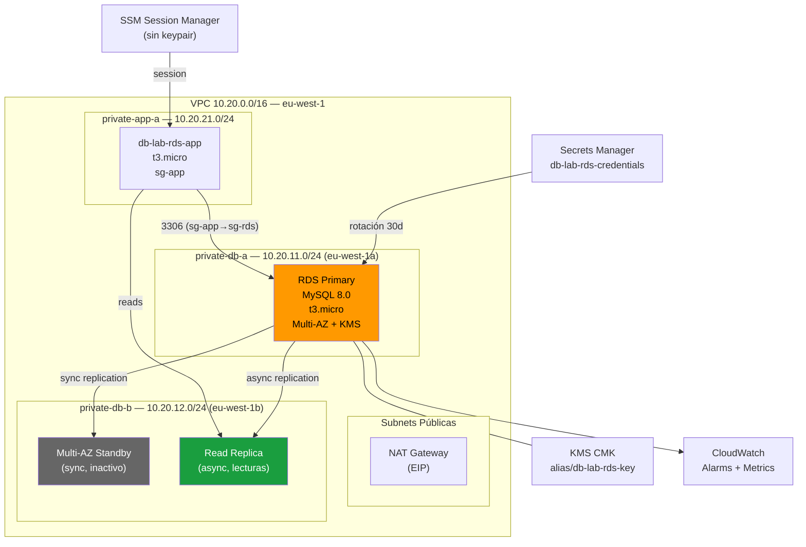

# Lab 01 — RDS MySQL: Seguridad y Alta Disponibilidad

> **Nivel:** AWS SAA-C03 | **Tiempo total:** ~2.5h | **Coste estimado:** ~0.50€ (con cleanup inmediato)

---

## Objetivo

Desplegar una instancia RDS MySQL 8.0 en subnets privadas con cifrado KMS, credenciales gestionadas por Secrets Manager, y configurar Multi-AZ + Read Replica para entender las diferencias fundamentales entre alta disponibilidad y escalado de lecturas — uno de los temas más evaluados en el SAA-C03.

---

## Qué aprenderás

| Concepto | Descripción |
|----------|-------------|
| **DB Subnet Group + Subnets privadas** | Por qué la DB nunca debe estar en una subnet pública |
| **KMS CMK** | Cifrado en reposo con clave gestionada por el cliente |
| **Secrets Manager** | Rotación automática de credenciales, sin passwords hardcodeadas |
| **Multi-AZ** | Standby síncrono para HA — failover automático ~1-2 min |
| **Read Replica** | Async, sirve tráfico de lectura, NO es failover automático |
| **PITR** | Point-in-Time Recovery dentro de la ventana de backups |
| **CloudWatch** | Métricas clave: FreeStorageSpace, ReplicaLag, DatabaseConnections |
| **SSM Session Manager** | Acceso a EC2 sin keypair ni bastión público |

---

## Arquitectura del Lab

```
┌─────────────────────────────────────────────────────────────────────────┐
│  AWS eu-west-1                                                            │
│                                                                           │
│  ┌─────────────────────── VPC 10.20.0.0/16 ────────────────────────────┐ │
│  │                                                                      │ │
│  │  ┌── public-a (10.20.1.0/24) ──┐  ┌── public-b (10.20.2.0/24) ───┐ │ │
│  │  │    [NAT GW + EIP]            │  │                               │ │ │
│  │  └─────────────────────────────┘  └───────────────────────────────┘ │ │
│  │                                                                      │ │
│  │  ┌── private-app-a (10.20.21.0/24) ────────────────────────────────┐│ │
│  │  │  EC2: db-lab-rds-app (t3.micro)                                  ││ │
│  │  │  SSM Session Manager  ─────────────────────────────────────────► ││ │
│  │  └─────────────────────────────────────────────────────────────────┘│ │
│  │                    │ MySQL :3306 (sg-app → sg-rds)                   │ │
│  │                    ▼                                                  │ │
│  │  ┌── private-db-a (10.20.11.0/24) ─┐ ┌─ private-db-b (10.20.12.0/24)┐│
│  │  │  RDS PRIMARY (eu-west-1a)        │ │ RDS STANDBY Multi-AZ (AZ-b)  ││
│  │  │  db-lab-rds-instance             │ │ (sync, NO sirve tráfico)     ││
│  │  │  MySQL 8.0, t3.micro, gp2 20GB  │ │                               ││
│  │  │  KMS CMK cifrado                │ │ RDS READ REPLICA (eu-west-1b) ││
│  │  │  Backups 7 días, PITR           │ │ db-lab-rds-replica            ││
│  │  └─────────────────────────────────┘ │ (async, SÍ sirve lecturas)   ││
│  │                                       └───────────────────────────────┘│
│  └──────────────────────────────────────────────────────────────────────┘ │
│                                                                            │
│  Secrets Manager: db-lab-rds-credentials (rotación cada 30 días)         │
│  KMS: alias/db-lab-rds-key (CMK, rotación anual)                         │
│  CloudWatch Alarms: FreeStorageSpace, CPUUtilization, ReplicaLag          │
└────────────────────────────────────────────────────────────────────────────┘
```

---

## Diagrama Mermaid



---

## Recursos creados y coste estimado

| Recurso | Tipo AWS | Coste/hora | Notas |
|---------|----------|-----------|-------|
| RDS Primary | db.t3.micro MySQL 8.0 | ~0.017€/h | Fase 1 |
| Multi-AZ Standby | db.t3.micro (automático) | +~0.017€/h | Fase 2 (doble instancia) |
| Read Replica | db.t3.micro MySQL 8.0 | ~0.017€/h | Fase 2 |
| EC2 App | t3.micro | ~0.011€/h | SSM, sin keypair |
| NAT Gateway | - | ~0.045€/h + datos | **Eliminar al terminar** |
| Secrets Manager | 1 secreto | ~0.40€/mes | Prorrateo |
| KMS CMK | 1 clave | ~1€/mes | Prorrateo |

> **Coste total del lab (2.5h, con cleanup inmediato):** aprox. 0.30-0.60€
> ⚠️ NAT Gateway es el mayor coste si se olvida activo (~33€/mes)

---

## Prerrequisitos

- AWS CLI configurado: `aws sts get-caller-identity` debe funcionar
- Permisos IAM: RDS, EC2, VPC, SecretsManager, KMS, CloudWatch, IAM, SSM
- `mysql` client o `jq` (para validaciones desde CLI)
- Terraform >= 1.5.0 (solo para la ruta Terraform)

---

## Estructura del lab

```
lab01-rds-basico/
├── README.md                          ← Este archivo
├── fase-00-preparacion.md             ← VPC, SGs, EC2 app, alarms coste
├── fase-01-rds-seguridad.md           ← RDS MySQL + KMS + Secrets Manager
├── fase-02-ha-replicas.md             ← Multi-AZ + Read Replica
├── cleanup.md                         ← Orden exacto de eliminación
├── cli/
│   ├── 00-env.sh                      ← Variables de entorno (source primero)
│   ├── 01-vpc-y-sg.sh                 ← VPC, subnets, SGs, SSM endpoints, EC2
│   ├── 02-rds-secreto.sh              ← KMS, DB Subnet Group, RDS, Secrets Manager
│   ├── 03-multi-az-replica.sh         ← Habilitar Multi-AZ, crear Read Replica
│   └── 99-cleanup.sh                  ← Limpieza completa en orden correcto
├── terraform/
│   ├── main.tf                        ← Infraestructura completa IaC
│   ├── variables.tf                   ← Variables con defaults
│   └── outputs.tf                     ← Endpoints, IDs, ARNs útiles
├── terragrunt/
│   └── terragrunt.hcl                 ← Config con S3 backend y DynamoDB lock
└── troubleshooting/
    ├── 01-no-conecta-rds.md           ← "Can't connect to MySQL server"
    ├── 02-rds-publico-accidental.md   ← Publicly accessible = Yes
    ├── 03-timeouts-dns.md             ← Timeout resolviendo endpoint DNS
    ├── 04-multi-az-mal-entendido.md   ← "El standby debería escalar lecturas"
    └── 05-read-replica-writes.md      ← "Error: read-only al hacer INSERT"
```

---

## Ruta de ejecución

Elige tu path:

| Path | Comandos | Cuándo usar |
|------|----------|-------------|
| **Consola** | Pasos en cada `fase-*.md` | Aprender cada opción visual |
| **CLI** | `bash cli/01-vpc-y-sg.sh` | Reproducibilidad rápida |
| **Terraform** | `cd terraform && terraform apply` | IaC producción-like |
| **Terragrunt** | `cd terragrunt && terragrunt apply` | Multi-env con S3 backend |

---

**Siguiente paso:** [fase-00-preparacion.md](./fase-00-preparacion.md)
