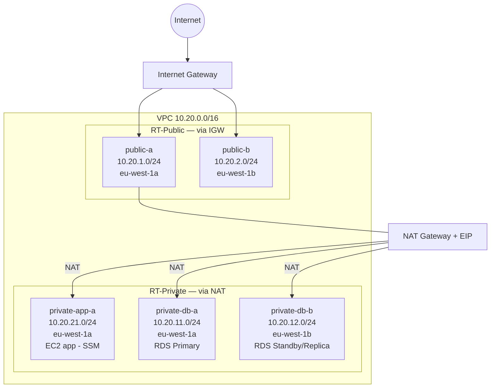

# Fase 0 — Preparación: VPC, Security Groups y Control de Coste

> **Tiempo:** ~35 min | **Coste:** ~0€ (solo red, sin DB todavía) | **Recursos:** VPC, 5 subnets, IGW, NAT, SGs, EC2, alarms

---

## Objetivo

Construir la red de base que necesita RDS: subnets privadas sin acceso a internet, Security Groups que restringen el acceso a la DB al mínimo necesario, una instancia EC2 de aplicación accesible vía SSM (sin keypair), y alarmas de coste para evitar sorpresas.

---

## Estado de la red al final de esta fase



---

## Paso 1 — Crear la VPC

**Consola:** VPC → Your VPCs → **Create VPC**

| Campo | Valor |
|-------|-------|
| Resources to create | **VPC only** |
| Name tag | `vpc-db-labs` |
| IPv4 CIDR | `10.20.0.0/16` |
| IPv6 | No IPv6 CIDR block |
| Tenancy | Default |

> ⚠️ Después de crear: VPC → Actions → **Edit VPC settings** → habilitar:
> - **Enable DNS hostnames** ✓ (necesario para endpoints RDS, SSM)
> - **Enable DNS resolution** ✓

✅ **Validación:** VPC `vpc-db-labs` aparece con estado `Available`, CIDR `10.20.0.0/16`, DNS hostnames = Enabled.

<details>
<summary>CLI equivalente</summary>

```bash
source cli/00-env.sh

VPC_ID=$(aws ec2 create-vpc \
  --cidr-block 10.20.0.0/16 \
  --tag-specifications "ResourceType=vpc,Tags=[{Key=Name,Value=vpc-db-labs},{Key=Project,Value=$PROJECT},{Key=Env,Value=$ENV}]" \
  --query 'Vpc.VpcId' --output text --region $REGION)

aws ec2 modify-vpc-attribute --vpc-id $VPC_ID --enable-dns-hostnames
aws ec2 modify-vpc-attribute --vpc-id $VPC_ID --enable-dns-support
echo "VPC_ID=$VPC_ID" >> cli/00-resources.env
ok "VPC creada: $VPC_ID"
```
</details>

---

## Paso 2 — Crear las 5 subnets

**Consola:** VPC → Subnets → **Create subnet** → seleccionar `vpc-db-labs`

Crea estas subnets una a una:

| Nombre | CIDR | AZ | Auto-assign public IP |
|--------|------|----|-----------------------|
| `public-a` | 10.20.1.0/24 | eu-west-1a | **Sí** |
| `public-b` | 10.20.2.0/24 | eu-west-1b | **Sí** |
| `private-db-a` | 10.20.11.0/24 | eu-west-1a | **No** |
| `private-db-b` | 10.20.12.0/24 | eu-west-1b | **No** |
| `private-app-a` | 10.20.21.0/24 | eu-west-1a | **No** |

> **Por qué eu-west-1a y eu-west-1b:** Multi-AZ requiere subnets en al menos 2 AZs distintas.

✅ **Validación:** 5 subnets visibles en VPC → Subnets, filtrando por `vpc-db-labs`.

<details>
<summary>CLI equivalente</summary>

```bash
declare -A SUBNET_NAMES=( ["public-a"]="10.20.1.0/24:eu-west-1a" ["public-b"]="10.20.2.0/24:eu-west-1b" ["private-db-a"]="10.20.11.0/24:eu-west-1a" ["private-db-b"]="10.20.12.0/24:eu-west-1b" ["private-app-a"]="10.20.21.0/24:eu-west-1a" )
for NAME in "${!SUBNET_NAMES[@]}"; do
  IFS=':' read -r CIDR AZ <<< "${SUBNET_NAMES[$NAME]}"
  SID=$(aws ec2 create-subnet --vpc-id $VPC_ID --cidr-block $CIDR --availability-zone $AZ \
    --tag-specifications "ResourceType=subnet,Tags=[{Key=Name,Value=$NAME}]" \
    --query 'Subnet.SubnetId' --output text --region $REGION)
  echo "SUBNET_${NAME//-/_}=$SID" >> cli/00-resources.env
  ok "Subnet $NAME: $SID"
done
```
</details>

---

## Paso 3 — Internet Gateway

**Consola:** VPC → Internet Gateways → **Create internet gateway**
- Name: `igw-db-labs`
- Crear → Actions → **Attach to VPC** → `vpc-db-labs`

✅ **Validación:** IGW en estado `Attached` a `vpc-db-labs`.

---

## Paso 4 — NAT Gateway + Elastic IP

**Consola:** VPC → NAT Gateways → **Create NAT gateway**

| Campo | Valor |
|-------|-------|
| Name | `nat-db-labs` |
| Subnet | `public-a` (IMPORTANTE: subnet pública) |
| Connectivity type | Public |
| Elastic IP allocation | **Allocate Elastic IP** (clic) |

> ⏳ El NAT Gateway tarda ~1-2 minutos en estar disponible.

> ⚠️ **Coste**: NAT Gateway cuesta ~0.045€/hora + datos transferidos. Representa ~33€/mes si se olvida activo. **Hacer cleanup al terminar el lab.**

✅ **Validación:** Estado `Available`, con EIP asignada.

---

## Paso 5 — Route Tables

### RT-Public (→ IGW)
**Consola:** VPC → Route Tables → **Create route table**
- Name: `rt-public-db-labs` | VPC: `vpc-db-labs`
- Routes → Edit routes → Add route: `0.0.0.0/0` → `igw-db-labs`
- Subnet associations → Edit → asociar: `public-a`, `public-b`

### RT-Private (→ NAT)
- Name: `rt-private-db-labs` | VPC: `vpc-db-labs`
- Routes → Edit routes → Add route: `0.0.0.0/0` → `nat-db-labs`
- Subnet associations → Edit → asociar: `private-db-a`, `private-db-b`, `private-app-a`

✅ **Validación:** Cada subnet tiene su RT correcto en la columna "Route table".

---

## Paso 6 — Security Groups

Crea estos 3 Security Groups (VPC → Security Groups → **Create security group**):

### SG 1 — sg-app (instancia de aplicación)
- Name: `sg-app-db-labs` | VPC: `vpc-db-labs`
- Inbound: ninguna regla (acceso vía SSM, no SSH)
- Outbound: `All traffic → 0.0.0.0/0` (para SSM y descargas)

### SG 2 — sg-rds (instancia RDS)
- Name: `sg-rds-db-labs` | VPC: `vpc-db-labs`
- Inbound: `MySQL/Aurora (3306)` → Source: **Custom** → `sg-app-db-labs`
- Outbound: ninguna (RDS no inicia conexiones)

> **Principio de menor privilegio:** RDS solo acepta conexiones desde la capa app, nunca desde internet.

### SG 3 — sg-ssm-endpoints (VPC endpoints de SSM)
- Name: `sg-ssm-ep-db-labs` | VPC: `vpc-db-labs`
- Inbound: `HTTPS (443)` → Source: `10.20.0.0/16` (toda la VPC)
- Outbound: `All traffic → 0.0.0.0/0`

✅ **Validación:** 3 SGs creados. sg-rds tiene inbound source = sg-app-db-labs (no un CIDR).

---

## Paso 7 — VPC Endpoints para SSM

Sin estos endpoints, SSM Session Manager no funciona en subnets privadas sin NAT (o con NAT pero más económico con endpoints).

**Consola:** VPC → Endpoints → **Create endpoint**

Crea los 3 siguientes (Interface type):

| Nombre | Service Name |
|--------|-------------|
| `ep-ssm` | `com.amazonaws.eu-west-1.ssm` |
| `ep-ssmmessages` | `com.amazonaws.eu-west-1.ssmmessages` |
| `ep-ec2messages` | `com.amazonaws.eu-west-1.ec2messages` |

Para cada uno:
- VPC: `vpc-db-labs`
- Subnets: `private-app-a`
- Security group: `sg-ssm-ep-db-labs`
- Policy: Full access

✅ **Validación:** 3 endpoints en estado `Available`.

---

## Paso 8 — IAM Instance Profile para SSM

**Consola:** IAM → Roles → **Create role**
- Trusted entity: **AWS service → EC2**
- Permissions: `AmazonSSMManagedInstanceCore`
- Name: `role-ec2-ssm-db-labs`

IAM → Roles → `role-ec2-ssm-db-labs` → Instance profiles (se crea automáticamente con el mismo nombre).

---

## Paso 9 — EC2 instancia de aplicación

**Consola:** EC2 → Instances → **Launch instances**

| Campo | Valor |
|-------|-------|
| Name | `db-lab-rds-app` |
| AMI | Amazon Linux 2023 (x86_64) |
| Instance type | t3.micro |
| Key pair | **Proceed without a key pair** |
| VPC | `vpc-db-labs` |
| Subnet | `private-app-a` |
| Auto-assign public IP | **Disable** |
| Security groups | `sg-app-db-labs` |
| IAM instance profile | `role-ec2-ssm-db-labs` |
| User data | (vacío — usaremos SSM) |

Tags: `Project=db-labs`, `Lab=lab01`, `Env=lab`

✅ **Validación:** Instancia en estado `Running`. SSM Manager → Fleet Manager → la instancia aparece como `Online`.

---

## Paso 10 — Alarmas de coste

### AWS Budgets (recomendado)
**Consola:** Billing → Budgets → **Create a budget**
- Type: **Cost budget**
- Budget name: `db-labs-budget`
- Amount: `20€`
- Alert: 80% (16€) → tu email

### CloudWatch Alarm (alerta inmediata)
**Consola:** CloudWatch → Alarms → **Create alarm**
- Metric: `AWS/Billing → EstimatedCharges → Currency=USD`
- Threshold: > 22 USD (~20€)
- Action: Create SNS topic `db-labs-billing-alert` → tu email

✅ **Validación:** El budget aparece en Billing → Budgets. La alarm en CloudWatch en estado `OK`.

---

## Resumen de la fase

Al terminar este paso tienes:

```
✅ VPC vpc-db-labs (10.20.0.0/16) con DNS habilitado
✅ 5 subnets en 2 AZs (2 públicas, 3 privadas)
✅ IGW + NAT Gateway + Elastic IP
✅ RT-public (→IGW) y RT-private (→NAT) correctamente asociadas
✅ 3 Security Groups con reglas de mínimo privilegio
✅ 3 VPC Endpoints SSM (EC2 privada puede usar SSM)
✅ EC2 db-lab-rds-app en private-app-a, accesible vía SSM
✅ Alarma de presupuesto configurada
```

**Siguiente fase:** [fase-01-rds-seguridad.md](./fase-01-rds-seguridad.md)
