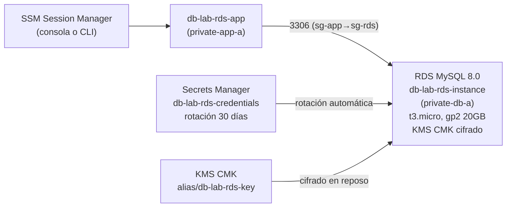

# Fase 1 — RDS MySQL: Subnets Privadas, KMS y Secrets Manager

> **Tiempo:** ~45 min | **Coste:** ~0.017€/hora (db.t3.micro RDS) | **Prerequisito:** Fase 0 completada

---

## Objetivo

Crear una instancia RDS MySQL 8.0 Single-AZ en subnets privadas, con cifrado en reposo mediante KMS CMK, credenciales gestionadas por Secrets Manager con rotación automática, y validar la conectividad desde la EC2 de aplicación sin exponer nada a internet.

---

## Estado al final de esta fase



---

## Paso 1 — Crear KMS Customer Managed Key (CMK)

> **Por qué CMK y no AWS managed key:** Con CMK tienes control total (rotar, deshabilitar, revocar). Para examen: CMK es la respuesta cuando el enunciado dice "control total de la clave".

**Consola:** KMS → Customer managed keys → **Create key**

| Campo | Valor |
|-------|-------|
| Key type | Symmetric |
| Key usage | Encrypt and decrypt |
| Alias | `alias/db-lab-rds-key` |
| Description | `CMK para cifrado de RDS del lab01` |
| Key administrators | tu usuario/role IAM |
| Key users | tu usuario/role IAM |

En la última pantalla: **Enable key rotation** ✓

✅ **Validación:** KMS → Customer managed keys → clave con alias `db-lab-rds-key` en estado `Enabled`, rotation = Enabled.

<details>
<summary>CLI equivalente</summary>

```bash
source cli/00-env.sh && source cli/00-resources.env

KMS_KEY_ID=$(aws kms create-key \
  --description "CMK para RDS lab01 db-labs" \
  --tags TagKey=Project,TagValue=db-labs TagKey=Lab,TagValue=lab01 \
  --query 'KeyMetadata.KeyId' --output text --region $REGION)

aws kms create-alias \
  --alias-name alias/db-lab-rds-key \
  --target-key-id $KMS_KEY_ID \
  --region $REGION

aws kms enable-key-rotation --key-id $KMS_KEY_ID --region $REGION

echo "KMS_KEY_ID=$KMS_KEY_ID" >> cli/00-resources.env
ok "KMS CMK creada: $KMS_KEY_ID"
```
</details>

---

## Paso 2 — Crear DB Subnet Group

El DB Subnet Group indica a RDS en qué subnets puede desplegar instancias. **Debe usar solo subnets privadas.**

**Consola:** RDS → Subnet groups → **Create DB subnet group**

| Campo | Valor |
|-------|-------|
| Name | `db-lab-rds-subnetgroup` |
| Description | `Subnets privadas para RDS lab01` |
| VPC | `vpc-db-labs` |
| Availability Zones | eu-west-1a, eu-west-1b |
| Subnets | `private-db-a` (10.20.11.0/24), `private-db-b` (10.20.12.0/24) |

> **Trampa del examen:** Si incluyes una subnet pública en el DB Subnet Group, RDS podría desplegarse ahí con `Publicly accessible = Yes`. Siempre usa subnets privadas.

✅ **Validación:** DB Subnet Group en estado `Complete`, 2 subnets en 2 AZs.

<details>
<summary>CLI equivalente</summary>

```bash
source cli/00-resources.env

# Obtener IDs de las subnets privadas DB
SUBNET_DB_A=$(aws ec2 describe-subnets \
  --filters "Name=tag:Name,Values=private-db-a" "Name=vpc-id,Values=$VPC_ID" \
  --query 'Subnets[0].SubnetId' --output text --region $REGION)

SUBNET_DB_B=$(aws ec2 describe-subnets \
  --filters "Name=tag:Name,Values=private-db-b" "Name=vpc-id,Values=$VPC_ID" \
  --query 'Subnets[0].SubnetId' --output text --region $REGION)

aws rds create-db-subnet-group \
  --db-subnet-group-name db-lab-rds-subnetgroup \
  --db-subnet-group-description "Subnets privadas para RDS lab01" \
  --subnet-ids $SUBNET_DB_A $SUBNET_DB_B \
  --tags Key=Project,Value=db-labs Key=Lab,Value=lab01 \
  --region $REGION

ok "DB Subnet Group creado"
```
</details>

---

## Paso 3 — Crear Secret en Secrets Manager

**Consola:** Secrets Manager → **Store a new secret**

| Pantalla | Campo | Valor |
|----------|-------|-------|
| 1. Secret type | | **Credentials for Amazon RDS database** |
| 1. Username | | `admin` |
| 1. Password | | (auto-generated, 16 chars, complex) |
| 1. Encryption key | | `alias/db-lab-rds-key` (nuestro CMK) |
| 2. Secret name | | `db-lab-rds-credentials` |
| 2. Description | | `Credenciales admin para RDS lab01` |
| 3. Rotation | | Configuraremos después (necesita el ARN de RDS) |

✅ **Validación:** Secreto creado con ARN. Retrieve secret value → muestra username y password.

<details>
<summary>CLI equivalente</summary>

```bash
# Generar password seguro
DB_PASSWORD=$(aws secretsmanager get-random-password \
  --password-length 16 \
  --require-each-included-type \
  --query 'RandomPassword' --output text --region $REGION)

SECRET_ARN=$(aws secretsmanager create-secret \
  --name db-lab-rds-credentials \
  --description "Credenciales admin para RDS lab01" \
  --kms-key-id alias/db-lab-rds-key \
  --secret-string "{\"username\":\"admin\",\"password\":\"$DB_PASSWORD\"}" \
  --tags Key=Project,Value=db-labs Key=Lab,Value=lab01 \
  --query 'ARN' --output text --region $REGION)

echo "SECRET_ARN=$SECRET_ARN" >> cli/00-resources.env
ok "Secret creado: $SECRET_ARN"
```
</details>

---

## Paso 4 — Crear la instancia RDS MySQL

**Consola:** RDS → Databases → **Create database**

### Engine options
- Engine type: **MySQL**
- Engine version: **MySQL 8.0.x** (la más reciente disponible)

### Templates
- **Dev/Test** (evita Multi-AZ obligatorio y reduce coste)

> En fase-02 añadiremos Multi-AZ manualmente para entender el proceso.

### Settings
| Campo | Valor |
|-------|-------|
| DB instance identifier | `db-lab-rds-instance` |
| Master username | `admin` |
| Credentials management | **Managed in AWS Secrets Manager** |
| Secret | `db-lab-rds-credentials` |

### Instance configuration
| Campo | Valor |
|-------|-------|
| DB instance class | **db.t3.micro** (Burstable, include previous gen) |
| Storage type | **gp2** |
| Allocated storage | **20 GB** |
| Storage autoscaling | **Disable** (para el lab) |

### Connectivity
| Campo | Valor |
|-------|-------|
| VPC | `vpc-db-labs` |
| DB subnet group | `db-lab-rds-subnetgroup` |
| Public access | **No** ← CRÍTICO |
| VPC security group | `sg-rds-db-labs` |
| Availability Zone | eu-west-1a |

### Additional configuration
| Campo | Valor |
|-------|-------|
| Initial database name | `labdb` |
| Backup retention period | **7 days** |
| Backup window | 02:00-03:00 UTC |
| Enhanced Monitoring | **Enable**, granularity 60s |
| Maintenance window | Mon 03:00-04:00 UTC |
| Auto minor version upgrade | **Enable** |
| Encryption | **Enable** |
| AWS KMS key | `alias/db-lab-rds-key` |
| CloudWatch Logs | MySQL Error log, Slow query log |

> ⏳ La creación tarda ~5-10 minutos. Puedes avanzar a los pasos 5-6 mientras esperas.

✅ **Validación:** Estado `Available`, Publicly accessible = `No`, Encrypted = `Yes`.

<details>
<summary>CLI equivalente</summary>

```bash
source cli/00-resources.env

SG_RDS=$(aws ec2 describe-security-groups \
  --filters "Name=group-name,Values=sg-rds-db-labs" "Name=vpc-id,Values=$VPC_ID" \
  --query 'SecurityGroups[0].GroupId' --output text --region $REGION)

aws rds create-db-instance \
  --db-instance-identifier db-lab-rds-instance \
  --db-instance-class db.t3.micro \
  --engine mysql \
  --engine-version "8.0" \
  --master-username admin \
  --manage-master-user-password \
  --master-user-secret-kms-key-id alias/db-lab-rds-key \
  --db-name labdb \
  --allocated-storage 20 \
  --storage-type gp2 \
  --no-publicly-accessible \
  --vpc-security-group-ids $SG_RDS \
  --db-subnet-group-name db-lab-rds-subnetgroup \
  --availability-zone eu-west-1a \
  --backup-retention-period 7 \
  --preferred-backup-window "02:00-03:00" \
  --preferred-maintenance-window "Mon:03:00-Mon:04:00" \
  --storage-encrypted \
  --kms-key-id alias/db-lab-rds-key \
  --enable-cloudwatch-logs-exports mysql error slowquery \
  --auto-minor-version-upgrade \
  --monitoring-interval 60 \
  --tags Key=Project,Value=db-labs Key=Lab,Value=lab01 \
  --region $REGION

# Esperar a que esté disponible
log "Esperando que RDS esté disponible (puede tardar 10 min)..."
aws rds wait db-instance-available \
  --db-instance-identifier db-lab-rds-instance \
  --region $REGION

RDS_ENDPOINT=$(aws rds describe-db-instances \
  --db-instance-identifier db-lab-rds-instance \
  --query 'DBInstances[0].Endpoint.Address' --output text --region $REGION)

echo "RDS_ENDPOINT=$RDS_ENDPOINT" >> cli/00-resources.env
ok "RDS disponible: $RDS_ENDPOINT"
```
</details>

---

## Paso 5 — CloudWatch Alarms

**Consola:** CloudWatch → Alarms → **Create alarm**

### Alarm 1: Poco espacio en disco
- Metric: `RDS → Per-Database Metrics → FreeStorageSpace → db-lab-rds-instance`
- Statistic: Average, Period: 5 minutes
- Condition: `< 2147483648` (2 GB en bytes)
- Action: crear SNS `db-labs-rds-alerts` → tu email
- Name: `db-lab-rds-storage-low`

### Alarm 2: CPU alta
- Metric: `CPUUtilization → db-lab-rds-instance`
- Condition: `> 80` (%)
- Period: 5 minutes, 3 consecutive datapoints
- Name: `db-lab-rds-cpu-high`

✅ **Validación:** 2 alarms en estado `OK` (hay datos porque RDS ya está corriendo).

---

## Paso 6 — Validar conectividad desde EC2

**Consola:** Systems Manager → Session Manager → **Start session** → `db-lab-rds-app`

En la terminal SSM:

```bash
# 1. Instalar cliente MySQL
sudo dnf install -y mariadb105

# 2. Obtener credenciales desde Secrets Manager
CREDS=$(aws secretsmanager get-secret-value \
  --secret-id db-lab-rds-credentials \
  --query 'SecretString' --output text \
  --region eu-west-1)

DB_PASS=$(echo $CREDS | python3 -c "import json,sys; print(json.load(sys.stdin)['password'])")
DB_HOST="<ENDPOINT_DE_TU_RDS>"  # Cópialo de RDS → Connectivity & security → Endpoint

# 3. Conectar
mysql -h $DB_HOST -u admin -p"$DB_PASS" labdb

# 4. Validar dentro de MySQL
SHOW DATABASES;
CREATE TABLE test_tabla (id INT, nombre VARCHAR(50));
INSERT INTO test_tabla VALUES (1, 'hola lab01');
SELECT * FROM test_tabla;
DROP TABLE test_tabla;
EXIT;
```

✅ **Validación:** Conexión exitosa, query devuelve resultados, credenciales nunca se hardcodearon en código.

---

## Conceptos SAA clave de esta fase

| Concepto | Lo que aprendiste |
|----------|------------------|
| **DB Subnet Group con subnets privadas** | RDS nunca en subnets públicas — capa de red como primera defensa |
| **Publicly accessible = No** | Sin esta opción, RDS tiene IP pública aunque esté en subnet privada |
| **KMS CMK vs AWS managed** | CMK = control total (rotar, revocar, auditar por CloudTrail) |
| **Secrets Manager** | Rotación automática, integración nativa RDS, sin passwords en código |
| **SSM Session Manager** | Acceso a EC2 privada sin keypair ni bastión — solución al examen "sin SSH key" |
| **CloudWatch Logs exports** | Error log + slow query log para diagnóstico de rendimiento |

---

**Siguiente fase:** [fase-02-ha-replicas.md](./fase-02-ha-replicas.md)
