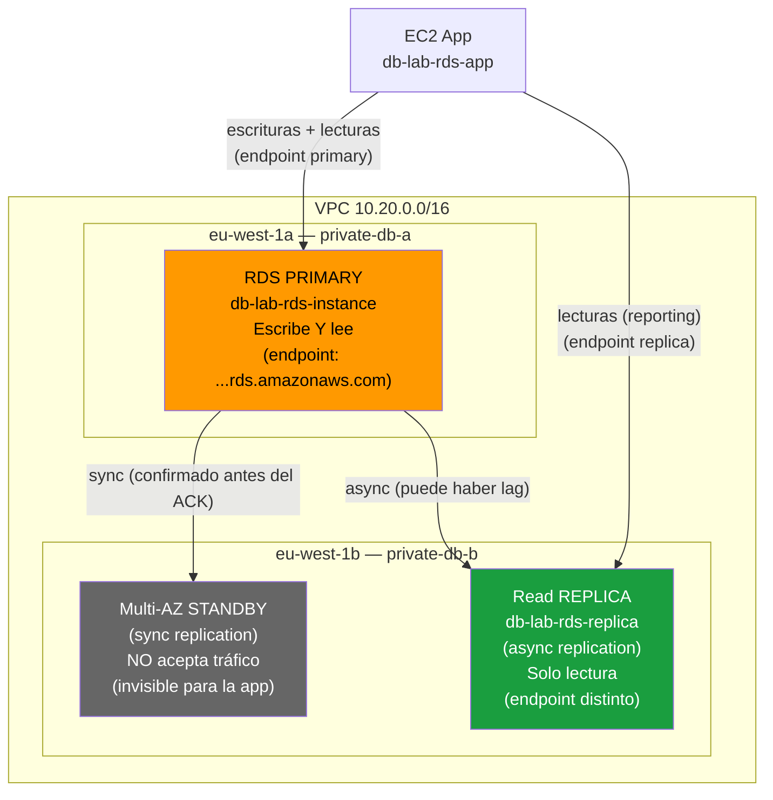

# Fase 2 — Alta Disponibilidad: Multi-AZ y Read Replica

> **Tiempo:** ~30 min + 10-20 min de espera | **Coste:** +~0.034€/hora (2 instancias adicionales)

---

## Objetivo

Comprender la diferencia FUNDAMENTAL entre Multi-AZ y Read Replica, que es posiblemente la pregunta más repetida del SAA-C03 relacionada con RDS:

```
┌─────────────────────────────────────────────────────────────────────┐
│  REGLA DE ORO (memorizar para el examen)                             │
│                                                                      │
│  Multi-AZ   = ALTA DISPONIBILIDAD (HA)                              │
│               Standby SÍNCRONO — NUNCA acepta tráfico               │
│               Failover automático en ~1-2 min si primary falla      │
│                                                                      │
│  Read Replica = ESCALADO DE LECTURA (performance)                   │
│                 Réplica ASÍNCRONA — SÍ acepta tráfico de lectura    │
│                 NO es failover automático (promoción manual)         │
└─────────────────────────────────────────────────────────────────────┘
```

---

## Diagrama del estado final



---

## Parte A — Habilitar Multi-AZ

### ¿Qué ocurre internamente?

Cuando habilitas Multi-AZ, AWS:
1. Crea una instancia standby en la otra AZ (sin que tú la veas como instancia separada en la consola)
2. Sincroniza TODOS los datos del primary al standby (esto tarda varios minutos)
3. Configura replicación síncrona: cada write al primary debe confirmarse en el standby antes de devolver ACK a la app
4. Configura DNS failover: si el primary falla, el endpoint DNS apunta al standby en ~1-2 min

**Consola:** RDS → Databases → `db-lab-rds-instance` → **Modify**

En la sección **Availability & durability**:
- Multi-AZ deployment: **Create a standby instance** ✓

En **Schedule modifications**:
- **Apply immediately** (para el lab, en producción usar maintenance window para evitar brief I/O freeze)

> ⚠️ Al aplicar Multi-AZ inmediatamente puede haber un breve periodo de I/O increased latency mientras se sincroniza el standby. En producción, aplica durante mantenimiento.

> ⏳ La conversión puede tardar 10-20 minutos. Durante este tiempo el status muestra "modifying".

**Observar el proceso:**
- RDS → Databases → `db-lab-rds-instance` → columna "Status" muestra `modifying` → `backing-up` → `available`
- En la pestaña "Maintenance & backups" → "Secondary zone" aparecerá `eu-west-1b`

✅ **Validación:**
- Status: `Available`
- Multi-AZ: `Yes`
- Secondary zone: `eu-west-1b`
- **Comprobación clave:** ¿Hay un segundo endpoint? **NO** — Multi-AZ usa el mismo endpoint. El standby es invisible.

<details>
<summary>CLI equivalente</summary>

```bash
source cli/00-resources.env

aws rds modify-db-instance \
  --db-instance-identifier db-lab-rds-instance \
  --multi-az \
  --apply-immediately \
  --region $REGION

log "Esperando que Multi-AZ esté aplicado..."
aws rds wait db-instance-available \
  --db-instance-identifier db-lab-rds-instance \
  --region $REGION

# Verificar
aws rds describe-db-instances \
  --db-instance-identifier db-lab-rds-instance \
  --query 'DBInstances[0].{MultiAZ:MultiAZ,SecondaryAZ:SecondaryAvailabilityZone,Status:DBInstanceStatus}' \
  --output table --region $REGION
```
</details>

---

### Simular failover (conceptual con Reboot)

**Consola:** RDS → `db-lab-rds-instance` → Actions → **Reboot**
- Marca: **Reboot With Failover?** ✓

Lo que ocurre:
1. RDS inicia el proceso de failover
2. El standby se convierte en primary
3. El DNS del endpoint se actualiza (TTL = 5s pero DNS propagation ~1-2 min)
4. La instancia original se convierte en nuevo standby

Lo que observas:
- El endpoint DNS NO cambia (misma URL)
- Las conexiones existentes se interrumpen brevemente
- Aplicaciones con connection retry automático recuperan solas
- CloudWatch Events: evento "Multi-AZ failover completed"
- En la consola: "Secondary zone" ahora muestra `eu-west-1a` (se invirtieron)

> **Mensaje clave para el examen:** Multi-AZ NO mejora el rendimiento. El standby no sirve tráfico. Su único propósito es HA/Failover.

---

## Parte B — Crear Read Replica

### ¿Cuándo usar Read Replica?

```
Si el enunciado dice:
  "reducir carga de lecturas en el primary"
  "reportes/analytics sin impactar OLTP"
  "escalar lecturas horizontalmente"
  → READ REPLICA

NO confundir con:
  "alta disponibilidad / failover automático"
  → MULTI-AZ
```

**Consola:** RDS → Databases → `db-lab-rds-instance` → Actions → **Create read replica**

| Campo | Valor |
|-------|-------|
| DB instance identifier | `db-lab-rds-replica` |
| DB instance class | `db.t3.micro` (mismo tipo para el lab) |
| Availability Zone | **eu-west-1b** (AZ diferente, buena práctica) |
| Storage type | gp2 |
| Multi-AZ deployment | No (ahorra coste en el lab) |
| Public access | **No** |
| VPC security group | `sg-rds-db-labs` |
| Encryption | (hereda del source) |
| Auto minor version upgrade | Enable |

> ⏳ La Read Replica tarda ~5-10 minutos en estar `Available`.

✅ **Validación:**
- `db-lab-rds-replica` en estado `Available`
- Role: `Replica` (visible en la columna Role)
- Source DB: `db-lab-rds-instance`
- **Tiene su propio endpoint distinto** al primary

<details>
<summary>CLI equivalente</summary>

```bash
source cli/00-resources.env

SG_RDS=$(aws ec2 describe-security-groups \
  --filters "Name=group-name,Values=sg-rds-db-labs" "Name=vpc-id,Values=$VPC_ID" \
  --query 'SecurityGroups[0].GroupId' --output text --region $REGION)

aws rds create-db-instance-read-replica \
  --db-instance-identifier db-lab-rds-replica \
  --source-db-instance-identifier db-lab-rds-instance \
  --db-instance-class db.t3.micro \
  --availability-zone eu-west-1b \
  --no-publicly-accessible \
  --vpc-security-group-ids $SG_RDS \
  --auto-minor-version-upgrade \
  --tags Key=Project,Value=db-labs Key=Lab,Value=lab01 \
  --region $REGION

log "Esperando que Read Replica esté disponible..."
aws rds wait db-instance-available \
  --db-instance-identifier db-lab-rds-replica \
  --region $REGION

REPLICA_ENDPOINT=$(aws rds describe-db-instances \
  --db-instance-identifier db-lab-rds-replica \
  --query 'DBInstances[0].Endpoint.Address' --output text --region $REGION)

echo "REPLICA_ENDPOINT=$REPLICA_ENDPOINT" >> cli/00-resources.env
ok "Read Replica disponible: $REPLICA_ENDPOINT"
```
</details>

---

## Validar Read Replica en acción

Desde SSM Session Manager en `db-lab-rds-app`:

```bash
CREDS=$(aws secretsmanager get-secret-value \
  --secret-id db-lab-rds-credentials \
  --query 'SecretString' --output text --region eu-west-1)
DB_PASS=$(echo $CREDS | python3 -c "import json,sys; print(json.load(sys.stdin)['password'])")

REPLICA_HOST="<TU_REPLICA_ENDPOINT>"

# Conectar a la réplica
mysql -h $REPLICA_HOST -u admin -p"$DB_PASS" labdb

# Verificar que es read-only
SELECT @@hostname;           -- Muestra el hostname del servidor (distinto al primary)
SELECT @@read_only;          -- Debe devolver 1 (read-only = TRUE)

# Intentar escritura (debe fallar)
CREATE TABLE prueba (id INT); -- Error: "The MySQL server is running with the --read-only option"
EXIT;
```

### Verificar ReplicaLag en CloudWatch

**Consola:** CloudWatch → Metrics → RDS → Per-Database Metrics → `ReplicaLag` → `db-lab-rds-replica`

El lag debe ser < 30 segundos en condiciones normales (async replication).

Crear alarma:
- Metric: `ReplicaLag` → `db-lab-rds-replica`
- Threshold: `> 30` segundos
- Name: `db-lab-rds-replica-lag`

---

## Comparativa final: Multi-AZ vs Read Replica

| Característica | Multi-AZ | Read Replica |
|----------------|----------|--------------|
| **Propósito** | Alta Disponibilidad (HA) | Escalado de lectura |
| **Tipo de replicación** | **Síncrona** (ACK antes del retorno) | **Asíncrona** (puede haber lag) |
| **Sirve tráfico** | **NO** (standby inactivo) | **SÍ** (solo lectura) |
| **Endpoint propio** | NO (mismo endpoint) | **SÍ** (endpoint distinto) |
| **Failover** | **Automático** (~1-2 min) | Manual (promover) |
| **Cross-region** | NO | **SÍ** (posible) |
| **Número máximo** | 1 standby | 5 para RDS, 15 para Aurora |
| **Coste** | 2x instancia | 1x instancia adicional |
| **Caso de uso** | RPO/RTO para fallo de instancia/AZ | Reporting, analytics, lecturas intensivas |

> **Para el examen:**
> - "necesito HA con failover automático" → **Multi-AZ**
> - "necesito escalar lecturas / reducir carga del primary" → **Read Replica**
> - "necesito AMBAS cosas" → **Multi-AZ + Read Replica** (pueden coexistir)

---

## PITR — Point-in-Time Recovery (conceptual)

Con automated backups habilitados (7 días), puedes restaurar a cualquier segundo del período:

**Consola:** RDS → `db-lab-rds-instance` → Actions → **Restore to point in time**
- ⚠️ **Esto crea una NUEVA instancia de DB** (no restaura in-place)
- Especificas: fecha/hora exacta
- La nueva instancia tiene el estado de la DB en ese momento
- Útil para: "un desarrollador hizo DELETE sin WHERE hace 2 horas"

> **Trampa del examen:** PITR crea nueva instancia, no restaura la existente. Tendrás que re-apuntar tu aplicación al nuevo endpoint.

---

**Siguiente paso:** [cleanup.md](./cleanup.md) cuando hayas terminado el lab.
