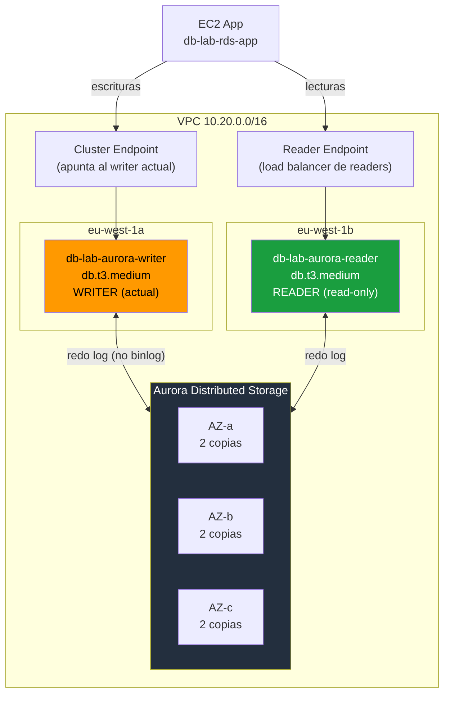

# Lab 02 — Aurora MySQL: Cluster, Failover y Escalado

> **Nivel:** AWS SAA-C03 | **Tiempo total:** ~2h | **Coste estimado:** ~0.50€ (con cleanup inmediato)
> **Prerrequisito:** Lab01 completado (VPC 10.20.0.0/16) o VPC mínima propia

---

## Objetivo

Desplegar un cluster Aurora MySQL 8.0 con writer y reader en AZs distintas, demostrar el failover automático en menos de 30 segundos, y entender por qué el storage distribuido de Aurora es arquitecturalmente diferente a RDS estándar. Comprenderás cuándo Aurora justifica su precio premium frente a RDS.

---

## Qué aprenderás

| Concepto | Descripción |
|----------|-------------|
| **Aurora storage distribuido** | 6 copias en 3 AZs, quorum 4/6 writes, 3/6 reads, auto-grow |
| **Cluster endpoint vs Reader endpoint** | Enrutamiento automático de escrituras y lecturas |
| **Failover < 30 segundos** | Promoción automática del reader, DNS apunta al nuevo writer |
| **Backtrack (Aurora MySQL)** | Rebobinar sin crear snapshot — solo MySQL compatible |
| **Aurora Serverless v2** | Escalado en segundos, sin instancias fijas (conceptual) |
| **Performance Insights** | Análisis de carga de DB a nivel de query |

---

## Arquitectura

```
┌─────────────────────────────────────────────────────────────────────┐
│  AWS eu-west-1                                                        │
│                                                                       │
│  ┌──────────────── VPC 10.20.0.0/16 ─────────────────────────────┐  │
│  │                                                                 │  │
│  │   EC2 App                                                       │  │
│  │   ┌──────────────────────────────────────────────────────────┐ │  │
│  │   │ db-lab-rds-app (reutilizado del lab01)                    │ │  │
│  │   │ Cluster endpoint → 3306 (escrituras)                     │ │  │
│  │   │ Reader endpoint  → 3306 (lecturas, balanceadas)          │ │  │
│  │   └──────────────────────────────────────────────────────────┘ │  │
│  │                        │ sg-app → sg-aurora                    │  │
│  │   private-db-a (eu-west-1a)    private-db-b (eu-west-1b)      │  │
│  │   ┌──────────────────┐         ┌────────────────────────────┐  │  │
│  │   │ db-lab-aurora-   │         │ db-lab-aurora-reader       │  │  │
│  │   │ writer           │◄───────►│ db.t3.medium               │  │  │
│  │   │ db.t3.medium     │  failover│ eu-west-1b                │  │  │
│  │   │ eu-west-1a       │         │ (solo lecturas)            │  │  │
│  │   └──────────────────┘         └────────────────────────────┘  │  │
│  │                                                                  │  │
│  │   Aurora Distributed Storage (compartido, invisible):           │  │
│  │   [AZ-a: 2 copias] [AZ-b: 2 copias] [AZ-c: 2 copias]          │  │
│  │   Quorum escritura 4/6 ─ Quorum lectura 3/6 ─ Auto-grow 128TB │  │
│  └──────────────────────────────────────────────────────────────────┘  │
└──────────────────────────────────────────────────────────────────────────┘
```

---

## Diagrama Mermaid



---

## Aurora vs RDS — tabla de decisión SAA-C03

| Criterio | RDS MySQL | Aurora MySQL | Elige Aurora cuando... |
|----------|-----------|--------------|------------------------|
| Failover automático | ~1-2 min | **< 30 seg** | el enunciado dice "mínimo downtime" |
| Read Replicas | hasta 5 | **hasta 15** | necesitas > 5 réplicas |
| Storage | Provisionado (pagas por GB reservado) | **Auto-grow hasta 128 TB** (pagas por usado) | crece imprevisiblemente |
| Backtrack | NO | **Sí (solo MySQL)** | necesitas revert sin restore |
| Cross-region | Manual (RR) | **Global DB (< 1s lag)** | RPO < 1s entre regiones |
| Serverless | No | **Aurora Serverless v2** | carga impredecible |
| Precio | ~20-30% más barato | Mayor | el coste no es criterio principal |
| Motores soportados | MySQL, PG, Oracle, MSSQL | **Solo MySQL y PG** | Oracle/MSSQL → solo RDS |

> **Regla de oro SAA:** `failover <1min` OR `>5 read replicas` OR `global database` → **Aurora**

---

## Recursos y coste

| Recurso | Coste/hora | Notas |
|---------|-----------|-------|
| Aurora Writer (db.t3.medium) | ~0.082€/h | Fase 1 — mínimo de Aurora |
| Aurora Reader (db.t3.medium) | ~0.082€/h | Fase 2 — necesario para failover real |
| Aurora Storage | ~0.10€/GB/mes | Solo lo usado, sin provisionar |

> **Total lab 2h + cleanup:** aprox. 0.40-0.60€

---

## Estructura

```
lab02-aurora/
├── README.md
├── fase-01-aurora-cluster.md      ← Crear cluster, explorar storage y endpoints
├── fase-02-failover-scaling.md    ← Añadir reader, failover <30s, backtrack
├── cleanup.md
├── cli/
│   ├── 00-env.sh
│   ├── 01-aurora-cluster.sh
│   ├── 02-failover-replica.sh
│   └── 99-cleanup.sh
├── terraform/
│   ├── main.tf
│   ├── variables.tf
│   └── outputs.tf
├── terragrunt/
│   └── terragrunt.hcl
└── troubleshooting/
    ├── 01-aurora-no-failover.md
    ├── 02-reader-endpoint-no-balancea.md
    ├── 03-backtrack-no-disponible.md
    └── 04-aurora-coste-elevado.md
```

**Siguiente paso:** [fase-01-aurora-cluster.md](./fase-01-aurora-cluster.md)
