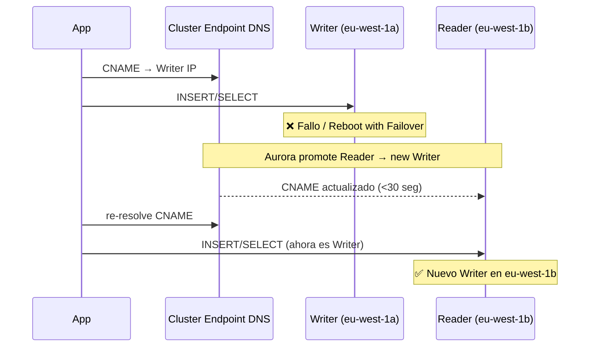

# Fase 02 — Aurora: Failover, Read Scaling y Serverless v2

## Objetivo

Probar el failover automático de Aurora (<30 seg), entender el endpoint de cluster como DNS dinámico, añadir más readers para escalar lecturas, y explorar Aurora Serverless v2 como opción de coste.

**Tiempo estimado:** 40-50 minutos
**Coste adicional:** mínimo (failover es gratis, Serverless v2 ~0.06 ACU/h mínimo)

---

## Parte A — Failover automático

### Mermaid: flujo de failover



### Paso A1 — Verificar estado inicial

```bash
# Qué instancia es actualmente el Writer
aws rds describe-db-clusters \
  --db-cluster-identifier db-lab-aurora-cluster \
  --query 'DBClusters[0].DBClusterMembers[*].{Instance:DBInstanceIdentifier,IsWriter:IsClusterWriter}' \
  --output table --region eu-west-1
```

Salida:
```
---------------------------------------------
| Instance              | IsWriter          |
---------------------------------------------
| db-lab-aurora-writer  | True              |
| db-lab-aurora-reader  | False             |
---------------------------------------------
```

### Paso A2 — Simular failover (Reboot with Failover)

> **Atención:** Esto causa una interrupción breve (~20-30 seg) del Writer. Los datos NO se pierden.

### Consola

1. **RDS → Databases → db-lab-aurora-writer**
2. **Actions → Reboot**
3. ☑ **Reboot with failover** — marca esta opción
4. **Confirm**

<details>
<summary>CLI equivalente</summary>

```bash
aws rds reboot-db-instance \
  --db-instance-identifier db-lab-aurora-writer \
  --force-failover \
  --region eu-west-1

echo "Failover iniciado. Esperando ~30 segundos..."
```

</details>

### Paso A3 — Monitorizar el failover

```bash
# En una terminal separada, ejecuta esto ANTES del failover
# para ver el cambio de Writer en tiempo real
while true; do
  echo -n "$(date +%H:%M:%S) Writer: "
  aws rds describe-db-clusters \
    --db-cluster-identifier db-lab-aurora-cluster \
    --query 'DBClusters[0].DBClusterMembers[?IsClusterWriter==`true`].DBInstanceIdentifier' \
    --output text --region eu-west-1
  sleep 5
done
```

Verás algo así:
```
14:30:01 Writer: db-lab-aurora-writer
14:30:06 Writer: db-lab-aurora-writer
14:30:11 Writer:              ← failover en progreso
14:30:16 Writer: db-lab-aurora-reader   ← ¡Nuevo Writer!
14:30:21 Writer: db-lab-aurora-reader
```

### Paso A4 — Verificar que el endpoint cluster NO cambió

El cluster endpoint siempre apunta al Writer actual. Tu aplicación usa el mismo DNS:

```bash
# El cluster endpoint sigue siendo el mismo
aws rds describe-db-clusters \
  --db-cluster-identifier db-lab-aurora-cluster \
  --query 'DBClusters[0].Endpoint' \
  --output text --region eu-west-1
# db-lab-aurora-cluster.cluster-xxxx.eu-west-1.rds.amazonaws.com ← mismo!

# Pero ahora apunta al reader (que se convirtió en writer)
nslookup db-lab-aurora-cluster.cluster-xxxx.eu-west-1.rds.amazonaws.com
# Resolverá a la IP de la instancia db-lab-aurora-reader (nuevo writer)
```

**Concepto clave para el examen:**
> Aurora usa el cluster endpoint como DNS dinámico. El CNAME se actualiza automáticamente en <30 seg tras el failover. La aplicación NO necesita cambiar su connection string.

---

## Parte B — Failover Priority (tiers)

Aurora permite controlar QUÉ Reader se convierte en Writer durante un failover usando **failover priority (tiers 0-15)**.

### Consola

1. **RDS → Databases → db-lab-aurora-reader**
2. **Modify**
3. Busca **Failover priority** → `tier-0` (más alta prioridad)
4. **Apply immediately**

<details>
<summary>CLI equivalente</summary>

```bash
aws rds modify-db-instance \
  --db-instance-identifier db-lab-aurora-reader \
  --promotion-tier 0 \
  --apply-immediately \
  --region eu-west-1
```

</details>

**Regla para el examen:**
- Tier 0 = máxima prioridad (primero en ser promovido)
- Tier 15 = mínima (último)
- Si hay empate en tier, Aurora elige el más grande en términos de instancia

---

## Parte C — Aurora Backtrack

Aurora Backtrack permite "rebobinar" la base de datos a un punto en el pasado **sin restaurar un backup** (solo MySQL). Ideal para errores accidentales.

> **Nota SAA-C03:** Backtrack no es un reemplazo de PITR. Es más rápido (segundos) pero tiene una ventana máxima limitada (configurada al crear el cluster, máx 72h).

### Simular un error accidental y hacer Backtrack

```bash
WRITER="db-lab-aurora-cluster.cluster-xxxx.eu-west-1.rds.amazonaws.com"
AURORA_PW=$(aws secretsmanager get-secret-value \
  --secret-id lab02/aurora/admin --query 'SecretString' \
  --output text --region eu-west-1 | jq -r '.password')

# Anotar el timestamp ANTES del error
BACKTRACK_TO=$(date -u +"%Y-%m-%dT%H:%M:%SZ")
echo "Timestamp para backtrack: $BACKTRACK_TO"

# Simular DROP TABLE accidental
mysql -h $WRITER -u admin -p"$AURORA_PW" auroradb -e "
  INSERT INTO aurora_test (mensaje) VALUES ('dato antes del error');
  DROP TABLE aurora_test;
  SHOW TABLES;
"
# aurora_test ya no existe
```

### Hacer Backtrack desde la consola

1. **RDS → Databases → db-lab-aurora-cluster**
2. **Actions → Backtrack**
3. En "Backtrack to": introduce el timestamp de antes del DROP
4. **Backtrack cluster**

O vía CLI:

```bash
aws rds backtrack-db-cluster \
  --db-cluster-identifier db-lab-aurora-cluster \
  --backtrack-to "$BACKTRACK_TO" \
  --region eu-west-1

# Esperar a que el cluster vuelva a available
aws rds wait db-cluster-available \
  --db-cluster-identifier db-lab-aurora-cluster \
  --region eu-west-1

# Verificar que la tabla volvió
mysql -h $WRITER -u admin -p"$AURORA_PW" auroradb -e "SELECT * FROM aurora_test;"
```

---

## Parte D — Aurora Serverless v2 (concepto + cuándo usar)

> **Nota:** Aurora Serverless v2 requiere instancias `db.serverless`. Para crear una, debes modificar el instance class durante la creación. En este lab lo cubrimos conceptualmente por coste.

### ¿Cuándo usar Aurora Serverless v2?

```
┌─────────────────────────────────────────────────────────────────┐
│  USA Aurora Serverless v2 cuando:                               │
│                                                                  │
│  ✅ Carga impredecible o muy variable (picos esporádicos)       │
│  ✅ Workloads intermitentes (dev, staging, demos)               │
│  ✅ No puedes predecir el tamaño de instancia                   │
│  ✅ Quieres escalar sin tiempo de inactividad                   │
│                                                                  │
│  ❌ NO uses Serverless v2 cuando:                               │
│  ❌ Carga constante y predecible → instancias fijas más baratas │
│  ❌ Necesitas max performance garantizado                       │
└─────────────────────────────────────────────────────────────────┘
```

### Unidad: Aurora Capacity Unit (ACU)

- 1 ACU ≈ 2 GiB RAM + CPU proporcional
- Mínimo: 0.5 ACU | Máximo: 128 ACU
- Precio (~eu-west-1): 0.06 USD/ACU·h
- Escala en fracciones de ACU en segundos

### Convertir instancia existente a Serverless v2

```bash
# Modificar la instancia reader a serverless v2
aws rds modify-db-instance \
  --db-instance-identifier db-lab-aurora-reader \
  --db-instance-class db.serverless \
  --apply-immediately \
  --region eu-west-1

# Configurar min/max ACU para el cluster
aws rds modify-db-cluster \
  --db-cluster-identifier db-lab-aurora-cluster \
  --serverless-v2-scaling-configuration MinCapacity=0.5,MaxCapacity=4 \
  --apply-immediately \
  --region eu-west-1
```

---

## Parte E — Aurora Global Database (concepto SAA)

Aurora Global Database permite replicar un cluster a otra región con latencia <1 seg. Diseñado para:
- DR cross-region (RPO <5 seg, RTO <1 min)
- Lecturas de baja latencia para usuarios en otra región

```
┌─────────────────────────────────────────────────────────────────────┐
│  eu-west-1 (Primary Region)                                         │
│  ┌─────────────────┐                                                 │
│  │  Aurora Cluster  │ ──── replication <1 seg ────►  us-east-1      │
│  │  R + W          │                                  (Secondary)    │
│  └─────────────────┘                                  R only         │
│                                                                      │
│  Failover cross-region: ~1 minuto (promueve secondary a primary)    │
└─────────────────────────────────────────────────────────────────────┘
```

**Examen SAA-C03 — Global Database vs Multi-AZ:**

| | Multi-AZ | Global Database |
|--|--|--|
| Scope | Una región, 2 AZs | Dos regiones |
| Failover | <30 seg (automático) | ~1 min (manual promote) |
| Uso | HA dentro de región | DR cross-region + read latency |
| Writes | Solo primary | Solo primary region |

---

## ✅ Validaciones de la fase

```bash
# 1. Confirmar que el failover cambió el writer
aws rds describe-db-clusters \
  --db-cluster-identifier db-lab-aurora-cluster \
  --query 'DBClusters[0].DBClusterMembers[*].{Instance:DBInstanceIdentifier,IsWriter:IsClusterWriter}' \
  --output table --region eu-west-1
# Ahora db-lab-aurora-reader debería ser IsWriter=True

# 2. Cluster endpoint sigue siendo el mismo
aws rds describe-db-clusters \
  --db-cluster-identifier db-lab-aurora-cluster \
  --query 'DBClusters[0].Endpoint' \
  --output text --region eu-west-1

# 3. Backtrack window configurado
aws rds describe-db-clusters \
  --db-cluster-identifier db-lab-aurora-cluster \
  --query 'DBClusters[0].{BacktrackWindow:BacktrackWindow,EarliestBacktrackTime:EarliestRestorableTime}' \
  --output table --region eu-west-1
```

---

## Tabla resumen SAA-C03 para Aurora

| Pregunta del examen | Respuesta |
|---------------------|-----------|
| ¿Qué endpoint uso para writes? | **Cluster endpoint** (Writer) |
| ¿Qué endpoint uso para reads escalados? | **Reader endpoint** (load balancer) |
| ¿Cuántos readers soporta Aurora? | **15** (vs 5 en RDS) |
| ¿Hay replication lag en Aurora readers? | **No** (mismo cluster volume) |
| ¿Cuánto tarda el failover Aurora? | **<30 segundos** (vs 1-2 min RDS Multi-AZ) |
| ¿Qué es Backtrack? | Rebobinar DB sin restaurar backup (solo MySQL) |
| ¿Para qué sirve Serverless v2? | Escalar automáticamente ACUs para carga variable |
| ¿Para qué sirve Global Database? | DR cross-region con RPO <5 seg |
| ¿El standby en Multi-AZ Aurora acepta lecturas? | **No** — usar Reader endpoint para eso |
