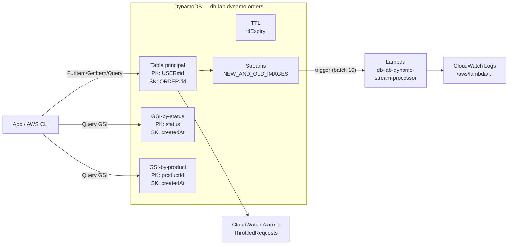

# Lab 03 — DynamoDB: Modelado, Capacity y Streams

> **Nivel:** AWS SAA-C03 | **Tiempo total:** ~2.5h | **Coste estimado:** < 0.10€ (DynamoDB on-demand)
> **No requiere VPC** — DynamoDB es un servicio regional gestionado por AWS

---

## Objetivo

Diseñar una tabla DynamoDB para un sistema de pedidos de e-commerce, entender por qué el diseño de la Partition Key es crítico para evitar hot partitions, implementar GSIs para diferentes access patterns, y conectar Streams con Lambda para procesamiento en tiempo real.

---

## Qué aprenderás

| Concepto | Descripción |
|----------|-------------|
| **Access Patterns first** | Diseñar PK/SK desde los patrones de acceso, no desde el esquema |
| **Hot partitions** | Por qué una PK con baja cardinalidad destruye el rendimiento |
| **GSI vs LSI** | Cuándo añadir índices secundarios y su coste |
| **On-Demand vs Provisioned** | Cuándo cada modo es óptimo + autoscaling |
| **TTL** | Expiración automática sin consumir WCU |
| **DynamoDB Streams + Lambda** | CDC: detectar cambios y reaccionar en tiempo real |
| **DAX** | Caché in-memory específico de DynamoDB (conceptual) |

---

## Caso de uso: Sistema de pedidos e-commerce

### Access Patterns definidos

| # | Patrón | Operación DynamoDB |
|---|--------|-------------------|
| AP1 | Todos los pedidos de un usuario | Query PK=`USER#<id>` |
| AP2 | Pedido específico | GetItem PK=`USER#<id>` SK=`ORDER#<id>` |
| AP3 | Pedidos pendientes ordenados por fecha | Query GSI-by-status PK=`PENDING` |
| AP4 | Qué usuarios compraron un producto | Query GSI-by-product PK=`PROD#<id>` |

### Diseño de tabla

```
Tabla: db-lab-dynamo-orders
┌──────────────────────────────────────────────────────────────────────┐
│  PK (String)          │ SK (String)              │ Atributos          │
├──────────────────────────────────────────────────────────────────────┤
│ USER#001              │ ORDER#20240101-001        │ status, total,     │
│ USER#001              │ ORDER#20240115-002        │ createdAt,         │
│ USER#002              │ ORDER#20240102-003        │ productId,         │
│ USER#003              │ ORDER#20240103-004        │ items[],           │
│                       │                           │ ttlExpiry          │
├──────────────────────────────────────────────────────────────────────┤
│  GSI-by-status        │ PK=status │ SK=createdAt  │ AP3: pedidos       │
│  GSI-by-product       │ PK=productId │ SK=createdAt│ AP4: por producto │
└──────────────────────────────────────────────────────────────────────┘
```

---

## Arquitectura del Lab

```
┌──────────────────────────────────────────────────────────────────────┐
│  AWS eu-west-1                                                        │
│                                                                       │
│  ┌─── DynamoDB Table: db-lab-dynamo-orders ────────────────────────┐ │
│  │  PK: USER#<id>  SK: ORDER#<id>                                  │ │
│  │  GSI-by-status  │  GSI-by-product                               │ │
│  │  TTL: ttlExpiry attribute                                        │ │
│  │  Streams: NEW_AND_OLD_IMAGES                                     │ │
│  └──────────────────────────────────────────────────────────────────┘ │
│                              │ Streams                               │
│                              ▼                                       │
│  ┌─── Lambda: db-lab-dynamo-stream-processor ──────────────────────┐ │
│  │  Runtime: Python 3.12                                           │ │
│  │  Trigger: DynamoDB Stream (batch 10)                            │ │
│  │  Logs → CloudWatch Logs: /aws/lambda/db-lab-dynamo-stream-...  │ │
│  └──────────────────────────────────────────────────────────────────┘ │
│                                                                       │
│  CloudWatch Alarms:                                                   │
│    - ThrottledRequests > 0                                            │
│    - ConsumedReadCapacityUnits > threshold                            │
└──────────────────────────────────────────────────────────────────────┘
```

---

## Diagrama Mermaid



---

## DynamoDB vs RDS — cuándo cada uno

| Señal en el enunciado | Servicio correcto |
|----------------------|-------------------|
| "escala a millones de usuarios" | **DynamoDB** |
| "latencia de milisegundos" | **DynamoDB** |
| "schema flexible / sin schema fijo" | **DynamoDB** |
| "serverless, sin gestionar DB" | **DynamoDB** |
| "key-value" | **DynamoDB** |
| "JOINs entre tablas" | RDS/Aurora |
| "transacciones ACID multi-tabla complejas" | RDS/Aurora |
| "ya tienen MySQL/PostgreSQL" | RDS/Aurora |
| "reporting SQL / BI" | RDS/Aurora o Redshift |

---

## Recursos y coste

| Recurso | Coste | Notas |
|---------|-------|-------|
| DynamoDB On-Demand | ~$1.25/millón WRU, $0.25/millón RRU | Lab: < 0.01€ |
| DynamoDB Storage | ~$0.25/GB/mes | Lab: < 0.01€ |
| Lambda | Gratis (free tier) | 1M invocaciones/mes gratis |
| CloudWatch | Gratis (métricas básicas) | |

> **Total lab: prácticamente 0€** — limpiarlo por buenas prácticas

---

## Estructura

```
lab03-dynamodb/
├── README.md
├── fase-01-modelado.md            ← Diseño PK/SK, GSIs, Query vs Scan
├── fase-02-capacity.md            ← On-Demand vs Provisioned, throttling, DAX
├── fase-03-streams-ttl.md         ← TTL + Streams + Lambda trigger
├── cleanup.md
├── cli/
│   ├── 00-env.sh
│   ├── 01-tabla-gsi.sh            ← Crear tabla + GSIs + insertar datos de prueba
│   ├── 02-capacity-ttl.sh         ← Cambiar capacity mode + TTL + alarms
│   ├── 03-streams-lambda.sh       ← Streams + Lambda + demo CDC
│   └── 99-cleanup.sh
├── terraform/
│   ├── main.tf
│   ├── variables.tf
│   └── outputs.tf
├── terragrunt/
│   └── terragrunt.hcl
└── troubleshooting/
    ├── 01-throttling-hot-partition.md
    ├── 02-query-scan-ineficiente.md
    └── 03-streams-lambda-no-dispara.md
```

**Siguiente paso:** [fase-01-modelado.md](./fase-01-modelado.md)
