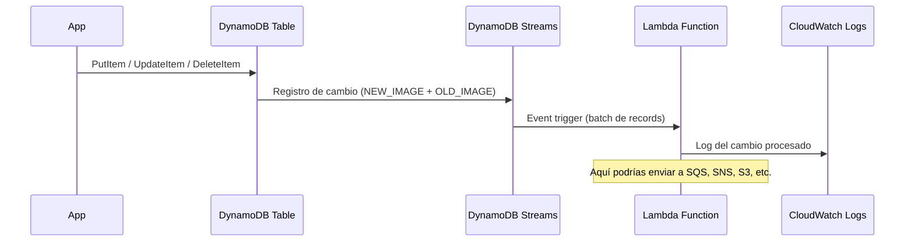

# Fase 03 — DynamoDB Streams + Lambda Trigger

## Objetivo

Habilitar DynamoDB Streams para capturar cambios en la tabla, crear una función Lambda que reaccione a los cambios (patrón Event-Driven), y verificar el flujo completo insert → stream → Lambda → CloudWatch Logs.

**Tiempo estimado:** 35-45 minutos
**Coste:** prácticamente 0€ (Lambda free tier cubre miles de invocaciones)

---

## Arquitectura del flujo



---

## Paso 1 — Habilitar DynamoDB Streams

### Consola

1. **DynamoDB → Tables → ecommerce-orders → Exports and streams tab**
2. Sección **DynamoDB stream details** → **Enable**
3. View type: **New and old images** (para procesar tanto el estado anterior como el nuevo)
4. **Enable stream**

<details>
<summary>CLI equivalente</summary>

```bash
aws dynamodb update-table \
  --table-name ecommerce-orders \
  --stream-specification "StreamEnabled=true,StreamViewType=NEW_AND_OLD_IMAGES" \
  --region eu-west-1

# Obtener el Stream ARN
STREAM_ARN=$(aws dynamodb describe-table \
  --table-name ecommerce-orders \
  --query 'Table.LatestStreamArn' \
  --output text --region eu-west-1)

echo "Stream ARN: $STREAM_ARN"
```

</details>

---

## Paso 2 — Crear IAM Role para Lambda

Lambda necesita permisos para:
- Leer del DynamoDB Stream
- Escribir logs en CloudWatch

### Consola

1. **IAM → Roles → Create role**
2. Trusted entity: **Lambda**
3. Attach policies:
   - `AWSLambdaDynamoDBExecutionRole` (incluye acceso a Streams + CloudWatch Logs)
4. Role name: `lambda-dynamodb-stream-role`
5. **Create role**

<details>
<summary>CLI equivalente</summary>

```bash
# Trust policy para Lambda
cat > /tmp/lambda-trust.json << 'EOF'
{
  "Version": "2012-10-17",
  "Statement": [{
    "Effect": "Allow",
    "Principal": {"Service": "lambda.amazonaws.com"},
    "Action": "sts:AssumeRole"
  }]
}
EOF

LAMBDA_ROLE_ARN=$(aws iam create-role \
  --role-name lambda-dynamodb-stream-role \
  --assume-role-policy-document file:///tmp/lambda-trust.json \
  --query 'Role.Arn' --output text)

# Adjuntar política que incluye DynamoDB Streams + CloudWatch Logs
aws iam attach-role-policy \
  --role-name lambda-dynamodb-stream-role \
  --policy-arn arn:aws:iam::aws:policy/service-role/AWSLambdaDynamoDBExecutionRole

echo "Lambda Role ARN: $LAMBDA_ROLE_ARN"
sleep 15  # Esperar propagación de IAM
```

</details>

---

## Paso 3 — Crear la función Lambda

La función Lambda procesa los cambios de DynamoDB y los registra en CloudWatch Logs.

### Código de la función

```python
# lambda_function.py
import json
import logging

logger = logging.getLogger()
logger.setLevel(logging.INFO)

def lambda_handler(event, context):
    """
    Procesa records del DynamoDB Stream.
    Cada record contiene: eventName (INSERT/MODIFY/REMOVE) + NewImage + OldImage
    """
    logger.info(f"Procesando {len(event['Records'])} records del stream")

    for record in event['Records']:
        event_name = record['eventName']  # INSERT, MODIFY, REMOVE
        table_name = record['eventSourceARN'].split('/')[1]

        # Deserializar el DynamoDB item
        if event_name == 'INSERT':
            new_item = deserialize(record['dynamodb'].get('NewImage', {}))
            logger.info(f"[INSERT] Tabla={table_name} PK={new_item.get('PK')} SK={new_item.get('SK')}")

            # Procesar según tipo
            tipo = new_item.get('tipo', 'UNKNOWN')
            if tipo == 'ORDER':
                logger.info(f"  → Nuevo pedido: total={new_item.get('total')} estado={new_item.get('estado')}")
                # Aquí podrías: enviar a SQS para procesamiento, notificar por SNS, etc.

        elif event_name == 'MODIFY':
            old_item = deserialize(record['dynamodb'].get('OldImage', {}))
            new_item = deserialize(record['dynamodb'].get('NewImage', {}))
            logger.info(f"[MODIFY] PK={new_item.get('PK')} — cambio detectado")

            # Detectar cambio de estado
            old_estado = old_item.get('estado')
            new_estado = new_item.get('estado')
            if old_estado != new_estado:
                logger.info(f"  → Estado cambió: {old_estado} → {new_estado}")

        elif event_name == 'REMOVE':
            old_item = deserialize(record['dynamodb'].get('OldImage', {}))
            logger.info(f"[REMOVE] PK={old_item.get('PK')} SK={old_item.get('SK')}")

            # Detectar expiración por TTL
            if record['userIdentity'].get('type') == 'Service' and \
               record['userIdentity'].get('principalId') == 'dynamodb.amazonaws.com':
                logger.info(f"  → Ítem expirado por TTL")

    return {'statusCode': 200, 'processed': len(event['Records'])}


def deserialize(dynamo_item):
    """Convierte el formato DynamoDB {attr: {S/N/BOOL: value}} a dict Python."""
    result = {}
    for key, val in dynamo_item.items():
        if 'S' in val:
            result[key] = val['S']
        elif 'N' in val:
            result[key] = float(val['N'])
        elif 'BOOL' in val:
            result[key] = val['BOOL']
        elif 'NULL' in val:
            result[key] = None
        elif 'L' in val:
            result[key] = [deserialize({'v': item})['v'] for item in val['L']]
        elif 'M' in val:
            result[key] = deserialize(val['M'])
    return result
```

### Crear la función en consola

1. **Lambda → Create function**
2. Author from scratch
3. Function name: `dynamodb-stream-processor`
4. Runtime: **Python 3.12**
5. Execution role: **Use an existing role** → `lambda-dynamodb-stream-role`
6. **Create function**
7. En el editor de código, reemplaza el contenido con el código de arriba
8. **Deploy**

<details>
<summary>CLI equivalente</summary>

```bash
# Comprimir el código
cat > /tmp/lambda_function.py << 'PYEOF'
import json, logging
logger = logging.getLogger()
logger.setLevel(logging.INFO)

def lambda_handler(event, context):
    logger.info(f"Procesando {len(event['Records'])} records del stream")
    for record in event['Records']:
        event_name = record['eventName']
        if event_name == 'INSERT':
            new_image = record['dynamodb'].get('NewImage', {})
            pk = new_image.get('PK', {}).get('S', 'N/A')
            sk = new_image.get('SK', {}).get('S', 'N/A')
            tipo = new_image.get('tipo', {}).get('S', 'UNKNOWN')
            logger.info(f"[INSERT] PK={pk} SK={sk} tipo={tipo}")
        elif event_name == 'MODIFY':
            logger.info(f"[MODIFY] {record['dynamodb'].get('Keys', {})}")
        elif event_name == 'REMOVE':
            logger.info(f"[REMOVE] {record['dynamodb'].get('OldImage', {}).get('PK', {}).get('S', 'N/A')}")
    return {'statusCode': 200}
PYEOF

cd /tmp && zip lambda.zip lambda_function.py

LAMBDA_ROLE_ARN=$(aws iam get-role \
  --role-name lambda-dynamodb-stream-role \
  --query 'Role.Arn' --output text)

aws lambda create-function \
  --function-name dynamodb-stream-processor \
  --runtime python3.12 \
  --role $LAMBDA_ROLE_ARN \
  --handler lambda_function.lambda_handler \
  --zip-file fileb:///tmp/lambda.zip \
  --timeout 60 \
  --tags Project=db-labs,Lab=lab03 \
  --region eu-west-1

aws lambda wait function-active \
  --function-name dynamodb-stream-processor \
  --region eu-west-1
echo "Lambda creada"
```

</details>

---

## Paso 4 — Conectar el Stream con Lambda (Event Source Mapping)

### Consola

1. **Lambda → Functions → dynamodb-stream-processor**
2. **Configuration → Triggers → Add trigger**
3. Source: **DynamoDB**
4. DynamoDB table: `ecommerce-orders`
5. Batch size: `10`
6. Starting position: **Latest**
7. **Add**

<details>
<summary>CLI equivalente</summary>

```bash
STREAM_ARN=$(aws dynamodb describe-table \
  --table-name ecommerce-orders \
  --query 'Table.LatestStreamArn' \
  --output text --region eu-west-1)

aws lambda create-event-source-mapping \
  --function-name dynamodb-stream-processor \
  --event-source-arn $STREAM_ARN \
  --starting-position LATEST \
  --batch-size 10 \
  --region eu-west-1

echo "Event Source Mapping creado"
```

</details>

---

## Paso 5 — Probar el flujo completo

```bash
# 1. Insertar un pedido nuevo
aws dynamodb put-item \
  --table-name ecommerce-orders \
  --item '{
    "PK": {"S": "CUSTOMER#9999"},
    "SK": {"S": "ORDER#2024-02-01#ORD-100"},
    "GSI1PK": {"S": "ORDER#ORD-100"},
    "GSI1SK": {"S": "CUSTOMER#9999"},
    "GSI2PK": {"S": "STATUS#pending"},
    "GSI2SK": {"S": "2024-02-01#ORD-100"},
    "total": {"N": "99.99"},
    "estado": {"S": "pending"},
    "producto": {"S": "Auriculares Bluetooth"},
    "tipo": {"S": "ORDER"}
  }' \
  --region eu-west-1

# 2. Modificar el estado del pedido
aws dynamodb update-item \
  --table-name ecommerce-orders \
  --key '{
    "PK": {"S": "CUSTOMER#9999"},
    "SK": {"S": "ORDER#2024-02-01#ORD-100"}
  }' \
  --update-expression "SET estado = :new_estado, GSI2PK = :new_gsi2pk" \
  --expression-attribute-values '{
    ":new_estado": {"S": "shipped"},
    ":new_gsi2pk": {"S": "STATUS#shipped"}
  }' \
  --region eu-west-1

# 3. Ver logs de Lambda en CloudWatch (esperar ~30 seg)
sleep 30

LOG_GROUP="/aws/lambda/dynamodb-stream-processor"
LOG_STREAM=$(aws logs describe-log-streams \
  --log-group-name "$LOG_GROUP" \
  --order-by LastEventTime \
  --descending \
  --query 'logStreams[0].logStreamName' \
  --output text --region eu-west-1)

aws logs get-log-events \
  --log-group-name "$LOG_GROUP" \
  --log-stream-name "$LOG_STREAM" \
  --query 'events[*].message' \
  --output text --region eu-west-1
```

Logs esperados:
```
Procesando 2 records del stream
[INSERT] PK=CUSTOMER#9999 SK=ORDER#2024-02-01#ORD-100 tipo=ORDER
[MODIFY] {'PK': {'S': 'CUSTOMER#9999'}, 'SK': {'S': 'ORDER#...'}}
```

---

## ✅ Validaciones de la fase

```bash
# 1. Streams habilitado con tipo NEW_AND_OLD_IMAGES
aws dynamodb describe-table \
  --table-name ecommerce-orders \
  --query 'Table.StreamSpecification' \
  --output json --region eu-west-1
# StreamEnabled=true, StreamViewType=NEW_AND_OLD_IMAGES

# 2. Event Source Mapping activo
aws lambda list-event-source-mappings \
  --function-name dynamodb-stream-processor \
  --query 'EventSourceMappings[*].{Source:EventSourceArn,State:State}' \
  --output table --region eu-west-1
# State=Enabled

# 3. Lambda invocada (métrica)
aws cloudwatch get-metric-statistics \
  --namespace AWS/Lambda \
  --metric-name Invocations \
  --dimensions Name=FunctionName,Value=dynamodb-stream-processor \
  --start-time $(date -u -d '1 hour ago' +%Y-%m-%dT%H:%M:%SZ) \
  --end-time $(date -u +%Y-%m-%dT%H:%M:%SZ) \
  --period 3600 \
  --statistics Sum \
  --region eu-west-1
# Sum > 0
```

---

## Conceptos SAA-C03 cubiertos

| Concepto | Detalle |
|----------|---------|
| DynamoDB Streams → Lambda | Patrón event-driven sin polling |
| StreamViewType | KEYS_ONLY / NEW_IMAGE / OLD_IMAGE / NEW_AND_OLD_IMAGES |
| TTL + Streams | Los deletes por TTL también aparecen en Streams (eventName=REMOVE) |
| Batch size | Lambda procesa hasta N records por invocación |
| Event Source Mapping | Polling automático de Streams por Lambda (managed) |
