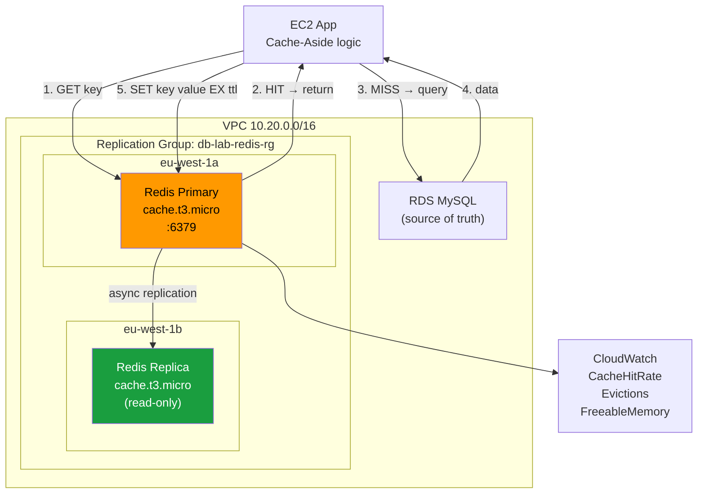

# Lab 04 — ElastiCache Redis: Cache-Aside, Sesiones y Alta Disponibilidad

> **Nivel:** AWS SAA-C03 | **Tiempo total:** ~2h | **Coste estimado:** ~0.20€ (con cleanup inmediato)
> **Prerrequisito:** VPC del lab01 (10.20.0.0/16) o VPC mínima con subnet privada

---

## Objetivo

Desplegar un cluster ElastiCache Redis con replication group y Multi-AZ, implementar el patrón cache-aside para reducir la carga sobre RDS, y entender cuándo elegir Redis vs Memcached — pregunta recurrente en el SAA-C03.

---

## Qué aprenderás

| Concepto | Descripción |
|----------|-------------|
| **Redis vs Memcached** | Cuándo cada uno es la respuesta correcta |
| **Replication Group** | 1 primary + replicas, failover automático |
| **Multi-AZ** | Replica en AZ distinta, promoción automática si falla primary |
| **Cache-Aside (Lazy Loading)** | El patrón más común en el examen |
| **Session Store** | Solución a "sesiones perdidas al escalar ASG/ECS" |
| **Métricas clave** | CacheHitRate, Evictions, FreeableMemory, CurrConnections |
| **Security** | SG, subnets privadas, Redis AUTH, TLS, KMS at-rest |

---

## Redis vs Memcached — decisión del examen

Esta tabla es probablemente el concepto más evaluado de ElastiCache en SAA-C03:

```
PREGUNTA: ¿Necesitas alguno de estos?
  ✓ Persistencia (sobrevivir reinicios)
  ✓ Pub/Sub, Lua scripting
  ✓ Sorted sets (leaderboards, rankings)
  ✓ Replicación y failover automático (HA)
  ✓ Cluster mode / sharding horizontal
  ✓ Cifrado en reposo (KMS)

SÍ a cualquiera → Redis
NO a todos → Memcached (solo cache puro, multi-threaded, sin estado)
```

| Feature | Redis | Memcached |
|---------|-------|-----------|
| Estructuras de datos | Strings, hashes, lists, sets, sorted sets | Solo K/V string |
| Persistencia | SÍ (RDB + AOF) | NO |
| Replicación | SÍ | NO |
| Multi-AZ / failover | SÍ | NO |
| Cluster mode (sharding) | SÍ | SÍ (client-side) |
| Pub/Sub | SÍ | NO |
| Sorted sets (leaderboard) | SÍ | NO |
| Multi-threaded | NO (single-thread) | SÍ |
| Cifrado KMS at-rest | SÍ | NO |
| Cuándo elegir | HA, sesiones, leaderboards, features avanzadas | Cache puro, simple, máx throughput |

---

## Arquitectura del Lab

```
┌──────────────────────────────────────────────────────────────────────┐
│  AWS eu-west-1                                                        │
│                                                                       │
│  ┌──────────── VPC 10.20.0.0/16 ────────────────────────────────┐   │
│  │                                                                │   │
│  │  private-app-a (10.20.21.0/24)                                │   │
│  │  ┌──────────────────────────────────────┐                     │   │
│  │  │  EC2: db-lab-rds-app (lab01)          │                    │   │
│  │  │  "app" que implementa cache-aside     │                    │   │
│  │  └────────────────┬─────────────────────┘                    │   │
│  │                   │ :6379 (sg-app → sg-redis)                 │   │
│  │                   ▼                                            │   │
│  │  private-db-a (10.20.11.0/24)    private-db-b (10.20.12.0/24)│   │
│  │  ┌──────────────────────────┐   ┌──────────────────────────┐  │   │
│  │  │ ElastiCache Redis        │   │ ElastiCache Redis        │  │   │
│  │  │ PRIMARY                  │──►│ REPLICA (read-only)      │  │   │
│  │  │ db-lab-redis-001         │   │ db-lab-redis-002         │  │   │
│  │  │ cache.t3.micro           │   │ cache.t3.micro           │  │   │
│  │  │ eu-west-1a               │   │ eu-west-1b               │  │   │
│  │  └──────────────────────────┘   └──────────────────────────┘  │   │
│  │                                                                │   │
│  │  Replication Group: db-lab-redis-rg                           │   │
│  │  Multi-AZ: ON | Failover automático si primary falla          │   │
│  └────────────────────────────────────────────────────────────────┘   │
└──────────────────────────────────────────────────────────────────────┘
```

---

## Diagrama Mermaid



---

## Patrones de caché cubiertos en el lab

### Cache-Aside (Lazy Loading)
```
1. App busca en Redis (GET key)
2a. HIT: devuelve dato sin ir a DB ← rápido
2b. MISS:
    → App consulta DB
    → App escribe en Redis con TTL
    → App devuelve dato al cliente
```

### Session Store
```
Problema: ASG escala a 3 instancias, usuario pierde sesión
Solución: EC2-1 guarda session_token en Redis con TTL=30min
         EC2-2 lee el mismo token → sesión compartida
         Cualquier instancia puede servir al mismo usuario
```

---

## Recursos y coste

| Recurso | Coste/hora | Notas |
|---------|-----------|-------|
| Redis Primary (cache.t3.micro) | ~0.017€/h | Fase 1 |
| Redis Replica (cache.t3.micro) | ~0.017€/h | Multi-AZ, Fase 1 |
| Subnet Group, SGs | 0€ | |

> **Total lab 2h + cleanup:** aprox. 0.10-0.20€

---

## Estructura

```
lab04-elasticache/
├── README.md
├── fase-01-redis-setup.md         ← Crear Replication Group, Multi-AZ, seguridad
├── fase-02-cache-aside.md         ← Patrón cache-aside + session store + métricas
├── cleanup.md
├── cli/
│   ├── 00-env.sh
│   ├── 01-redis-cluster.sh        ← Crear replication group + subnet group + SG
│   ├── 02-cache-aside-demo.sh     ← Demo cache-aside vía redis-cli
│   └── 99-cleanup.sh
├── terraform/
│   ├── main.tf
│   ├── variables.tf
│   └── outputs.tf
├── terragrunt/
│   └── terragrunt.hcl
└── troubleshooting/
    ├── 01-conexion-fallida-sg.md
    ├── 02-cache-inconsistente.md
    └── 03-redis-vs-memcached.md
```

**Siguiente paso:** [fase-01-redis-setup.md](./fase-01-redis-setup.md)
