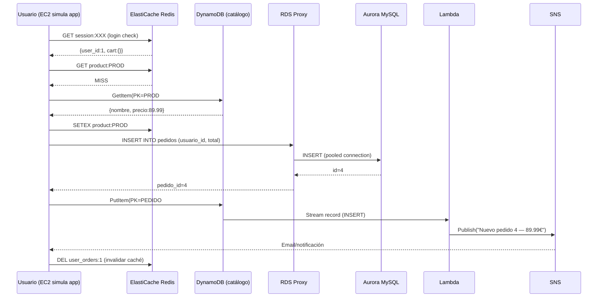

# Fase 05 — Validación E2E + CloudWatch Dashboard + DR

## Objetivo

Ejecutar el flujo completo de e-commerce de extremo a extremo, crear un CloudWatch Dashboard unificado para los 3 servicios, y practicar los dos escenarios de DR más frecuentes en el examen SAA-C03.

**Tiempo estimado:** 30-35 minutos

---

## Flujo completo validado



---

## Paso 1 — Script de validación E2E

```bash
#!/usr/bin/env bash
# 05-validacion.sh — Ejecutar desde la EC2 via SSM

REGION="eu-west-1"
DYNAMO_TABLE="ecommerce-catalog"
PROXY_HOST="aurora-lab05-proxy.proxy-xxxx.eu-west-1.rds.amazonaws.com"
REDIS_HOST="redis-lab05.xxxxx.ng.0001.euw1.cache.amazonaws.com"
SECRET_ID="lab05/aurora/admin"

AURORA_PASS=$(aws secretsmanager get-secret-value \
  --secret-id $SECRET_ID --query 'SecretString' --output text \
  --region $REGION | jq -r '.password')

echo "=== VALIDACIÓN E2E Lab05 ==="
echo ""

# 1. Aurora via RDS Proxy
echo "1. Aurora via RDS Proxy..."
PEDIDOS=$(mysql -h $PROXY_HOST -u admin -p"$AURORA_PASS" ecommerce \
  -se "SELECT COUNT(*) FROM pedidos;" 2>/dev/null)
echo "   Pedidos en Aurora: $PEDIDOS ✓"

# 2. DynamoDB — catálogo
echo "2. DynamoDB catálogo..."
PRODS=$(aws dynamodb scan --table-name $DYNAMO_TABLE \
  --filter-expression "tipo = :t" \
  --expression-attribute-values '{":t":{"S":"PRODUCTO"}}' \
  --select COUNT --query 'Count' --output text --region $REGION)
echo "   Productos en DynamoDB: $PRODS ✓"

# 3. Redis — conectividad
echo "3. ElastiCache Redis..."
PING=$(redis-cli -h $REDIS_HOST -p 6379 --tls PING 2>/dev/null)
echo "   Ping: $PING ✓"

# 4. DynamoDB Streams → Lambda
echo "4. DynamoDB Streams + Lambda..."
# Insertar un pedido de test
aws dynamodb put-item --table-name $DYNAMO_TABLE --region $REGION --item '{
  "PK":       {"S":"PEDIDO#E2E-TEST"},
  "SK":       {"S":"METADATA"},
  "usuario_id":{"S":"usr1001"},
  "total":    {"N":"89.99"},
  "estado":   {"S":"pendiente"},
  "tipo":     {"S":"PEDIDO"}
}'
echo "   Pedido E2E insertado en DynamoDB, esperando Lambda..."
sleep 25

# Verificar log de Lambda
LAMBDA_LOG=$(aws logs filter-log-events \
  --log-group-name /aws/lambda/ecommerce-catalog-stream \
  --filter-pattern "E2E-TEST" \
  --start-time $(($(date +%s) - 120))000 \
  --query 'events[0].message' --output text --region $REGION 2>/dev/null)
[[ -n "$LAMBDA_LOG" ]] && echo "   Lambda procesó el stream ✓" || echo "   Lambda: no log en 25s (check CloudWatch)"

# 5. RDS Proxy target health
echo "5. RDS Proxy health..."
PROXY_HEALTH=$(aws rds describe-db-proxy-targets \
  --db-proxy-name aurora-lab05-proxy \
  --query 'Targets[0].TargetHealth.State' \
  --output text --region $REGION 2>/dev/null)
echo "   RDS Proxy target: $PROXY_HEALTH"

echo ""
echo "=== Validación completada ==="
```

---

## Paso 2 — CloudWatch Dashboard unificado

### Crear el dashboard desde la consola

1. **CloudWatch → Dashboards → Create dashboard**
2. Name: `lab05-ecommerce-overview`
3. **Create dashboard**

### Widgets recomendados

Añade estos widgets para tener visión completa:

| Widget | Servicio | Métrica | Por qué |
|--------|----------|---------|---------|
| Line: CPU Writer | RDS | CPUUtilization | Detectar saturación |
| Line: ReplicaLag | RDS | AuroraReplicaLag | Replicación OK |
| Number: DB Connections via Proxy | RDS Proxy | DatabaseConnectionsSetupFailed | Proxy health |
| Line: Redis Hit Rate | ElastiCache | CacheHitRate | Eficiencia caché |
| Line: Redis Memory | ElastiCache | FreeableMemory | Evitar eviction |
| Number: DynamoDB Throttle | DynamoDB | ReadThrottleEvents + WriteThrottleEvents | Hot partitions |
| Line: Lambda Invocations | Lambda | Invocations | Streams activos |
| Line: Lambda Errors | Lambda | Errors | Errores en proceso |
| Line: Lambda IteratorAge | Lambda | IteratorAge | Retraso en Streams |

### Via CLI (JSON del dashboard)

```bash
aws cloudwatch put-dashboard \
  --dashboard-name lab05-ecommerce-overview \
  --dashboard-body '{
    "widgets": [
      {
        "type":"metric","x":0,"y":0,"width":12,"height":6,
        "properties":{
          "title":"Aurora CPU + Replica Lag",
          "metrics":[
            ["AWS/RDS","CPUUtilization","DBInstanceIdentifier","aurora-lab05-writer"],
            ["AWS/RDS","AuroraReplicaLag","DBInstanceIdentifier","aurora-lab05-reader"]
          ],
          "period":60,"stat":"Average","view":"timeSeries"
        }
      },
      {
        "type":"metric","x":12,"y":0,"width":12,"height":6,
        "properties":{
          "title":"Redis Hit Rate + Freeable Memory",
          "metrics":[
            ["AWS/ElastiCache","CacheHitRate","ReplicationGroupId","redis-lab05"],
            ["AWS/ElastiCache","FreeableMemory","ReplicationGroupId","redis-lab05"]
          ],
          "period":60,"stat":"Average","view":"timeSeries"
        }
      },
      {
        "type":"metric","x":0,"y":6,"width":12,"height":6,
        "properties":{
          "title":"DynamoDB Throttling",
          "metrics":[
            ["AWS/DynamoDB","ReadThrottleEvents","TableName","ecommerce-catalog"],
            ["AWS/DynamoDB","WriteThrottleEvents","TableName","ecommerce-catalog"]
          ],
          "period":60,"stat":"Sum","view":"timeSeries"
        }
      },
      {
        "type":"metric","x":12,"y":6,"width":12,"height":6,
        "properties":{
          "title":"Lambda Stream Processor",
          "metrics":[
            ["AWS/Lambda","Invocations","FunctionName","ecommerce-catalog-stream"],
            ["AWS/Lambda","Errors","FunctionName","ecommerce-catalog-stream"],
            ["AWS/Lambda","IteratorAge","FunctionName","ecommerce-catalog-stream"]
          ],
          "period":60,"stat":"Sum","view":"timeSeries"
        }
      }
    ]
  }' \
  --region eu-west-1
echo "Dashboard creado"
```

---

## Paso 3 — Escenarios de DR para el examen SAA-C03

### DR Escenario 1: Failover de Aurora (<30 segundos)

```bash
# 1. Ver Writer actual
aws rds describe-db-clusters \
  --db-cluster-identifier aurora-lab05 \
  --query 'DBClusters[0].DBClusterMembers[?IsClusterWriter==`true`].DBInstanceIdentifier' \
  --output text --region eu-west-1

# 2. Forzar failover
aws rds failover-db-cluster \
  --db-cluster-identifier aurora-lab05 \
  --region eu-west-1

# 3. Monitorizar (el cluster endpoint NO cambia)
while true; do
  NEW_WRITER=$(aws rds describe-db-clusters \
    --db-cluster-identifier aurora-lab05 \
    --query 'DBClusters[0].DBClusterMembers[?IsClusterWriter==`true`].DBInstanceIdentifier' \
    --output text --region eu-west-1)
  echo "$(date +%H:%M:%S) Writer: $NEW_WRITER"
  sleep 5
done
```

**Lo que debes observar:**
- El Writer cambia de instancia en <30 segundos
- El Cluster Endpoint (DNS) sigue siendo el mismo
- Redis sigue funcionando (no depende de Aurora)
- DynamoDB sigue funcionando (servicio gestionado)

### DR Escenario 2: Restaurar Aurora desde PITR

```bash
# Simular pérdida de datos accidental
TIMESTAMP_BEFORE=$(date -u +"%Y-%m-%dT%H:%M:%SZ")
sleep 5

mysql -h $PROXY_HOST -u admin -p"$AURORA_PASS" ecommerce \
  -e "DELETE FROM pedidos WHERE id = 3;"

# Restaurar al punto anterior al DELETE
aws rds restore-db-cluster-to-point-in-time \
  --db-cluster-identifier aurora-lab05-restored \
  --source-db-cluster-identifier aurora-lab05 \
  --restore-to-time "$TIMESTAMP_BEFORE" \
  --db-subnet-group-name aurora-lab05-subnetgroup \
  --vpc-security-group-ids $SG_AURORA \
  --region eu-west-1

echo "Restauración PITR iniciada (nuevo cluster aurora-lab05-restored)"
echo "Cuando esté disponible, conecta al nuevo cluster y verifica que el pedido id=3 existe"
```

---

## Paso 4 — Tabla de conceptos SAA-C03 cubiertos en el lab

| Concepto | Dónde lo ves en este lab |
|----------|--------------------------|
| Aurora Multi-AZ con failover <30s | Fase 02 + DR Escenario 1 |
| RDS Proxy para connection pooling | Fase 02 |
| Gateway VPC Endpoint para DynamoDB | Fase 01 |
| Interface VPC Endpoint para Secrets Manager | Fase 01 |
| DynamoDB On-Demand + GSI + TTL | Fase 03 |
| DynamoDB Streams → Lambda → SNS | Fase 03 + E2E |
| ElastiCache Redis cache-aside | Fase 04 |
| ElastiCache Redis session store | Fase 04 |
| SGs en cascada (ALB→App→DB) | Fase 01 |
| Secrets Manager para Aurora credentials | Fase 02 |
| PITR para restauración de datos | Fase 05 DR |
| CloudWatch Dashboard multi-servicio | Fase 05 |

---

## ✅ Checklist final del lab

```
☐ VPC 3-tier con 6 subnets (public/app/db)
☐ Gateway VPC Endpoint para DynamoDB en route tables
☐ Aurora cluster en subnets DB tier, no accesible públicamente
☐ RDS Proxy delante de Aurora
☐ Esquema SQL creado (usuarios, pedidos, lineas_pedido, pagos)
☐ DynamoDB tabla ecommerce-catalog con GSI + TTL + Streams
☐ Lambda conectada al Stream, publicando en SNS
☐ Redis Replication Group con Primary + Replica
☐ Script de demo ejecutado exitosamente (HITs en Redis)
☐ CloudWatch Dashboard con métricas de los 3 servicios
☐ Failover Aurora probado (Writer cambió en <30s)
☐ cleanup.md ejecutado al terminar
```
