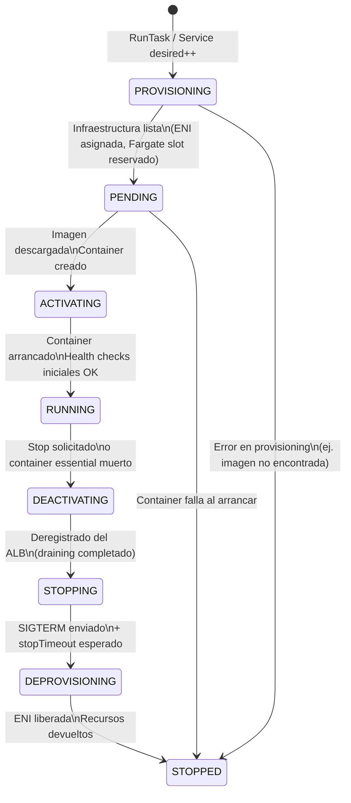
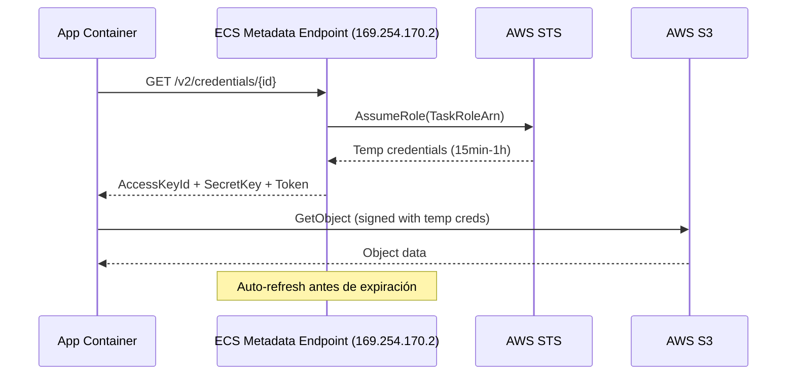
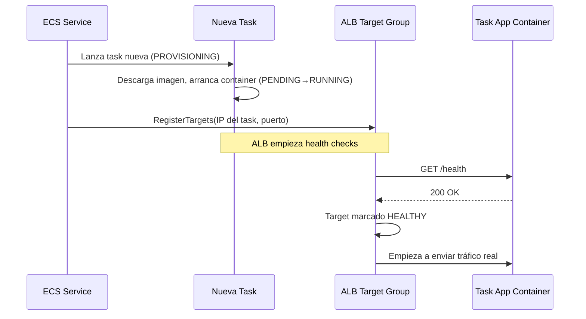
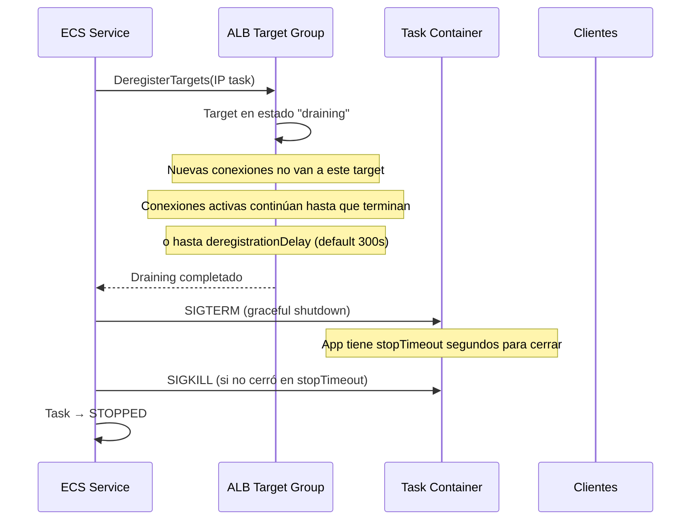
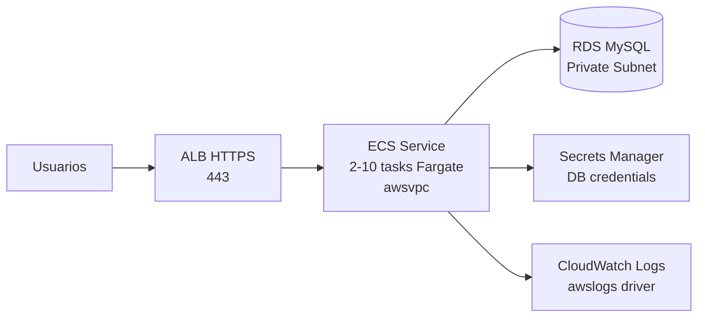
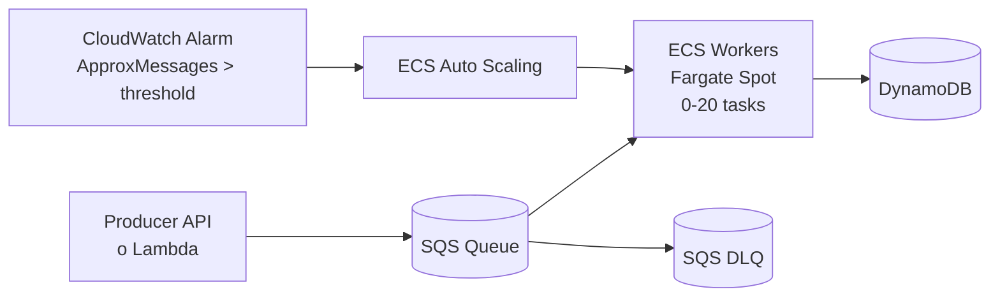
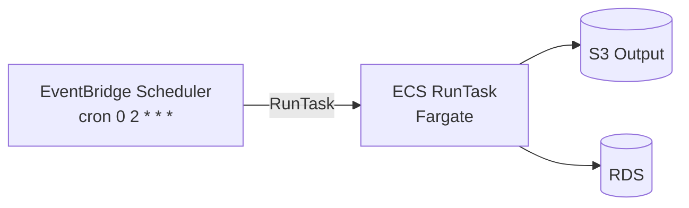
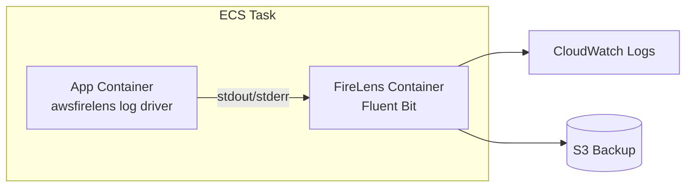

# AWS ECS — SA Associate: Deep Dive (Internals + Configuración)

> **Objetivo**: Entender cómo funciona ECS por dentro y cómo configurar cada primitivo correctamente.
> **Nivel**: AWS Solutions Architect Associate.
> **Enfoque**: mecanismos internos + todos los parámetros + exam traps nivel associate.

---

## Índice

1. [Arquitectura interna: cómo funciona ECS](#1-arquitectura-interna-cómo-funciona-ecs)
2. [ECS Agent y Fargate managed data plane](#2-ecs-agent-y-fargate-managed-data-plane)
3. [Task Lifecycle: máquina de estados](#3-task-lifecycle-máquina-de-estados)
4. [Networking awsvpc por dentro](#4-networking-awsvpc-por-dentro)
5. [IAM: cómo llegan las credenciales al container](#5-iam-cómo-llegan-las-credenciales-al-container)
6. [Secrets y configuración: inyección en runtime](#6-secrets-y-configuración-inyección-en-runtime)
7. [Log drivers: cómo ECS envía logs](#7-log-drivers-cómo-ecs-envía-logs)
8. [Task Definition: todos los campos](#8-task-definition-todos-los-campos)
9. [Service: configuración completa](#9-service-configuración-completa)
10. [Cluster: configuración y capacity](#10-cluster-configuración-y-capacity)
11. [Integración con ALB: registro dinámico de targets](#11-integración-con-alb-registro-dinámico-de-targets)
12. [Health checks: las 3 capas](#12-health-checks-las-3-capas)
13. [ECR pull flow: cómo ECS descarga la imagen](#13-ecr-pull-flow-cómo-ecs-descarga-la-imagen)
14. [Patrones básicos Associate](#14-patrones-básicos-associate)
15. [Comparativas](#15-comparativas)
16. [Exam Traps Associate (top 12)](#16-exam-traps-associate-top-12)

---

## 1. Arquitectura interna: cómo funciona ECS

### 1.1 Dos planos separados

```
┌─────────────────────────────────────────────────────────────────┐
│                     CONTROL PLANE (AWS managed)                  │
│                                                                  │
│  ECS API ──► Task Scheduler ──► Service Scheduler ──► ECR Auth  │
│                 │                   │                            │
│                 └─────────────────────────────────────────────► │
│                       comunica via HTTPS polling                 │
└──────────────────────────────┬──────────────────────────────────┘
                               │
              ┌────────────────┴────────────────┐
              │                                 │
┌─────────────▼───────────┐      ┌──────────────▼──────────────┐
│   DATA PLANE — EC2      │      │   DATA PLANE — FARGATE       │
│                         │      │                              │
│  EC2 Instance           │      │  MicroVM (AWS managed)      │
│  ├── ECS Agent          │      │  ├── ENI dedicada           │
│  ├── Docker daemon      │      │  ├── Container runtime      │
│  └── Containers         │      │  └── Containers             │
└─────────────────────────┘      └──────────────────────────────┘
   Tú gestionas OS, parcheo           AWS gestiona todo el host
```

**Regla fundamental**:
- **Control plane**: siempre AWS managed. Tú no ves ni gestionas el scheduler.
- **Data plane EC2**: tú gestionas las instancias (OS, parcheo, AMI, ASG).
- **Data plane Fargate**: AWS gestiona todo. Tú solo defines CPU/memoria/containers.

### 1.2 Flujo de una llamada `RunTask`

```
1. Tu app / EventBridge / CLI llama a ECS API: RunTask
2. ECS API valida permisos (IAM) y la Task Definition
3. Task Scheduler selecciona capacidad (subnet, AZ, instancia EC2 o slot Fargate)
4. Scheduler envía la instrucción al ECS Agent (EC2) o al sistema Fargate
5. El agent/Fargate: autentica con ECR, descarga imagen, crea el container
6. Container arranca → ECS registra estado RUNNING
7. Si hay Service + ALB: ECS registra el task en el target group
```

---

## 2. ECS Agent y Fargate managed data plane

### 2.1 ECS Agent (solo EC2 launch type)

El **ECS Agent** es un proceso (escrito en Go, open source en GitHub) que corre en cada instancia EC2 del cluster. Sin él, la instancia no puede recibir tasks.

```
EC2 Instance
│
├── /etc/ecs/ecs.config          ← archivo de configuración del agente
├── /var/log/ecs/ecs-agent.log  ← logs del agente
└── ECS Agent process
    │
    └── HTTPS polling → ecs.{region}.amazonaws.com
        (no necesita inbound; solo outbound 443)
```

**Variables clave en `ecs.config`**:

| Variable | Descripción | Ejemplo |
|----------|-------------|---------|
| `ECS_CLUSTER` | A qué cluster se une esta instancia | `ECS_CLUSTER=mi-cluster` |
| `ECS_ENABLE_TASK_IAM_ROLE` | Habilita task roles (credenciales por task) | `true` |
| `ECS_ENABLE_AWSLOGS_EXECUTIONROLE_OVERRIDE` | Usar Execution Role para CloudWatch Logs | `true` |
| `ECS_ENGINE_TASK_CLEANUP_WAIT_DURATION` | Tiempo antes de borrar containers parados | `1h` |
| `ECS_IMAGE_CLEANUP_INTERVAL` | Frecuencia limpieza de imágenes antiguas | `30m` |
| `ECS_CONTAINER_STOP_TIMEOUT` | Tiempo extra para SIGTERM antes de SIGKILL | `30s` |

**Lo que hace el agente**:
1. Se registra en el cluster al arrancar
2. Hace **polling** periódico al API de ECS para recibir instrucciones
3. Ejecuta: arrancar/parar tasks, reportar estado de containers, gestionar imágenes
4. Reporta métricas de CPU/memoria de containers a CloudWatch

### 2.2 Fargate: qué gestiona AWS, qué ves tú

Con Fargate, AWS provisiona un **microVM** aislado por cada task. Tú nunca ves este host.

```
Lo que AWS gestiona en Fargate:
  ✓ Hardware físico
  ✓ Hypervisor (Firecracker microVM)
  ✓ Sistema operativo del host
  ✓ Parcheo y actualizaciones de seguridad
  ✓ ECS Agent (embebido)
  ✓ Docker/containerd runtime
  ✓ Asignación de ENI

Lo que TÚ defines/controlas:
  → Task Definition (containers, CPU, memoria)
  → Networking (VPC, subnets, SGs)
  → IAM roles (Task Role + Execution Role)
  → Imagen del container
  → Variables de entorno y secrets
```

**Aislamiento de seguridad**: cada task Fargate corre en su propio microVM → isolación a nivel de kernel (no comparte kernel con otras tasks del mismo cliente ni con otros clientes AWS).

---

## 3. Task Lifecycle: máquina de estados

Entender el ciclo de vida es crítico para debuggear y para el examen.



### 3.1 Descripción de cada estado

| Estado | Qué está pasando | Duración típica |
|--------|-----------------|-----------------|
| **PROVISIONING** | ECS reserva capacidad, asigna ENI (Fargate), descarga imagen | 10-60 segundos |
| **PENDING** | Container creado pero aún no ha arrancado; esperando dependencias | Segundos |
| **ACTIVATING** | Container arrancando; en Fargate: adjuntando ENI al microVM | Segundos |
| **RUNNING** | Container en ejecución y respondiendo health checks | Indefinido |
| **DEACTIVATING** | Task recibió señal de stop; deregistrándose del ALB | Hasta `deregistrationDelay` |
| **STOPPING** | SIGTERM enviado al container; esperando graceful shutdown | Hasta `stopTimeout` (max 120s Fargate) |
| **DEPROVISIONING** | Liberando ENI y recursos de red | Segundos |
| **STOPPED** | Terminal. Tiene `stopCode` y `stoppedReason` para diagnóstico | — |

### 3.2 Stop codes (diagnóstico de tareas paradas)

| `stopCode` | Significado |
|-----------|------------|
| `EssentialContainerExited` | Un container `essential: true` terminó → toda la task para |
| `TaskFailedToStart` | La task no pudo arrancar (imagen no encontrada, error de red) |
| `ServiceSchedulerInitiated` | El service scheduler paró la task (deployment, scale-in) |
| `UserInitiated` | Alguien llamó a `StopTask` manualmente |
| `SpotInterruption` | Fargate Spot fue reclamada por AWS |
| `TerminationNotice` | Aviso de terminación (Spot) recibido |

### 3.3 Placement Strategies (solo EC2 launch type)

Cuando el launch type es EC2, el scheduler usa **placement strategies** para decidir en qué instancia colocar cada task:

| Estrategia | Comportamiento | Caso de uso |
|-----------|---------------|------------|
| `spread` | Distribuye tasks uniformemente por el campo indicado (`instanceId`, `attribute:ecs.availability-zone`) | Alta disponibilidad multi-AZ |
| `binpack` | Empaqueta tasks en el menor número de instancias posible (por CPU o memoria) | Minimizar coste EC2 |
| `random` | Asignación aleatoria entre instancias disponibles | Carga distribuida sin lógica específica |

**Placement Constraints** (filtros que deben cumplirse):

| Constraint | Descripción |
|-----------|-------------|
| `distinctInstance` | Cada task debe ir en una instancia diferente |
| `memberOf` | Expresión de cluster query language: `attribute:ecs.availability-zone == us-east-1a` |

> **Examen**: Fargate **no soporta** placement strategies ni constraints. AWS gestiona el placement internamente.

---

## 4. Networking awsvpc por dentro

### 4.1 El problema que resuelve awsvpc

En el modo `bridge` (legacy EC2), todos los containers del host compartían la IP del host con puertos dinámicos. Esto complicaba los SGs (no podías aplicar SG por container) y la visibilidad de red.

Con `awsvpc`, **cada task tiene su propia ENI e IP privada** dentro de la VPC → como si fuera una instancia EC2 independiente desde el punto de vista de la red.

### 4.2 Cómo funciona awsvpc en EC2: Trunk ENI + Branch ENIs

```
EC2 Instance (ej. m5.xlarge)
│
├── eth0 (Primary ENI)  ←── IP de la instancia; gestión SSH, etc.
│
└── Trunk ENI (eth1)    ←── ENI especial para VPC trunking
    │
    ├── Branch ENI ────────► Task A (IP: 10.0.1.15) + SG-A
    ├── Branch ENI ────────► Task B (IP: 10.0.1.22) + SG-B
    └── Branch ENI ────────► Task C (IP: 10.0.1.31) + SG-C
```

**VPC Trunking**: capacidad que permite a una instancia EC2 tener múltiples ENIs virtuales (branch ENIs) a través de una única ENI física troncal. No todos los tipos de instancia lo soportan → requiere tipos compatibles con "increased ENI density".

### 4.3 Cómo funciona awsvpc en Fargate

```
Fargate MicroVM (aislado)
│
└── ENI dedicada ──► IP privada en tu subnet
                    Security Groups aplicados directamente
                    Mismo comportamiento que una EC2 desde perspectiva VPC
```

En Fargate, **no hay trunk ENI**: cada microVM tiene su propia ENI directa en la VPC. Esto es más limpio pero también significa que cada task Fargate consume 1 IP de la subnet.

### 4.4 Límite crítico: IPs de subnet = máximo de tasks

```
Subnet /24 = 256 IPs - 5 (AWS reservadas) = 251 IPs disponibles
              → máximo ~251 tasks Fargate en esa subnet

Subnet /25 = 128 IPs - 5 = 123 IPs disponibles
              → máximo ~123 tasks

Para escalar a 500+ tasks: usar subnets /22 (1019 IPs) o múltiples subnets
```

### 4.5 Modos de red comparados

| Modo | Fargate | EC2 | ENI por task | SG por task | Port mapping |
|------|---------|-----|-------------|-------------|-------------|
| **awsvpc** | ✅ obligatorio | ✅ | ✅ 1 ENI propia | ✅ | `containerPort == hostPort` |
| **bridge** | ❌ | ✅ | ❌ comparte host | ❌ (SG del host) | `hostPort: 0` → puerto dinámico |
| **host** | ❌ | ✅ | ❌ namespace del host | ❌ | Mismo puerto que host |
| **none** | ❌ | ✅ | ❌ sin red | ❌ | Sin puertos |

---

## 5. IAM: cómo llegan las credenciales al container

### 5.1 Los dos roles de IAM en ECS

```
ECS Task
│
├── Execution Role  ← "lo que ECS necesita para LANZAR el task"
│   │
│   ├── ecr:GetAuthorizationToken    ← autenticarse con ECR
│   ├── ecr:BatchGetImage            ← descargar imagen
│   ├── logs:CreateLogStream         ← escribir en CloudWatch
│   ├── logs:PutLogEvents
│   └── secretsmanager:GetSecretValue ← inyectar secrets al arrancar
│
└── Task Role  ← "lo que TU APLICACIÓN necesita mientras corre"
    │
    ├── s3:GetObject → bucket-específico
    ├── dynamodb:PutItem → tabla-específica
    └── kms:Decrypt → clave-específica
```

**Regla mnemónica**:
- **Execution Role** = permisos para ECS (plano de control necesita esto para gestionar el task)
- **Task Role** = permisos para tu código (lo que llama tu app con el AWS SDK)

### 5.2 Cómo llegan las credenciales del Task Role al container

ECS crea un **metadata endpoint** accesible únicamente dentro de cada task:

```
Container app
│
└── AWS SDK llama a: http://169.254.170.2/v2/credentials/{credential_id}
    │
    └── ECS Task Metadata Endpoint
        │
        └── Responde con: AccessKeyId, SecretAccessKey, Token, Expiration
            (credenciales temporales STS del Task Role)
```

**Detalles importantes**:
- La URL `169.254.170.2` es un link-local accesible solo desde dentro del task
- Las credenciales son temporales (STS AssumeRole) y se rotan **automáticamente antes de expirar**
- El AWS SDK hace esto transparentemente: no necesitas configurar nada en tu código
- Es similar al Instance Metadata Service (IMDS) de EC2, pero **aislado por task** (no por instancia EC2)

### 5.3 Flujo completo de credenciales Task Role



---

## 6. Secrets y configuración: inyección en runtime

### 6.1 Dos formas de pasar configuración a un container

| Método | Campo Task Definition | Visibilidad | Cuándo usar |
|--------|--------------------|-------------|------------|
| `environment` | `"environment": [{"name": "DB_HOST", "value": "db.example.com"}]` | Visible en `describe-tasks`, CloudTrail, logs | Config no sensible |
| `secrets` | `"secrets": [{"name": "DB_PASS", "valueFrom": "arn:aws:secretsmanager:..."}]` | Solo el ARN visible; valor nunca en API | Secrets, credenciales, tokens |

### 6.2 Cómo funciona la inyección de secrets (mecanismo interno)

```
PROVISIONING state
│
└── ECS usa Execution Role para llamar:
    ├── secretsmanager:GetSecretValue (si usa Secrets Manager)
    │   └── Retorna el valor del secret
    └── ssm:GetParameters (si usa SSM Parameter Store)
        └── Retorna el valor del parámetro

    El valor se inyecta como variable de entorno dentro del container
    ANTES de que el proceso principal arranque.

    El container recibe la variable ya con el valor resuelto:
    env | grep DB_PASS → DB_PASS=s3cr3t-v4lue
```

**Punto importante**: la inyección ocurre **una sola vez al arrancar** el container. Si el secret cambia en Secrets Manager después del arranque, el container **no** ve el cambio → necesita reiniciarse para obtener el nuevo valor.

### 6.3 Secrets Manager vs SSM Parameter Store

| Característica | Secrets Manager | SSM Parameter Store |
|----------------|----------------|---------------------|
| **Coste** | $0.40/secret/mes + $0.05/10K API calls | Standard: gratis; Advanced: $0.05/param/mes |
| **Rotación automática** | ✅ nativa (Lambda integration) | ❌ manual |
| **Versionado** | ✅ (`AWSCURRENT`, `AWSPREVIOUS`, por ID) | ✅ (por versión numérica) |
| **Referencia en Task Def** | ARN completo o nombre | ARN completo o nombre |
| **Encryption** | KMS siempre | KMS para SecureString |
| **Casos de uso** | DB credentials, API keys con rotación | Config values, feature flags, endpoints |

### 6.4 Pinning de versión en Task Definition

```json
"secrets": [
  {
    "name": "DB_PASSWORD",
    "valueFrom": "arn:aws:secretsmanager:eu-west-1:123456789:secret:prod/db:password:AWSCURRENT::"
  },
  {
    "name": "DB_PASSWORD_V2",
    "valueFrom": "arn:aws:secretsmanager:eu-west-1:123456789:secret:prod/db:password::abc123def456::"
  }
]
```

El formato es: `arn:...:secret:name:json-key:version-stage:version-id`
- `json-key`: si el secret es JSON, extrae un campo específico
- `version-stage`: `AWSCURRENT` (default) o `AWSPREVIOUS`
- `version-id`: ID específico de versión (para deploy reproducible)

---

## 7. Log drivers: cómo ECS envía logs

### 7.1 Log drivers disponibles

| Driver | Descripción | Requiere |
|--------|-------------|---------|
| `awslogs` | Envía directamente a CloudWatch Logs | Execution Role con permisos logs |
| `awsfirelens` | FireLens: Fluent Bit/Fluentd como sidecar router | Container FireLens en la task |
| `splunk` | Envía a Splunk HTTP Event Collector | URL + token Splunk |
| `fluentd` | Envía a endpoint Fluentd | Endpoint accesible |
| `json-file` | Solo en disco local del host (EC2) | Nada; default Docker |
| `none` | Sin logging | — |

### 7.2 `awslogs` en detalle (el más frecuente en el examen)

```json
"logConfiguration": {
  "logDriver": "awslogs",
  "options": {
    "awslogs-group": "/ecs/mi-servicio",
    "awslogs-region": "eu-west-1",
    "awslogs-stream-prefix": "app",
    "awslogs-create-group": "true"
  }
}
```

**Parámetros clave**:

| Parámetro | Descripción | Nota |
|-----------|-------------|------|
| `awslogs-group` | Nombre del log group en CloudWatch | Debes crearlo o usar `awslogs-create-group: true` |
| `awslogs-region` | Región donde se crean los logs | Normalmente la misma región del cluster |
| `awslogs-stream-prefix` | Prefijo del log stream | **Obligatorio en Fargate** |
| `awslogs-create-group` | Si ECS crea el log group si no existe | Requiere `logs:CreateLogGroup` en Execution Role |
| `awslogs-datetime-format` | Formato de timestamp para multiline logs | Para stack traces multi-línea |

**Formato del log stream resultante**:
```
{awslogs-stream-prefix}/{container-name}/{task-id}

Ejemplo: app/my-container/a1b2c3d4e5f6a1b2c3d4e5f6a1b2c3d4
```

### 7.3 FireLens (awsfirelens) en detalle

FireLens es un log router que se configura como container sidecar en la task. Intercepta el stdout/stderr de los demás containers y los enruta a múltiples destinos.

```
┌─────────────────────────────────────┐
│             ECS Task                │
│                                     │
│  ┌──────────────┐    stdout/stderr  │
│  │  App container│─────────────────►│
│  └──────────────┘                   │  ┌──────────────────┐
│                                     │  │ CloudWatch Logs  │
│  ┌──────────────────────────┐       │  └──────────────────┘
│  │ FireLens container       │───────►
│  │ (Fluent Bit / Fluentd)   │       │  ┌──────────────────┐
│  │                          │───────►  │ OpenSearch / S3  │
│  │ logConfiguration:        │       │  └──────────────────┘
│  │   logDriver: awsfirelens │       │
│  └──────────────────────────┘       │  ┌──────────────────┐
│                                     │  │ Splunk / Kinesis │
│                                     │  └──────────────────┘
└─────────────────────────────────────┘
```

**Cuándo usar FireLens vs awslogs**:
- `awslogs`: un destino (CloudWatch), configuración simple → la mayoría de casos
- `awsfirelens`: múltiples destinos, filtrado/transformación de logs, enrutamiento condicional

---

## 8. Task Definition: todos los campos

La Task Definition es el "blueprint" inmutable (cada cambio crea una nueva revisión) que describe cómo debe correr un conjunto de containers.

### 8.1 Campos de nivel de task (task-level)

```json
{
  "family": "mi-servicio",
  "revision": 3,
  "taskRoleArn": "arn:aws:iam::123:role/MyTaskRole",
  "executionRoleArn": "arn:aws:iam::123:role/MyExecutionRole",
  "networkMode": "awsvpc",
  "requiresCompatibilities": ["FARGATE"],
  "cpu": "1024",
  "memory": "2048",
  "runtimePlatform": {
    "cpuArchitecture": "X86_64",
    "operatingSystemFamily": "LINUX"
  },
  "volumes": [],
  "placementConstraints": [],
  "containerDefinitions": [ ... ]
}
```

| Campo | Valores | Notas |
|-------|---------|-------|
| `family` | string | Agrupa revisiones de la misma task; inmutable |
| `networkMode` | `awsvpc`, `bridge`, `host`, `none` | Fargate requiere `awsvpc` |
| `requiresCompatibilities` | `["FARGATE"]`, `["EC2"]`, `["FARGATE","EC2"]` | Define el launch type compatible |
| `cpu` | Ver tabla | Task-level; Fargate requiere valores válidos |
| `memory` | Ver tabla | Task-level; Fargate requiere valores válidos |
| `runtimePlatform.cpuArchitecture` | `X86_64`, `ARM64` | ARM64 = Graviton (~20% más barato en Fargate) |

### 8.2 Combinaciones válidas CPU/Memory en Fargate (examen!)

Esta tabla es directamente preguntable en el examen:

| CPU (task-level) | Memoria válida |
|------------------|----------------|
| 256 (0.25 vCPU) | 512, 1024, 2048 MB |
| 512 (0.5 vCPU) | 1024 – 4096 MB (incrementos de 1024) |
| 1024 (1 vCPU) | 2048 – 8192 MB (incrementos de 1024) |
| 2048 (2 vCPU) | 4096 – 16384 MB (incrementos de 1024) |
| 4096 (4 vCPU) | 8192 – 30720 MB (incrementos de 1024) |
| 8192 (8 vCPU) | 16384 – 61440 MB (incrementos de 4096) |
| 16384 (16 vCPU) | 32768 – 122880 MB (incrementos de 8192) |

> **Trampa**: si intentas registrar una Task Definition con una combinación inválida (ej. 256 vCPU + 4096 MB), la API de ECS rechaza la llamada.

### 8.3 Campos de containerDefinitions (por container)

```json
{
  "name": "app",
  "image": "123456789.dkr.ecr.eu-west-1.amazonaws.com/mi-app:1.2.3",
  "cpu": 512,
  "memory": 1024,
  "memoryReservation": 512,
  "essential": true,
  "portMappings": [
    {
      "containerPort": 8080,
      "hostPort": 8080,
      "protocol": "tcp",
      "name": "http"
    }
  ],
  "environment": [
    { "name": "ENV", "value": "production" }
  ],
  "secrets": [
    { "name": "DB_PASSWORD", "valueFrom": "arn:aws:secretsmanager:..." }
  ],
  "logConfiguration": { ... },
  "healthCheck": {
    "command": ["CMD", "curl", "-f", "http://localhost:8080/health"],
    "interval": 30,
    "timeout": 5,
    "retries": 3,
    "startPeriod": 60
  },
  "dependsOn": [
    { "containerName": "envoy-proxy", "condition": "HEALTHY" }
  ],
  "stopTimeout": 30,
  "user": "1000:1000",
  "readonlyRootFilesystem": true,
  "linuxParameters": {
    "capabilities": {
      "drop": ["ALL"],
      "add": []
    }
  },
  "mountPoints": [
    {
      "containerPath": "/data",
      "sourceVolume": "efs-volume",
      "readOnly": false
    }
  ]
}
```

**Campos críticos explicados**:

| Campo | Explicación | Trampa |
|-------|-------------|--------|
| `essential` | Si este container muere, **todos** los containers de la task se paran | Un task con 3 containers: si 1 essential muere, los 3 paran |
| `memory` (hard limit) | Si el container supera este valor → Docker lo mata (OOMKilled) | Diferente de `memoryReservation` |
| `memoryReservation` (soft limit) | Reserva mínima garantizada; puede subir hasta `memory` | Úsalo para packing eficiente en EC2 |
| `cpu` | Unidades CPU reservadas (1024 = 1 vCPU) | En Fargate: la suma de containers ≤ task-level CPU |
| `stopTimeout` | Segundos entre SIGTERM y SIGKILL | Máximo **120 segundos** en Fargate |
| `dependsOn` | Ordena el arranque de containers | `condition`: `START`, `COMPLETE`, `SUCCESS`, `HEALTHY` |
| `healthCheck.startPeriod` | Tiempo de gracia antes de que fallen los health checks | Para apps lentas en arrancar |

### 8.4 `dependsOn`: ordenación de containers

Útil cuando tienes un proxy (Envoy) o un agente que debe arrancar antes que la app:

```json
"dependsOn": [
  { "containerName": "envoy", "condition": "HEALTHY" }
]
```

| Condición | Significado |
|-----------|-------------|
| `START` | El container dependido ha arrancado (estado RUNNING) |
| `COMPLETE` | El container terminó (exit, cualquier código) — para init containers |
| `SUCCESS` | El container terminó con exit code 0 |
| `HEALTHY` | El container pasó su `healthCheck` |

### 8.5 Volumes en Task Definition

```json
"volumes": [
  {
    "name": "efs-volume",
    "efsVolumeConfiguration": {
      "fileSystemId": "fs-0a1b2c3d",
      "rootDirectory": "/data",
      "transitEncryption": "ENABLED",
      "authorizationConfig": {
        "accessPointId": "fsap-0a1b2c3d",
        "iam": "ENABLED"
      }
    }
  },
  {
    "name": "tmp-volume",
    "host": { "sourcePath": "/tmp/data" }
  }
]
```

| Tipo de volume | Persistencia | Compartido entre tasks | Notas |
|----------------|-------------|----------------------|-------|
| `efsVolumeConfiguration` | ✅ Persistente | ✅ Multi-task | Fargate 1.4+ requerido |
| `host` (bind mount) | Solo durante vida del task | ❌ | Solo EC2; no Fargate |
| `dockerVolumeConfiguration` | Mientras el host vive | ❌ | Solo EC2 |
| Efímero local (sin volume) | Solo durante vida del task | ❌ | 21GB incluidos en Fargate; expandible |

---

## 9. Service: configuración completa

El Service es el componente que mantiene el número deseado de tasks corriendo, gestiona deployments y se integra con ALB.

### 9.1 Parámetros clave del Service

```json
{
  "serviceName": "mi-api",
  "cluster": "mi-cluster",
  "taskDefinition": "mi-servicio:3",
  "desiredCount": 4,
  "launchType": "FARGATE",
  "networkConfiguration": {
    "awsvpcConfiguration": {
      "subnets": ["subnet-aaa", "subnet-bbb"],
      "securityGroups": ["sg-xxx"],
      "assignPublicIp": "DISABLED"
    }
  },
  "loadBalancers": [
    {
      "targetGroupArn": "arn:aws:elasticloadbalancing:...",
      "containerName": "app",
      "containerPort": 8080
    }
  ],
  "healthCheckGracePeriodSeconds": 60,
  "deploymentConfiguration": {
    "maximumPercent": 200,
    "minimumHealthyPercent": 100,
    "deploymentCircuitBreaker": {
      "enable": true,
      "rollback": true
    }
  },
  "schedulingStrategy": "REPLICA",
  "enableExecuteCommand": false,
  "propagateTags": "SERVICE"
}
```

### 9.2 Rolling update: la matemática

Los parámetros `maximumPercent` y `minimumHealthyPercent` controlan cómo ECS hace el rolling update:

```
desiredCount = 4
maximumPercent = 200      → máximo 8 tasks corriendo simultáneamente (4 * 200%)
minimumHealthyPercent = 100 → mínimo 4 tasks healthy en todo momento (4 * 100%)

Rolling update con estos valores:
  1. ECS lanza 4 tasks nuevas (total: 8 = máximo permitido)
  2. Cuando las 4 nuevas están RUNNING + healthy:
  3. ECS para las 4 antiguas
  4. Total vuelve a 4
  → Zero downtime, pero requiere el doble de capacidad temporalmente

Con minimumHealthyPercent = 50:
  1. ECS puede bajar a 2 tasks healthy (4 * 50%)
  2. Para 2 antiguas → quedan 2 running
  3. Lanza 2 nuevas → total 4 (max 200% = 8, pero no necesario)
  → Más lento pero consume menos recursos
```

**Valores por defecto según desiredCount**:

| desiredCount | maximumPercent default | minimumHealthyPercent default |
|-------------|----------------------|------------------------------|
| ≥ 2 | 200 | 100 |
| 1 | 200 | 0 (permite downtime breve) |

### 9.3 Deployment Circuit Breaker

Previene que un deployment fallido se quede atascado lanzando tasks que siguen fallando:

```
Circuit Breaker logic:
  1. ECS lanza tasks nuevas
  2. Si > threshold de tasks fallan health checks consecutivamente
  3. Circuit Breaker: marca el deployment como FAILED
  4. Si rollback: true → revierte automáticamente a la task definition anterior
  5. Si rollback: false → detiene el deployment sin revertir
```

**Sin circuit breaker** (comportamiento pre-2021): ECS sigue intentando lanzar tasks hasta alcanzar `desiredCount`, aunque fallen. El deployment nunca termina → la app queda en estado degradado.

### 9.4 `healthCheckGracePeriodSeconds`

```
Escenario sin grace period:
  1. Task RUNNING (container arrancó)
  2. ALB hace health check al container (que aún está inicializando)
  3. Health check falla → ALB desregistra target
  4. ECS ve que target está unhealthy → para el task
  5. Loop: ECS lanza otro task → mismo problema

Con healthCheckGracePeriodSeconds = 60:
  1. Task RUNNING
  2. ECS espera 60 segundos antes de evaluar health checks del ALB
  3. En esos 60s el container completa su inicialización
  4. Health check pasa → deployment exitoso
```

**Cuándo ajustar**: apps lentas en arrancar (JVM con Spring Boot, inicialización de caché). El valor debe ser ≥ tiempo de arranque de tu app.

### 9.5 `schedulingStrategy`: REPLICA vs DAEMON

| Estrategia | Comportamiento | Caso de uso |
|-----------|---------------|------------|
| `REPLICA` | Mantiene `desiredCount` tasks en el cluster | APIs, workers — la mayoría de servicios |
| `DAEMON` | 1 task por cada instancia EC2 activa | Log collectors, monitoring agents, proxy sidecars — solo EC2 launch type |

> **Examen**: DAEMON solo funciona con EC2 launch type. No compatible con Fargate.

---

## 10. Cluster: configuración y capacity

### 10.1 Qué es un cluster

```
Cluster ECS
│
├── Nombre (único por cuenta y región)
├── Capacity Providers adjuntos
│   ├── FARGATE
│   ├── FARGATE_SPOT
│   └── EC2 (vinculado a ASG)
├── Default Capacity Provider Strategy
├── Container Insights: ENABLED/DISABLED
└── Namespaces (para Service Connect)
```

Un cluster es un límite lógico: los tasks y services de un cluster no "ven" los de otro cluster automáticamente.

### 10.2 Capacity Providers

| Capacity Provider | Qué gestiona AWS | Qué gestionas tú |
|------------------|-----------------|-----------------|
| `FARGATE` | Todo el host | Nada (solo task definition) |
| `FARGATE_SPOT` | Todo el host | Idempotencia ante interrupciones |
| EC2 (custom name) | Scheduling en el ASG | El ASG: instancias, AMI, parcheo |

**Capacity Provider Strategy** (cómo mezclar providers):

```json
"capacityProviderStrategy": [
  { "capacityProvider": "FARGATE",      "base": 1, "weight": 1 },
  { "capacityProvider": "FARGATE_SPOT", "base": 0, "weight": 4 }
]
```

- `base`: número mínimo de tasks en este provider (solo se aplica a uno)
- `weight`: proporción de nuevas tasks → aquí 80% van a Spot (weight 4 / total 5)

### 10.3 Container Insights

Cuando se habilita, ECS publica métricas adicionales en CloudWatch a nivel de cluster, service y task:

```
Sin Container Insights (por defecto):
  CloudWatch recibe: métricas básicas (CPUUtilization, MemoryUtilization)

Con Container Insights habilitado:
  CloudWatch recibe adicionalmente:
  - NetworkRxBytes, NetworkTxBytes
  - StorageReadBytes, StorageWriteBytes
  - Task-level y container-level granularidad
  - Dashboards pre-configurados en CloudWatch
```

**Coste**: las métricas de Container Insights son métricas **custom** de CloudWatch → ~$0.30/métrica/mes. No gratuito. Habilitarlo solo donde sea útil.

---

## 11. Integración con ALB: registro dinámico de targets

### 11.1 El flujo completo de registro



### 11.2 El flujo de deregistro (graceful shutdown)



### 11.3 `deregistrationDelay` vs `stopTimeout`

Este es un punto de confusión muy frecuente:

```
Timeline de un shutdown graceful:

T=0   ECS inicia stop → ALB DeregisterTargets
T=0   deregistrationDelay empieza (default: 300s en Target Group)
      → ALB acepta conexiones activas existentes pero no nuevas

T=300 Draining completado → ECS envía SIGTERM al container
T=300 stopTimeout empieza (max 120s en Fargate)
      → Tu app debe cerrar conexiones y terminar

T=420 Si la app no terminó → SIGKILL

Total tiempo máximo: 300s (draining) + 120s (stop) = 420s
```

**Optimización**: para deployments rápidos, reduce `deregistrationDelay` a 30-60s si tus conexiones son cortas (HTTP/REST). Mantén 300s para WebSockets o conexiones de larga duración.

---

## 12. Health checks: las 3 capas

Confundir estas 3 capas es uno de los errores más frecuentes en el examen.

```
Capa 1: Container Health Check (definido en Task Definition)
│
│  - ECS ejecuta el comando dentro del container
│  - Evalúa: HEALTHY, UNHEALTHY, UNKNOWN
│  - Si UNHEALTHY N veces: container → UNHEALTHY
│  - Si container essential UNHEALTHY: task → STOPPED
│
Capa 2: ECS Task Health (agregación)
│
│  - Si cualquier container essential está UNHEALTHY: task UNHEALTHY
│  - ECS puede reemplazar tasks UNHEALTHY (según config del service)
│
Capa 3: ALB Target Health Check (definido en Target Group)
│
│  - ALB hace HTTP GET al endpoint de health del container
│  - Independiente del Container Health Check
│  - Si falla: ALB deja de enviar tráfico (target "unhealthy")
│  - No para el task automáticamente (solo deja de mandar tráfico)
```

### 12.1 Campos del Container Health Check

```json
"healthCheck": {
  "command": ["CMD", "curl", "-f", "http://localhost:8080/health"],
  "interval": 30,
  "timeout": 5,
  "retries": 3,
  "startPeriod": 60
}
```

| Campo | Descripción | Default |
|-------|-------------|---------|
| `command` | Comando a ejecutar dentro del container | Obligatorio |
| `interval` | Segundos entre health checks | 30 |
| `timeout` | Segundos para que el comando responda | 5 |
| `retries` | Fallos consecutivos antes de UNHEALTHY | 3 |
| `startPeriod` | Tiempo de gracia inicial (no cuenta fallos) | 0 |

### 12.2 Interacción entre capas (caso práctico)

```
Scenario: App tarda 45 segundos en arrancar

Sin startPeriod (healthCheck) y sin healthCheckGracePeriodSeconds (Service):
  T=0:  Container arranca
  T=30: Container healthcheck → FAIL (app aún inicializando)
  T=60: Container healthcheck → FAIL (2 fallos)
  T=90: Container healthcheck → FAIL (3 fallos = UNHEALTHY)
  T=90: ECS para el task → LOOP infinito

Con startPeriod = 60 (healthCheck nivel container) y healthCheckGracePeriodSeconds = 90 (Service):
  T=0:  Container arranca
  T=60: startPeriod termina; healthchecks empiezan a contar
  T=90: healthCheckGracePeriodSeconds termina; ALB empieza a evaluar
  T=90: App ya está lista → health checks pasan
  → Deployment exitoso
```

---

## 13. ECR pull flow: cómo ECS descarga la imagen

### 13.1 Flujo completo de pull

```
PROVISIONING state
│
Step 1: Autenticación ECR
  ECS Execution Role llama: ecr:GetAuthorizationToken
  AWS devuelve: token Base64 válido 12 horas

Step 2: Pull de imagen
  Docker pull https://123456789.dkr.ecr.eu-west-1.amazonaws.com/mi-app:1.2.3
  │
  ├── Descarga el manifest de la imagen
  ├── Para cada layer:
  │   ├── Verifica si ya existe en caché local (Fargate tiene caché compartida)
  │   └── Si no existe: descarga desde S3 (las layers de ECR se almacenan en S3)
  └── Imagen verificada y descomprimida

Step 3: Container creado con la imagen
```

### 13.2 VPC Endpoints necesarios para ECR (sin NAT Gateway)

```
Para que Fargate/EC2 en private subnet pueda hacer pull de ECR sin NAT:

1. com.amazonaws.{region}.ecr.api    (Interface VPC Endpoint)
   → Para GetAuthorizationToken y otros llamadas API ECR

2. com.amazonaws.{region}.ecr.dkr    (Interface VPC Endpoint)
   → Para el pull de la imagen (Docker API)

3. com.amazonaws.{region}.s3         (Gateway VPC Endpoint) ← ¡GRATUITO!
   → Las layers de las imágenes ECR se almacenan en S3
   → Sin esto, el pull falla aunque tengas los dos anteriores
```

**Trampa frecuente**: configurar solo `ecr.api` y `ecr.dkr` y olvidar el S3 gateway → las tasks quedan en PENDING/PROVISIONING sin poder descargar la imagen.

### 13.3 Lifecycle policies en ECR

Sin lifecycle policies, las imágenes se acumulan indefinidamente:

```json
{
  "rules": [
    {
      "rulePriority": 1,
      "description": "Keep last 10 tagged images",
      "selection": {
        "tagStatus": "tagged",
        "tagPrefixList": ["v"],
        "countType": "imageCountMoreThan",
        "countNumber": 10
      },
      "action": { "type": "expire" }
    },
    {
      "rulePriority": 2,
      "description": "Remove untagged images after 7 days",
      "selection": {
        "tagStatus": "untagged",
        "countType": "sinceImagePushed",
        "countUnit": "days",
        "countNumber": 7
      },
      "action": { "type": "expire" }
    }
  ]
}
```

---

## 14. Patrones básicos Associate

### Patrón 1: API stateless detrás de ALB



**Configuración rolling update** para zero-downtime:
```
desiredCount: 4
maximumPercent: 200        → puede haber hasta 8 tasks
minimumHealthyPercent: 100 → siempre 4 tasks healthy
healthCheckGracePeriodSeconds: 60
```

---

### Patrón 2: Workers SQS con autoscaling



**Métrica de scaling** (la correcta):
```
Target = ApproximateNumberOfMessagesVisible / número_de_tasks_corriendo = X
Si X > threshold → escala hacia arriba
Si X < threshold → escala hacia abajo (con cooldown)
```

**NO escalar por CPU** cuando el driver es SQS: los workers pueden estar idle con CPU baja aunque la cola tenga miles de mensajes.

---

### Patrón 3: Scheduled task con EventBridge



**Puntos clave**:
- `RunTask` es fire-and-forget: si falla, no se reintenta automáticamente
- EventBridge puede configurar retry policy (hasta 185 reintentos)
- Para jobs más complejos: Step Functions + RunTask

---

### Patrón 4: Sidecar logging con FireLens



**Task Definition snippet**:
```json
{
  "name": "log_router",
  "image": "public.ecr.aws/aws-observability/aws-for-fluent-bit:stable",
  "firelensConfiguration": { "type": "fluentbit" },
  "essential": true
},
{
  "name": "app",
  "logConfiguration": {
    "logDriver": "awsfirelens",
    "options": {
      "Name": "cloudwatch",
      "region": "eu-west-1",
      "log_group_name": "/ecs/mi-app",
      "log_stream_prefix": "from-firelens/"
    }
  }
}
```

---

## 15. Comparativas

### 15.1 Fargate vs EC2 launch type

| Dimensión | Fargate | EC2 |
|-----------|---------|-----|
| **Gestión de nodos** | ✅ AWS gestiona todo | ❌ Tú gestionas AMI, parcheo, ASG |
| **Visibilidad del host** | ❌ No accedes al host | ✅ SSH a la instancia |
| **GPU** | ❌ No disponible | ✅ p3, g4 instances |
| **Placement strategies** | ❌ AWS decide | ✅ spread, binpack, random |
| **DAEMON scheduling** | ❌ | ✅ 1 task por instancia |
| **Coste en steady state** | Más caro por unidad | Potencialmente más barato con Reserved |
| **Cold start** | 10-60s (sin cache) | Más rápido si instancia ya activa |
| **Seguridad** | Mejor aislamiento (microVM) | Comparten kernel del host |
| **Spot** | FARGATE_SPOT (~70% desc.) | EC2 Spot Fleet vía ASG |

### 15.2 awsvpc vs bridge

| Dimensión | awsvpc | bridge |
|-----------|--------|--------|
| **ENI por task** | ✅ 1 ENI propia | ❌ Comparte la del host |
| **SG por task** | ✅ Control granular | ❌ SG del host EC2 |
| **IP visible en VPC** | ✅ IP propia en subnet | ❌ Solo IP del host |
| **Port conflicts** | ❌ No puede haber (puerto fijo) | ✅ Puertos dinámicos (0) |
| **Fargate** | ✅ Obligatorio | ❌ |
| **Límite IPs** | Sí (IPs de subnet) | No (solo límite de tasks por host) |

### 15.3 ECS vs Lambda vs EC2 directo

| Dimensión | ECS Fargate | Lambda | EC2 (sin orquestador) |
|-----------|------------|--------|-----------------------|
| **Duración máxima** | Ilimitada | 15 minutos | Ilimitada |
| **Cold start** | 10-60 segundos | ms-segundos | Sin cold start (siempre encendido) |
| **Scale to zero** | No nativo (min 0 con autoscaling) | ✅ Automático | ❌ Mantenimiento manual |
| **Operaciones** | Bajo (sin nodos) | Mínimo | Alto (OS, parcheo, HA manual) |
| **Container workloads** | ✅ Nativo | ❌ (container image posible pero limitado) | ✅ Con Docker manual |
| **Conexiones persistentes** | ✅ | ❌ (stateless por diseño) | ✅ |
| **Coste idle** | Cero si desiredCount=0 | Cero | Siempre paga la instancia |
| **Ideal para** | Microservicios, workers | Event handlers cortos | Legacy, control total |

---

## 16. Exam Traps Associate (top 12)

| # | Trampa | Respuesta correcta |
|---|--------|-------------------|
| 1 | "Configuré solo `ecr.dkr` VPC endpoint y las tasks no pueden descargar la imagen" | Necesitas **3 endpoints**: `ecr.api` + `ecr.dkr` + **S3 Gateway** (las layers están en S3) |
| 2 | "Mis tasks Fargate no pasan el health check durante el deploy y se reinician en loop" | Configura `healthCheckGracePeriodSeconds` en el Service y/o `startPeriod` en el container health check |
| 3 | "El container muere (exit 0) y quiero que la task siga corriendo" | Ese container debe tener `essential: false`. Si es `essential: true`, toda la task se para cuando cualquier essential muere |
| 4 | "Quiero usar placement strategy `spread` con Fargate para distribución multi-AZ" | **No es posible**. Placement strategies son **solo para EC2**. Fargate: usa múltiples subnets en distintas AZs en `networkConfiguration` |
| 5 | "Rolling update: desiredCount=2, maximumPercent=100, minimumHealthyPercent=50 — ¿hay downtime?" | **Sí, hay downtime breve**. ECS puede bajar a 1 task (50% de 2) para lanzar la nueva. Si quieres zero-downtime: minimumHealthyPercent=100 |
| 6 | "Task Role y Execution Role apuntan al mismo ARN — ¿es correcto?" | Técnicamente funciona pero es **mala práctica y un riesgo de seguridad**. El Execution Role no debe tener permisos de aplicación (S3, DynamoDB) ni el Task Role permisos de ECR/Logs |
| 7 | "Necesito 1 task de log collector por cada instancia EC2 del cluster" | `schedulingStrategy: DAEMON`. **Solo EC2 launch type**, no Fargate |
| 8 | "Mi app necesita leer un archivo de configuración compartido entre 10 tasks Fargate" | **EFS mount** en Task Definition. Requiere Fargate platform version **1.4.0+** |
| 9 | "Puse Fargate CPU=256 y Memory=4096 pero la Task Definition no se registra" | Combinación **inválida**. CPU 256 solo acepta hasta 2048 MB de memoria. Usa CPU=512 para Memory=4096 |
| 10 | "El deployment tarda 5 minutos porque espera que las conexiones HTTP cortas terminen" | Reduce `deregistrationDelay.timeout` en el Target Group de 300s a 30-60s para conexiones cortas |
| 11 | "Puse secrets en `environment` con los valores directos para simplificar" | Los valores son **visibles en `describe-tasks`** (CloudTrail, consola). Usa el campo `secrets` con ARN de Secrets Manager/SSM |
| 12 | "Tengo 300 tasks Fargate en una subnet /24 y algunas no pueden arrancar (PROVISIONING)" | /24 = max ~251 IPs. Tasks en **PROVISIONING no pueden obtener IP**. Usa subnets más grandes (/22) o múltiples subnets |

---

*Documentos SA Pro relacionados: `ecs-sa-pro-concept-map.md`, `ecs-sa-pro-industry-scenarios.md`*
