# AWS ECS — SA Pro: Mapa Conceptual Completo (Temático Progresivo)

> **Objetivo**: Referencia exhaustiva para AWS Solutions Architect Professional.
> **Enfoque**: Fargate-first. Cubre gaps críticos del examen: Capacity Providers, Service Connect, CI/CD Blue/Green, ECS Anywhere, multi-región, exam traps.

---

## 1. ECS en perspectiva: qué es y por qué existe

**Amazon ECS** es el orquestador de contenedores nativo de AWS. Gestiona el ciclo de vida de **Tasks** y **Services** Docker/OCI sobre:

- **Fargate** (serverless compute): sin gestión de nodos, pago por segundo
- **EC2** (capacity-managed): tú gestionas el ASG, más control y potencialmente más barato en steady state
- **External / ECS Anywhere**: instancias on-premises o de terceros registradas como capacidad

### 1.1 Primitivos clave (examen)

| Concepto | Descripción | Trampa frecuente |
|----------|-------------|-----------------|
| **Cluster** | Límite lógico de capacidad y scheduling | Un cluster puede mezclar Fargate + EC2 + External |
| **Task Definition** | Spec declarativa: containers, CPU/mem, puertos, secrets, logging, healthchecks | La revisión no actualiza servicios corriendo automáticamente |
| **Task** | Instancia de una task definition (one-off o parte de service) | RunTask no reintenta si falla: sin reemplazo automático |
| **Service** | Mantiene desired count; soporta rolling/B-G; gestiona ALB registration | Requiere deployment config: min/max healthy percent |
| **awsvpc** | Cada Task obtiene su propia ENI y IP privada | **Límite crítico**: 1 ENI por task → las IPs disponibles en la subnet limitan el número de tasks |

### 1.2 Modos de red

| Modo | Fargate | EC2 | Notas |
|------|---------|-----|-------|
| **awsvpc** | ✅ Obligatorio | ✅ Disponible | ENI propio por task; SG a nivel de task |
| **bridge** | ❌ | ✅ | NAT en host; puertos dinámicos |
| **host** | ❌ | ✅ | Comparte network namespace del host |
| **none** | ❌ | ✅ | Sin red; solo para batch aislado |

---

## 2. Capacity Providers — Estrategia de capacidad

Este es un tema frecuentemente subestimado en el examen. Los Capacity Providers son la abstracción entre el Service y la capacidad subyacente.

### 2.1 Tipos de Capacity Provider

```
Cluster ECS
├── FARGATE          → pago On-Demand por segundo
├── FARGATE_SPOT     → hasta 70% descuento; 2 min de aviso antes de interrupción
└── EC2              → vinculado a un ASG; tú controlas el AMI y el tamaño
```

### 2.2 Estrategia de Capacity Provider (examen SA Pro)

Cada service o tarea puede especificar una **Cluster Capacity Provider Strategy** con dos parámetros:

- `base`: número mínimo de tasks en ese provider (se aplica a uno solo)
- `weight`: peso relativo para nuevas tasks (proporcional entre providers)

**Ejemplo: mezcla FARGATE + FARGATE_SPOT para workers**

```json
{
  "capacityProviderStrategy": [
    { "capacityProvider": "FARGATE",      "base": 1, "weight": 1 },
    { "capacityProvider": "FARGATE_SPOT", "base": 0, "weight": 3 }
  ]
}
```

Resultado: 1 task siempre en FARGATE (garantizada), el resto 75% en Spot.
→ **Examen**: esta configuración es la respuesta para "workers idempotentes con mínima garantía de disponibilidad a bajo coste".

### 2.3 EC2 Capacity Provider con Managed Scaling

Cuando usas EC2 capacity provider, ECS puede gestionar el ASG automáticamente:

- **Target capacity**: porcentaje de reserva de capacidad (ej. 80% → ECS escala EC2 para que haya 20% de reserva libre)
- ECS lanza/termina instancias EC2 basándose en las reservas de Tasks
- Evita el "huevo/gallina" entre escalar EC2 y tener tasks pendientes

### 2.4 Fargate Platform Versions

| Versión | EFS | Task Metadata Endpoint | Estado |
|---------|-----|----------------------|--------|
| 1.3.0 | Limitado | v3 | Legacy |
| **1.4.0** | ✅ Completo | **v4** | Recomendada actualmente |
| LATEST | Apunta a 1.4.0 | v4 | Usar siempre que no haya requisito de versión fija |

**Trampa examen**: para montar **EFS en Fargate**, necesitas platform version **1.4.0 o LATEST**.

---

## 3. Patrones arquitectónicos (10 patrones SA Pro)

### Patrón 1: Microservicios HTTP detrás de ALB

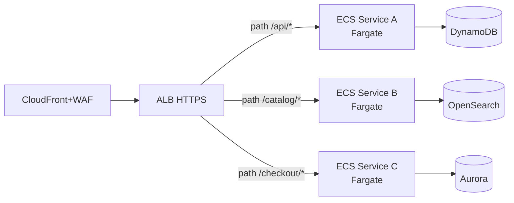

**Scaling**: Target Tracking por `ALBRequestCountPerTarget` (métrica recomendada).
**Examen**: ALB puede registrar dinámicamente tasks de ECS. No necesitas gestionar IPs manualmente.

---

### Patrón 2: Workers event-driven (SQS)

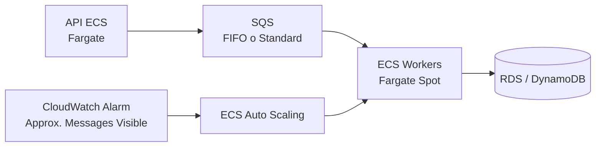

**Scaling**: basado en `ApproximateNumberOfMessagesVisible / RunningTaskCount`
**Trampa examen**: **no** escalar workers por CPU cuando el driver es SQS. La CPU puede estar baja incluso con miles de mensajes en cola.
**DLQ obligatoria** cuando usas Fargate Spot: mensajes no procesados antes de interrupción van a DLQ.

---

### Patrón 3: Batch / Scheduled Jobs

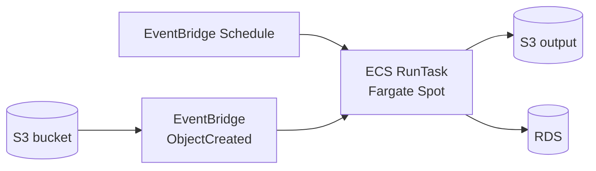

**Puntos clave**:
- `RunTask` es fire-and-forget. Si falla, EventBridge puede reintentarlo (configura retry policy).
- Para jobs complejos con dependencias entre pasos → **Step Functions + ECS RunTask**.
- Para cientos de jobs heterogéneos con dependencias → considera **AWS Batch** (ver sección 11).

---

### Patrón 4: Sidecar (observabilidad + proxy)

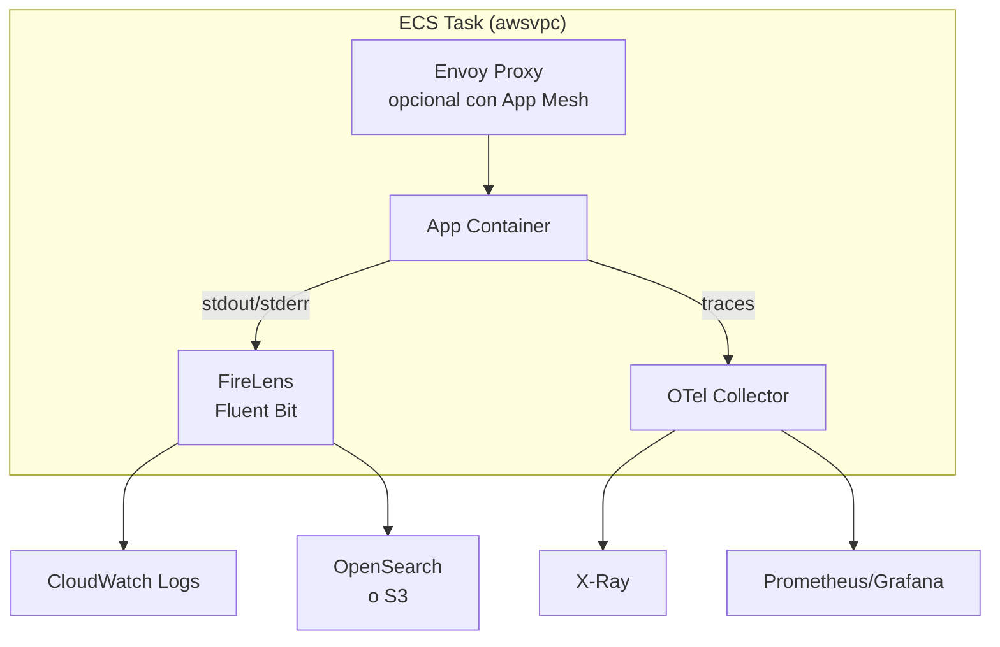

**FireLens**: reemplaza el log driver nativo de Docker. Permite enrutar logs a múltiples destinos sin cambiar la aplicación.
**Examen**: FireLens se configura en el `logConfiguration` de la Task Definition con `awsfirelens` como log driver.

---

### Patrón 5: Blue/Green con CodeDeploy

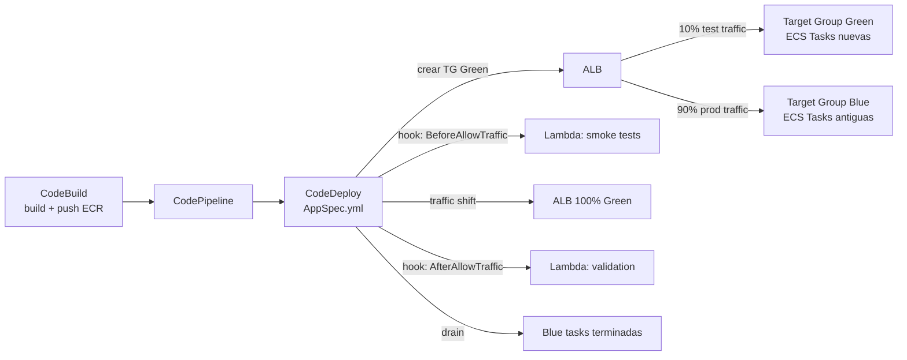

**Opciones de traffic shifting** (AppSpec):
| Opción | Comportamiento |
|--------|---------------|
| `Canary10Percent5Minutes` | 10% durante 5 min, luego 100% |
| `Linear10PercentEvery1Minute` | +10% cada minuto durante 10 min |
| `AllAtOnce` | Cambio inmediato total |

**Rollback automático**: si alarma CloudWatch dispara o hook falla → CodeDeploy revierte a Blue.
**Trampa examen**: Blue/Green con CodeDeploy requiere **ALB** (no NLB). Necesita **dos target groups**.

---

### Patrón 6: Service Connect (service-to-service nativo ECS)

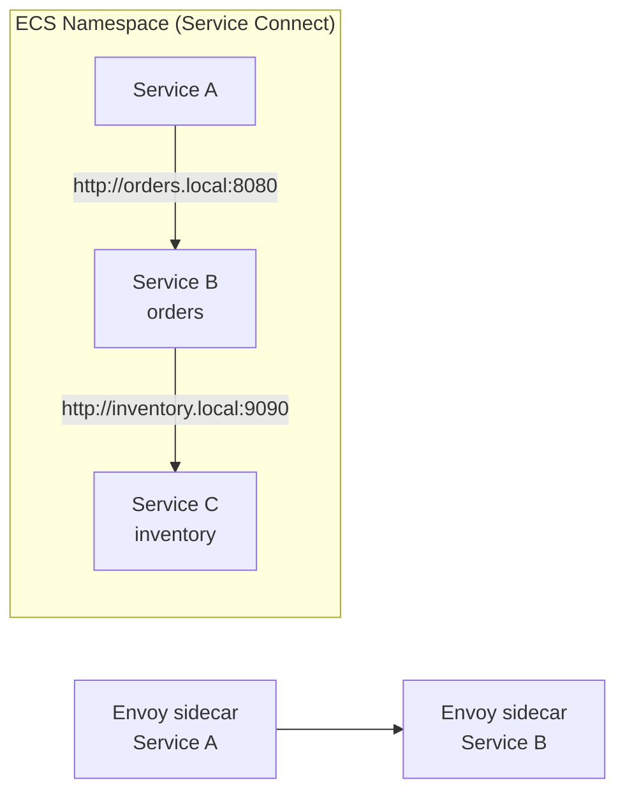

**Ventajas vs Cloud Map puro**:
- Métricas built-in: `ConnectionCount`, `RequestCount`, `RequestDuration`, `ServerErrors`
- Circuit breaking transparente
- Load balancing con health-aware routing
- Sin gestión de DNS TTL ni dependencias en registros Cloud Map
- Transparente para la aplicación (usa hostname corto)

**Cuándo usar qué**:
| Escenario | Usar |
|-----------|------|
| Service-to-service dentro del mismo cluster/namespace ECS | **Service Connect** |
| Discovery cross-cluster o cross-VPC dentro de AWS | **Cloud Map** o **VPC Lattice** |
| Service-to-service cross-account / cross-VPC con authZ IAM | **VPC Lattice** |

---

### Patrón 7: ECS Anywhere (Híbrido)

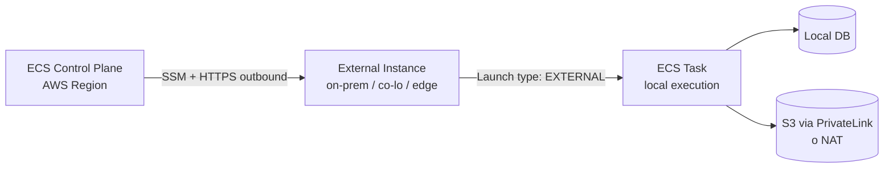

**Requisitos del external instance**:
1. SSM Agent instalado y conectado
2. ECS Agent instalado
3. Salida HTTPS puerto 443 a endpoints AWS (no requiere inbound)
4. IAM role `ECSAnywhereRole` para el instance

**Casos de uso**:
- Datos que **no pueden salir de las instalaciones** (regulatorio, GDPR estricto)
- Burst to cloud: baseline on-prem, overflow en Fargate
- Edge computing: tiendas retail, fábricas con procesamiento local
- Path de migración: containerizar on-prem antes de mover a cloud

**Limitaciones importantes**:
- No Fargate (siempre EC2/External launch type)
- No ALB integrado automáticamente (gestión manual del LB)
- Algunas funcionalidades ECS no disponibles (service connect limitado)
- Coste adicional: tarifa por hora por instancia externa registrada

---

### Patrón 8: EFS + ECS (almacenamiento compartido persistente)

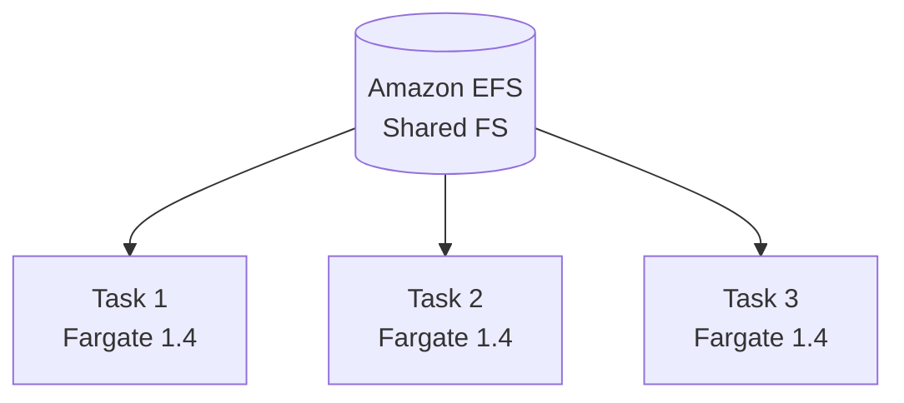

**Cuándo usar EFS con ECS**:
- Contenidos compartidos entre múltiples tasks (CMS, archivos de configuración, modelos ML)
- Workloads que necesitan persistir estado entre reinicios de task

**Requisitos**:
- Fargate Platform Version **1.4.0+**
- EFS mount points en Task Definition
- SG del EFS debe permitir NFS (puerto 2049) desde SG de las tasks
- Cifrado en tránsito recomendado (`TransitEncryption: ENABLED`)

---

### Patrón 9: Multi-cuenta / Landing Zone

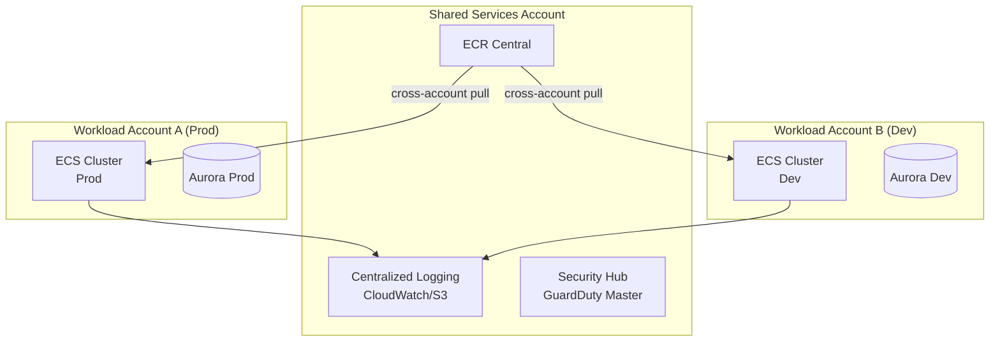

**Puntos clave examen**:
- ECR centralizado requiere **resource-based policy** en el repositorio + `ecr:GetAuthorizationToken` en la execution role de la cuenta destino
- CloudWatch log groups pueden enrutar a cuenta central con **cross-account subscription filter**
- GuardDuty tiene cuenta delegada administrador (Org master o cuenta designada)

---

### Patrón 10: Multi-región / DR

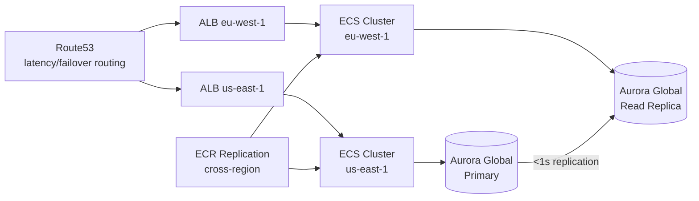

**Estrategias DR comparadas**:

| Estrategia | RTO | RPO | Coste relativo | Configuración |
|-----------|-----|-----|---------------|---------------|
| **Active/Active** | Segundos | ~0 | Alto | Ambas regiones full capacity |
| **Active/Passive (Warm Standby)** | Minutos | <1 min | Medio | Secundaria con tasks mínimos |
| **Pilot Light** | 10-30 min | <1 min | Bajo | Secundaria sin tasks (solo infra) |
| **Backup/Restore** | Horas | Horas | Mínimo | Solo backups S3/RDS |

**Examen**: Aurora Global Database tiene **RPO < 1 segundo** y **RTO < 1 minuto** (promotion). DynamoDB Global Tables → multi-master, eventual consistency.

---

## 4. Mapa completo de integraciones AWS

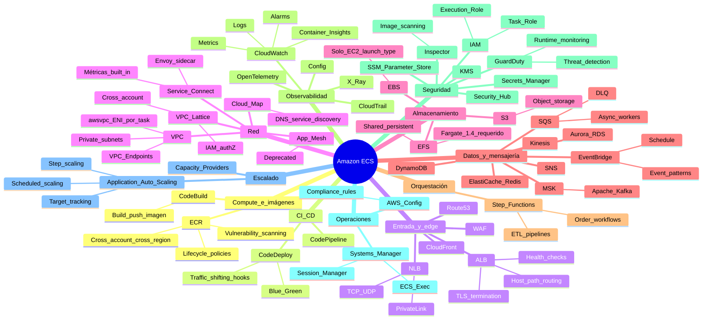

### 4.1 Tabla de integraciones clave (SA Pro: propósito + trampa)

| Servicio | Rol en ECS | Trampa examen |
|---------|-----------|--------------|
| **ECR** | Registry de imágenes | Necesitas DOS VPC endpoints: `ecr.api` y `ecr.dkr` + S3 gateway para layers |
| **CodeDeploy** | Blue/Green deployments | Sólo con ALB, no NLB; necesita 2 target groups |
| **CloudWatch Container Insights** | Métricas a nivel task/service | **No habilitado por defecto**; coste adicional por métricas custom |
| **GuardDuty Runtime** | Detección amenazas en runtime | Requiere activación explícita; inyecta agente como sidecar |
| **EFS** | Almacenamiento compartido | Solo Fargate 1.4.0+; SG NFS port 2049 |
| **VPC Lattice** | Service mesh cross-account | Más nuevo que Service Connect; requiere configuración de service network |
| **ECS Exec** | Acceso interactivo a containers | Requiere `enableExecuteCommand: true` en task + rol SSM |
| **Savings Plans** | Descuento compute | Compute Savings Plans cubren Fargate; no EC2 Instance Savings Plans |

---

## 5. Service Connect vs Cloud Map vs VPC Lattice

Esta decisión aparece frecuentemente en el examen como pregunta de "cuándo usar qué":

### 5.1 Comparativa

| Característica | Service Connect | Cloud Map | VPC Lattice |
|---------------|----------------|-----------|-------------|
| **Tipo** | ECS-native sidecar (Envoy) | DNS-based discovery | Managed service mesh |
| **Scope** | Mismo namespace ECS | VPC (DNS) | Cross-VPC, cross-account |
| **Métricas** | ✅ Built-in (CloudWatch) | ❌ Manual | ✅ Built-in |
| **Circuit breaking** | ✅ Automático | ❌ | ✅ |
| **Authz IAM** | ❌ | ❌ | ✅ Auth policies |
| **Targets soportados** | ECS Services | ECS, EC2, Lambda, IPs | ECS, EC2, Lambda, K8s |
| **Configuración** | Task Definition + Namespace | Service registration API | Lattice Service Network |
| **Coste extra** | Solo compute del sidecar | Por queries DNS + registros | Por hora de Service Network |

### 5.2 Árbol de decisión

```
¿Service-to-service dentro del mismo cluster ECS?
  → SÍ: ¿Necesitas métricas y circuit breaking sin configuración extra?
    → SÍ: Service Connect ✅
    → NO: Cloud Map (más simple)
  → NO: ¿Cross-VPC o cross-account?
    → SÍ: ¿Necesitas authZ IAM y soporte multi-compute (ECS+Lambda+EKS)?
      → SÍ: VPC Lattice ✅
      → NO: Cloud Map con VPC peering / Transit Gateway
```

---

## 6. CI/CD Pipeline completo con ECS

### 6.1 Pipeline estándar (rolling update)

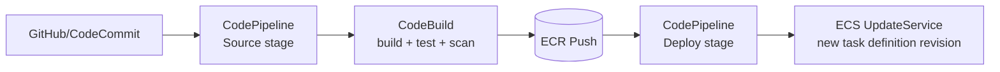

### 6.2 Pipeline Blue/Green (alto riesgo)

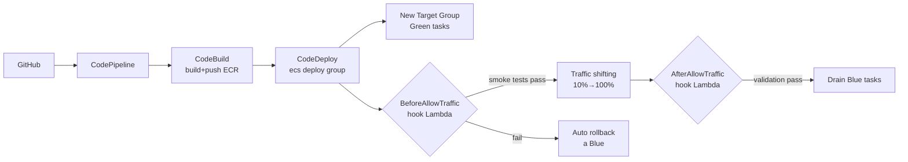

### 6.3 appspec.yml para ECS Blue/Green

```yaml
version: 0.0
Resources:
  - TargetService:
      Type: AWS::ECS::Service
      Properties:
        TaskDefinition: "<TASK_DEFINITION>"
        LoadBalancerInfo:
          ContainerName: "app"
          ContainerPort: 8080
        PlatformVersion: "LATEST"

Hooks:
  - BeforeAllowTraffic: "BeforeAllowTrafficLambdaHook"
  - AfterAllowTraffic:  "AfterAllowTrafficLambdaHook"
```

---

## 7. FinOps avanzado (Fargate)

### 7.1 Desglose de costes Fargate

| Componente | Precio (orientativo eu-west-1) | Optimización |
|-----------|-------------------------------|-------------|
| vCPU-hora | ~$0.04856 | Rightsizing + Spot + Graviton |
| GB-hora (mem) | ~$0.00532 | Rightsize mem; no sobreprovisionar |
| Almacenamiento efímero adicional (>21GB) | Por GB/día | Evitar si posible |
| **ALB**: horas + LCU | ~$0.008/hora + $0.008/LCU | Consolidar ALBs |
| **NAT Gateway**: hora + GB | $0.045/hora + $0.045/GB | **VPC Endpoints** reducen GBs |
| **CloudWatch Logs**: ingest + storage | $0.50/GB + $0.03/GB/mes | Controlar verbosity + retention |
| **Container Insights** | ~$0.50/métrica/mes | Solo para prod; evaluar coste |
| Data transfer inter-AZ | $0.01/GB | Diseño AZ-aware para bases de datos |

### 7.2 Ventaja Graviton (ARM)

- **~20% más barato** para la misma configuración vCPU/mem en Fargate
- Rendimiento igual o superior para la mayoría de workloads (Java, Python, Go, Node.js)
- Requiere imágenes compatibles ARM (`linux/arm64` en multi-arch build)
- Configurar en Task Definition: `runtimePlatform: { cpuArchitecture: ARM64 }`

### 7.3 Tabla de estrategia por tipo de workload

| Tipo workload | Capacity Provider | Compromiso | Idempotente | Estrategia |
|--------------|------------------|------------|-------------|------------|
| API crítica 24/7 | FARGATE | Savings Plan 1yr | N/A | On-demand + Savings Plan |
| API con tráfico variable | FARGATE | No | N/A | Target tracking autoscaling |
| Workers async | FARGATE_SPOT (75%) + FARGATE (25%) | No | ✅ requerido | base=1 FARGATE + weight=3 SPOT |
| Batch nocturno | FARGATE_SPOT | No | ✅ requerido | RunTask en SPOT; retry en EventBridge |
| Batch crítico | FARGATE | No | Recomendado | On-demand; Savings Plan si volumen |

### 7.4 Cálculo rápido (template examen)

```
Compute mensual (Fargate, 30 días = 720h):

vCPU-horas = N_tasks × vCPU_por_task × horas_al_mes
GB-horas   = N_tasks × GB_por_task × horas_al_mes

Coste compute = (vCPU-horas × precio_vCPU) + (GB-horas × precio_GB)

Coste total ≈ compute + ALB + NAT + CloudWatch + data_transfer
```

### 7.5 Top 5 trampas de coste

1. **NAT Gateway con alta salida**: cada GB procesado cuesta $0.045. Cien tasks con logging frecuente → sorpresa en factura. **Solución**: VPC Endpoints.
2. **Container Insights no desactivado en dev/staging**: métricas custom cuestan por mes activo.
3. **CloudWatch Logs sin política de retención**: por defecto retención indefinida. **Solución**: lifecycle policy en cada log group.
4. **ALB LCU con reglas complejas**: cuantas más reglas y conexiones activas, más LCU. Evalúa consolidar listeners.
5. **Data transfer inter-AZ**: si tasks en AZ-A conectan a RDS en AZ-B regularmente, los $0.01/GB se acumulan. Usa read replicas en misma AZ o AZ-aware routing.

---

## 8. Seguridad (SA Pro nivel)

### 8.1 IAM: Task Role vs Execution Role

```
ECS Task
├── Execution Role (lo que ECS necesita para gestionar el task)
│   ├── ecr:GetAuthorizationToken
│   ├── ecr:BatchGetImage
│   ├── logs:CreateLogStream / PutLogEvents
│   └── secretsmanager:GetSecretValue (si inyectas secrets)
│
└── Task Role (lo que TU APLICACIÓN necesita)
    ├── s3:GetObject → bucket-específico
    ├── dynamodb:GetItem → tabla-específica
    └── kms:Decrypt → clave-específica
```

**Error frecuente examen**: mezclar ambos roles o poner permisos de aplicación en el Execution Role.

### 8.2 Modelo de red seguro

```mermaid
flowchart TB
  INET[Internet] --> IGW[Internet Gateway]
  IGW --> ALB[ALB\nPublic Subnet]
  ALB -->|SG: allow from ALB-SG| TASKS[ECS Tasks\nPrivate Subnet]
  TASKS -->|SG: allow NFS 2049| EFS[(EFS)]
  TASKS -->|SG: allow 5432| RDS[(RDS Private Subnet)]
  TASKS --> VPCE[VPC Endpoints\nECR, Logs, S3, Secrets]
  VPCE --> AWS_API[AWS Services\n(no public internet)]
```

**Regla**: Los tasks nunca necesitan IP pública. Acceso saliente a AWS via VPC Endpoints. Solo ALB tiene IP pública.

**VPC Endpoints necesarios para ECS privado**:
| Endpoint | Tipo | Para qué |
|---------|------|---------|
| `com.amazonaws.{region}.ecr.api` | Interface | Autenticación ECR |
| `com.amazonaws.{region}.ecr.dkr` | Interface | Pull de imágenes |
| `com.amazonaws.{region}.s3` | Gateway | Layers de imágenes ECR |
| `com.amazonaws.{region}.logs` | Interface | CloudWatch Logs |
| `com.amazonaws.{region}.secretsmanager` | Interface | Secrets en Task Def |
| `com.amazonaws.{region}.ssm` | Interface | SSM Parameter Store |
| `com.amazonaws.{region}.ssmmessages` | Interface | ECS Exec / Session Manager |

### 8.3 Hardening de runtime

| Práctica | Descripción | Por qué |
|---------|-------------|---------|
| **Non-root** | `user: 1000:1000` en Task Definition | Reduce blast radius de vulnerabilidad |
| **Read-only FS** | `readonlyRootFilesystem: true` | Impide escritura en sistema de archivos |
| **Capabilities drop** | `linuxParameters.capabilities.drop: ["ALL"]` | Minimal Linux capabilities |
| **ECR image scanning** | Basic o Enhanced (Inspector) | Detectar CVEs antes del deploy |
| **Pinned base images** | `FROM node:20.10.0-alpine` en vez de `latest` | Reproducibilidad y seguridad |
| **No secrets en env vars** | Usar `secrets` con ARN de Secrets Manager | Evitar exposición en CloudTrail, describe-tasks |

### 8.4 GuardDuty ECS Runtime Protection

- Inyecta agente como sidecar en tasks Fargate
- Detecta: **container escapes**, **credential theft**, **crypto mining**, **unexpected network connections**
- Se activa en: GuardDuty → Protection Plans → ECS Runtime Monitoring
- Genera findings que se integran con **Security Hub**
- **No hay configuración de aplicación**: transparente para el task

### 8.5 Compliance y auditoría

| Herramienta | Función en ECS | Configuración |
|------------|----------------|--------------|
| **CloudTrail** | Auditar llamadas API ECS (RegisterTask, RunTask, etc.) | Activar en todas las regiones |
| **AWS Config** | Verificar conformidad de configuración ECS | Rules: ecs-task-definition-nonroot, ecs-no-environment-secrets |
| **Security Hub** | Agregación y scoring de findings | Standards: FSBP (AWS Foundational Security Best Practices) |
| **Inspector** | Escaneo de imágenes ECR y vulnerabilidades OS | Integrado con ECR; automático en push |

---

## 9. Networking avanzado

### 9.1 Límites ENI y planificación de subnets

**Cálculo crítico para el examen**:

```
Max tasks en una subnet = IPs disponibles - 5 (AWS reservadas)

/24 subnet = 256 IPs - 5 = 251 IPs → max ~251 tasks Fargate
/25 subnet  = 128 IPs - 5 = 123 IPs → max ~123 tasks
/22 subnet = 1024 IPs - 5 = 1019 IPs → permite escalar a ~1000 tasks
```

**Recomendación**: usar subnets /22 o /21 para clusters que necesiten escalar a cientos de tasks. Distribuir en mínimo 2-3 AZs.

### 9.2 Security Groups granulares por task

Con `awsvpc`, cada task tiene su propio SG (a diferencia de bridge mode donde todos los tasks en un host comparten el SG del host):

```
ALB-SG → permite HTTPS:443 desde internet
Task-SG → permite puerto app solo desde ALB-SG
RDS-SG → permite 5432 solo desde Task-SG
```

---

## 10. Escalado (Application Auto Scaling)

### 10.1 Políticas de escalado comparadas

| Tipo | Cuándo usar | Ejemplo |
|------|------------|---------|
| **Target Tracking** | Métrica simple con target claro | RequestCountPerTarget = 1000 |
| **Step Scaling** | Control granular en rangos | 0-500 req/task: 2 tasks; 500-1000: 4 tasks |
| **Scheduled Scaling** | Patrones predecibles | Black Friday: min=20 tasks desde 9:00 |

### 10.2 Métricas de escalado por tipo de workload

| Workload | Métrica recomendada | Por qué |
|---------|--------------------|---------|
| API HTTP | `ALBRequestCountPerTarget` | Directamente correlacionada con carga real |
| Worker SQS | `SQS ApproximateNumberOfMessages / RunningTaskCount` | Cola = carga pendiente real |
| Worker CPU-bound | `ECSServiceAverageCPUUtilization` | CPU sí es indicador cuando el work es compute |
| Scheduled batch | Scheduled scaling | Carga conocida de antemano |

### 10.3 Scale-in cooldown

- Evita que el scaler elimine tasks demasiado rápido tras un spike
- Para workers SQS: cooldown más largo (ej. 300s) para evitar thrashing
- Para APIs: cooldown más corto (60-120s) permite recuperación rápida

---

## 11. ECS vs Alternativas (tabla completa SA Pro)

### 11.1 ECS Fargate vs EKS vs Lambda vs Batch vs App Runner

| Dimensión | ECS Fargate | EKS | Lambda | AWS Batch | App Runner |
|-----------|------------|-----|--------|-----------|------------|
| **Ops overhead** | Bajo | Alto | Mínimo | Medio | Mínimo |
| **Cold start** | Segundos | Segundos | ms-segundos | Minutos | Segundos |
| **Max duración** | Ilimitada | Ilimitada | 15 min | Ilimitada | Ilimitada |
| **Scale to zero** | Con ECS Service Connect Spot | ❌ | ✅ | ✅ (jobs) | ✅ |
| **K8s ecosystem** | ❌ | ✅ | ❌ | ❌ | ❌ |
| **Portabilidad** | Contenedores | K8s nativo | Vendor lock | Limitada | Contenedores |
| **GPU support** | ❌ Fargate (sí EC2) | ✅ | ❌ | ✅ | ❌ |
| **Job dependencies** | Manual (Step Functions) | Manual | Manual | ✅ Nativo | ❌ |
| **VPC control** | ✅ Total | ✅ Total | ✅ Parcial | ✅ | Limitado |
| **Ideal para** | Microservicios AWS-native | K8s-first orgs | Event handlers | HPC/batch | Apps simples rápidas |

### 11.2 Árbol de decisión: cuándo usar ECS

```
¿Tienes workloads containerizados?
  → NO: EC2 o Lambda según duración
  → SÍ: ¿Requieres K8s (operators, CRDs, Helm, portabilidad)?
    → SÍ: EKS
    → NO: ¿Duración < 15 min + stateless + spiky?
      → SÍ: Lambda (si cabe en límites)
      → NO: ¿Batch complejo con dependencias entre jobs?
        → SÍ: AWS Batch
        → NO: ¿Aplicación web simple sin VPC compleja?
          → SÍ: App Runner
          → NO: ECS Fargate ✅
```

### 11.3 ECS vs AWS Batch (detalle)

| | ECS RunTask | AWS Batch |
|--|------------|----------|
| **Job queue** | ❌ | ✅ Priority queues |
| **Dependencias jobs** | Manual (Step Functions) | ✅ Nativo (dependsOn) |
| **Array jobs** | ❌ | ✅ (parallelismo masivo) |
| **Compute environments** | Fargate/EC2 | Managed/Unmanaged; Spot Fleet |
| **Scheduling** | EventBridge → RunTask | Managed automáticamente |
| **Ideal** | Batch ocasional simple | HPC, ML training, ETL masivo |

---

## 12. Multi-región: patrones DR detallados

### 12.1 Active/Active con ECS

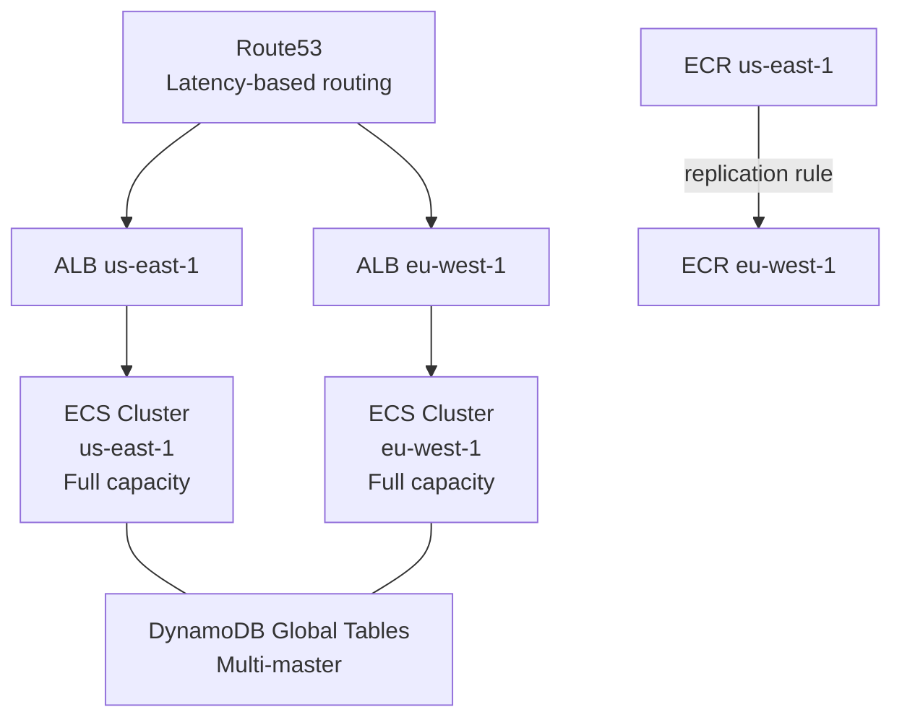

**Consideraciones**:
- **DynamoDB Global Tables**: multi-master, eventual consistency (RPO ~1s)
- **Aurora Global**: single-writer, replicación asíncrona <1s (no multi-master)
- **ECR**: configurar replication rules para tener imágenes en ambas regiones
- **Route53 Health Checks**: failover automático si ALB en una región falla
- **Coste**: doble de infraestructura compute

### 12.2 Warm Standby (Active/Passive con capacidad mínima)

- Región secundaria: 1-2 tasks mínimas (mantiene warm la red, task definition activa)
- Route53 failover routing: solo si health check falla en primaria
- **Aurora Global**: promote secundaria a primary en <1 min con RTO bajo
- Escalar secundaria con **Scheduled Scaling** o automatización Lambda en event de failover

---

## 13. Exam Traps & Gotchas (top 15)

> Estas son las respuestas incorrectas más comunes en el examen SA Pro relacionadas con ECS.

| # | Trampa | Respuesta correcta |
|---|--------|-------------------|
| 1 | "Para escalar workers, usa CPU utilization" | **Usa SQS ApproximateNumberOfMessages / RunningTaskCount** cuando el driver es una cola |
| 2 | "Blue/Green con NLB en CodeDeploy ECS" | **CodeDeploy ECS B/G requiere ALB** con dos target groups |
| 3 | "Una subnet /24 soporta cientos de tasks Fargate sin problemas" | /24 = max ~251 IPs → max ~251 tasks. Para escalar a 500+ usa /22 o múltiples subnets |
| 4 | "Container Insights está habilitado por defecto" | **No**. Hay que activarlo explícitamente. Coste adicional |
| 5 | "Task Role y Execution Role son lo mismo" | **Execution Role**: permisos para ECS (ECR, logs, secrets). **Task Role**: permisos para tu app (S3, DynamoDB) |
| 6 | "Para usar EFS en Fargate, cualquier platform version funciona" | **Solo 1.4.0+**. Versiones anteriores no soportan EFS completamente |
| 7 | "Puedo usar EC2 Instance Savings Plans para Fargate" | **No**. Fargate requiere **Compute Savings Plans** |
| 8 | "Service Connect y Cloud Map son equivalentes" | Service Connect = Envoy sidecar + métricas built-in + circuit breaking. Cloud Map = DNS puro |
| 9 | "Para Fargate Spot, basta con habilitar Spot; no hace falta cambiar la aplicación" | **Necesitas idempotencia, manejo de SIGTERM, DLQ** para tolerar interrupciones de 2 min |
| 10 | "El Task Definition revision actualiza el service automáticamente" | **No**. Debes hacer `UpdateService` con la nueva revisión o configurar pipeline CI/CD |
| 11 | "ECS Anywhere funciona con Fargate" | **No**. ECS Anywhere solo soporta EC2/External launch type |
| 12 | "Solo necesito `ecr.dkr` VPC endpoint para pull de imágenes ECR privadas" | Necesitas **ecr.api + ecr.dkr + S3 gateway** (las layers se almacenan en S3) |
| 13 | "Para acceso interactivo a containers en producción, uso SSH en el host" | Usa **ECS Exec** (`execute-command`) con SSM → sin SSH, auditado en CloudTrail |
| 14 | "Route53 active/active con Aurora multiregión = multi-master" | **Aurora Global NO es multi-master**. Solo DynamoDB Global Tables lo es |
| 15 | "Deployment circuit breaker rollback sucede siempre" | Circuit breaker solo rollback si se activa el flag `rollback: true` en deployment config |

---

## 14. Checklist SA Pro (expandido)

### Arquitectura y primitivos
- [ ] Service vs RunTask: Service para long-running/desired-count; RunTask para one-off/batch
- [ ] Capacity Provider strategy: base + weight para mezcla FARGATE/SPOT
- [ ] Platform version: 1.4.0/LATEST para EFS; verificar compatibilidad
- [ ] Task Definition: healthchecks alineados con ALB health check; grace period configurado

### Networking
- [ ] awsvpc + subnet sizing: /22 o mayor para clusters que escalen a >100 tasks
- [ ] Private subnets; solo ALB/NLB en subnets públicas
- [ ] SG chaining: Task SG solo acepta del ALB SG
- [ ] VPC Endpoints: ecr.api + ecr.dkr + s3 (gateway) + logs + secretsmanager + ssm + ssmmessages
- [ ] Egress controlado: no `0.0.0.0/0` saliente por defecto

### IAM y secretos
- [ ] Execution Role ≠ Task Role: separados, least privilege
- [ ] Secrets Manager / SSM para secrets; no en env vars planas
- [ ] KMS para cifrado; scope `kms:Decrypt` a claves específicas
- [ ] ECS Exec: `ssmmessages` VPC endpoint + `enableExecuteCommand` en service

### CI/CD
- [ ] CodeDeploy B/G: dos target groups + AppSpec.yml + hooks Lambda
- [ ] Traffic shifting: elegir canary/linear/allAtOnce según riesgo
- [ ] Alarm para rollback automático CodeDeploy
- [ ] ECR lifecycle policy para limpiar imágenes antiguas

### Observabilidad
- [ ] Container Insights habilitado en producción; evaluar coste en dev
- [ ] Alarms: latencia, 5xx rate, SQS depth, deployment failures
- [ ] X-Ray / OTel para tracing distribuido
- [ ] Log retention configurada (no infinito por defecto)
- [ ] ECS Exec para debugging interactivo sin SSH

### Escalado
- [ ] APIs: Target Tracking por ALBRequestCountPerTarget
- [ ] Workers SQS: escalado por backlog / running tasks
- [ ] Scheduled scaling para patrones predecibles (Black Friday, batch window)
- [ ] Fargate Spot: idempotencia + SIGTERM handler + DLQ

### Seguridad
- [ ] GuardDuty ECS Runtime Monitoring activado en prod
- [ ] ECR Enhanced Scanning (Inspector) habilitado
- [ ] Non-root container + read-only FS donde sea posible
- [ ] CloudTrail + Config + Security Hub integrados
- [ ] Pinned base images; no usar `latest` en producción

### FinOps
- [ ] VPC Endpoints para reducir NAT Gateway costs
- [ ] Rightsizing: CPU/mem ajustados a p95 real
- [ ] Graviton ARM evaluado para workloads compatibles (~20% ahorro)
- [ ] Fargate Spot para workers/batch interruptibles
- [ ] Compute Savings Plans para baseline estable 24/7
- [ ] Log verbosity controlado; retention mínima necesaria

### DR y multi-región
- [ ] Estrategia DR definida: Active/Active, Warm Standby, Pilot Light
- [ ] ECR replication configurada a región secundaria
- [ ] Route53 health checks + failover routing
- [ ] RTO/RPO definidos y arquitectura alineada

---

*Documento complementario de escenarios por industria: `ecs-sa-pro-industry-scenarios.md`*
