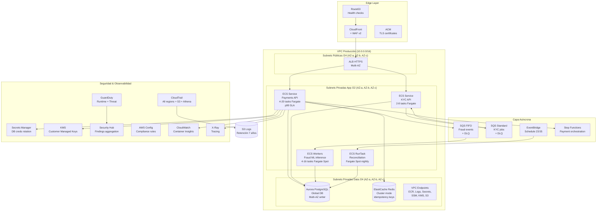
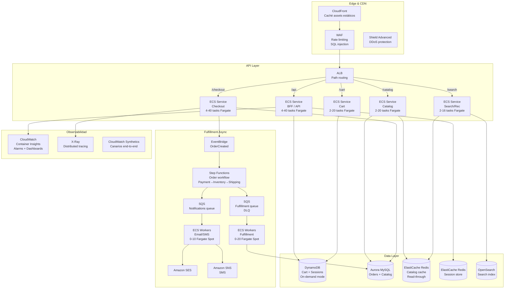
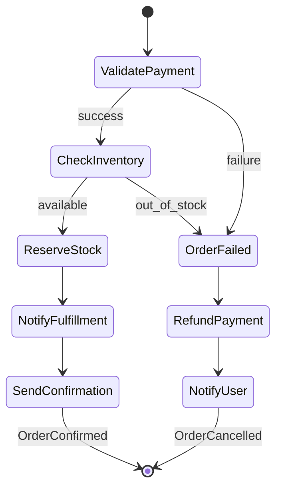
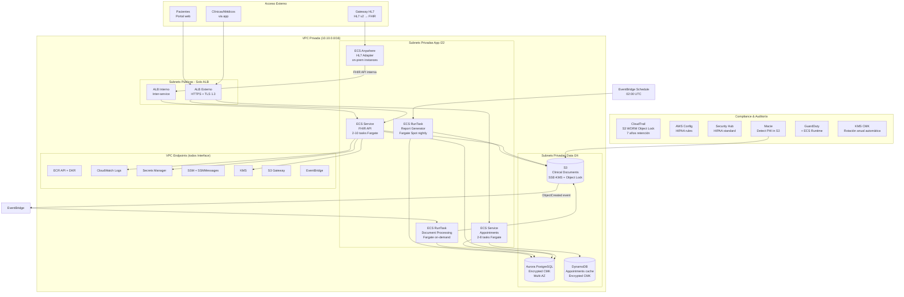
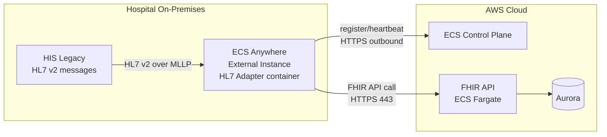
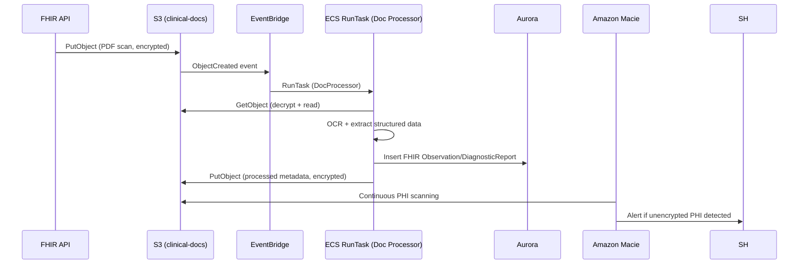
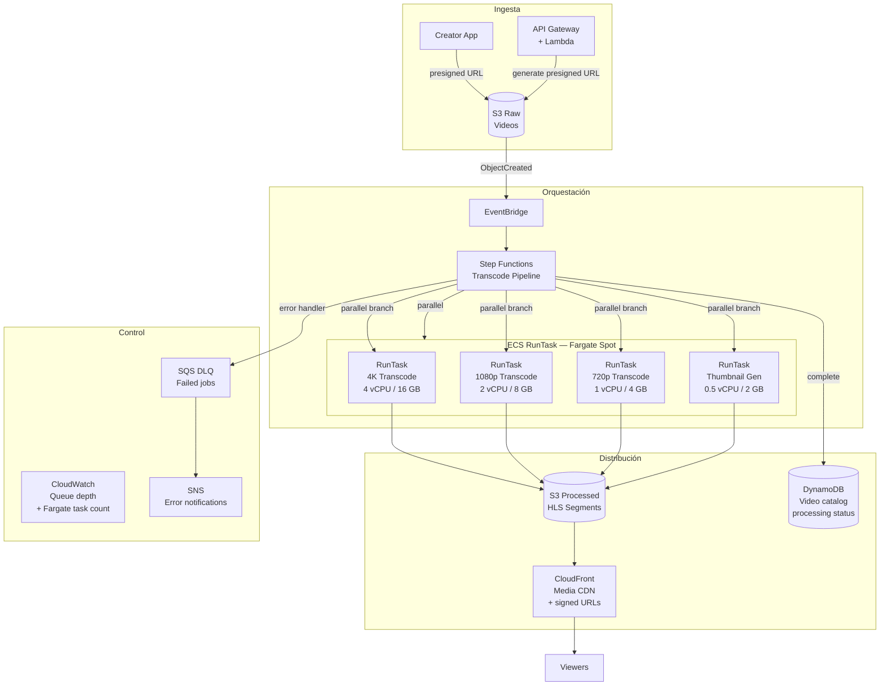

# AWS ECS — SA Pro: Escenarios por Industria

> **Objetivo**: Arquitecturas reales y completas por sector. Cada escenario incluye diagrama, decisiones de diseño, consideraciones de seguridad/compliance, estrategia de costes y tradeoffs.
> **Complemento de**: `ecs-sa-pro-concept-map.md`

---

## Índice

1. [FinTech — Plataforma de Pagos](#1-fintech--plataforma-de-pagos-digital)
2. [eCommerce — Plataforma con Picos de Tráfico](#2-ecommerce--plataforma-con-picos-de-tráfico)
3. [Healthcare — Plataforma HIPAA con APIs Clínicas](#3-healthcare--plataforma-hipaa-con-apis-clínicas)
4. [Media / Streaming — Pipeline de Ingesta y Transcoding](#4-media--streaming--pipeline-de-ingesta-y-transcoding)
5. [Matriz de Decisión Cross-Sector](#5-matriz-de-decisión-cross-sector)

---

## 1. FinTech — Plataforma de Pagos Digital

### 1.1 Contexto empresarial

**Empresa**: Fintech con licencia como Payment Institution (PSD2 en Europa / similar en US).
**Workloads principales**:
- API REST de pagos (procesamiento en tiempo real, <200ms p99)
- KYC/AML: verificación de identidad, scoring de riesgo
- Motor antifraude: análisis en tiempo real + ML asíncrono
- Conciliación contable: batch nocturno, cierre de día

**Requisitos críticos**:
- **PCI-DSS** compliance (datos de tarjetas)
- **SOC 2 Type II** (controles de seguridad)
- **SLA 99.99%** para el servicio de pagos
- Trazabilidad completa (auditoría por regulador)
- Segregación de entornos: prod aislado de dev/staging

### 1.2 Arquitectura de referencia



### 1.3 Decisiones de diseño clave

#### ¿Por qué ECS y no EKS?
- El equipo no tiene expertise K8s y el regulador requiere auditorías de cambio rápidas
- AWS-native = CloudTrail integrado en cada acción del plano de control
- Menor superficie de ataque: sin API Server K8s expuesto

#### ¿Por qué Fargate y no EC2?
- Sin SSH a nodos: reduce drásticamente la superficie de ataque (PCI-DSS exige "no acceso físico/lógico innecesario")
- Sin parcheo de OS: responsabilidad de AWS en Fargate
- GuardDuty Runtime en Fargate funciona sin agente manual

#### Patrón de pagos: sincrónico + asíncrono
1. **POST /payments**: API valida, persiste en Aurora (ACID), publica evento a SQS FIFO, devuelve 202
2. **Worker antifraude**: consume SQS FIFO, ejecuta modelo ML, actualiza estado en Aurora
3. **Pattern de idempotencia**: `idempotency_key` en ElastiCache Redis con TTL 24h

### 1.4 Seguridad PCI-DSS específica

| Requerimiento PCI | Implementación AWS |
|-------------------|-------------------|
| Req 1: Red segmentada | VPC con subnets públicas/privadas; SG granulares por task; NACLs |
| Req 2: No defaults del vendor | AMIs hardeneadas; non-root containers; capabilities drop ALL |
| Req 3: Proteger datos tarjetas (CHD) | KMS CMK para cifrar en BD; nunca en logs; tokenización |
| Req 6: Software seguro | ECR Enhanced Scanning; SAST en CodeBuild; DAST |
| Req 7-8: Control de acceso | IAM least privilege; MFA obligatorio; task role ≠ execution role |
| Req 10: Auditoría | CloudTrail + S3 WORM (Object Lock); retención 12 meses online + 7 años |
| Req 11: Escaneos y pentests | Inspector para imágenes; Security Hub scores; pentests trimestrales |
| Req 12: Políticas | AWS Config rules; Organization SCPs para bloquear acciones no permitidas |

### 1.5 Estrategia de costes FinTech

| Servicio | Patrón | Optimización |
|---------|--------|-------------|
| Payments API (4-20 tasks) | Fargate On-Demand | Compute Savings Plan 1yr para baseline de 4 tasks |
| Fraud workers (4-16 tasks) | FARGATE_SPOT 75% + FARGATE 25% | Idempotencia garantizada; base=1 FARGATE |
| Reconciliation (nightly) | FARGATE_SPOT | RunTask en SPOT; retry en EventBridge si falla |
| Aurora | Multi-AZ writer + 1 read replica | Reserved instances para escritor |
| ElastiCache | Redis cluster 3 nodos | Reserved nodes para cache de idempotencia |
| NAT Gateway | Evitado con VPC Endpoints | $0 en tráfico ECR/Logs/Secrets via endpoints |

**Coste estimado mensual** (orientativo, región eu-west-1):
- Compute Fargate: ~$400-800 (según carga)
- Aurora PostgreSQL: ~$300 (Multi-AZ, db.r6g.large)
- ElastiCache: ~$150 (3x cache.m6g.large)
- ALB: ~$30-50
- NAT: ~$0-20 (minimizado con endpoints)
- CloudWatch + logs: ~$50-100
- **Total estimado**: ~$1000-1300/mes baseline

---

## 2. eCommerce — Plataforma con Picos de Tráfico

### 2.1 Contexto empresarial

**Empresa**: Retailer con presencia online (500K-5M usuarios activos, picos en campañas).
**Workloads**:
- Frontend BFF / API Gateway de servicios
- Catálogo de productos (alta lectura, caché intensivo)
- Carrito y sesiones de usuario
- Checkout y procesamiento de órdenes
- Fulfillment y notificaciones asíncronas
- Motor de búsqueda y recomendaciones

**Requisitos críticos**:
- Manejar **10x-100x picos** de tráfico (Black Friday, Cyber Monday)
- **Disponibilidad 99.9%** mínimo
- **Time to deploy < 15 min** (iteración rápida de producto)
- **Zero-downtime deployments**

### 2.2 Arquitectura de referencia



### 2.3 Estrategia para Black Friday: elastic scaling extremo

**El problema**: tráfico 20x normal durante 6h. Hay que escalar rápido y no pagar cuando no hay tráfico.

**Solución multi-capa**:

```
Capa 1: CloudFront (absorbe 90% de requests - assets, catálogo cacheado)
         ↓ solo peticiones dinámicas pasan
Capa 2: ALB + ECS Auto Scaling
         - Scheduled Scaling: aumentar min tasks desde 22:00 el día anterior
         - Target Tracking: ALBRequestCountPerTarget = 500 req/task
Capa 3: DynamoDB On-Demand (escala automáticamente, sin capacity planning)
Capa 4: Aurora Read Replicas preconfiguradas (escalar con días de antelación)
```

**Preparación anticipada (runway capacity)**:
```yaml
# Scheduled scaling - pre-warm para Black Friday
ScheduledActions:
  - ScaleName: "BlackFriday_PreWarm"
    Schedule: "cron(0 22 * 11 4 *)"  # Thanksgiving Thursday 22:00
    MinCapacity: 20
    MaxCapacity: 100
  - ScaleName: "BlackFriday_PostEvent"
    Schedule: "cron(0 8 * 11 6 *)"   # Saturday after BF 08:00
    MinCapacity: 4
    MaxCapacity: 40
```

### 2.4 Patrón de orden: orquestación con Step Functions



**Por qué Step Functions aquí y no solo SQS**:
- Las órdenes tienen pasos dependientes con posible compensación (saga pattern)
- Visibilidad del estado de cada orden sin consultar múltiples servicios
- Reintentos automáticos con backoff exponencial en cada paso
- Timeout por paso para evitar órdenes "colgadas"

### 2.5 CI/CD para iteración rápida

**Estrategia de deployment por servicio**:

| Servicio | Estrategia | Justificación |
|---------|-----------|--------------|
| BFF / API | **Blue/Green** (CodeDeploy) | Alta visibilidad; rollback rápido |
| Catalog | Rolling update | Bajo riesgo; alta disponibilidad |
| Checkout | **Blue/Green + Canary** | Crítico; tráfico gradual |
| Workers async | Rolling update | Workers idempotentes; rollback no crítico |

### 2.6 Costes eCommerce

**Patrón de coste**: muy variable. El clave es pagar por pico solo durante el pico.

| Componente | Steady state | Black Friday (pico 6h) | Optimización |
|-----------|-------------|----------------------|-------------|
| ECS Fargate (APIs) | ~$500/mes | +$200 extra 6h | Scheduled scaling + autoscaling |
| ECS Workers (Spot) | ~$100/mes | +$50 extra | Spot para fulfillment |
| DynamoDB | ~$50/mes | Auto-escala automático | On-Demand mode para eventos impredecibles |
| Aurora | ~$200/mes | Sin cambio (read replicas) | Reserved + read replicas pre-added |
| CloudFront | ~$50/mes | Absorbe tráfico → bajo impacto en ALB | Cache TTL optimizado |
| ElastiCache | ~$150/mes | Sin cambio | Cache-aside para catálogo |

**Trampa examen para eCommerce**: "El cliente quiere ahorrar en DynamoDB. ¿Usar Provisioned Capacity?"
→ **No para Black Friday**. Con Provisioned Capacity hay que sobreprovisionar anticipando el pico. **On-Demand** escala automáticamente y es más eficiente en costes para tráfico errático aunque ligeramente más caro por unidad de request.

---

## 3. Healthcare — Plataforma HIPAA con APIs Clínicas

### 3.1 Contexto empresarial

**Empresa**: Proveedor de salud digital (Telehealth, EHR access, patient portal).
**Workloads**:
- API FHIR R4 (interoperabilidad de datos clínicos)
- Sistema de citas y telemedicina
- Ingesta y procesamiento de documentos clínicos (PDFs de diagnósticos, labs)
- Generación de informes y analytics clínicos
- Integración con sistemas legacy HL7 v2 on-premises via ECS Anywhere

**Requisitos críticos**:
- **HIPAA compliance** (Protected Health Information - PHI)
- **Cifrado en tránsito y reposo** (todo PHI)
- **Audit trail completo** (quién accedió a qué datos y cuándo)
- **BAA** (Business Associate Agreement) con AWS
- Datos de pacientes **no pueden salir de la región** designada
- **Resiliencia**: sistemas clínicos son críticos para la atención

### 3.2 Arquitectura de referencia



### 3.3 Diseño HIPAA: decisiones críticas

#### Cifrado: todo PHI cifrado con CMK

```
En reposo:
  Aurora PostgreSQL → AES-256 con KMS CMK propio
  S3 documentos → SSE-KMS con CMK + Object Lock (compliance mode, 7 años)
  DynamoDB → KMS CMK
  CloudWatch Logs → KMS CMK

En tránsito:
  Todo HTTPS/TLS 1.3 (ALB forced)
  EFS si se usa → TransitEncryption ENABLED
  Aurora → SSL obligatorio (rds.force_ssl=1)
```

#### Acceso a PHI: mínimo necesario

```
Task Role para FHIR API:
  s3:GetObject       → solo bucket clinical-docs-prod
  s3:PutObject       → solo bucket clinical-docs-prod con kms condition
  kms:Decrypt        → solo CMK de datos clínicos
  kms:GenerateDataKey → solo CMK de datos clínicos

NO incluir:
  s3:*               (demasiado amplio)
  kms:*              (demasiado amplio)
```

#### Audit trail: quién accedió a qué PHI

```
CloudTrail → registra todas las llamadas API AWS (incluye GetObject S3)
  → S3 bucket con Object Lock (WORM, Compliance mode, 7 años)
  → Athena para queries de auditoría
  → Alertas CloudWatch si alguien deshabilita CloudTrail

S3 Access Logs → registro a nivel de objeto (FHIR documents accessed)
RDS Audit Log → exported to CloudWatch Logs
Application logs → structured logging (no PHI en logs)
```

### 3.4 ECS Anywhere para legacy HL7

Muchos hospitales tienen sistemas legacy que emiten mensajes HL7 v2 (no FHIR) y no pueden conectarse directamente a internet.



**Ventajas de ECS Anywhere aquí**:
- El adaptador HL7 corre **donde están los datos del hospital** (on-prem)
- **No se transfieren** mensajes HL7 crudos con PHI a internet
- ECS gestiona el lifecycle del container adaptador de forma centralizada
- Actualizaciones del adaptador via ECS deploy (sin SSH al servidor on-prem)

### 3.5 Procesamiento de documentos clínicos (event-driven)



### 3.6 Compliance checklist HIPAA para ECS

| Control HIPAA | Verificación |
|--------------|-------------|
| **§164.312(a)(1)** Acceso controlado | IAM least privilege; MFA obligatorio |
| **§164.312(a)(2)(iv)** Cifrado | KMS CMK para todos los servicios con PHI |
| **§164.312(b)** Audit controls | CloudTrail + S3 access logs + RDS audit log |
| **§164.312(c)(1)** Integrity | S3 Object Lock; checksums; Aurora backups |
| **§164.312(d)** Authentication | IAM + Cognito (user auth); Certificate-based (service-to-service) |
| **§164.312(e)(1)** Transmission security | TLS 1.3 everywhere; VPC Endpoints |

### 3.7 Costes Healthcare (compliance tiene coste)

| Servicio | Consideración de coste | Optimización |
|---------|----------------------|-------------|
| KMS CMK | $1/CMK/mes + $0.03/10K API calls | Usar CMK compartido por dominio (no por recurso individual) |
| CloudTrail | $2/100K events management | Activar en todas las regiones (no opcional en HIPAA) |
| Amazon Macie | $1/GB datos escaneados | Escaneo continuo solo en buckets con PHI |
| Config Rules | $0.001/rule evaluation | Activar las reglas HIPAA/FSBP estándar |
| VPC Endpoints | ~$7-8/endpoint/AZ/mes | Necesarios para no exponer PHI a internet; son coste de compliance |
| S3 Object Lock | Storage adicional al no poder eliminar | Diseñar lifecycle: STANDARD → STANDARD_IA → GLACIER |

---

## 4. Media / Streaming — Pipeline de Ingesta y Transcoding

### 4.1 Contexto empresarial

**Empresa**: Plataforma de contenido de vídeo (UGC + contenido propio).
**Workloads**:
- Ingesta de vídeo (upload directo S3 desde creator tools)
- Transcoding: generación de múltiples resoluciones (4K, 1080p, 720p, 480p)
- Generación de thumbnails
- Packaging HLS/DASH para streaming adaptativo
- CDN distribution via CloudFront
- Analytics de visualización

**Requisitos críticos**:
- **Latencia de procesamiento < 5 min** desde upload hasta disponible en plataforma
- **Alta paralelización**: procesar N vídeos simultáneamente
- **Coste de compute**: transcoding es muy CPU-intensivo → coste principal
- **Escalabilidad**: de 0 a cientos de jobs en minutos durante lanzamientos

### 4.2 Arquitectura de referencia



### 4.3 Por qué Fargate Spot + Step Functions aquí

**ECS RunTask vs AWS Batch**:

| Criterio | Este caso | Decisión |
|---------|-----------|---------|
| Jobs con dependencias complejas | Sí (branch en parallel) | Step Functions gestiona |
| Tiempo de job | 5-30 min | Fargate aceptable; sin cold start de EC2 |
| Interrupciones tolerables | Sí (transcoding puede reiniciarse) | **Fargate Spot** hasta 70% ahorro |
| Volumen de jobs | Variable (0 a cientos) | Scale-to-zero con RunTask |
| HPC / GPU | No (CPU transcoding con FFmpeg) | Fargate suficiente |

**Resultado**: Step Functions + ECS RunTask Fargate Spot es la elección correcta.
Si fuera GPU transcoding: AWS Batch con p3/g4 instances sería mejor.

### 4.4 Manejo de interrupción Fargate Spot en transcoding

```python
# Dentro del container FFmpeg:
import signal
import boto3
import os

def handle_sigterm(signum, frame):
    """Fargate Spot: 2 minutos para cleanup"""
    # Guardar progreso en S3 (checkpoint)
    s3 = boto3.client('s3')
    s3.put_object(
        Bucket=os.environ['CHECKPOINT_BUCKET'],
        Key=f"checkpoints/{os.environ['JOB_ID']}/progress.json",
        Body=json.dumps({"last_segment": current_segment, "status": "interrupted"})
    )
    # Step Functions detectará el fallo y reintentará el RunTask
    sys.exit(0)

signal.signal(signal.SIGTERM, handle_sigterm)
```

### 4.5 Costes Media/Streaming

| Componente | Estimación | Optimización |
|-----------|-----------|-------------|
| Fargate Spot (transcoding) | ~70% ahorro vs On-Demand | Base en Spot; reintentos automáticos |
| S3 RAW (storage temporal) | Lifecycle a Glacier tras 30 días | Object expiration tras proceso |
| S3 PROCESSED (HLS) | STANDARD para popular; S3-IA para contenido antiguo | Intelligent Tiering |
| CloudFront | Por TB de data transfer | Cache TTL largo para segments HLS |
| Step Functions | $0.025 por 1000 state transitions | Consolidar pasos pequeños |
| Data transfer S3 → CloudFront | **$0.00** (mismo origen) | Usar CloudFront como origen desde S3 |

**Trampa examen**: "¿Cuánto cuesta el data transfer de S3 a CloudFront?"
→ **$0** cuando S3 es el origen de CloudFront. El coste es CloudFront → Internet.

---

## 5. Matriz de Decisión Cross-Sector

### 5.1 Cuándo usar qué estrategia de ECS por sector

| Dimensión | FinTech | eCommerce | Healthcare | Media |
|-----------|---------|-----------|------------|-------|
| **Launch type** | Fargate (compliance) | Fargate (agility) | Fargate (no SSH) | Fargate Spot (cost) |
| **Spot usage** | Solo workers/batch | Workers fulfillment | Solo report batch | Transcoding principal |
| **Deployment** | Blue/Green (CodeDeploy) | Mixed B-G + rolling | Rolling + B-G checkout | RunTask (jobs) |
| **DB principal** | Aurora (ACID, compliance) | Aurora + DynamoDB | Aurora (HIPAA) | DynamoDB (catalog) |
| **Async pattern** | SQS FIFO (ordenado) | EventBridge + Step Fn | EventBridge + RunTask | Step Functions |
| **Compliance** | PCI-DSS | Estándar | HIPAA | Estándar |
| **DR strategy** | Active/Passive Warm | Active/Active | Active/Passive | Pilot Light |
| **Scaling driver** | SQS depth + CPU | ALB RPS + Scheduled | Low (predecible) | S3 events + job queue |

### 5.2 Patrones de integración más frecuentes en el examen

```
Pregunta: "High-availability stateless API con zero-downtime deploy"
→ ECS Fargate + ALB + CodeDeploy Blue/Green + Target Tracking Scaling

Pregunta: "Procesar mensajes en orden con exactamente una vez"
→ SQS FIFO + ECS Workers + idempotency key en DynamoDB

Pregunta: "Datos sensibles nunca en internet, acceso mínimo"
→ Private subnets + VPC Endpoints + Fargate (sin SSH) + KMS CMK

Pregunta: "Batch intensivo de corta duración a mínimo coste"
→ FARGATE_SPOT + EventBridge schedule/S3 event + RunTask

Pregunta: "Escalar de 0 a 1000 en minutos durante evento"
→ Scheduled scaling (pre-warm) + Target Tracking + DynamoDB On-Demand + CloudFront

Pregunta: "Procesar datos on-premises con gestión centralizada"
→ ECS Anywhere + External launch type + SSM

Pregunta: "Service-to-service con observabilidad sin configuración extra"
→ ECS Service Connect (Envoy sidecar, métricas built-in)

Pregunta: "Workload con dependencias complejas entre pasos y compensación"
→ Step Functions Standard + ECS RunTask (saga pattern)

Pregunta: "Acceso interactivo a container en prod sin SSH"
→ ECS Exec + ssmmessages VPC endpoint + IAM session policy
```

### 5.3 Anti-patrones comunes (lo que NO hacer)

| Anti-patrón | Problema | Corrección |
|------------|---------|-----------|
| Tasks en public subnets con IP pública asignada | Superficie de ataque innecesaria | Private subnets + ALB en public |
| Secrets en variables de entorno en Task Definition | Visibles en `describe-tasks` y CloudTrail | Usar `secrets` field con ARN Secrets Manager |
| Un solo SG para todos los tasks del cluster | Falta segmentación | SG diferente por servicio |
| Scale workers solo por CPU cuando el trigger es SQS | Workers idle con cola llena | Escalar por `ApproximateNumberOfMessages` |
| Usar Rolling update para servicios con estado o BD migrations | Risk de versión incompatible en paralelo | Blue/Green + migration scripts pre-deploy |
| CloudWatch Logs sin retention policy | Coste creciente ilimitado | Mínimo 30 días; prod 90-365 días |
| ECR con imágenes `latest` en producción | Deployments no reproducibles | Tags semánticos + pinned SHA |
| NAT Gateway para ECR/Logs/Secrets | Coste innecesario + superficie | VPC Interface Endpoints |
| Task Role con `*` como resource | Principio de mínimo privilegio violado | ARN específicos + conditions |

---

*Mapa conceptual temático completo: `ecs-sa-pro-concept-map.md`*
*Documentos de referencia base: `ecs-fargate-sa-pro-full.md`, `ecs-fargate-sa-pro.md`*
