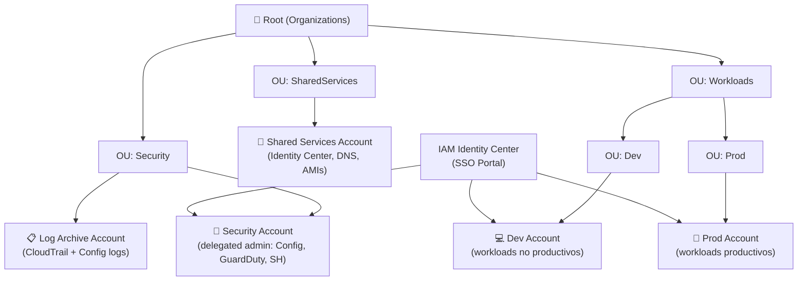

# Lab 01 — Security & Governance Multi-Cuenta (SAA-C03 + Security Specialty)

> **Región:** `eu-west-1` | **Presupuesto estimado:** ~15–20 € por sesión completa (8h)
> **Nivel:** Básico → Enterprise | **Duración estimada:** 6–8 horas en total

---

## Diagramas

| Diagrama | Descripción |
|----------|-------------|
| [lab01-governance-architecture.png](./lab01-governance-architecture.png) | Visión global de las 6 fases |
| [lab01-identity-center-flow.png](./lab01-identity-center-flow.png) | Flujo de acceso con Identity Center end-to-end |
| [lab01-logging-central.png](./lab01-logging-central.png) | Arquitectura de logging centralizado |

---

## Arquitectura objetivo



---

## Estructura del Lab

| Fase | Tema | Tiempo est. | Coste |
|------|------|-------------|-------|
| [Fase 0](./fase-00-diseno-objetivo.md) | Paper design: OUs, cuentas, SCPs objetivo | 30 min | Gratis |
| [Fase 1](./fase-01-organizations-cuentas.md) | Organizations + OUs + cuentas + delegated admin | 45 min | Gratis |
| [Fase 2](./fase-02-identity-center.md) | IAM Identity Center: permission sets + assignments | 45 min | Gratis |
| [Fase 3](./fase-03-scps-validacion.md) | SCPs: diseño, aplicación y validación | 45 min | Gratis |
| [Fase 4](./fase-04-logging-central.md) | CloudTrail org-level + S3 log archive + KMS | 60 min | ~$1 KMS/mes |
| [Fase 5](./fase-05-compliance-config.md) | Config recorder + aggregator + reglas gestionadas | 45 min | ~$1-2/Config |
| [Fase 6](./fase-06-secretos-operacion.md) | Secrets Manager + KMS + SSM Session Manager | 60 min | ~$1-2/mes |
| [Troubleshooting](./troubleshooting/01-troubleshooting-guide.md) | 12 escenarios de diagnóstico | Referencia | — |
| [Cleanup](./cleanup.md) | Borrado ordenado de todos los recursos | 30 min | Gratis |

---

## Costes estimados por servicio

| Servicio | Coste | Notas |
|----------|-------|-------|
| AWS Organizations | Gratis | — |
| IAM Identity Center | Gratis | — |
| SCPs | Gratis | — |
| CloudTrail (1 trail, management events) | Gratis | 1 trail gratuito por región |
| CloudTrail (data events) | ~$0.10/100k eventos | Evitar en lab o limitar |
| KMS CMK | $1/key/mes | Crear 2: log-archive + app-secrets |
| S3 (log bucket) | < $0.10 | Muy pocos datos en lab |
| AWS Config | $0.003/config item | ~$1-3 para un lab de 8h |
| Secrets Manager | $0.40/secreto/mes | 1 secreto = $0.40 |
| EC2 t3.micro | $0.0104/hora | ~$0.08 para lab 8h |
| SSM Session Manager | Gratis | — |
| **TOTAL estimado (sesión 8h)** | **~€8-15** | Apagar EC2 tras lab |

> ⚠️ **Aviso cuentas AWS:** Crear cuentas miembro en Organizations tiene implicaciones:
> - Cada cuenta necesita un email único (usar `+alias` de Gmail funciona: `tuemail+dev@gmail.com`)
> - Las cuentas no se pueden borrar inmediatamente (proceso: cerrar cuenta → 90 días)
> - Para el lab puedes trabajar con **2 cuentas** (management + dev) en lugar de 5
> - Las fases están diseñadas para funcionar con 1 sola cuenta adicional; el diseño completo es el objetivo conceptual

---

## Prerequisitos

- [ ] Cuenta AWS con acceso de administrador
- [ ] AWS CLI v2 configurado (`aws configure`)
- [ ] Permisos para crear Organizations, Identity Center, CloudTrail, Config, KMS
- [ ] Email alternativo para cuenta miembro (ej: `tuemail+lab-dev@gmail.com`)
- [ ] Facturación activada (para poder crear Organizations)

---

## Convención de nombres

```
Prefijo:  lab-sec-<recurso>
Tags:     Env=lab | Project=security-lab01 | Owner=<tu-usuario>
Región:   eu-west-1
```

---

## Archivos CLI

```
cli/
├── 00-env.sh              → variables de entorno y funciones comunes
├── 01-organizations.sh    → crear org, OUs, invitar/crear cuentas
├── 02-identity-center.sh  → habilitar IDC, permission sets, assignments
├── 03-scps.sh             → crear y aplicar SCPs
├── 04-logging-central.sh  → org CloudTrail + S3 log archive + KMS
├── 05-config.sh           → Config recorder + aggregator + reglas
├── 06-secretos-ssm.sh     → Secrets Manager + EC2 + SSM Session Manager
└── 99-cleanup.sh          → cleanup ordenado completo
```
