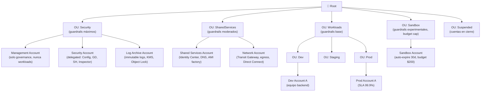
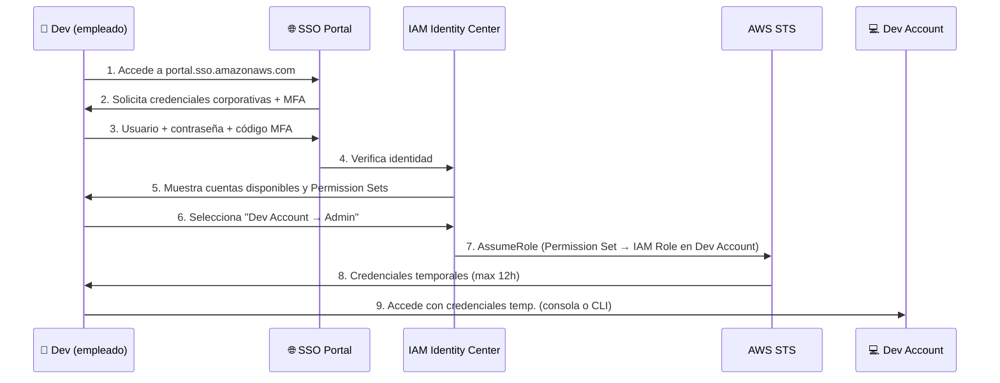
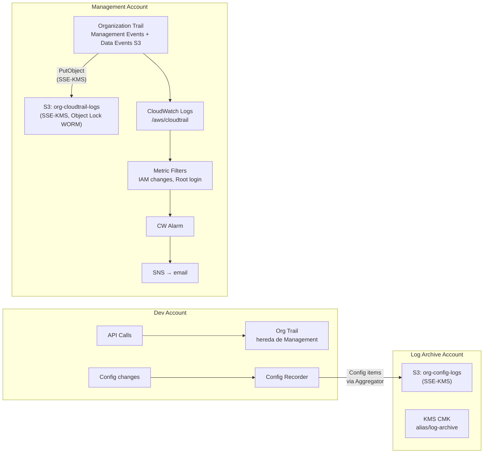

# Fase 0 — Diseño Objetivo (Paper Design)

> **Tiempo:** 30 min | **Coste:** Gratis | **Tipo:** Conceptual — sin recursos AWS

Esta fase es pura arquitectura en papel. Diseña la estructura antes de tocar la consola. En el mundo real esto se hace en una pizarra con el equipo de seguridad y el CTO.

---

## Expected Outcomes

- [ ] Estructura de OUs definida y justificada
- [ ] Lista de cuentas con propósito claro
- [ ] Catálogo de SCPs a implementar (con qué bloquean y en qué OU)
- [ ] Flujo de acceso de Identity Center documentado
- [ ] Decisiones de logging y compliance justificadas

---

## 0.1 Estructura de OUs



### Justificación de OUs

| OU | Propósito | SCPs aplicadas | Justificación |
|----|-----------|----------------|---------------|
| **Security** | Cuentas de control y auditoría | Mínimas (para que Security pueda hacer su trabajo) | Las cuentas de logs no deben estar limitadas para recibir logs de otras cuentas |
| **SharedServices** | Servicios centrales compartidos | Restricción de región, no root, no IAM Users | Infraestructura estable, cambios controlados |
| **Workloads/Dev** | Entornos de desarrollo | Deny prod resources, budget cap $500/mes | Devs necesitan libertad pero con límites de coste |
| **Workloads/Prod** | Entornos de producción | Deny regions except approved, deny disable trail, deny public S3 | Máxima restricción, solo lo necesario |
| **Sandbox** | Experimentación libre | Budget cap $200, deny PHI/PII services, deny expensive services | Seguridad de coste sin restricciones de funcionalidad |
| **Suspended** | Cuentas en proceso de cierre | Deny everything | Transición segura antes de cierre definitivo |

> **Principio clave:** Las SCPs de una OU se heredan a todas las OUs hijas y cuentas dentro. Una cuenta en `Workloads/Prod` hereda las SCPs de Root, Workloads Y Prod.

---

## 0.2 Cuentas Mínimas para el Lab

Para mantener el coste < 25€/mes, trabajamos con estructura reducida:

| Cuenta | Email | Propósito en lab | OU destino |
|--------|-------|-----------------|------------|
| **Management** | `tuemail@gmail.com` | Governance, Organizations root, billing | Root |
| **Log Archive** | `tuemail+logs@gmail.com` | CloudTrail + Config logs centralizados | Security OU |
| **Dev** | `tuemail+dev@gmail.com` | Workloads de lab (EC2, S3, etc.) | Workloads/Dev OU |

> ℹ️ Gmail acepta `+alias`: el mismo buzón recibe todos los emails. Úsalo para crear cuentas sin necesitar emails reales distintos.

---

## 0.3 Catálogo de SCPs Objetivo

### SCPs para TODAS las OUs (aplicadas en Root o en cada OU)

```
SCP-001: DenyLeaveOrganization
  → Acción denegada: organizations:LeaveOrganization
  → Por qué: ninguna cuenta puede salir de la org sin aprobación del Management Account
  → OU: Root (aplica a todos menos Management)

SCP-002: DenyDisableCloudTrail
  → Acciones denegadas: cloudtrail:StopLogging, cloudtrail:DeleteTrail, cloudtrail:UpdateTrail
  → Por qué: auditoría no puede desactivarse
  → OU: Root

SCP-003: DenyDisableConfig
  → Acciones denegadas: config:StopConfigurationRecorder, config:DeleteConfigurationRecorder
  → Por qué: compliance no puede interrumpirse
  → OU: Root

SCP-004: DenyRootAccountAPIUsage
  → Acción denegada: * (todas) con Condition: aws:PrincipalType = Root
  → Por qué: root user solo para emergencias de recuperación de cuenta
  → OU: Root
```

### SCPs para OU Prod (restrictivas)

```
SCP-005: DenyRegionsExceptApproved
  → Acción denegada: * en regiones distintas de eu-west-1 y us-east-1
  → Excepciones: servicios globales (IAM, STS, Route53, CloudFront, Billing)
  → Por qué: datos de producción solo en regiones aprobadas (GDPR, compliance)

SCP-006: DenyS3PublicAccess
  → Acciones denegadas: s3:PutBucketPublicAccessBlock con RestrictPublicBuckets=false,
                         s3:PutBucketPolicy que permita Principal: *
  → Por qué: ningún bucket prod puede ser público

SCP-007: DenyCreateIAMUsersInMemberAccounts
  → Acciones denegadas: iam:CreateUser, iam:CreateAccessKey
  → Excepción: AWSControlTowerExecution role
  → Por qué: solo Identity Center, no IAM Users con credenciales permanentes
```

### SCPs para OU Sandbox (control de coste)

```
SCP-008: DenyExpensiveServices
  → Servicios denegados: redshift:*, emr:*, sagemaker:*, glacier:*
  → Por qué: sandbox no necesita servicios de alto coste

SCP-009: RequireTagging
  → Denegar creación de recursos sin tag Project (usando aws:RequestTag)
  → Por qué: trazabilidad de costes por proyecto
```

---

## 0.4 Flujo de Acceso — Identity Center



### Permission Sets a crear

| Permission Set | Policies adjuntas | Asignación |
|----------------|------------------|------------|
| `AdminAccess` | `AdministratorAccess` | Ops team → Management Account |
| `DevPowerUser` | `PowerUserAccess` + SSM + Secrets Manager | Dev team → Dev Account |
| `ReadOnlyAll` | `ReadOnlyAccess` + SecurityAudit | Security team → todas las cuentas |
| `BillingRead` | `Billing` (read-only) | Finance team → Management Account |
| `OpsSession` | SSM Session Manager + CloudWatch + Secrets Manager (custom) | Ops → Prod Account |

---

## 0.5 Estrategia de Logging



### Decisiones de logging

| Decisión | Elección | Por qué |
|----------|----------|---------|
| Tipo de trail | Organization Trail | Un solo trail cubre TODAS las cuentas automáticamente |
| Management Events | Activados | Gratis en el primer trail; cubre todas las API calls de control |
| Data Events | Solo S3 en Log Archive bucket | Los data events son caros; limitamos a lo crítico |
| Destino | S3 en Log Archive Account | Separación de cuentas = logs no modificables por cuenta Dev/Prod |
| Cifrado | SSE-KMS con CMK | Auditoría de quién lee los logs (kms:Decrypt en CloudTrail) |
| Inmutabilidad | S3 Object Lock (Governance Mode en lab, Compliance en prod) | Logs no pueden borrarse ni modificarse |
| Retención | 365 días logs activos + 7 años en S3 Glacier | Requisito típico GDPR/SOC2 |

---

## 0.6 Estrategia de Compliance

| Servicio | Regla/Config | Scope | Remediación |
|----------|-------------|-------|-------------|
| Config | `s3-bucket-public-read-prohibited` | Org-level | Manual alert → SSM Automation |
| Config | `encrypted-volumes` | Org-level | Manual alert |
| Config | `mfa-enabled-for-iam-console-access` | Org-level | Manual alert |
| Config | `rds-storage-encrypted` | Prod OU | Manual alert |
| Config | `vpc-flow-logs-enabled` | Prod OU | Auto-remediation via SSM |
| Config Aggregator | Org-level aggregator | Todas las cuentas | Vista unificada en Security Account |

---

## Checklist Fase 0

- [ ] Estructura de OUs documentada y compartida con el equipo
- [ ] Emails preparados para crear cuentas (`+alias`)
- [ ] Lista de SCPs revisada con el equipo legal/compliance
- [ ] Permission Sets definidos (quién accede a qué cuenta con qué permisos)
- [ ] Estrategia de logging aprobada (retención, cifrado, cuenta destino)
- [ ] Decisión tomada: ¿Control Tower o manual? (para lab → manual; para prod → Control Tower)

> **Decisión lab:** Usaremos Organizations + Identity Center + SCPs **manualmente** para entender cada pieza. Control Tower automatiza todo esto pero oculta los detalles. Entender el manual primero = entender Control Tower después.
