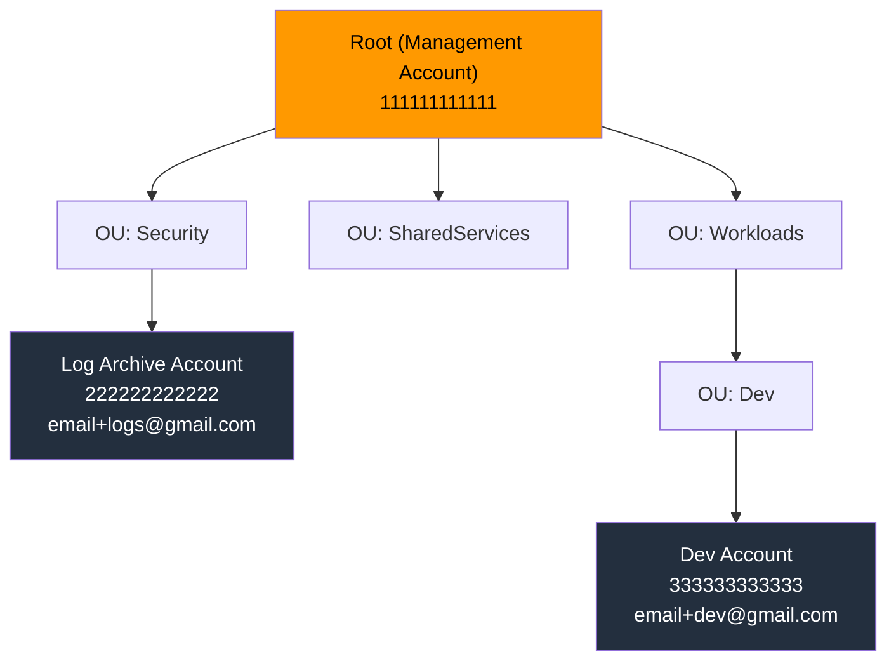

# Fase 1 — AWS Organizations + OUs + Cuentas + Delegated Admin

> **Tiempo:** 45 min | **Coste:** Gratis | **Prerequisito:** Cuenta AWS con facturación activada

---

## Expected Outcomes

- [ ] Organizations habilitado con Management Account
- [ ] 3 OUs creadas: Security, SharedServices, Workloads
- [ ] Al menos 1 cuenta miembro creada/invitada (Log Archive o Dev)
- [ ] Concepto de Management vs Member Account verificado
- [ ] Delegated Admin configurado para Config (conceptual si solo 1 cuenta miembro)

---

## Diagrama de la fase



---

## 1.1 Habilitar AWS Organizations

### Consola

1. Navegar a **AWS Organizations** → `https://console.aws.amazon.com/organizations`
2. Click **Create an organization**
3. Seleccionar **Enable all features** (no solo Consolidated Billing)
   > ⚠️ "All features" permite SCPs. "Consolidated Billing only" NO permite SCPs. Para el lab necesitas "All features".
4. Confirmar el email de la Management Account

### CLI

```bash
# Verificar si ya existe una organización
aws organizations describe-organization 2>/dev/null \
  && echo "Ya existe organización" \
  || aws organizations create-organization --feature-set ALL

# Ver el ID de la root
aws organizations list-roots --query 'Roots[0].Id' --output text
# Output: r-xxxx (guardar este ID)
ROOT_ID=$(aws organizations list-roots --query 'Roots[0].Id' --output text)
echo "Root ID: $ROOT_ID"
```

---

## 1.2 Crear OUs

### Consola

1. En Organizations → **AWS accounts** → seleccionar Root
2. Click **Actions** → **Create new organizational unit**
3. Crear en orden:
   - `Security`
   - `SharedServices`
   - `Workloads`
4. Dentro de `Workloads` → crear sub-OU `Dev`

### CLI

```bash
ROOT_ID=$(aws organizations list-roots --query 'Roots[0].Id' --output text)

# Crear OUs de primer nivel
OU_SECURITY=$(aws organizations create-organizational-unit \
  --parent-id $ROOT_ID \
  --name "Security" \
  --query 'OrganizationalUnit.Id' --output text)
echo "OU Security: $OU_SECURITY"

OU_SHARED=$(aws organizations create-organizational-unit \
  --parent-id $ROOT_ID \
  --name "SharedServices" \
  --query 'OrganizationalUnit.Id' --output text)

OU_WORKLOADS=$(aws organizations create-organizational-unit \
  --parent-id $ROOT_ID \
  --name "Workloads" \
  --query 'OrganizationalUnit.Id' --output text)

# Sub-OU dentro de Workloads
OU_DEV=$(aws organizations create-organizational-unit \
  --parent-id $OU_WORKLOADS \
  --name "Dev" \
  --query 'OrganizationalUnit.Id' --output text)
echo "OU Dev: $OU_DEV"

# Listar todas las OUs
aws organizations list-organizational-units-for-parent \
  --parent-id $ROOT_ID \
  --query 'OrganizationalUnits[*].[Name,Id]' \
  --output table
```

---

## 1.3 Crear Cuenta Miembro — Log Archive

### Consola

1. Organizations → **Add an AWS account** → **Create an AWS account**
2. Rellenar:
   - **Account name:** `lab-log-archive`
   - **Email:** `tuemail+logs@gmail.com`
   - **IAM role name:** `OrganizationAccountAccessRole` (mantener por defecto)
3. Esperar ~2-3 minutos hasta que el estado sea `Active`
4. Mover la cuenta a la OU Security:
   - Seleccionar la cuenta → **Actions** → **Move**
   - Seleccionar OU: Security

### CLI

```bash
# Crear cuenta (proceso asíncrono)
CREATE_STATUS=$(aws organizations create-account \
  --email "tuemail+logs@gmail.com" \
  --account-name "lab-log-archive" \
  --role-name "OrganizationAccountAccessRole" \
  --query 'CreateAccountStatus.Id' --output text)

echo "Request ID: $CREATE_STATUS"

# Esperar a que la cuenta esté activa (polling)
while true; do
  STATUS=$(aws organizations describe-create-account-status \
    --create-account-request-id $CREATE_STATUS \
    --query 'CreateAccountStatus.State' --output text)
  echo "Estado: $STATUS"
  [[ "$STATUS" == "SUCCEEDED" ]] && break
  [[ "$STATUS" == "FAILED" ]] && echo "ERROR" && break
  sleep 10
done

# Obtener el Account ID de la nueva cuenta
LOGS_ACCOUNT_ID=$(aws organizations describe-create-account-status \
  --create-account-request-id $CREATE_STATUS \
  --query 'CreateAccountStatus.AccountId' --output text)
echo "Log Archive Account ID: $LOGS_ACCOUNT_ID"

# Mover a OU Security
aws organizations move-account \
  --account-id $LOGS_ACCOUNT_ID \
  --source-parent-id $ROOT_ID \
  --destination-parent-id $OU_SECURITY

# Verificar
aws organizations list-accounts-for-parent \
  --parent-id $OU_SECURITY \
  --query 'Accounts[*].[Name,Id,Status]' --output table
```

---

## 1.4 Acceder a la Cuenta Miembro (AssumeRole)

Cuando Organizations crea una cuenta miembro, crea automáticamente un rol `OrganizationAccountAccessRole` en ella, con trust policy que permite a la Management Account asumir ese rol.

### Consola

1. En Organizations → click en la cuenta `lab-log-archive`
2. Click **Access** (o ir a Switch Role)
3. Usar el Account ID de la cuenta miembro
4. Role name: `OrganizationAccountAccessRole`
5. Color: elige uno para distinguirla visualmente

### CLI — Asumir el rol de la cuenta miembro

```bash
# Asumir el rol de la cuenta Log Archive
LOGS_CREDS=$(aws sts assume-role \
  --role-arn "arn:aws:iam::${LOGS_ACCOUNT_ID}:role/OrganizationAccountAccessRole" \
  --role-session-name "lab-logs-session" \
  --query 'Credentials' --output json)

# Exportar credenciales temporales
export AWS_ACCESS_KEY_ID=$(echo $LOGS_CREDS | jq -r '.AccessKeyId')
export AWS_SECRET_ACCESS_KEY=$(echo $LOGS_CREDS | jq -r '.SecretAccessKey')
export AWS_SESSION_TOKEN=$(echo $LOGS_CREDS | jq -r '.SessionToken')

# Verificar que estamos en la cuenta correcta
aws sts get-caller-identity
# Output: debe mostrar el Account ID de Log Archive y el role OrganizationAccountAccessRole

# Volver a Management Account: unset de las variables
unset AWS_ACCESS_KEY_ID AWS_SECRET_ACCESS_KEY AWS_SESSION_TOKEN
aws sts get-caller-identity  # Ahora muestra Management Account
```

> **Señal SAA-C03:** El role `OrganizationAccountAccessRole` es la puerta de entrada cross-account desde la Management Account. Trust policy: permite a toda la Management Account asumir el rol (Principal: Management Account ID).

---

## 1.5 Verificar Estructura — Expected Outcomes

```bash
# Ver toda la jerarquía
aws organizations list-accounts \
  --query 'Accounts[*].[Name,Id,Status,JoinedMethod]' \
  --output table

# Ver cuentas en cada OU
echo "=== OU Security ==="
aws organizations list-accounts-for-parent \
  --parent-id $OU_SECURITY \
  --query 'Accounts[*].[Name,Id]' --output table

echo "=== OU Dev ==="
aws organizations list-accounts-for-parent \
  --parent-id $OU_DEV \
  --query 'Accounts[*].[Name,Id]' --output table
```

**Resultado esperado:**

```
=== OU Security ===
| lab-log-archive | 222222222222 |
=== OU Dev ===
(vacío por ahora)
```

---

## 1.6 Delegated Admin — Concepto y Configuración

**Qué es:** La Management Account puede delegar la administración de ciertos servicios AWS a una cuenta miembro. Así la cuenta Security puede gestionar Config, GuardDuty, Security Hub para toda la org sin necesitar acceso a la Management Account.

**Servicios que soportan delegated admin:**
- AWS Config
- Amazon GuardDuty
- AWS Security Hub
- Amazon Inspector
- AWS Macie
- IAM Access Analyzer

### Configurar delegated admin para Config (desde Management Account)

```bash
# Desde Management Account
# Primero habilitar AWS Config en ambas cuentas (se hace en Fase 5)
# Luego registrar la cuenta Security como delegated admin de Config:

aws organizations register-delegated-administrator \
  --account-id $SECURITY_ACCOUNT_ID \
  --service-principal config.amazonaws.com

# Verificar
aws organizations list-delegated-administrators \
  --service-principal config.amazonaws.com \
  --query 'DelegatedAdministrators[*].[Name,Id]' --output table
```

### Por qué importa (examen)

| Situación | Sin delegated admin | Con delegated admin |
|-----------|--------------------|--------------------|
| Ver compliance de todas las cuentas | Debes entrar a cada cuenta individualmente | Security Account tiene vista org-level |
| Activar GuardDuty en nueva cuenta | Ops must go to Management Account | Security Account lo gestiona |
| Respuesta a incidentes | Necesitas root/Management | Security Account tiene acceso de solo lectura |

> **Trampa examen:** Delegated admin NO da acceso administrativo total a la Management Account. Solo delega ese servicio específico. La Management Account sigue siendo la root.

---

## Troubleshooting Fase 1

| Síntoma | Causa probable | Fix |
|---------|---------------|-----|
| "Account creation failed" | Email ya en uso en otra cuenta AWS | Usar un email diferente (no reutilizar emails de cuentas cerradas) |
| No puedo mover cuenta de OU | La cuenta tiene una SCP que previene el movimiento | Verificar SCPs aplicadas; mover desde Management Account |
| AssumeRole a cuenta miembro falla | El rol no existe o trust policy incorrecta | Verificar que el rol `OrganizationAccountAccessRole` existe en la cuenta destino |
| "Feature set must be ALL" | Organizations creado en modo "Billing only" | No se puede cambiar a posterior; hay que recrear la org (proceso complejo) |
