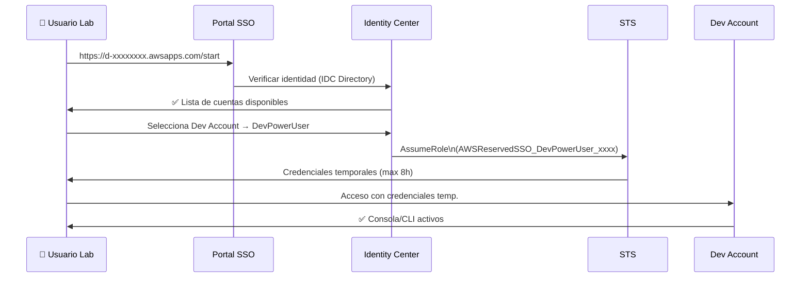

# Fase 2 — IAM Identity Center: Permission Sets y Acceso a Cuentas

> **Tiempo:** 45 min | **Coste:** Gratis | **Prerequisito:** Fase 1 completada (Organizations activo)

---

## Expected Outcomes

- [ ] IAM Identity Center habilitado en eu-west-1
- [ ] 4 Permission Sets creados: AdminAccess, DevPowerUser, ReadOnlyAll, OpsSession
- [ ] Al menos 1 usuario creado en el directorio de Identity Center
- [ ] Asignación verificada: usuario → permission set → cuenta Dev
- [ ] Login funcional via portal SSO y verificación del rol resultante

---

## Diagrama de la fase



---

## 2.1 Habilitar IAM Identity Center

> ⚠️ **Importante:** Identity Center debe habilitarse desde la **Management Account**. Solo existe una instancia por organización.

### Consola

1. En la Management Account → buscar **IAM Identity Center** (antes AWS SSO)
2. Click **Enable** → confirmar
3. Seleccionar región: **eu-west-1**
4. Anotar el **SSO Start URL**: `https://d-xxxxxxxxxx.awsapps.com/start`

### CLI

```bash
# Habilitar Identity Center (solo desde Management Account en us-east-1 o la región donde está el servicio)
# Identity Center es global pero se activa en una región
aws sso-admin list-instances 2>/dev/null || echo "Identity Center no activo aún"

# Tras habilitarlo manualmente en consola, obtener el instance ARN
IDC_INSTANCE_ARN=$(aws sso-admin list-instances \
  --query 'Instances[0].InstanceArn' --output text)
IDC_IDENTITY_STORE_ID=$(aws sso-admin list-instances \
  --query 'Instances[0].IdentityStoreId' --output text)

echo "Instance ARN: $IDC_INSTANCE_ARN"
echo "Identity Store ID: $IDC_IDENTITY_STORE_ID"
```

---

## 2.2 Crear Usuario en el Directorio de Identity Center

Para el lab usaremos el **directorio propio de Identity Center** (no AD ni IdP externo).

### Consola

1. Identity Center → **Users** → **Add user**
2. Rellenar:
   - Username: `lab-admin`
   - Email: `tuemail+labuser@gmail.com`
   - First name: `Lab`, Last name: `Admin`
3. Click **Send email invitation** (recibirás el email para establecer contraseña)
4. Crear también un usuario `lab-dev` para usar con el permission set de developer

### CLI

```bash
# Crear usuario en el Identity Store
aws identitystore create-user \
  --identity-store-id $IDC_IDENTITY_STORE_ID \
  --user-name "lab-admin" \
  --display-name "Lab Admin" \
  --name '{"FamilyName": "Admin", "GivenName": "Lab"}' \
  --emails '[{"Value": "tuemail+labuser@gmail.com", "Type": "work", "Primary": true}]'

aws identitystore create-user \
  --identity-store-id $IDC_IDENTITY_STORE_ID \
  --user-name "lab-dev" \
  --display-name "Lab Developer" \
  --name '{"FamilyName": "Developer", "GivenName": "Lab"}' \
  --emails '[{"Value": "tuemail+labdev@gmail.com", "Type": "work", "Primary": true}]'

# Listar usuarios
aws identitystore list-users \
  --identity-store-id $IDC_IDENTITY_STORE_ID \
  --query 'Users[*].[UserName,UserId]' --output table
```

---

## 2.3 Crear Permission Sets

### Permission Set 1: AdminAccess

```bash
ADMIN_PS=$(aws sso-admin create-permission-set \
  --instance-arn $IDC_INSTANCE_ARN \
  --name "AdminAccess" \
  --description "Acceso administrador completo — solo para cuenta management" \
  --session-duration "PT4H" \
  --query 'PermissionSet.PermissionSetArn' --output text)

# Adjuntar AWS managed policy
aws sso-admin attach-managed-policy-to-permission-set \
  --instance-arn $IDC_INSTANCE_ARN \
  --permission-set-arn $ADMIN_PS \
  --managed-policy-arn "arn:aws:iam::aws:policy/AdministratorAccess"

echo "AdminAccess PS ARN: $ADMIN_PS"
```

### Permission Set 2: DevPowerUser

```bash
DEV_PS=$(aws sso-admin create-permission-set \
  --instance-arn $IDC_INSTANCE_ARN \
  --name "DevPowerUser" \
  --description "PowerUser para entornos de desarrollo — sin IAM full" \
  --session-duration "PT8H" \
  --query 'PermissionSet.PermissionSetArn' --output text)

aws sso-admin attach-managed-policy-to-permission-set \
  --instance-arn $IDC_INSTANCE_ARN \
  --permission-set-arn $DEV_PS \
  --managed-policy-arn "arn:aws:iam::aws:policy/PowerUserAccess"

# Adjuntar managed policies adicionales
aws sso-admin attach-managed-policy-to-permission-set \
  --instance-arn $IDC_INSTANCE_ARN \
  --permission-set-arn $DEV_PS \
  --managed-policy-arn "arn:aws:iam::aws:policy/AmazonSSMFullAccess"
```

### Permission Set 3: ReadOnlyAll

```bash
RO_PS=$(aws sso-admin create-permission-set \
  --instance-arn $IDC_INSTANCE_ARN \
  --name "ReadOnlyAll" \
  --description "Lectura en todos los servicios — para equipo de seguridad y auditoría" \
  --session-duration "PT12H" \
  --query 'PermissionSet.PermissionSetArn' --output text)

aws sso-admin attach-managed-policy-to-permission-set \
  --instance-arn $IDC_INSTANCE_ARN \
  --permission-set-arn $RO_PS \
  --managed-policy-arn "arn:aws:iam::aws:policy/ReadOnlyAccess"

aws sso-admin attach-managed-policy-to-permission-set \
  --instance-arn $IDC_INSTANCE_ARN \
  --permission-set-arn $RO_PS \
  --managed-policy-arn "arn:aws:iam::aws:policy/SecurityAudit"
```

### Permission Set 4: OpsSession (custom — mínimo privilegio)

```bash
OPS_PS=$(aws sso-admin create-permission-set \
  --instance-arn $IDC_INSTANCE_ARN \
  --name "OpsSession" \
  --description "Acceso operativo mínimo: SSM Session Manager + CloudWatch + Secrets Manager" \
  --session-duration "PT4H" \
  --query 'PermissionSet.PermissionSetArn' --output text)

# Policy inline personalizada para el permission set
cat > /tmp/ops-inline-policy.json << 'EOF'
{
  "Version": "2012-10-17",
  "Statement": [
    {
      "Sid": "SSMSessionManager",
      "Effect": "Allow",
      "Action": [
        "ssm:StartSession",
        "ssm:TerminateSession",
        "ssm:ResumeSession",
        "ssm:DescribeSessions",
        "ssm:GetConnectionStatus",
        "ssm:DescribeInstanceProperties",
        "ec2:DescribeInstances"
      ],
      "Resource": "*"
    },
    {
      "Sid": "CloudWatchLogs",
      "Effect": "Allow",
      "Action": [
        "logs:DescribeLogGroups",
        "logs:DescribeLogStreams",
        "logs:GetLogEvents",
        "cloudwatch:GetMetricData",
        "cloudwatch:DescribeAlarms"
      ],
      "Resource": "*"
    },
    {
      "Sid": "SecretsManagerRead",
      "Effect": "Allow",
      "Action": ["secretsmanager:GetSecretValue", "secretsmanager:ListSecrets"],
      "Resource": "arn:aws:secretsmanager:eu-west-1:*:secret:lab/*"
    }
  ]
}
EOF

aws sso-admin put-inline-policy-to-permission-set \
  --instance-arn $IDC_INSTANCE_ARN \
  --permission-set-arn $OPS_PS \
  --inline-policy file:///tmp/ops-inline-policy.json
```

### Listar todos los permission sets

```bash
aws sso-admin list-permission-sets \
  --instance-arn $IDC_INSTANCE_ARN \
  --query 'PermissionSets' --output json | \
while read -r arn; do
  name=$(aws sso-admin describe-permission-set \
    --instance-arn $IDC_INSTANCE_ARN \
    --permission-set-arn "$arn" \
    --query 'PermissionSet.Name' --output text 2>/dev/null)
  echo "$name → $arn"
done
```

---

## 2.4 Asignar Permission Sets a Cuentas

Una asignación conecta: **[Usuario o Grupo]** + **[Permission Set]** + **[Cuenta AWS]**

### Obtener IDs necesarios

```bash
# ID del usuario lab-dev
LAB_DEV_USER_ID=$(aws identitystore list-users \
  --identity-store-id $IDC_IDENTITY_STORE_ID \
  --filter AttributePath=UserName,AttributeValue=lab-dev \
  --query 'Users[0].UserId' --output text)

LAB_ADMIN_USER_ID=$(aws identitystore list-users \
  --identity-store-id $IDC_IDENTITY_STORE_ID \
  --filter AttributePath=UserName,AttributeValue=lab-admin \
  --query 'Users[0].UserId' --output text)

echo "lab-dev ID: $LAB_DEV_USER_ID"
echo "lab-admin ID: $LAB_ADMIN_USER_ID"

# Account IDs (Management y Dev)
MGMT_ACCOUNT_ID=$(aws sts get-caller-identity --query Account --output text)
```

### Asignación: lab-dev → DevPowerUser → Dev Account

```bash
# Necesitamos el Dev Account ID (si ya lo creaste)
DEV_ACCOUNT_ID="333333333333"  # Reemplaza con tu Dev Account ID real

aws sso-admin create-account-assignment \
  --instance-arn $IDC_INSTANCE_ARN \
  --target-id $DEV_ACCOUNT_ID \
  --target-type AWS_ACCOUNT \
  --permission-set-arn $DEV_PS \
  --principal-type USER \
  --principal-id $LAB_DEV_USER_ID

echo "Asignación creada: lab-dev → DevPowerUser → Dev Account"
```

### Asignación: lab-admin → AdminAccess → Management Account

```bash
aws sso-admin create-account-assignment \
  --instance-arn $IDC_INSTANCE_ARN \
  --target-id $MGMT_ACCOUNT_ID \
  --target-type AWS_ACCOUNT \
  --permission-set-arn $ADMIN_PS \
  --principal-type USER \
  --principal-id $LAB_ADMIN_USER_ID
```

### Asignación: lab-dev → ReadOnlyAll → Management Account (auditoría)

```bash
aws sso-admin create-account-assignment \
  --instance-arn $IDC_INSTANCE_ARN \
  --target-id $MGMT_ACCOUNT_ID \
  --target-type AWS_ACCOUNT \
  --permission-set-arn $RO_PS \
  --principal-type USER \
  --principal-id $LAB_DEV_USER_ID
```

---

## 2.5 Verificar Login y Rol Resultante

### Verificación via consola

1. Abre una ventana de incógnito (para no interferir con la sesión actual)
2. Navega a la SSO Start URL: `https://d-xxxxxxxx.awsapps.com/start`
3. Login con `lab-dev` y la contraseña que estableciste vía email
4. Deberías ver las cuentas disponibles:
   - Dev Account → DevPowerUser
   - Management Account → ReadOnlyAll
5. Click en "Management console" de Dev Account → DevPowerUser
6. En la consola, verifica el rol activo (esquina superior derecha)

### Verificación via CLI (AWS SSO login)

```bash
# Configurar un profile de SSO en ~/.aws/config
aws configure sso \
  --profile lab-dev-sso

# Seguir el wizard:
# SSO start URL: https://d-xxxxxxxx.awsapps.com/start
# SSO Region: eu-west-1
# Seleccionar cuenta y permission set

# Usar el profile para verificar identidad
aws sts get-caller-identity --profile lab-dev-sso
```

**Output esperado:**

```json
{
  "UserId": "AROA....:lab-dev",
  "Account": "333333333333",
  "Arn": "arn:aws:sts::333333333333:assumed-role/AWSReservedSSO_DevPowerUser_xxxx/lab-dev"
}
```

> **Punto clave:** El ARN muestra `AWSReservedSSO_DevPowerUser_xxxx` — este es el IAM Role que Identity Center crea automáticamente en la cuenta destino cuando creas la asignación. El nombre empieza siempre por `AWSReservedSSO_`.

---

## 2.6 Verificar el Rol IAM Creado en la Cuenta Destino

Identity Center crea automáticamente un IAM Role en cada cuenta cuando creas una asignación. Verifícalo:

```bash
# Desde la Dev Account (usando el role de Organizations)
aws iam list-roles \
  --query 'Roles[?starts_with(RoleName, `AWSReservedSSO`)].[RoleName,Arn]' \
  --output table

# Ver la trust policy del rol (quién puede asumirlo)
aws iam get-role \
  --role-name "AWSReservedSSO_DevPowerUser_xxxx" \
  --query 'Role.AssumeRolePolicyDocument' \
  --output json
```

**Trust policy esperada:**

```json
{
  "Version": "2012-10-17",
  "Statement": [{
    "Effect": "Allow",
    "Principal": {
      "Federated": "arn:aws:iam::333333333333:saml-provider/AWSSSO_xxx"
    },
    "Action": ["sts:AssumeRoleWithSAML", "sts:TagSession"],
    "Condition": {
      "StringEquals": {
        "SAML:aud": "https://signin.aws.amazon.com/saml"
      }
    }
  }]
}
```

> **Señal examen:** El principal es un **SAML provider**, no una cuenta IAM. Identity Center usa SAML para federar la identidad y luego asume el rol. Por eso las credenciales son siempre temporales y el usuario nunca tiene una clave permanente.

---

## 2.7 ABAC con Identity Center (concepto avanzado)

ABAC (Attribute-Based Access Control) permite usar atributos del usuario de Identity Center como tags en la sesión, para crear policies IAM dinámicas.

### Configurar atributo de departamento

1. Identity Center → **Settings** → **Attributes for access control**
2. Añadir mapping: `Department` → `${user:department}`
3. En el usuario `lab-dev`: editar → añadir atributo `department=backend`

### Policy IAM que usa el atributo

```json
{
  "Version": "2012-10-17",
  "Statement": [{
    "Effect": "Allow",
    "Action": ["s3:GetObject", "s3:PutObject"],
    "Resource": "arn:aws:s3:::lab-app-*/${aws:PrincipalTag/department}/*"
  }]
}
```

> Un usuario del departamento `backend` solo puede acceder a `s3://lab-app-xxx/backend/`. Sin ABAC necesitarías un role por cada departamento.

---

## Checklist Fase 2

- [ ] Identity Center habilitado y SSO URL anotada
- [ ] 4 Permission Sets creados con las políticas correctas
- [ ] 2 usuarios creados (lab-admin, lab-dev) con contraseñas establecidas
- [ ] Asignaciones verificadas en consola Identity Center
- [ ] Login funcional via SSO portal (ventana incógnito)
- [ ] Verificado que el IAM Role creado en la cuenta empieza por `AWSReservedSSO_`
- [ ] `aws sts get-caller-identity` muestra el rol correcto en la cuenta destino
