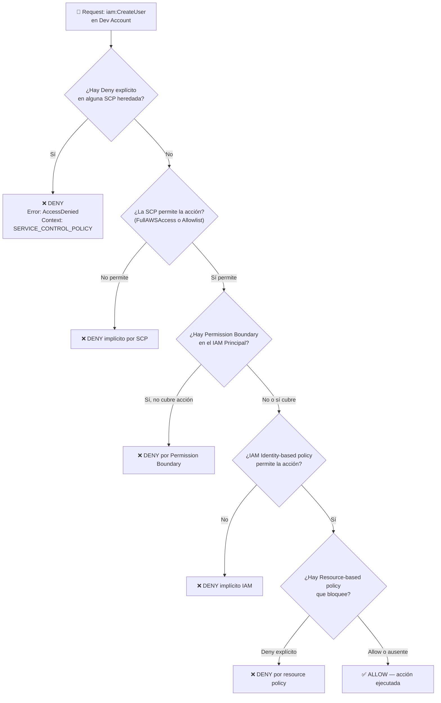

# Fase 3 — SCPs: Diseño, Aplicación y Validación

> **Tiempo:** 45 min | **Coste:** Gratis | **Prerequisito:** Fase 1 (Organizations con OUs)

---

## Expected Outcomes

- [ ] 3 SCPs creadas: DenyDisableCloudTrail, DenyRegions, DenyS3PublicAccess
- [ ] SCPs aplicadas a las OUs correctas
- [ ] Validación exitosa: acción bloqueada por SCP con error `AccessDenied` y contexto `SERVICE_CONTROL_POLICY`
- [ ] Comprensión del orden de evaluación de policies en multi-cuenta

---

## Diagrama — Flujo de evaluación de permisos



---

## 3.1 SCP-001: DenyDisableCloudTrail

Esta SCP evita que cualquier cuenta miembro desactive, elimine o modifique trails de CloudTrail.

```bash
# Desde Management Account
cat > /tmp/scp-deny-disable-cloudtrail.json << 'EOF'
{
  "Version": "2012-10-17",
  "Statement": [
    {
      "Sid": "DenyDisableCloudTrail",
      "Effect": "Deny",
      "Action": [
        "cloudtrail:StopLogging",
        "cloudtrail:DeleteTrail",
        "cloudtrail:UpdateTrail",
        "cloudtrail:RemoveTags",
        "cloudtrail:PutEventSelectors"
      ],
      "Resource": "*"
    }
  ]
}
EOF

# Crear la SCP en Organizations
SCP_TRAIL_ID=$(aws organizations create-policy \
  --name "SCP-DenyDisableCloudTrail" \
  --description "Previene desactivar o modificar CloudTrail en cuentas miembro" \
  --type SERVICE_CONTROL_POLICY \
  --content file:///tmp/scp-deny-disable-cloudtrail.json \
  --query 'Policy.PolicySummary.Id' --output text)

echo "SCP CloudTrail ID: $SCP_TRAIL_ID"

# Adjuntar a Root (aplica a TODAS las cuentas miembro excepto Management)
aws organizations attach-policy \
  --policy-id $SCP_TRAIL_ID \
  --target-id $ROOT_ID

echo "SCP adjuntada a Root"
```

> ⚠️ **Importante:** La Management Account NO está sujeta a SCPs. Si adjuntas esta SCP a Root, protege las cuentas miembro, pero la Management Account sigue pudiendo modificar trails.

---

## 3.2 SCP-002: DenyRegionsExceptApproved

Esta SCP restringe todas las acciones a solo eu-west-1, excluyendo servicios globales (IAM, STS, etc.).

```bash
cat > /tmp/scp-deny-regions.json << 'EOF'
{
  "Version": "2012-10-17",
  "Statement": [
    {
      "Sid": "DenyUnapprovedRegions",
      "Effect": "Deny",
      "NotAction": [
        "iam:*",
        "organizations:*",
        "account:*",
        "sts:*",
        "sso:*",
        "sso-admin:*",
        "identitystore:*",
        "cloudfront:*",
        "route53:*",
        "route53domains:*",
        "s3:GetBucketLocation",
        "s3:ListAllMyBuckets",
        "support:*",
        "billing:*",
        "ce:*",
        "cur:*",
        "budgets:*",
        "health:*"
      ],
      "Resource": "*",
      "Condition": {
        "StringNotEquals": {
          "aws:RequestedRegion": ["eu-west-1"]
        },
        "StringNotLike": {
          "aws:PrincipalARN": [
            "arn:aws:iam::*:role/AWSControlTowerExecution",
            "arn:aws:iam::*:role/OrganizationAccountAccessRole"
          ]
        }
      }
    }
  ]
}
EOF

SCP_REGIONS_ID=$(aws organizations create-policy \
  --name "SCP-DenyRegionsExceptEUWest1" \
  --description "Solo permite recursos en eu-west-1. Servicios globales exentos." \
  --type SERVICE_CONTROL_POLICY \
  --content file:///tmp/scp-deny-regions.json \
  --query 'Policy.PolicySummary.Id' --output text)

# Adjuntar solo a la OU Workloads (no a Security, que puede necesitar otras regiones)
aws organizations attach-policy \
  --policy-id $SCP_REGIONS_ID \
  --target-id $OU_WORKLOADS

echo "SCP Regions adjuntada a OU Workloads: $SCP_REGIONS_ID"
```

---

## 3.3 SCP-003: DenyS3PublicAccess

Esta SCP evita que cualquier bucket en cuentas de Workloads tenga acceso público.

```bash
cat > /tmp/scp-deny-s3-public.json << 'EOF'
{
  "Version": "2012-10-17",
  "Statement": [
    {
      "Sid": "DenyS3PublicAccessBlock",
      "Effect": "Deny",
      "Action": [
        "s3:PutBucketPublicAccessBlock"
      ],
      "Resource": "*",
      "Condition": {
        "StringEquals": {
          "s3:PublicAccessBlockConfiguration/RestrictPublicBuckets": "false"
        }
      }
    },
    {
      "Sid": "DenyS3ACLPublic",
      "Effect": "Deny",
      "Action": [
        "s3:PutBucketAcl",
        "s3:PutObjectAcl"
      ],
      "Resource": "*",
      "Condition": {
        "StringEquals": {
          "s3:x-amz-acl": ["public-read", "public-read-write", "authenticated-read"]
        }
      }
    }
  ]
}
EOF

SCP_S3_ID=$(aws organizations create-policy \
  --name "SCP-DenyS3PublicAccess" \
  --description "Previene configurar acceso público en buckets S3" \
  --type SERVICE_CONTROL_POLICY \
  --content file:///tmp/scp-deny-s3-public.json \
  --query 'Policy.PolicySummary.Id' --output text)

aws organizations attach-policy \
  --policy-id $SCP_S3_ID \
  --target-id $OU_WORKLOADS
```

---

## 3.4 Verificar SCPs Aplicadas

```bash
# Ver SCPs adjuntas a un OU
aws organizations list-policies-for-target \
  --target-id $OU_WORKLOADS \
  --filter SERVICE_CONTROL_POLICY \
  --query 'Policies[*].[Name,Id]' --output table

# Ver SCPs adjuntas a la Root
aws organizations list-policies-for-target \
  --target-id $ROOT_ID \
  --filter SERVICE_CONTROL_POLICY \
  --query 'Policies[*].[Name,Id]' --output table

# Listar TODAS las SCPs de la organización
aws organizations list-policies \
  --filter SERVICE_CONTROL_POLICY \
  --query 'Policies[*].[Name,Id,Description]' --output table
```

---

## 3.5 Validación — Demostrar que las SCPs bloquean

### Test 1: Intentar hacer `cloudtrail:StopLogging` desde cuenta Dev

```bash
# Desde la Dev Account (asumiendo el OrganizationAccountAccessRole o usando Identity Center)
# INTENTO: detener CloudTrail (debe ser DENEGADO por SCP-001)

# Primero necesitamos saber el ARN del trail (si existe alguno en la cuenta dev)
# Si no hay trail en dev, creamos uno temporal para el test:
TRAIL_ARN=$(aws cloudtrail create-trail \
  --name "test-trail-for-scp-validation" \
  --s3-bucket-name "un-bucket-cualquiera" \
  2>/dev/null | jq -r '.TrailARN' || echo "error al crear")

# Ahora intentar detenerlo (DEBE FALLAR con AccessDenied si SCP está activa)
aws cloudtrail stop-logging \
  --name "test-trail-for-scp-validation" 2>&1

# Output esperado si SCP funciona:
# An error occurred (AccessDenied) when calling the StopLogging operation:
# User: arn:aws:sts::333333333333:assumed-role/... is not authorized
# to perform: cloudtrail:StopLogging ... because no service control policy allows it
```

### Test 2: Intentar crear un recurso en us-east-1 (SCP-002)

```bash
# Desde la Dev Account, intentar crear bucket en us-east-1
aws s3api create-bucket \
  --bucket "test-scp-region-validation-$(date +%s)" \
  --region "us-east-1" \
  --create-bucket-configuration LocationConstraint=us-east-1 2>&1

# Output esperado:
# An error occurred (AccessDenied) ... because no service control policy allows it
```

### Test 3: Intentar hacer un bucket público (SCP-003)

```bash
# Crear un bucket en eu-west-1 (debe funcionar)
TEST_BUCKET="test-scp-s3-$(date +%s)"
aws s3api create-bucket \
  --bucket $TEST_BUCKET \
  --region eu-west-1 \
  --create-bucket-configuration LocationConstraint=eu-west-1

# Intentar desactivar el Block Public Access (DEBE FALLAR)
aws s3api put-public-access-block \
  --bucket $TEST_BUCKET \
  --public-access-block-configuration \
    BlockPublicAcls=false,IgnorePublicAcls=false,BlockPublicPolicy=false,RestrictPublicBuckets=false 2>&1

# Output esperado: AccessDenied por SCP
# Limpiar bucket de test
aws s3 rb s3://$TEST_BUCKET --force
```

---

## 3.6 Interpretar el Mensaje de Error de SCP

Cuando una SCP bloquea, el mensaje incluye información clave:

```
An error occurred (AccessDenied) when calling the StopLogging operation:
User: arn:aws:sts::333333333333:assumed-role/AWSReservedSSO_DevPowerUser_xxx/lab-dev
is not authorized to perform: cloudtrail:StopLogging on resource: arn:aws:cloudtrail:...
with an explicit deny in a service control policy
```

Partes del mensaje:
- `explicit deny in a service control policy` → confirma que es una SCP, no una IAM policy
- `assumed-role/AWSReservedSSO_DevPowerUser_xxx/lab-dev` → el usuario de Identity Center
- Cuenta `333333333333` → la cuenta Dev donde se intentó la acción

---

## 3.7 Diferencia entre SCP y Permission Boundary

| Aspecto | SCP | Permission Boundary |
|---------|-----|---------------------|
| Quién la aplica | Management Account / Organizations | Administrador dentro de una cuenta |
| A quién afecta | Toda la cuenta (todos los principals) | Un IAM User o Role específico |
| Puede otorgar permisos | NO | NO |
| Afecta a Management Account | NO | SÍ (si se adjunta a un rol allí) |
| Herencia | De OU padres a hijos | No hereda |
| Escenario típico | "Ninguna cuenta de Prod puede usar us-east-1" | "Este dev puede crear roles pero no darse más permisos de los que tiene" |

---

## 3.8 Control Tower vs SCPs Custom — Diferencia clave

| Aspecto | Control Tower Guardrails | SCPs Custom |
|---------|--------------------------|-------------|
| Cómo se crean | AWS las crea automáticamente | Tú las defines en JSON |
| Dónde se ven | Control Tower → Guardrails | Organizations → Policies |
| Son modificables | NO (solo enable/disable) | Sí, control total |
| Nomenclatura | `aws-guardrails-*` | Nombre que tú definas |
| Soporte | AWS las mantiene y actualiza | Responsabilidad tuya |
| Visibilidad | Dashboard de Control Tower | Organizations + CloudTrail |

> **Trampa examen:** Si ves una SCP con nombre `aws-guardrails-*` en Organizations → esa SCP fue creada por Control Tower. No la modifiques manualmente — usar el dashboard de Control Tower para gestionar guardrails preventivos.

---

## Checklist Fase 3

- [ ] 3 SCPs creadas y visibles en Organizations → Policies
- [ ] SCP-001 adjuntada a Root
- [ ] SCP-002 y SCP-003 adjuntadas a OU Workloads
- [ ] Test 1 verificado: `cloudtrail:StopLogging` devuelve `AccessDenied` con contexto SCP
- [ ] Test 2 verificado: crear recurso en us-east-1 devuelve `AccessDenied`
- [ ] Test 3 verificado: desactivar Block Public Access devuelve `AccessDenied`
- [ ] Mensaje de error de SCP analizado e interpretado correctamente
