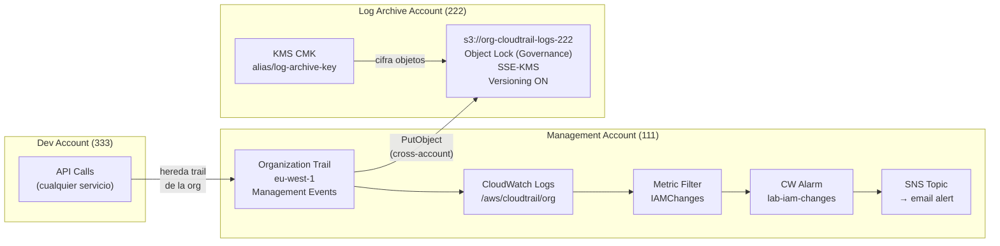

# Fase 4 — Logging y Auditoría Centralizada

> **Tiempo:** 60 min | **Coste:** ~€1-2 (1 KMS CMK/mes, S3 mínimo) | **Prerequisito:** Fases 1-3

---

## Expected Outcomes

- [ ] KMS CMK creada en Log Archive Account para cifrar logs
- [ ] S3 bucket en Log Archive Account con SSE-KMS, Object Lock y policy de acceso cross-account
- [ ] Organization Trail configurado en Management Account → entrega a Log Archive Account
- [ ] CloudTrail entregando a CloudWatch Logs (Management Account)
- [ ] Metric filter + Alarm para cambios en IAM
- [ ] Validación: encontrar un evento específico en S3 y en CloudWatch Logs

---

## Diagrama de la fase



---

## 4.1 Crear KMS CMK en Log Archive Account

> Ejecutar desde Log Archive Account (asumiendo el rol `OrganizationAccountAccessRole`)

```bash
# Asumir rol de Log Archive Account
LOGS_ACCOUNT_ID="222222222222"  # Reemplaza con tu Log Archive Account ID

aws sts assume-role \
  --role-arn "arn:aws:iam::${LOGS_ACCOUNT_ID}:role/OrganizationAccountAccessRole" \
  --role-session-name "lab-logs-setup" > /tmp/logs-creds.json

export AWS_ACCESS_KEY_ID=$(jq -r '.Credentials.AccessKeyId' /tmp/logs-creds.json)
export AWS_SECRET_ACCESS_KEY=$(jq -r '.Credentials.SecretAccessKey' /tmp/logs-creds.json)
export AWS_SESSION_TOKEN=$(jq -r '.Credentials.SessionToken' /tmp/logs-creds.json)

# Verificar cuenta
aws sts get-caller-identity

# Key Policy: permite a CloudTrail de la Management Account usar esta clave
MGMT_ACCOUNT_ID="111111111111"  # Reemplaza con tu Management Account ID

cat > /tmp/kms-log-key-policy.json << EOF
{
  "Version": "2012-10-17",
  "Statement": [
    {
      "Sid": "Enable IAM policies in Log Archive account",
      "Effect": "Allow",
      "Principal": {"AWS": "arn:aws:iam::${LOGS_ACCOUNT_ID}:root"},
      "Action": "kms:*",
      "Resource": "*"
    },
    {
      "Sid": "Allow CloudTrail from Management Account to use this key",
      "Effect": "Allow",
      "Principal": {"Service": "cloudtrail.amazonaws.com"},
      "Action": ["kms:GenerateDataKey*", "kms:DescribeKey"],
      "Resource": "*",
      "Condition": {
        "StringLike": {
          "kms:EncryptionContext:aws:cloudtrail:arn": "arn:aws:cloudtrail:*:${MGMT_ACCOUNT_ID}:trail/*"
        }
      }
    },
    {
      "Sid": "Allow Config from Management Account to use this key",
      "Effect": "Allow",
      "Principal": {"Service": "config.amazonaws.com"},
      "Action": ["kms:GenerateDataKey*", "kms:Decrypt"],
      "Resource": "*"
    }
  ]
}
EOF

KMS_LOG_KEY_ARN=$(aws kms create-key \
  --description "lab-log-archive: cifra logs de CloudTrail y Config org-level" \
  --region eu-west-1 \
  --policy file:///tmp/kms-log-key-policy.json \
  --query 'KeyMetadata.Arn' --output text)

aws kms create-alias \
  --alias-name "alias/lab-log-archive-key" \
  --target-key-id $KMS_LOG_KEY_ARN \
  --region eu-west-1

echo "KMS Log Archive Key ARN: $KMS_LOG_KEY_ARN"
```

---

## 4.2 Crear S3 Bucket en Log Archive Account

```bash
BUCKET_NAME="org-cloudtrail-logs-${LOGS_ACCOUNT_ID}"
REGION="eu-west-1"

# Crear bucket
aws s3api create-bucket \
  --bucket $BUCKET_NAME \
  --region $REGION \
  --create-bucket-configuration LocationConstraint=$REGION

# Activar versioning
aws s3api put-bucket-versioning \
  --bucket $BUCKET_NAME \
  --versioning-configuration Status=Enabled

# Activar Object Lock (Governance Mode para lab — Compliance para prod)
# NOTA: Object Lock requiere versioning y se activa al crear el bucket
# Si el bucket ya existe sin Object Lock, hay que recrearlo
aws s3api put-object-lock-configuration \
  --bucket $BUCKET_NAME \
  --object-lock-configuration '{
    "ObjectLockEnabled": "Enabled",
    "Rule": {
      "DefaultRetention": {
        "Mode": "GOVERNANCE",
        "Days": 365
      }
    }
  }' 2>/dev/null || echo "Object Lock puede requerir recrear el bucket — ver nota"

# Block Public Access (siempre)
aws s3api put-public-access-block \
  --bucket $BUCKET_NAME \
  --public-access-block-configuration \
    BlockPublicAcls=true,IgnorePublicAcls=true,\
BlockPublicPolicy=true,RestrictPublicBuckets=true

# SSE-KMS como cifrado por defecto
aws s3api put-bucket-encryption \
  --bucket $BUCKET_NAME \
  --server-side-encryption-configuration "{
    \"Rules\": [{
      \"ApplyServerSideEncryptionByDefault\": {
        \"SSEAlgorithm\": \"aws:kms\",
        \"KMSMasterKeyID\": \"${KMS_LOG_KEY_ARN}\"
      },
      \"BucketKeyEnabled\": true
    }]
  }"

echo "Bucket creado: $BUCKET_NAME"
```

### Bucket Policy — permitir a CloudTrail y Config escribir desde Management Account

```bash
cat > /tmp/s3-log-bucket-policy.json << EOF
{
  "Version": "2012-10-17",
  "Statement": [
    {
      "Sid": "DenyNonSSL",
      "Effect": "Deny",
      "Principal": "*",
      "Action": "s3:*",
      "Resource": [
        "arn:aws:s3:::${BUCKET_NAME}",
        "arn:aws:s3:::${BUCKET_NAME}/*"
      ],
      "Condition": {"Bool": {"aws:SecureTransport": "false"}}
    },
    {
      "Sid": "AllowCloudTrailACLCheck",
      "Effect": "Allow",
      "Principal": {"Service": "cloudtrail.amazonaws.com"},
      "Action": "s3:GetBucketAcl",
      "Resource": "arn:aws:s3:::${BUCKET_NAME}"
    },
    {
      "Sid": "AllowCloudTrailWrite",
      "Effect": "Allow",
      "Principal": {"Service": "cloudtrail.amazonaws.com"},
      "Action": "s3:PutObject",
      "Resource": "arn:aws:s3:::${BUCKET_NAME}/cloudtrail/AWSLogs/${MGMT_ACCOUNT_ID}/*",
      "Condition": {
        "StringEquals": {"s3:x-amz-acl": "bucket-owner-full-control"}
      }
    },
    {
      "Sid": "AllowCloudTrailOrgWrite",
      "Effect": "Allow",
      "Principal": {"Service": "cloudtrail.amazonaws.com"},
      "Action": "s3:PutObject",
      "Resource": "arn:aws:s3:::${BUCKET_NAME}/cloudtrail/AWSLogs/*",
      "Condition": {
        "StringEquals": {
          "s3:x-amz-acl": "bucket-owner-full-control",
          "aws:SourceArn": "arn:aws:cloudtrail:eu-west-1:${MGMT_ACCOUNT_ID}:trail/lab-org-trail"
        }
      }
    },
    {
      "Sid": "AllowConfigWrite",
      "Effect": "Allow",
      "Principal": {"Service": "config.amazonaws.com"},
      "Action": "s3:PutObject",
      "Resource": "arn:aws:s3:::${BUCKET_NAME}/config/AWSLogs/*",
      "Condition": {
        "StringEquals": {"s3:x-amz-acl": "bucket-owner-full-control"}
      }
    },
    {
      "Sid": "DenyDelete",
      "Effect": "Deny",
      "Principal": "*",
      "Action": ["s3:DeleteObject", "s3:DeleteBucket"],
      "Resource": [
        "arn:aws:s3:::${BUCKET_NAME}",
        "arn:aws:s3:::${BUCKET_NAME}/*"
      ]
    }
  ]
}
EOF

aws s3api put-bucket-policy \
  --bucket $BUCKET_NAME \
  --policy file:///tmp/s3-log-bucket-policy.json

echo "Bucket policy aplicada"
```

---

## 4.3 Crear Organization Trail en Management Account

```bash
# Volver a Management Account
unset AWS_ACCESS_KEY_ID AWS_SECRET_ACCESS_KEY AWS_SESSION_TOKEN
aws sts get-caller-identity  # Debe mostrar Management Account

# Crear CloudWatch Log Group para el trail
aws logs create-log-group \
  --log-group-name "/aws/cloudtrail/lab-org-trail" \
  --region eu-west-1

# Crear IAM Role para que CloudTrail pueda escribir en CloudWatch Logs
cat > /tmp/cloudtrail-cw-trust.json << 'EOF'
{
  "Version": "2012-10-17",
  "Statement": [{
    "Effect": "Allow",
    "Principal": {"Service": "cloudtrail.amazonaws.com"},
    "Action": "sts:AssumeRole"
  }]
}
EOF

aws iam create-role \
  --role-name "lab-cloudtrail-cloudwatch-role" \
  --assume-role-policy-document file:///tmp/cloudtrail-cw-trust.json

MGMT_ACCOUNT_ID=$(aws sts get-caller-identity --query Account --output text)

cat > /tmp/cloudtrail-cw-policy.json << EOF
{
  "Version": "2012-10-17",
  "Statement": [{
    "Effect": "Allow",
    "Action": ["logs:CreateLogStream", "logs:PutLogEvents"],
    "Resource": "arn:aws:logs:eu-west-1:${MGMT_ACCOUNT_ID}:log-group:/aws/cloudtrail/lab-org-trail:*"
  }]
}
EOF

aws iam put-role-policy \
  --role-name "lab-cloudtrail-cloudwatch-role" \
  --policy-name "CloudTrailToCloudWatch" \
  --policy-document file:///tmp/cloudtrail-cw-policy.json

CW_ROLE_ARN=$(aws iam get-role \
  --role-name "lab-cloudtrail-cloudwatch-role" \
  --query 'Role.Arn' --output text)

CW_LOG_GROUP_ARN=$(aws logs describe-log-groups \
  --log-group-name-prefix "/aws/cloudtrail/lab-org-trail" \
  --query 'logGroups[0].arn' --output text)

# Crear el Organization Trail
aws cloudtrail create-trail \
  --name "lab-org-trail" \
  --s3-bucket-name $BUCKET_NAME \
  --s3-key-prefix "cloudtrail" \
  --is-multi-region-trail \
  --include-global-service-events \
  --is-organization-trail \
  --kms-key-id $KMS_LOG_KEY_ARN \
  --cloud-watch-logs-log-group-arn $CW_LOG_GROUP_ARN \
  --cloud-watch-logs-role-arn $CW_ROLE_ARN \
  --region eu-west-1

# Activar el trail
aws cloudtrail start-logging --name "lab-org-trail"

# Verificar
aws cloudtrail get-trail-status --name "lab-org-trail" \
  --query '[IsLogging,LatestDeliveryTime,LatestCloudWatchLogsDeliveryTime]' \
  --output table
```

---

## 4.4 Crear Metric Filter y Alarma para Cambios en IAM

```bash
# Metric filter: detectar cambios en IAM (crear/modificar/borrar users, roles, policies)
aws logs put-metric-filter \
  --log-group-name "/aws/cloudtrail/lab-org-trail" \
  --filter-name "IAMChanges" \
  --filter-pattern '{ ($.eventName = CreateUser) || ($.eventName = DeleteUser) ||
    ($.eventName = CreateRole) || ($.eventName = DeleteRole) ||
    ($.eventName = AttachUserPolicy) || ($.eventName = DetachUserPolicy) ||
    ($.eventName = CreateAccessKey) || ($.eventName = DeleteAccessKey) }' \
  --metric-transformations \
    metricName=IAMChangesCount,metricNamespace=CloudTrailMetrics,metricValue=1

# Crear SNS Topic para alertas
SNS_TOPIC_ARN=$(aws sns create-topic \
  --name "lab-security-alerts" \
  --query 'TopicArn' --output text)

aws sns subscribe \
  --topic-arn $SNS_TOPIC_ARN \
  --protocol email \
  --notification-endpoint "tuemail@gmail.com"

echo "Confirma la suscripción en tu email antes de continuar"

# Crear alarma CloudWatch
aws cloudwatch put-metric-alarm \
  --alarm-name "lab-iam-changes" \
  --alarm-description "Alerta cuando se realizan cambios en IAM (SAA-C03 security pattern)" \
  --metric-name IAMChangesCount \
  --namespace CloudTrailMetrics \
  --statistic Sum \
  --period 300 \
  --evaluation-periods 1 \
  --threshold 1 \
  --comparison-operator GreaterThanOrEqualToThreshold \
  --alarm-actions $SNS_TOPIC_ARN \
  --treat-missing-data notBreaching

echo "Alarm creada: lab-iam-changes"
```

---

## 4.5 Validación — Encontrar un Evento en CloudTrail

### Opción 1: Buscar en CloudWatch Logs

```bash
# Buscar eventos de CloudTrail en CloudWatch Logs (últimos 30 min)
aws logs filter-log-events \
  --log-group-name "/aws/cloudtrail/lab-org-trail" \
  --start-time $(($(date +%s) - 1800))000 \
  --filter-pattern '{ $.eventName = "CreateUser" }' \
  --query 'events[*].message' \
  --output text | jq '.' 2>/dev/null | head -50

# Buscar eventos de IAM (cualquier cambio)
aws logs filter-log-events \
  --log-group-name "/aws/cloudtrail/lab-org-trail" \
  --start-time $(($(date +%s) - 3600))000 \
  --filter-pattern '{ $.eventSource = "iam.amazonaws.com" }' \
  --query 'events[*].message' \
  --output json | jq '.[] | fromjson | {eventTime, eventName, userIdentity.arn, responseElements}' 2>/dev/null
```

### Opción 2: Buscar directamente en CloudTrail

```bash
# Buscar eventos de los últimos 60 minutos
aws cloudtrail lookup-events \
  --lookup-attributes AttributeKey=EventName,AttributeValue=CreateUser \
  --start-time $(date -u -d '1 hour ago' +%Y-%m-%dT%H:%M:%SZ 2>/dev/null || \
                 date -u -v-1H +%Y-%m-%dT%H:%M:%SZ) \
  --query 'Events[*].[EventName,Username,EventTime]' \
  --output table

# Ver evento de AssumeRole (cuando Identity Center asume un rol)
aws cloudtrail lookup-events \
  --lookup-attributes AttributeKey=EventName,AttributeValue=AssumeRole \
  --max-results 5 \
  --query 'Events[*].[EventName,Username,EventTime,Resources[0].ResourceName]' \
  --output table
```

### Generar un evento para verificar (crear y borrar un usuario IAM test)

```bash
# Crear usuario de test para generar evento IAM (esto dispara la alarma)
aws iam create-user --user-name "test-cloudtrail-alarm-user" 2>/dev/null
sleep 5
aws iam delete-user --user-name "test-cloudtrail-alarm-user" 2>/dev/null

echo "Eventos generados. Espera 2-3 min y verifica en CloudWatch Logs y el email"
```

---

## 4.6 Verificar Logs en S3 (Log Archive Account)

```bash
# Listar los logs de CloudTrail en el bucket del Log Archive
aws s3 ls s3://$BUCKET_NAME/cloudtrail/AWSLogs/$MGMT_ACCOUNT_ID/CloudTrail/eu-west-1/ \
  --recursive 2>/dev/null | head -20

# Descargar y leer un archivo de log (formato JSON comprimido con gzip)
LOG_FILE=$(aws s3 ls \
  "s3://${BUCKET_NAME}/cloudtrail/AWSLogs/${MGMT_ACCOUNT_ID}/CloudTrail/eu-west-1/$(date +%Y/%m/%d)/" \
  2>/dev/null | awk 'NR==1{print $4}')

if [[ -n "$LOG_FILE" ]]; then
  aws s3 cp \
    "s3://${BUCKET_NAME}/cloudtrail/AWSLogs/${MGMT_ACCOUNT_ID}/CloudTrail/eu-west-1/$(date +%Y/%m/%d)/${LOG_FILE}" \
    /tmp/cloudtrail-sample.json.gz
  gunzip /tmp/cloudtrail-sample.json.gz
  jq '.Records[] | {eventTime, eventName, userIdentity.arn}' /tmp/cloudtrail-sample.json | head -30
fi
```

---

## Checklist Fase 4

- [ ] KMS CMK creada en Log Archive Account con key policy correcta
- [ ] S3 bucket creado con SSE-KMS, versioning, Block Public Access y bucket policy
- [ ] Organization Trail activo (`IsLogging: true`)
- [ ] Trail vinculado a CloudWatch Logs (verificado `LatestCloudWatchLogsDeliveryTime`)
- [ ] Metric filter `IAMChanges` creado en el Log Group
- [ ] Alarma `lab-iam-changes` activa y vinculada a SNS
- [ ] Suscripción email confirmada
- [ ] Evento de prueba generado (create+delete IAM user)
- [ ] Email de alerta recibido en < 5 minutos
- [ ] Logs de CloudTrail visibles en S3 del Log Archive Account
