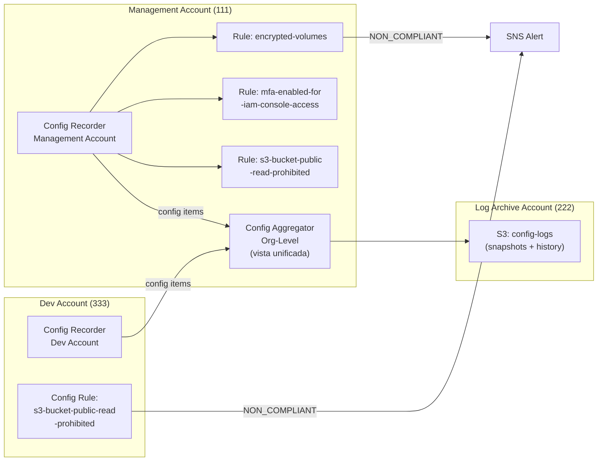

# Fase 5 — Compliance con AWS Config

> **Tiempo:** 45 min | **Coste:** ~€1-3 (Config charges per item) | **Prerequisito:** Fase 4

---

## Expected Outcomes

- [ ] Config Recorder activo en Management Account
- [ ] 3 reglas gestionadas activadas: S3 public access, EBS encrypted, MFA enabled
- [ ] Config Aggregator org-level configurado (conceptual si solo 1 cuenta)
- [ ] Non-compliant forzado y evaluación visible en consola
- [ ] Comprensión de la diferencia: Config (estado) vs CloudTrail (quién lo hizo)

---

## Diagrama de la fase



---

## 5.1 Habilitar AWS Config

> Ejecutar desde Management Account

### Consola

1. Buscar **AWS Config** en la consola
2. Click **Get started** o **Set up AWS Config**
3. Configurar:
   - **Recording**: All resources (incluyendo globales como IAM)
   - **S3 bucket**: especificar el bucket del Log Archive Account (`org-cloudtrail-logs-222/config/`)
   - **SNS topic**: seleccionar `lab-security-alerts` (creado en Fase 4)
   - **IAM Role**: crear rol nuevo `lab-config-recorder-role`
4. Click **Next** → **Next** → **Confirm**

### CLI

```bash
MGMT_ACCOUNT_ID=$(aws sts get-caller-identity --query Account --output text)
LOGS_ACCOUNT_ID="222222222222"
BUCKET_NAME="org-cloudtrail-logs-${LOGS_ACCOUNT_ID}"
SNS_TOPIC_ARN=$(aws sns list-topics \
  --query 'Topics[?contains(TopicArn,`lab-security-alerts`)].TopicArn' \
  --output text)

# Crear IAM Role para Config
cat > /tmp/config-trust.json << 'EOF'
{
  "Version": "2012-10-17",
  "Statement": [{
    "Effect": "Allow",
    "Principal": {"Service": "config.amazonaws.com"},
    "Action": "sts:AssumeRole"
  }]
}
EOF

aws iam create-role \
  --role-name "lab-config-recorder-role" \
  --assume-role-policy-document file:///tmp/config-trust.json

aws iam attach-role-policy \
  --role-name "lab-config-recorder-role" \
  --policy-arn "arn:aws:iam::aws:policy/service-role/AWS_ConfigRole"

CONFIG_ROLE_ARN=$(aws iam get-role \
  --role-name "lab-config-recorder-role" \
  --query 'Role.Arn' --output text)

# Configurar el recorder
aws configservice put-configuration-recorder \
  --configuration-recorder \
    name=default,roleARN=$CONFIG_ROLE_ARN \
  --recording-group \
    allSupported=true,includeGlobalResourceTypes=true

# Configurar delivery channel (dónde enviar los snapshots)
aws configservice put-delivery-channel \
  --delivery-channel \
    name=default,\
s3BucketName=${BUCKET_NAME},\
s3KeyPrefix=config,\
snsTopicARN=${SNS_TOPIC_ARN},\
configSnapshotDeliveryProperties={deliveryFrequency=TwentyFour_Hours}

# Iniciar el recorder
aws configservice start-configuration-recorder \
  --configuration-recorder-name default

# Verificar
aws configservice describe-configuration-recorder-status \
  --query 'ConfigurationRecordersStatus[0].[name,recording,lastStatus]' \
  --output table
```

---

## 5.2 Activar Reglas Gestionadas

### Regla 1: s3-bucket-public-read-prohibited

```bash
aws configservice put-config-rule \
  --config-rule '{
    "ConfigRuleName": "s3-bucket-public-read-prohibited",
    "Description": "Detecta buckets S3 con acceso público de lectura",
    "Source": {
      "Owner": "AWS",
      "SourceIdentifier": "S3_BUCKET_PUBLIC_READ_PROHIBITED"
    },
    "Scope": {
      "ComplianceResourceTypes": ["AWS::S3::Bucket"]
    }
  }'
```

### Regla 2: encrypted-volumes

```bash
aws configservice put-config-rule \
  --config-rule '{
    "ConfigRuleName": "encrypted-volumes",
    "Description": "Detecta volúmenes EBS sin cifrado",
    "Source": {
      "Owner": "AWS",
      "SourceIdentifier": "ENCRYPTED_VOLUMES"
    },
    "Scope": {
      "ComplianceResourceTypes": ["AWS::EC2::Volume"]
    }
  }'
```

### Regla 3: mfa-enabled-for-iam-console-access

```bash
aws configservice put-config-rule \
  --config-rule '{
    "ConfigRuleName": "mfa-enabled-for-iam-console-access",
    "Description": "Detecta usuarios IAM con acceso a consola pero sin MFA",
    "Source": {
      "Owner": "AWS",
      "SourceIdentifier": "MFA_ENABLED_FOR_IAM_CONSOLE_ACCESS"
    }
  }'

# Listar todas las reglas y su estado actual
aws configservice describe-config-rules \
  --query 'ConfigRules[*].[ConfigRuleName,ConfigRuleState]' \
  --output table
```

---

## 5.3 Config Aggregator — Nivel Organización

El Aggregator consolida el estado de compliance de TODAS las cuentas de la organización en un único punto de vista.

```bash
# Crear Aggregator org-level (desde Management Account)
aws configservice put-configuration-aggregator \
  --configuration-aggregator-name "lab-org-aggregator" \
  --organization-aggregation-source '{
    "RoleArn": "'$CONFIG_ROLE_ARN'",
    "AllAwsRegions": false,
    "AwsRegions": ["eu-west-1"]
  }'

# Verificar
aws configservice describe-configuration-aggregators \
  --query 'ConfigurationAggregators[*].[ConfigurationAggregatorName,CreationTime]' \
  --output table
```

> ℹ️ El aggregator necesita unos minutos para recoger el estado de todas las cuentas. En la consola se ve como un dashboard unificado de compliance.

---

## 5.4 Forzar un Non-Compliant (S3 Public Access)

### Paso 1: Crear bucket sin Block Public Access

```bash
# En Dev Account (usando Identity Center o AssumeRole)
TEST_BUCKET_NC="lab-noncompliant-test-$(date +%s)"

aws s3api create-bucket \
  --bucket $TEST_BUCKET_NC \
  --region eu-west-1 \
  --create-bucket-configuration LocationConstraint=eu-west-1

# DESACTIVAR Block Public Access (generará non-compliant)
# NOTA: Si la SCP de Fase 3 está activa en la Dev Account, esto fallará
# En ese caso, hacerlo en la Management Account donde la SCP no aplica
aws s3api put-public-access-block \
  --bucket $TEST_BUCKET_NC \
  --public-access-block-configuration \
    BlockPublicAcls=false,IgnorePublicAcls=false,\
BlockPublicPolicy=false,RestrictPublicBuckets=false

echo "Bucket non-compliant creado: $TEST_BUCKET_NC"
echo "Espera 2-5 minutos para que Config evalúe..."
```

### Paso 2: Forzar re-evaluación de la regla

```bash
aws configservice start-config-rules-evaluation \
  --config-rule-names "s3-bucket-public-read-prohibited"

sleep 10

# Ver resultado de compliance
aws configservice get-compliance-details-by-config-rule \
  --config-rule-name "s3-bucket-public-read-prohibited" \
  --compliance-types NON_COMPLIANT \
  --query 'EvaluationResults[*].[EvaluationResultIdentifier.EvaluationResultQualifier.ResourceId,ComplianceType]' \
  --output table
```

### Paso 3: Ver el estado completo de compliance

```bash
# Resumen de compliance por regla
aws configservice describe-compliance-by-config-rule \
  --query 'ComplianceByConfigRules[*].[ConfigRuleName,Compliance.ComplianceType]' \
  --output table

# Ver historial de cambios de configuración de un recurso
aws configservice get-resource-config-history \
  --resource-type AWS::S3::Bucket \
  --resource-id $TEST_BUCKET_NC \
  --limit 5 \
  --query 'configurationItems[*].[configurationItemCaptureTime,configurationItemStatus,resourceName]' \
  --output table
```

---

## 5.5 Diferencia Clave: Config vs CloudTrail

```
PREGUNTA: "¿Quién desactivó el Block Public Access del bucket X?"

Config → me dice QUÉ: el bucket tiene BlockPublicAcls=false (NON_COMPLIANT)
         me dice CUÁNDO cambió (configuration item timeline)
         NO me dice QUIÉN hizo el cambio

CloudTrail → me dice QUIÉN: el usuario arn:aws:iam::xxx:user/devA
             me dice QUÉ API call: s3:PutPublicAccessBlock
             me dice CUÁNDO: 2024-03-15T14:30:00Z
             NO evalúa si el resultado es compliant o no

Para responder a la pregunta completa, necesitas AMBOS:
  Config  → "el recurso está en estado non-compliant"
  CloudTrail → "el usuario X lo cambió a las 14:30"
```

---

## 5.6 Remediar el Non-Compliant

```bash
# Re-activar Block Public Access (remediar el non-compliant manualmente)
aws s3api put-public-access-block \
  --bucket $TEST_BUCKET_NC \
  --public-access-block-configuration \
    BlockPublicAcls=true,IgnorePublicAcls=true,\
BlockPublicPolicy=true,RestrictPublicBuckets=true

# Forzar re-evaluación
aws configservice start-config-rules-evaluation \
  --config-rule-names "s3-bucket-public-read-prohibited"

sleep 15

# Verificar que ahora es COMPLIANT
aws configservice get-compliance-details-by-config-rule \
  --config-rule-name "s3-bucket-public-read-prohibited" \
  --compliance-types COMPLIANT \
  --query 'EvaluationResults[*].[EvaluationResultIdentifier.EvaluationResultQualifier.ResourceId,ComplianceType]' \
  --output table

# Limpiar bucket de test
aws s3 rb s3://$TEST_BUCKET_NC --force
```

---

## Checklist Fase 5

- [ ] Config Recorder activo (`recording: true`, `lastStatus: SUCCESS`)
- [ ] 3 Config Rules creadas y en estado `ACTIVE`
- [ ] Config Aggregator org-level configurado
- [ ] Bucket non-compliant creado y detectado por la regla
- [ ] Estado cambiado de `NON_COMPLIANT` a `COMPLIANT` tras remediar
- [ ] Confirmado: Config muestra el estado, CloudTrail muestra quién lo cambió
