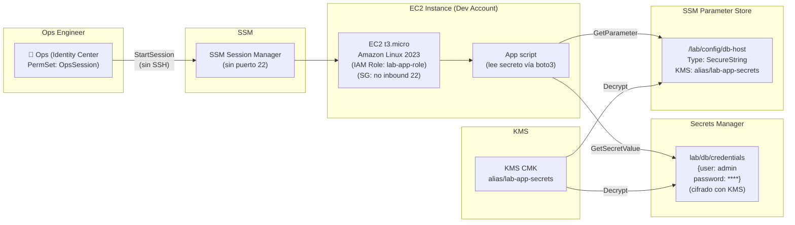

# Fase 6 — Secretos, Cifrado y Operación Segura

> **Tiempo:** 60 min | **Coste:** ~€1-2 (KMS + Secrets Manager + EC2 t3.micro) | **Prerequisito:** Fases 1-5

---

## Expected Outcomes

- [ ] KMS CMK para secretos de aplicación creada
- [ ] Secreto en Secrets Manager con credenciales ficticias cifradas con KMS
- [ ] Parámetros en SSM Parameter Store (SecureString con KMS)
- [ ] EC2 t3.micro con IAM Role de mínimo privilegio (solo puede leer secreto + SSM Session)
- [ ] Security Group sin puerto 22 abierto
- [ ] Acceso via SSM Session Manager verificado
- [ ] `kms:Decrypt` necesario verificado: sin él, el acceso al secreto falla

---

## Diagrama de la fase



---

## 6.1 Crear KMS CMK para Secretos de Aplicación

```bash
# En Dev Account (o Management Account para el lab)
ACCOUNT_ID=$(aws sts get-caller-identity --query Account --output text)

cat > /tmp/kms-app-key-policy.json << EOF
{
  "Version": "2012-10-17",
  "Statement": [
    {
      "Sid": "Enable IAM user permissions",
      "Effect": "Allow",
      "Principal": {"AWS": "arn:aws:iam::${ACCOUNT_ID}:root"},
      "Action": "kms:*",
      "Resource": "*"
    },
    {
      "Sid": "Allow EC2 IAM Role to Decrypt",
      "Effect": "Allow",
      "Principal": {"AWS": "arn:aws:iam::${ACCOUNT_ID}:role/lab-app-role"},
      "Action": ["kms:Decrypt", "kms:DescribeKey"],
      "Resource": "*"
    },
    {
      "Sid": "Allow Secrets Manager to use this key",
      "Effect": "Allow",
      "Principal": {"Service": "secretsmanager.amazonaws.com"},
      "Action": ["kms:GenerateDataKey*", "kms:Decrypt", "kms:DescribeKey"],
      "Resource": "*"
    }
  ]
}
EOF

KMS_APP_KEY_ARN=$(aws kms create-key \
  --description "lab-app-secrets: cifra secretos de aplicación en Secrets Manager y SSM" \
  --region eu-west-1 \
  --policy file:///tmp/kms-app-key-policy.json \
  --query 'KeyMetadata.Arn' --output text)

aws kms create-alias \
  --alias-name "alias/lab-app-secrets" \
  --target-key-id $KMS_APP_KEY_ARN

echo "KMS App Secrets Key ARN: $KMS_APP_KEY_ARN"
```

> ⚠️ **Nota:** La key policy hace referencia al rol `lab-app-role` que crearemos en 6.3. Orden: primero la clave (con el ARN del rol), luego el rol. Si el rol no existe aún, AWS no valida el ARN en la key policy — se crea igualmente.

---

## 6.2 Crear Secreto en Secrets Manager

```bash
# Crear secreto con credenciales ficticias (lab)
SECRET_ARN=$(aws secretsmanager create-secret \
  --name "lab/db/credentials" \
  --description "Credenciales de base de datos para el lab (ficticias)" \
  --kms-key-id "alias/lab-app-secrets" \
  --secret-string '{"username":"lab_admin","password":"SuperSecretPass123!","host":"lab-db.cluster.eu-west-1.rds.amazonaws.com","port":5432,"dbname":"labdb"}' \
  --region eu-west-1 \
  --query 'ARN' --output text)

echo "Secret ARN: $SECRET_ARN"

# Verificar que está cifrado con KMS
aws secretsmanager describe-secret \
  --secret-id "lab/db/credentials" \
  --query '[Name,KmsKeyId,LastChangedDate]' \
  --output table
```

---

## 6.3 Crear SSM Parameter Store (SecureString)

```bash
# Crear parámetros de configuración
aws ssm put-parameter \
  --name "/lab/config/db-host" \
  --value "lab-db.cluster.eu-west-1.rds.amazonaws.com" \
  --type "SecureString" \
  --key-id "alias/lab-app-secrets" \
  --description "Host de la base de datos (SecureString, cifrado con KMS)" \
  --region eu-west-1

aws ssm put-parameter \
  --name "/lab/config/environment" \
  --value "development" \
  --type "String" \
  --description "Entorno de la aplicación (String, sin cifrar)" \
  --region eu-west-1

# Verificar
aws ssm describe-parameters \
  --parameter-filters "Key=Path,Values=/lab/config" \
  --query 'Parameters[*].[Name,Type,KeyId]' \
  --output table

# Leer el valor (descifrado automáticamente si tienes permisos kms:Decrypt)
aws ssm get-parameter \
  --name "/lab/config/db-host" \
  --with-decryption \
  --query 'Parameter.Value' --output text
```

---

## 6.4 Crear IAM Role para la Instancia EC2 (Mínimo Privilegio)

```bash
# Trust policy para EC2
cat > /tmp/ec2-trust.json << 'EOF'
{
  "Version": "2012-10-17",
  "Statement": [{
    "Effect": "Allow",
    "Principal": {"Service": "ec2.amazonaws.com"},
    "Action": "sts:AssumeRole"
  }]
}
EOF

aws iam create-role \
  --role-name "lab-app-role" \
  --assume-role-policy-document file:///tmp/ec2-trust.json \
  --description "Role para EC2 de lab: SSM Session Manager + Secrets Manager + CloudWatch"

# Policy 1: SSM Session Manager (sin esto, SSM no puede conectar)
aws iam attach-role-policy \
  --role-name "lab-app-role" \
  --policy-arn "arn:aws:iam::aws:policy/AmazonSSMManagedInstanceCore"

# Policy 2: Secrets Manager (solo el secreto específico)
cat > /tmp/app-secrets-policy.json << EOF
{
  "Version": "2012-10-17",
  "Statement": [
    {
      "Sid": "ReadSpecificSecret",
      "Effect": "Allow",
      "Action": ["secretsmanager:GetSecretValue", "secretsmanager:DescribeSecret"],
      "Resource": "${SECRET_ARN}"
    },
    {
      "Sid": "ReadSSMParameters",
      "Effect": "Allow",
      "Action": ["ssm:GetParameter", "ssm:GetParameters", "ssm:GetParametersByPath"],
      "Resource": "arn:aws:ssm:eu-west-1:${ACCOUNT_ID}:parameter/lab/config/*"
    },
    {
      "Sid": "DecryptKMSForSecrets",
      "Effect": "Allow",
      "Action": ["kms:Decrypt", "kms:DescribeKey"],
      "Resource": "${KMS_APP_KEY_ARN}",
      "Condition": {
        "StringEquals": {
          "kms:ViaService": [
            "secretsmanager.eu-west-1.amazonaws.com",
            "ssm.eu-west-1.amazonaws.com"
          ]
        }
      }
    },
    {
      "Sid": "CloudWatchLogs",
      "Effect": "Allow",
      "Action": ["logs:CreateLogGroup", "logs:CreateLogStream", "logs:PutLogEvents"],
      "Resource": "arn:aws:logs:eu-west-1:${ACCOUNT_ID}:log-group:/lab/*:*"
    }
  ]
}
EOF

aws iam put-role-policy \
  --role-name "lab-app-role" \
  --policy-name "lab-app-minimal-policy" \
  --policy-document file:///tmp/app-secrets-policy.json

# Crear Instance Profile
aws iam create-instance-profile --instance-profile-name "lab-app-profile"
aws iam add-role-to-instance-profile \
  --instance-profile-name "lab-app-profile" \
  --role-name "lab-app-role"

echo "IAM Role y Instance Profile creados"
```

> **Punto clave del examen:** `kms:ViaService` restringe el uso de KMS SOLO cuando la llamada viene vía Secrets Manager o SSM. La EC2 no puede llamar `kms:Decrypt` directamente — solo a través de esos servicios.

---

## 6.5 Lanzar EC2 con Security Group sin Puerto 22

```bash
# Crear Security Group SIN inbound SSH
VPC_ID=$(aws ec2 describe-vpcs \
  --filters Name=isDefault,Values=true \
  --query 'Vpcs[0].VpcId' --output text)

SG_ID=$(aws ec2 create-security-group \
  --group-name "lab-app-sg-no-ssh" \
  --description "SG para lab: SSM Session Manager, sin SSH inbound" \
  --vpc-id $VPC_ID \
  --query 'GroupId' --output text)

# Solo outbound HTTPS (necesario para SSM)
aws ec2 authorize-security-group-egress \
  --group-id $SG_ID \
  --protocol tcp --port 443 --cidr 0.0.0.0/0

# Verificar que NO hay inbound en puerto 22
aws ec2 describe-security-groups \
  --group-ids $SG_ID \
  --query 'SecurityGroups[0].IpPermissions' \
  --output json
# Output esperado: [] (sin reglas inbound)

# Buscar AMI de Amazon Linux 2023
AMI_ID=$(aws ec2 describe-images \
  --owners amazon \
  --filters \
    "Name=name,Values=al2023-ami-2023*-x86_64" \
    "Name=state,Values=available" \
  --query 'sort_by(Images,&CreationDate)[-1].ImageId' \
  --output text)

echo "AMI: $AMI_ID"

# Lanzar instancia
INSTANCE_ID=$(aws ec2 run-instances \
  --image-id $AMI_ID \
  --instance-type t3.micro \
  --iam-instance-profile Name=lab-app-profile \
  --security-group-ids $SG_ID \
  --metadata-options "HttpTokens=required,HttpEndpoint=enabled" \
  --tag-specifications \
    'ResourceType=instance,Tags=[{Key=Name,Value=lab-sec-app-01},{Key=Env,Value=lab},{Key=Project,Value=security-lab01}]' \
  --query 'Instances[0].InstanceId' --output text)

echo "Instancia lanzada: $INSTANCE_ID"
echo "Esperando a que esté running..."
aws ec2 wait instance-running --instance-ids $INSTANCE_ID
echo "Instancia running"
```

---

## 6.6 Acceso via SSM Session Manager (Sin SSH)

### Desde la consola

1. Navegar a **EC2** → **Instances** → seleccionar `lab-sec-app-01`
2. Click **Connect** → tab **Session Manager**
3. Click **Connect**
4. Se abre una terminal en el navegador — sin SSH, sin puerto 22

### Desde CLI

```bash
# Verificar que la instancia aparece en SSM Fleet Manager
aws ssm describe-instance-information \
  --query 'InstanceInformationList[?InstanceId==`'$INSTANCE_ID'`].[InstanceId,PingStatus,PlatformName,AgentVersion]' \
  --output table

# Esperar a que el agente SSM conecte (puede tardar 2-3 min)
# Si no aparece: ver Troubleshooting #9

# Iniciar sesión SSM
aws ssm start-session --target $INSTANCE_ID

# Dentro de la sesión SSM (shell en la instancia):
# whoami
# cat /etc/os-release
# curl http://169.254.169.254/latest/meta-data/instance-id
```

---

## 6.7 Verificar Acceso a Secretos desde la Instancia

```bash
# Dentro de la sesión SSM (o via send-command):
aws ssm send-command \
  --instance-ids $INSTANCE_ID \
  --document-name "AWS-RunShellScript" \
  --parameters 'commands=[
    "#!/bin/bash",
    "echo === Identidad del rol ===",
    "aws sts get-caller-identity 2>&1",
    "echo",
    "echo === Leer secreto desde Secrets Manager ===",
    "aws secretsmanager get-secret-value --secret-id lab/db/credentials --region eu-west-1 --query SecretString --output text 2>&1 | python3 -m json.tool",
    "echo",
    "echo === Leer parámetro SSM SecureString ===",
    "aws ssm get-parameter --name /lab/config/db-host --with-decryption --region eu-west-1 --query Parameter.Value --output text 2>&1",
    "echo",
    "echo === Intentar leer OTRO secreto (debe fallar) ===",
    "aws secretsmanager list-secrets --region eu-west-1 2>&1 | head -5"
  ]' \
  --region eu-west-1 \
  --query 'Command.CommandId' --output text

# Obtener resultado (esperar ~10s)
sleep 15
aws ssm get-command-invocation \
  --command-id $(aws ssm list-commands --filters Key=InstanceIds,Values=$INSTANCE_ID \
    --query 'Commands[0].CommandId' --output text) \
  --instance-id $INSTANCE_ID \
  --query '[StatusDetails,StandardOutputContent]' \
  --output text
```

**Resultado esperado:**

```
=== Identidad del rol ===
{"UserId": "AROA...", "Account": "...", "Arn": "arn:aws:iam::xxx:role/lab-app-role"}

=== Leer secreto desde Secrets Manager ===
{"username": "lab_admin", "password": "SuperSecretPass123!", ...}

=== Leer parámetro SSM SecureString ===
lab-db.cluster.eu-west-1.rds.amazonaws.com

=== Intentar leer OTRO secreto (debe fallar) ===
An error occurred (AccessDenied) ... not authorized to perform: secretsmanager:ListSecrets
```

---

## 6.8 Verificar que kms:Decrypt es Imprescindible

```bash
# DEMO: quitar kms:Decrypt del role policy y ver qué pasa

# Crear policy temporal SIN kms:Decrypt
cat > /tmp/app-no-kms-policy.json << EOF
{
  "Version": "2012-10-17",
  "Statement": [{
    "Effect": "Allow",
    "Action": ["secretsmanager:GetSecretValue"],
    "Resource": "${SECRET_ARN}"
  }]
}
EOF

aws iam put-role-policy \
  --role-name "lab-app-role" \
  --policy-name "lab-app-minimal-policy" \
  --policy-document file:///tmp/app-no-kms-policy.json

# Esperar unos segundos para que propaguen los permisos
sleep 10

# Intentar leer el secreto (DEBE FALLAR porque el secreto está cifrado con CMK)
aws ssm send-command \
  --instance-ids $INSTANCE_ID \
  --document-name "AWS-RunShellScript" \
  --parameters 'commands=["aws secretsmanager get-secret-value --secret-id lab/db/credentials --region eu-west-1 2>&1"]' \
  --region eu-west-1

# Output esperado:
# An error occurred (AccessDenied) when calling the GetSecretValue operation:
# Access to KMS is not allowed
```

Restaurar los permisos correctos:

```bash
aws iam put-role-policy \
  --role-name "lab-app-role" \
  --policy-name "lab-app-minimal-policy" \
  --policy-document file:///tmp/app-secrets-policy.json
echo "Permisos restaurados"
```

> **Conclusión verificada:** Si el secreto está cifrado con un KMS CMK, `secretsmanager:GetSecretValue` solo NO es suficiente. También necesitas `kms:Decrypt` en la key policy Y en la identity policy del rol.

---

## 6.9 Verificar IMDSv2 (Metadata Service Seguro)

```bash
# Verificar que la instancia usa IMDSv2 (configurado al lanzarla con HttpTokens=required)
aws ssm send-command \
  --instance-ids $INSTANCE_ID \
  --document-name "AWS-RunShellScript" \
  --parameters 'commands=[
    "# Intentar IMDSv1 (debe fallar con HttpTokens=required)",
    "curl -s http://169.254.169.254/latest/meta-data/instance-id 2>&1",
    "echo Exit: $?",
    "# Usar IMDSv2 correctamente (debe funcionar)",
    "TOKEN=$(curl -s -X PUT http://169.254.169.254/latest/api/token -H X-aws-ec2-metadata-token-ttl-seconds:21600)",
    "curl -s -H \"X-aws-ec2-metadata-token: $TOKEN\" http://169.254.169.254/latest/meta-data/instance-id"
  ]' \
  --region eu-west-1
```

> **Examen SAA-C03:** IMDSv2 evita el ataque SSRF (Server-Side Request Forgery) donde un atacante podría obtener las credenciales del role de EC2 a través de la metadata API v1. Con IMDSv2, se requiere un token TTL que el SSRF no puede obtener.

---

## Checklist Fase 6

- [ ] KMS CMK `alias/lab-app-secrets` creada con key policy correcta
- [ ] Secreto `lab/db/credentials` en Secrets Manager cifrado con KMS
- [ ] Parámetro `/lab/config/db-host` en SSM Parameter Store (SecureString)
- [ ] IAM Role `lab-app-role` con policy de mínimo privilegio + `kms:ViaService`
- [ ] EC2 t3.micro lanzada con Instance Profile y SG sin puerto 22
- [ ] Instancia visible en SSM Fleet Manager (`PingStatus: Online`)
- [ ] Sesión SSM activa (desde consola o CLI `start-session`)
- [ ] Secreto leído correctamente desde la instancia via SSM Run Command
- [ ] Verificado: sin `kms:Decrypt`, `GetSecretValue` falla con `AccessDenied`
- [ ] IMDSv2 verificado: v1 sin token falla, v2 con token funciona
