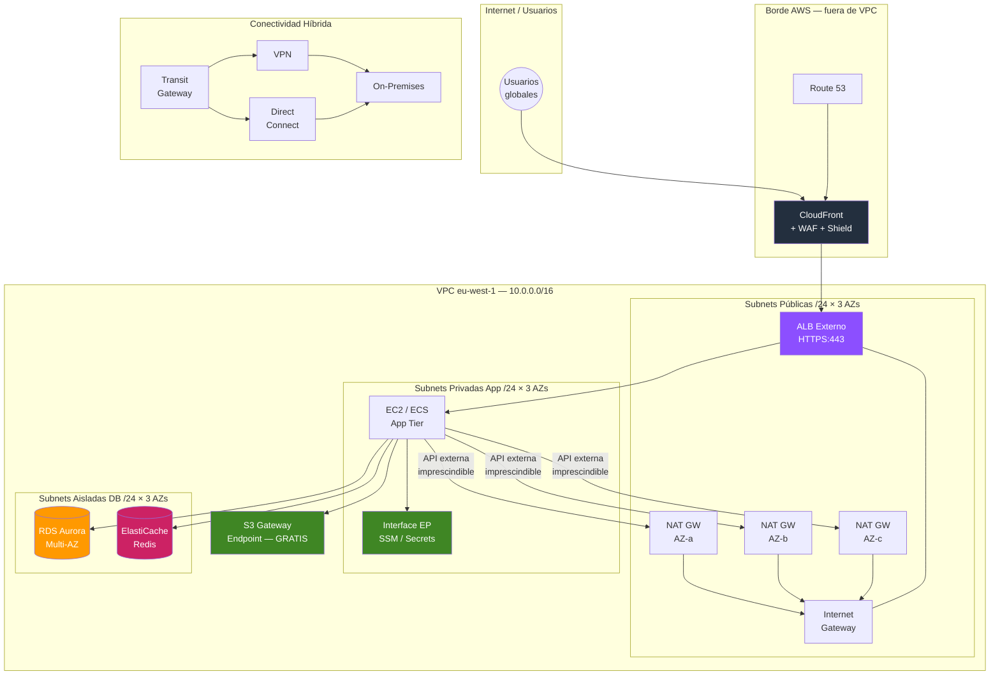
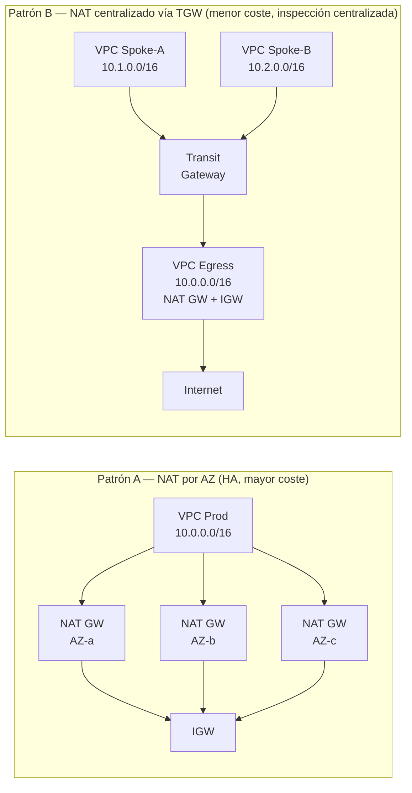
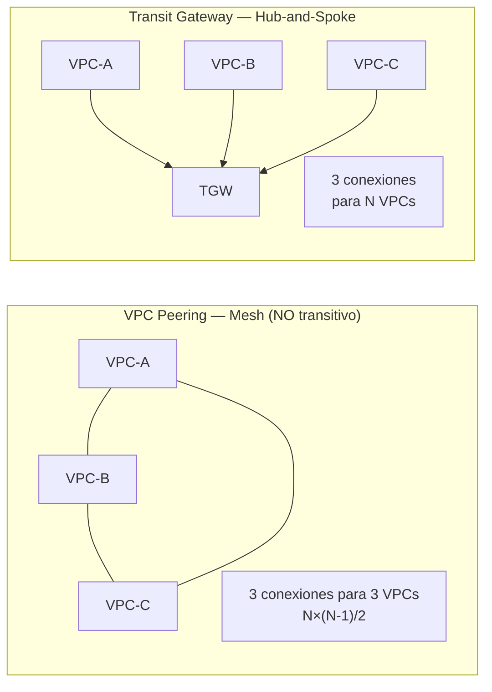

# AWS VPC — SA Associate: Mapa Conceptual Completo

> **Objetivo**: Dominar VPC desde los fundamentos hasta patrones de arquitectura empresarial.
> **Nivel**: AWS Solutions Architect Associate (SAA-C03).
> **Variables**: Región=`eu-west-1` | Tráfico=`500 RPS` | Requisito=`sin salida a internet salvo lo imprescindible`
> **Fuentes MCP**: AWS Documentation (flow-logs, NAT centralized egress, WAF/Shield, Lambda VPC)

---

## Índice

**Parte A** — [Mindmap jerárquico completo](#parte-a--mindmap-jerárquico-completo)
**Parte B** — [Diagramas Mermaid](#parte-b--diagramas-mermaid)

1. [¿Qué es una VPC y por qué existe?](#1-qué-es-una-vpc-y-por-qué-existe)
2. [Arquitectura interna y límites](#2-arquitectura-interna-y-límites)
3. [Subnets y planificación de CIDRs (+ errores típicos)](#3-subnets-y-planificación-de-cidrs--errores-típicos)
4. [Tablas de Rutas: el cerebro del routing](#4-tablas-de-rutas-el-cerebro-del-routing)
5. [Internet Gateway + Egress-only IGW (IPv6)](#5-internet-gateway--egress-only-igw-ipv6)
6. [NAT Gateway: por AZ vs centralizado](#6-nat-gateway-por-az-vs-centralizado)
7. [Security Groups vs NACLs (con tablas de reglas reales)](#7-security-groups-vs-nacls-con-tablas-de-reglas-reales)
8. [DNS en VPC: enableDnsSupport, Resolver y Private Hosted Zones](#8-dns-en-vpc-enablednssupport-resolver-y-private-hosted-zones)
9. [VPC Endpoints: Gateway, Interface y Endpoint Policies](#9-vpc-endpoints-gateway-interface-y-endpoint-policies)
10. [AWS PrivateLink](#10-aws-privatelink)
11. [Lambda en VPC: Hyperplane ENI y puntos clave](#11-lambda-en-vpc-hyperplane-eni-y-puntos-clave)
12. [Integraciones: ALB/NLB, RDS/Aurora, ElastiCache, ECS/Fargate](#12-integraciones-albnlb-rdsaurora-elasticache-ecsfargate)
13. [Borde: WAF, Shield y CloudFront vs controles dentro de VPC](#13-borde-waf-shield-y-cloudfront-vs-controles-dentro-de-vpc)
14. [Conectividad entre VPCs: Peering vs Transit Gateway](#14-conectividad-entre-vpcs-peering-vs-transit-gateway)
15. [Conectividad híbrida: Site-to-Site VPN vs Direct Connect](#15-conectividad-híbrida-site-to-site-vpn-vs-direct-connect)
16. [VPC Flow Logs: formato, destinos y troubleshooting](#16-vpc-flow-logs-formato-destinos-y-troubleshooting)
17. [Patrones arquitectónicos (2-tier, 3-tier, multi-AZ, egress)](#17-patrones-arquitectónicos-2-tier-3-tier-multi-az-egress)
18. [Coste y optimización](#18-coste-y-optimización)
19. [Seguridad y compliance](#19-seguridad-y-compliance)
20. [Mini-casos end-to-end: Fintech / E-Commerce / Healthcare](#20-mini-casos-end-to-end-fintech--e-commerce--healthcare)
21. [Exam Traps Associate (top 30)](#21-exam-traps-associate-top-30)

---

## Parte A — Mindmap jerárquico completo

```
AWS VPC (eu-west-1)
│
├── ESTRUCTURA LÓGICA
│   ├── VPC (bloque CIDR /16 típico)
│   │   ├── CIDRs secundarios (hasta 4 adicionales)
│   │   └── IPv6 opcional (/56 asignado por AWS o BYOIP)
│   ├── Subnet (una AZ, /24 típico para tier)
│   │   ├── Pública → route 0.0.0.0/0 → IGW
│   │   ├── Privada → route 0.0.0.0/0 → NAT GW
│   │   └── Aislada → sin ruta 0.0.0.0/0
│   └── Route Tables
│       ├── Main RT (default, no modificar)
│       └── Custom RT por tier (asociar explícitamente)
│
├── GATEWAYS DE SALIDA
│   ├── Internet Gateway (IGW)
│   │   ├── HA y managed por AWS, no tienes que escalar
│   │   ├── NAT 1:1 IP pública ↔ IP privada
│   │   └── 1 por VPC (límite no ajustable)
│   ├── NAT Gateway (IPv4 outbound de subnets privadas)
│   │   ├── Public: en subnet pública, usa EIP, sale a internet
│   │   ├── Private: en subnet privada, para tráfico entre VPCs
│   │   ├── Por AZ (HA real) vs centralizado vía TGW (coste)
│   │   └── Throughput: 5 Gbps → 100 Gbps auto
│   └── Egress-only IGW (IPv6 outbound ONLY)
│       ├── Análogo a NAT GW pero para IPv6
│       ├── Bloquea inbound IPv6 desde internet
│       └── Route: ::/0 → eigw-xxxx
│
├── FIREWALLS
│   ├── Security Group (stateful, ENI-level)
│   │   ├── Solo ALLOW (sin DENY explícito)
│   │   ├── Todas las reglas evaluadas simultáneamente
│   │   └── SG referencing: permite tráfico entre SGs (sin IPs)
│   └── NACL (stateless, subnet-level)
│       ├── ALLOW + DENY, evaluadas en orden (# más bajo primero)
│       ├── Requiere reglas INBOUND y OUTBOUND (puertos efímeros)
│       └── Default NACL: permite todo; Custom NACL: deniega todo
│
├── ACCESO A SERVICIOS AWS (sin salir a internet)
│   ├── Gateway Endpoint (gratis)
│   │   ├── Solo S3 y DynamoDB
│   │   └── Implementación: entrada en route table
│   ├── Interface Endpoint (PrivateLink, ~$7/AZ/mes)
│   │   ├── Todos los demás servicios (SSM, Secrets, ECR, SQS…)
│   │   └── Implementación: ENI con IP privada en subnet
│   └── Endpoint Policies
│       ├── Restricción de acceso a recursos específicos
│       └── Aplicadas al endpoint (no al recurso)
│
├── DNS
│   ├── VPC Resolver (base+2, ej: 10.0.0.2)
│   ├── enableDnsSupport → activa el resolver (default: true)
│   ├── enableDnsHostnames → asigna DNS a IPs públicas (default: false en custom VPC)
│   ├── Private Hosted Zones → DNS interno privado (asociar a múltiples VPCs)
│   └── Route 53 Resolver Endpoints
│       ├── Inbound → on-premises puede resolver dominios AWS
│       └── Outbound → VPC puede resolver dominios on-premises
│
├── CONECTIVIDAD VPC-TO-VPC
│   ├── VPC Peering (directo, no transitivo)
│   │   ├── Requiere rutas en AMBAS VPCs + SG update
│   │   └── Límite: 125 activos; sin overlapping CIDRs
│   └── Transit Gateway (hub-and-spoke, transitivo)
│       ├── Hasta 5.000 attachments
│       ├── TGW Route Tables propias (aislamiento entre entornos)
│       └── $0.05/h/attachment + $0.02/GB
│
├── CONECTIVIDAD HÍBRIDA
│   ├── Site-to-Site VPN
│   │   ├── IPSec, 2 túneles (HA), 1.25 Gbps/túnel
│   │   └── Customer GW + Virtual Private GW (o TGW attachment)
│   ├── Direct Connect (DX)
│   │   ├── Dedicated: 1G/10G/100G (directamente con AWS)
│   │   ├── Hosted: 50M-10G (vía AWS Partner)
│   │   ├── VIFs: Private (VPC), Public (servicios AWS), Transit (TGW)
│   │   └── DX Gateway → multi-región, sin routing VPC-to-VPC
│   └── Client VPN (trabajadores remotos, OpenVPN)
│
├── INTEGRACIONES CLAVE
│   ├── ALB/NLB → en subnets públicas (externo) o privadas (interno)
│   ├── RDS/Aurora → DB Subnet Group (subnets aisladas, ≥2 AZs)
│   ├── ElastiCache → Cache Subnet Group (subnets aisladas)
│   ├── ECS Fargate → ENI por task (awsvpc mode), IPs de subnet
│   └── Lambda en VPC
│       ├── Hyperplane ENI: compartida, no 1 ENI por invocación
│       ├── Sin internet aunque esté en subnet "pública"
│       └── Internet → necesita NAT GW; servicios AWS → Interface Endpoint
│
├── BORDE (FUERA DE VPC)
│   ├── CloudFront → CDN, termina SSL, cachea
│   ├── WAF → L7 (SQLi, XSS, bots, geo-block, rate limit)
│   │   ├── Adjunto a: CloudFront, ALB, API GW, AppSync
│   │   └── NO soportado en: NLB
│   └── Shield
│       ├── Standard → automático, gratis, L3/L4 DDoS
│       └── Advanced → $3.000/mes, L7, DRT 24/7, reembolso costes
│
├── VISIBILIDAD Y LOGS
│   └── VPC Flow Logs
│       ├── Captura metadatos (no contenido del paquete)
│       ├── Niveles: VPC / Subnet / ENI
│       ├── Destinos: CloudWatch Logs, S3, Kinesis Firehose
│       └── Formato: srcaddr, dstaddr, srcport, dstport, action (ACCEPT/REJECT)
│
└── COSTE
    ├── NAT GW: $0.045/h + $0.045/GB procesado (x3 AZs prod)
    ├── Interface Endpoint: $0.01/h/AZ + $0.01/GB
    ├── TGW: $0.05/h/attachment + $0.02/GB
    ├── Cross-AZ data: $0.01/GB (dentro de región)
    └── Optimización #1: Gateway Endpoint para S3/DynamoDB (GRATIS)
```

---

## Parte B — Diagramas Mermaid

### B.1 Arquitectura 3-Tier completa (eu-west-1, "sin internet innecesario")



---

### B.2 Egress patterns: NAT por AZ vs NAT centralizado vía TGW



---

### B.3 Peering vs TGW: topología



---

## 1. ¿Qué es una VPC y por qué existe?

Una **Virtual Private Cloud (VPC)** es una red virtual lógicamente aislada dentro de AWS. Es el fundamento de toda arquitectura — todos los recursos compute residen dentro de una VPC (salvo servicios globales: S3, DynamoDB, CloudFront).

### 1.1 Analogía del mundo real

```
Data Center Tradicional          AWS VPC
─────────────────────────        ─────────────────────────
Edificio físico          →       VPC (bloque CIDR)
Planta/Departamento      →       Subnet (una AZ)
Router central           →       Route Table
Firewall perimetral      →       Security Group + NACL
DMZ pública              →       Subnet pública + IGW
Zona segura interna      →       Subnet privada + NAT GW
Zona ultra-segura        →       Subnet aislada (sin internet)
Línea dedicada telco     →       Direct Connect
VPN corporativa          →       Site-to-Site VPN
```

### 1.2 Primitivos: tabla rápida de referencia

| Primitivo | Descripción | Alcance | Coste |
|-----------|-------------|---------|-------|
| **VPC** | Red virtual con CIDR IPv4/IPv6 | Regional | Gratis |
| **Subnet** | Segmento de red en una AZ | AZ | Gratis |
| **Route Table** | Reglas de routing | Subnet-level | Gratis |
| **IGW** | Salida/entrada internet IPv4 | VPC | Gratis |
| **Egress-only IGW** | Salida internet IPv6 only | VPC | Gratis |
| **NAT Gateway** | Salida internet subnets privadas | AZ-level | $0.045/h |
| **Security Group** | Firewall stateful por ENI | Recurso | Gratis |
| **NACL** | Firewall stateless por subnet | Subnet | Gratis |
| **VPC Endpoint** | Acceso privado a servicios AWS | VPC | Gateway gratis; Interface ~$7/AZ |
| **Peering** | Conexión directa entre VPCs | Par de VPCs | $0.01/GB |
| **Transit Gateway** | Hub conectividad multi-VPC | Regional | $0.05/h/attachment |

---

## 2. Arquitectura interna y límites

### 2.1 Estructura física dentro de la región

```
┌──────────────────────────────────────────────────────────────────────┐
│  REGIÓN: eu-west-1                                                    │
│  ┌────────────────────────────────────────────────────────────────┐  │
│  │  VPC: 10.0.0.0/16                         [máx 5 VPCs/región] │  │
│  │  ┌──────────────────┐  ┌──────────────────┐  ┌─────────────┐ │  │
│  │  │  AZ: eu-west-1a  │  │  AZ: eu-west-1b  │  │ eu-west-1c  │ │  │
│  │  │  ┌────────────┐  │  │  ┌────────────┐  │  │ ┌─────────┐ │ │  │
│  │  │  │ 10.0.1.0/24│  │  │  │ 10.0.2.0/24│  │  │ │10.0.3.0 │ │ │  │
│  │  │  │  (Pública) │  │  │  │  (Pública) │  │  │ │ /24 Pub │ │ │  │
│  │  │  └────────────┘  │  │  └────────────┘  │  │ └─────────┘ │ │  │
│  │  │  ┌────────────┐  │  │  ┌────────────┐  │  │ ┌─────────┐ │ │  │
│  │  │  │10.0.11.0/24│  │  │  │10.0.12.0/24│  │  │ │10.0.13.0│ │ │  │
│  │  │  │  (Privada) │  │  │  │  (Privada) │  │  │ │ /24 Pri │ │ │  │
│  │  │  └────────────┘  │  │  └────────────┘  │  │ └─────────┘ │ │  │
│  │  │  ┌────────────┐  │  │  ┌────────────┐  │  │ ┌─────────┐ │ │  │
│  │  │  │10.0.21.0/24│  │  │  │10.0.22.0/24│  │  │ │10.0.23.0│ │ │  │
│  │  │  │  (Aislada) │  │  │  │  (Aislada) │  │  │ │ /24 Ais │ │ │  │
│  │  │  └────────────┘  │  │  └────────────┘  │  │ └─────────┘ │ │  │
│  │  └──────────────────┘  └──────────────────┘  └─────────────┘ │  │
│  └────────────────────────────────────────────────────────────────┘  │
└──────────────────────────────────────────────────────────────────────┘
```

### 2.2 Límites de cuota (examen)

| Recurso | Defecto | Ajustable | Exam trap |
|---------|---------|-----------|-----------|
| VPCs por región | 5 | Sí | Pedir aumento por soporte |
| Subnets por VPC | 200 | Sí | |
| IPs reservadas por subnet | 5 | No | Las 5 siempre reservadas |
| IGW por VPC | 1 | No | No se puede tener más de 1 |
| SGs por ENI | 5 | Sí (hasta 16) | |
| Reglas por SG | 60 in + 60 out | Sí | |
| CIDRs secundarios por VPC | 4 | Sí | No se puede modificar el CIDR principal |

### 2.3 Las 5 IPs reservadas por subnet

```
Subnet 10.0.1.0/24 → 256 IPs totales, 251 disponibles

10.0.1.0   → Dirección de red
10.0.1.1   → VPC Router (el router de la VPC)
10.0.1.2   → DNS de la VPC (siempre base_VPC_CIDR + 2)
10.0.1.3   → Reservada por AWS (uso futuro)
10.0.1.255 → Broadcast (no soportado, reservado)
```

**Exam trap crítica**: Subnet /27 = 32 IPs - 5 = 27 disponibles. Si necesitas 28 hosts → necesitas /26 (64 IPs - 5 = 59 disponibles).

---

## 3. Subnets y planificación de CIDRs (+ errores típicos)

### 3.1 ¿Qué hace pública una subnet?

Una subnet es pública si y solo si **ambas** condiciones son ciertas:
1. Tiene la ruta `0.0.0.0/0 → IGW` en su route table
2. Los recursos tienen **IP pública** asignada (auto-assign o Elastic IP)

```
Con IGW en RT pero sin IP pública → recurso NO alcanzable desde internet
Sin IGW en RT pero con IP pública → recurso NO puede iniciar tráfico a internet
```

### 3.2 Los tres niveles de subnet

```
┌─────────────────┬────────────────────────────────────────────────────┐
│  SUBNET PÚBLICA │  RT: 0.0.0.0/0 → IGW                              │
│                 │  Recursos: ALB, NAT GW, Bastion (si aplica)        │
├─────────────────┼────────────────────────────────────────────────────┤
│  SUBNET PRIVADA │  RT: 0.0.0.0/0 → NAT GW (o sin ruta si endpoints) │
│                 │  Recursos: EC2, ECS Tasks, Lambda, RDS              │
│                 │  Sale a internet SOLO por actualizaciones o APIs    │
├─────────────────┼────────────────────────────────────────────────────┤
│  SUBNET AISLADA │  Sin ruta 0.0.0.0/0                                │
│  (database)     │  Recursos: RDS, ElastiCache, bases de datos        │
│                 │  Acceso solo desde la VPC o vía VPC Endpoints       │
└─────────────────┴────────────────────────────────────────────────────┘
```

### 3.3 Planificación de CIDRs (diseño canónico 3-tier)

```
VPC: 10.0.0.0/16  → 65.536 IPs — elegir /16 para dar margen
│
├── /20 Subnets públicas (4.096 IPs)
│   ├── 10.0.1.0/24   AZ-a pública   (251 disponibles)
│   ├── 10.0.2.0/24   AZ-b pública
│   └── 10.0.3.0/24   AZ-c pública
│
├── /20 Subnets privadas app (4.096 IPs)
│   ├── 10.0.11.0/24  AZ-a privada
│   ├── 10.0.12.0/24  AZ-b privada
│   └── 10.0.13.0/24  AZ-c privada
│
└── /20 Subnets aisladas DB (4.096 IPs)
    ├── 10.0.21.0/24  AZ-a DB
    ├── 10.0.22.0/24  AZ-b DB
    └── 10.0.23.0/24  AZ-c DB

Reservar 10.0.48.0/20 para crecimiento futuro (Lambda, endpoints, etc.)
```

### 3.4 Errores típicos de planificación CIDR

| Error | Consecuencia | Solución |
|-------|-------------|----------|
| VPC /24 (solo 256 IPs) | Sin margen para crecer, Lambda agota IPs | Usar /16 por defecto |
| Solapamiento con on-premises | Peering/VPN imposible | Planificar CIDRs antes con equipo de red |
| Subnets demasiado pequeñas (/28 = 11 IPs) | ECS/Lambda consumen IPs rápido | Mínimo /24 por subnet de workloads |
| No reservar espacio para endpoints | Interface Endpoints necesitan IPs en subnets | Reservar /24 por AZ para endpoints |
| CIDR primario elegido arbitrariamente | Conflictos con VPC Peering futuro | Documentar rangos usados en la organización |

---

## 4. Tablas de Rutas: el cerebro del routing

### 4.1 Evaluación: longest prefix match

El VPC router evalúa la ruta **más específica** primero:

```
Route Table — Subnet Privada App (con endpoint S3):
┌───────────────────────┬─────────────────────┬────────┐
│  Destination          │  Target             │ Status │
├───────────────────────┼─────────────────────┼────────┤
│  10.0.0.0/16          │  local              │ Active │  ← Tráfico VPC interno
│  pl-xxxxxxxx (S3 IPs) │  vpce-xxxxxxxxx     │ Active │  ← S3 via Gateway Endpoint
│  0.0.0.0/0            │  nat-xxxxxxxxx      │ Active │  ← Solo lo necesario a internet
└───────────────────────┴─────────────────────┴────────┘

Route Table — Subnet Aislada DB:
┌───────────────────────┬─────────────────────┬────────┐
│  Destination          │  Target             │ Status │
├───────────────────────┼─────────────────────┼────────┤
│  10.0.0.0/16          │  local              │ Active │  ← Solo tráfico VPC local
└───────────────────────┴─────────────────────┴────────┘
     ↑ Sin ruta a internet. DB NUNCA sale fuera de la VPC.
```

### 4.2 Main Route Table

- Cada VPC tiene una **Main RT** creada automáticamente (solo tiene la ruta `local`)
- Subnets sin asociación explícita usan la Main RT
- **Best practice**: no modificar la Main RT; crear route tables explícitas por tier

### 4.3 Propagación de rutas BGP

Para VPN y Direct Connect, habilitar **Route Propagation** en la RT. Las rutas del gateway se añaden automáticamente sin configuración manual.

---

## 5. Internet Gateway + Egress-only IGW (IPv6)

### 5.1 Internet Gateway (IPv4 bidireccional)

```
Internet  ←────────── IGW (NAT 1:1) ──────────────► Recurso en VPC
                       │
                       ├── IP Pública (EIP o auto-assigned) ↔ IP Privada
                       ├── Managed por AWS (HA, escala automática)
                       └── 1 por VPC (límite fijo)
```

**El IGW hace dos cosas**:
1. **Routing**: permite a los paquetes salir/entrar de la VPC
2. **NAT 1:1**: traduce IP privada ↔ IP pública (stateless)

### 5.2 Egress-only Internet Gateway (IPv6 outbound)

Para workloads con IPv6 en subnets privadas que necesitan salir a internet **sin** ser alcanzables desde fuera:

```
IPv6 privado de EC2 (fc00::/7)
    │
    ▼
Egress-only IGW ──────────────────────────────► Internet (IPv6)
    │
    └── Bloquea TODO tráfico inbound IPv6 iniciado desde internet
        (analogía: NAT para IPv4 privado, pero para IPv6)

Route Table configuración:
  ::/0  →  eigw-xxxxxxxxxx
```

**Diferencia IGW vs Egress-only IGW**:

| | Internet Gateway | Egress-only IGW |
|--|-----------------|-----------------|
| IPv4 | Sí (bidireccional) | No |
| IPv6 | Sí (bidireccional) | Solo outbound |
| Inbound IPv6 | Permitido | Bloqueado |
| Uso | Subnets públicas | Subnets privadas con IPv6 |
| Coste | Gratis | Gratis |

**Exam trap**: Si tienes una instancia con IPv6 en una subnet privada y necesitas que acceda a internet sin ser accesible desde fuera → Egress-only IGW (no IGW ni NAT GW).

---

## 6. NAT Gateway: por AZ vs centralizado

### 6.1 Flujo NAT (stateful)

```
EC2 Privada (10.0.11.5)      NAT GW (Subnet Pública)      Internet
        │                           │                          │
        │── src:10.0.11.5 ─────────►│                          │
        │   dst:api.stripe.com       │── src:EIP_NAT ──────────►│
        │                           │   dst:api.stripe.com      │
        │                           │◄── respuesta ─────────────│
        │◄── respuesta ─────────────│                           │
        │   src:api.stripe.com       │
        │   dst:10.0.11.5 (NAT recuerda la conexión)
```

### 6.2 Patrón A — NAT por AZ (HA real, producción)

```
AZ-a                    AZ-b                    AZ-c
┌─────────────────┐    ┌─────────────────┐    ┌─────────────────┐
│ Subnet Pública  │    │ Subnet Pública  │    │ Subnet Pública  │
│ NAT GW AZ-a     │    │ NAT GW AZ-b     │    │ NAT GW AZ-c     │
└────────┬────────┘    └────────┬────────┘    └────────┬────────┘
         │                      │                      │
┌────────▼────────┐    ┌────────▼────────┐    ┌────────▼────────┐
│ Subnet Privada  │    │ Subnet Privada  │    │ Subnet Privada  │
│  RT: 0.0.0.0/0  │    │  RT: 0.0.0.0/0  │    │  RT: 0.0.0.0/0  │
│  → NAT GW AZ-a  │    │  → NAT GW AZ-b  │    │  → NAT GW AZ-c  │
└─────────────────┘    └─────────────────┘    └─────────────────┘

Coste: 3× $0.045/h = ~$98/mes + $0.045/GB procesado por gateway
Si AZ falla: las otras 2 AZs siguen con internet (no hay cross-AZ)
```

### 6.3 Patrón B — NAT centralizado vía TGW (menor coste, inspección centralizada)

Basado en la arquitectura de AWS Whitepaper "Building a Scalable and Secure Multi-VPC AWS Network Infrastructure":

```
VPC-Spoke-A (10.1.0.0/16)
VPC-Spoke-B (10.2.0.0/16)        ← Múltiples VPCs (org con muchas cuentas)
VPC-Spoke-C (10.3.0.0/16)
         │ │ │
         ▼ ▼ ▼
   Transit Gateway
         │
         ▼
┌────────────────────────────────────────────────────────┐
│  VPC-Egress (10.0.0.0/16)                              │
│                                                         │
│  Subnet Privada → TGW Attachment (entrada desde spokes) │
│  Subnet Pública → 1 NAT GW por AZ → IGW → Internet     │
│                                                         │
│  (Opcional: AWS Network Firewall para inspección aquí)  │
└────────────────────────────────────────────────────────┘

Route Tables en TGW:
  RT-Spokes:     0.0.0.0/0 → VPC-Egress attachment
  RT-Egress:     10.1.0.0/16, 10.2.0.0/16, 10.3.0.0/16 → spoke attachments
```

### 6.4 Comparativa: por AZ vs centralizado

| Criterio | Por AZ | Centralizado (TGW) |
|----------|--------|-------------------|
| Coste | Alto (NAT GW × AZs × VPCs) | Un NAT GW set por org |
| Resiliencia | Muy alta (sin SPOF) | Depende de VPC-Egress |
| Inspección tráfico | No centralizada | Sí (añadir AWS Network Firewall) |
| Complejidad | Baja | Alta (TGW + routing) |
| Ideal para | 1-3 VPCs producción | Organizations con 10+ VPCs |

---

## 7. Security Groups vs NACLs (con tablas de reglas reales)

### 7.1 Diferencias fundamentales

```
                    NACL                    Security Group
                    ────                    ──────────────
Nivel           Subnet (todo el tráfico)    Recurso (ENI individual)
Estado          STATELESS                   STATEFUL
Reglas          ALLOW + DENY                Solo ALLOW (sin DENY explícito)
Evaluación      En orden (# más bajo)       Todas simultáneamente
Inbound/Out     Configurar AMBAS            Solo inbound (outbound auto)
Default         ALLOW todo (default NACL)   DENY todo (sin reglas)
Uso principal   Bloquear IPs malas, capas   Firewall granular por recurso
```

### 7.2 STATEFUL vs STATELESS en detalle

```
SECURITY GROUP (stateful):
  Cliente → SG permite TCP:443 inbound → EC2 recibe la petición
  EC2 → responde por puerto efímero (ej: 54321) → SG permite AUTOMÁTICAMENTE
  Solo necesitas la regla INBOUND 443

NACL (stateless — debes pensar en AMBAS direcciones):
  Cliente → NACL permite TCP:443 inbound → EC2 recibe la petición
  EC2 → responde por puerto efímero 54321 → NACL DEBE tener regla OUTBOUND 1024-65535
  Sin la regla OUTBOUND: la respuesta es bloqueada y la conexión falla
```

### 7.3 Tablas de reglas NACL reales (examen)

**NACL Subnet Pública — Inbound:**

| # Regla | Protocolo | Puerto | Origen | Acción |
|---------|-----------|--------|--------|--------|
| 100 | TCP | 443 | 0.0.0.0/0 | ALLOW |
| 110 | TCP | 80 | 0.0.0.0/0 | ALLOW |
| 120 | TCP | 1024-65535 | 0.0.0.0/0 | ALLOW |
| `*` | Todo | Todo | 0.0.0.0/0 | DENY |

*La regla 120 permite retorno de conexiones salientes del NAT GW y de recursos de la subnet.*

**NACL Subnet Pública — Outbound:**

| # Regla | Protocolo | Puerto | Destino | Acción |
|---------|-----------|--------|---------|--------|
| 100 | TCP | 8080 | 10.0.11.0/24 | ALLOW |
| 110 | TCP | 1024-65535 | 0.0.0.0/0 | ALLOW |
| `*` | Todo | Todo | 0.0.0.0/0 | DENY |

**NACL Subnet Privada App — Inbound:**

| # Regla | Protocolo | Puerto | Origen | Acción |
|---------|-----------|--------|--------|--------|
| 100 | TCP | 8080 | 10.0.1.0/24 | ALLOW |
| 110 | TCP | 1024-65535 | 0.0.0.0/0 | ALLOW |
| `*` | Todo | Todo | 0.0.0.0/0 | DENY |

**NACL Subnet Privada App — Outbound:**

| # Regla | Protocolo | Puerto | Destino | Acción |
|---------|-----------|--------|---------|--------|
| 100 | TCP | 443 | 0.0.0.0/0 | ALLOW |
| 110 | TCP | 3306 | 10.0.21.0/24 | ALLOW |
| 120 | TCP | 6379 | 10.0.21.0/24 | ALLOW |
| 130 | TCP | 1024-65535 | 10.0.1.0/24 | ALLOW |
| `*` | Todo | Todo | 0.0.0.0/0 | DENY |

### 7.4 Security Group Referencing

```
En lugar de IPs hardcodeadas, un SG referencia otro SG:

SG-ALB  → Inbound: 0.0.0.0/0:443
SG-APP  → Inbound: SG-ALB:8080        ← solo tráfico del ALB, sin IPs
SG-DB   → Inbound: SG-APP:3306/5432   ← solo tráfico de la app

Ventaja: el ALB puede cambiar de IPs sin actualizar el SG-APP
Cross-account: funciona si se habilita en el peering
```

### 7.5 Cuándo NACL es la respuesta

| Escenario | Herramienta |
|-----------|-------------|
| "Bloquear IP 1.2.3.4 específica" | NACL (DENY explícito) |
| "Bloquear tráfico de un país" | WAF (geoblocking L7) |
| "Controlar acceso a nivel de recurso" | Security Group |
| "Respuesta de firewall adicional en subnet" | NACL + SG (defense in depth) |

---

## 8. DNS en VPC: enableDnsSupport, Resolver y Private Hosted Zones

### 8.1 Configuración DNS en VPC

| Parámetro | Default VPC | Custom VPC | Qué controla |
|-----------|-------------|------------|--------------|
| `enableDnsSupport` | true | true | Activa el resolver DNS (base+2). Si false, sin resolución DNS en la VPC |
| `enableDnsHostnames` | true | **false** | Asigna nombres DNS a instancias con IP pública. Requerido para Interface Endpoints con Private DNS |

**Exam trap**: En VPCs custom, `enableDnsHostnames` está desactivado por defecto. Los Interface Endpoints con "Private DNS" requieren que **ambas** opciones estén en `true`.

### 8.2 El resolver VPC: base+2

```
VPC CIDR: 10.0.0.0/16  →  Resolver DNS: 10.0.0.2
VPC CIDR: 172.31.0.0/16 →  Resolver DNS: 172.31.0.2

También accesible como: 169.254.169.253 (link-local, cualquier VPC)

El resolver resuelve:
  - Nombres de recursos con IP pública en la VPC
  - Route 53 Private Hosted Zones asociadas a la VPC
  - Nombres DNS públicos (consulta a Route 53)
```

### 8.3 Route 53 Resolver Endpoints (DNS híbrido)

```
ESCENARIO: comunicación DNS bidireccional con on-premises

VPC
├── Inbound Endpoint (ENIs en subnets privadas, IPs: 10.0.11.10, 10.0.11.11)
│   └── On-premises → envía queries a estas IPs → se resuelven en AWS
│
└── Outbound Endpoint (ENIs en subnets privadas)
    └── VPC → queries para corp.local → se reenvían al DNS on-premises (192.168.1.53)

Forwarding Rules (Outbound):
  corp.local          → forward 192.168.1.53
  hospital.internal   → forward 192.168.1.53
  (resto)             → resuelto por Route 53 VPC Resolver
```

### 8.4 Private Hosted Zones (DNS interno)

```
Zona: services.internal (Private Hosted Zone, solo visible en VPCs asociadas)
  ├── api.services.internal          → 10.0.11.10
  ├── db.services.internal           → 10.0.21.5
  ├── cache.services.internal        → 10.0.21.20
  └── payments.services.internal     → 10.0.11.15

Asociación: múltiples VPCs (misma cuenta o cross-account vía RAM)
Beneficio: microservicios se llaman por nombre, sin hardcodear IPs
```

---

## 9. VPC Endpoints: Gateway, Interface y Endpoint Policies

### 9.1 ¿Por qué existen? El coste de ir por internet

```
Sin endpoint: EC2 (privada) → NAT GW ($0.045/h + $0.045/GB) → Internet → S3
Con endpoint: EC2 (privada) → Gateway Endpoint (GRATIS) → S3

Para 500 GB/mes de tráfico S3: ahorro de 500 × $0.045 = $22.50/mes por NAT GW
```

### 9.2 Gateway Endpoint

| Aspecto | Detalle |
|---------|---------|
| Servicios | **Solo S3 y DynamoDB** |
| Coste | **Gratis** |
| Implementación | Entrada en la route table (Managed Prefix List `pl-xxxxxx`) |
| DNS | No cambia (S3 URL normal funciona) |
| Alcance | Misma región |
| On-premises access | No (no es alcanzable desde VPN/DX) |

```
Route Table privada con Gateway Endpoint para S3:
  pl-68a54001 (S3 eu-west-1)  →  vpce-xxxxxxxxx  [ALLOW]
  0.0.0.0/0                   →  nat-xxxxxxxxx   [solo para lo que no sea S3]
```

### 9.3 Interface Endpoint (PrivateLink)

| Aspecto | Detalle |
|---------|---------|
| Servicios | Casi todos los servicios AWS + servicios de terceros |
| Coste | ~$0.01/h/AZ + $0.01/GB ≈ $7/mes/AZ |
| Implementación | ENI con IP privada en tu subnet |
| DNS | Private DNS override (el URL normal del servicio resuelve a la IP privada) |
| On-premises access | Sí (vía VPN o DX) |
| Cross-region | No nativo (requiere PrivateLink cross-region) |

**Servicios de Interface Endpoint típicos en producción**:

```
com.amazonaws.eu-west-1.ssm             → SSM Session Manager
com.amazonaws.eu-west-1.ssmmessages     → SSM Session Manager
com.amazonaws.eu-west-1.ec2messages     → SSM Session Manager
com.amazonaws.eu-west-1.secretsmanager  → Credenciales y secrets
com.amazonaws.eu-west-1.kms             → Operaciones KMS
com.amazonaws.eu-west-1.logs            → CloudWatch Logs
com.amazonaws.eu-west-1.monitoring      → CloudWatch Metrics
com.amazonaws.eu-west-1.ecr.api         → ECR (pull imágenes)
com.amazonaws.eu-west-1.ecr.dkr         → ECR (pull imágenes)
com.amazonaws.eu-west-1.sqs             → SQS (colas internas)
com.amazonaws.eu-west-1.sns             → SNS (notificaciones)
```

### 9.4 Endpoint Policies (control de acceso)

Los endpoints soportan **políticas IAM-like** para restringir qué recursos son accesibles:

```json
{
  "Statement": [{
    "Effect": "Allow",
    "Principal": "*",
    "Action": ["s3:GetObject", "s3:PutObject"],
    "Resource": [
      "arn:aws:s3:::mi-bucket-produccion",
      "arn:aws:s3:::mi-bucket-produccion/*"
    ]
  }]
}
```

**Caso de uso**: Gateway Endpoint de S3 que solo permite acceso al bucket de producción, bloqueando acceso accidental a otros buckets o exfiltración de datos.

---

## 10. AWS PrivateLink

### 10.1 Concepto

PrivateLink permite exponer un servicio de **tu VPC** a otras VPCs de forma privada, sin tráfico por internet ni peering.

```
Proveedor (VPC A)                         Consumidor (VPC B)
┌────────────────────┐                    ┌────────────────────┐
│                    │                    │                    │
│  NLB               ├── PrivateLink ────►│  Interface         │
│  (tu servicio)     │  (Endpoint         │  Endpoint          │
│                    │   Service)         │  (ENI: 10.x.x.x)  │
└────────────────────┘                    └────────────────────┘

El tráfico nunca sale de la red AWS.
No requiere overlapping CIDR check.
```

### 10.2 Casos de uso

| Caso | Descripción |
|------|-------------|
| **SaaS providers** | Empresa SaaS expone API a clientes en AWS sin peering |
| **Microservicios entre cuentas** | Equipo A expone servicio a equipo B sin dar acceso a toda la VPC |
| **AWS Marketplace** | Soluciones de terceros usan PrivateLink para conectar a tu VPC |
| **NLB para Interface Endpoint** | El target del PrivateLink debe ser un NLB |

---

## 11. Lambda en VPC: Hyperplane ENI y puntos clave

### 11.1 Cuándo poner Lambda en VPC

```
Lambda SIN VPC (por defecto):
  ✓ Accede a: S3, DynamoDB, SQS, SNS, API GW (servicios públicos)
  ✓ Sin latencia extra de ENI
  ✗ No puede acceder a: RDS privado, ElastiCache, EC2 privado

Lambda EN VPC:
  ✓ Accede a recursos privados (RDS, ElastiCache, EC2)
  ✓ Beneficia de NACLs y SGs de la VPC
  ✗ Sin internet por defecto (necesita NAT GW para internet)
  ✗ Sin acceso a S3 directo (necesita NAT GW o Gateway Endpoint)

REGLA: Pon Lambda en VPC SOLO si accede a recursos privados de la VPC.
```

### 11.2 Hyperplane ENI (desde 2019)

Antes de 2019, Lambda creaba 1 ENI por función-invocación → cold start alto, agotamiento de IPs.

**Hyperplane**: Las ENIs se crean una sola vez por combinación (VPC + Subnet + SG) y se comparten entre múltiples invocaciones concurrentes:

```
Antes (2018):                      Ahora (Hyperplane):
Lambda fn-A invoc-1 → ENI-1        Lambda fn-A/B/C comparten ENIs
Lambda fn-A invoc-2 → ENI-2        Hyperplane gestiona el pool
Lambda fn-B invoc-1 → ENI-3        1 ENI ≠ 1 invocación
→ Agotamiento de IPs rápido        → Mucho menor consumo de IPs
→ Cold start por ENI provisioning  → Cold start reducido significativamente
```

**Permisos IAM requeridos** para que Lambda cree ENIs:
```
ec2:CreateNetworkInterface
ec2:DescribeNetworkInterfaces
ec2:DeleteNetworkInterface
ec2:AssignPrivateIpAddresses
ec2:UnassignPrivateIpAddresses
```
Estos permisos están incluidos en la managed policy `AWSLambdaVPCAccessExecutionRole`.

### 11.3 Lambda en subnet pública: exam trap

```
Lambda en subnet PÚBLICA:
  ← El ALB/CloudFront puede llegar a Lambda ✓ (a través del VPC, no internet)
  → Lambda NO puede salir a internet ✗

  Por qué: Lambda en VPC no recibe IP pública auto-asignada.
  Para internet: necesitas NAT GW + route 0.0.0.0/0 → NAT GW en la subnet de Lambda

Conclusión: siempre poner Lambda en subnet PRIVADA (con NAT si necesita internet).
```

### 11.4 Consumo de IPs y tamaño de subnet

```
Con Hyperplane, el consumo es menor pero sigue siendo relevante:
  Máximo concurrencia Lambda: 1000 por defecto (ajustable)
  IPs reservadas por Hyperplane: ~6 ENIs iniciales por vpc-subnet-sg combo

  Para Lambda en producción: subnet /24 (251 IPs) es suficiente
  Cuidado: si tienes múltiples funciones en la misma subnet/SG, comparten ENIs
```

---

## 12. Integraciones: ALB/NLB, RDS/Aurora, ElastiCache, ECS/Fargate

### 12.1 ALB/NLB en VPC

```
ALB externo (internet-facing):
  ├── Se despliega en subnets PÚBLICAS (≥2 AZs)
  ├── Tiene IP pública por AZ
  └── Security Group: permite 0.0.0.0/0:443

ALB interno:
  ├── Se despliega en subnets PRIVADAS (≥2 AZs)
  ├── Solo IPs privadas
  └── Solo accesible desde dentro de la VPC o peering/TGW

NLB interno para PrivateLink:
  ├── Se despliega en subnets del proveedor
  └── El NLB es el destino del Endpoint Service
```

### 12.2 RDS / Aurora

```
RDS Subnet Group: colección de subnets en ≥2 AZs donde RDS puede desplegar instancias

Diseño correcto:
  DB Subnet Group → subnets AISLADAS (sin ruta a internet)
  ├── 10.0.21.0/24 (AZ-a)
  ├── 10.0.22.0/24 (AZ-b)
  └── 10.0.23.0/24 (AZ-c)

Security Group RDS:
  Inbound:  SG-APP:3306 (o 5432 para PostgreSQL)
  Outbound: vacío (RDS no inicia conexiones salientes)

RDS Multi-AZ: writer en AZ-a, standby en AZ-b (sincrónico)
  → El standby NO sirve lecturas (exam trap)
  → Para reads: usa RDS Read Replicas (async, distinto endpoint)
```

### 12.3 ElastiCache

```
ElastiCache Subnet Group: igual que RDS, subnets aisladas en ≥2 AZs
Redis Cluster Mode: shards distribuidos en múltiples AZs
Security Group ElastiCache:
  Inbound: SG-APP:6379 (Redis) o :11211 (Memcached)
```

### 12.4 ECS/Fargate en awsvpc mode

```
En awsvpc mode, CADA TASK ECS recibe:
  ├── Una ENI propia
  ├── Una IP privada de la subnet
  └── Un Security Group propio (granularidad por task)

Implicación crítica: si tu subnet tiene 251 IPs disponibles y
cada task usa 1 IP → máximo 251 tasks concurrentes en esa subnet.

Para ECS: usar subnets /23 (507 IPs) o /22 (1019 IPs) si escalas mucho.
Alternativa: múltiples subnets en el mismo AZ.
```

---

## 13. Borde: WAF, Shield y CloudFront vs controles dentro de VPC

### 13.1 El modelo de defensa en capas

```
Internet
    │
    ▼ ─────────────────────── FUERA DE VPC ───────────────────────────
    │
  Shield Standard (automático, gratis)
    → Detecta y mitiga ataques L3/L4: SYN flood, UDP reflection, volumétrico
    │
    ▼
  CloudFront (CDN global)
    → Termina SSL, cachea contenido, absorbe tráfico en edge
    │ + WAF asociado a CloudFront
    │   → SQLi, XSS, bots, rate limiting, geo-blocking
    │   → Managed Rule Groups (AWS o terceros)
    │
    ▼ ─────────────────────── DENTRO DE VPC ──────────────────────────
    │
  NACL (subnet-level, stateless, ALLOW + DENY)
    → Bloqueo de IPs maliciosas conocidas
    │
    ▼
  Security Group (recurso-level, stateful, solo ALLOW)
    → Control granular por puerto/protocolo/SG origen
    │
    ▼
  EC2 / ECS / Lambda (la aplicación)
    → IAM Roles, KMS cifrado, validación de input en código
```

### 13.2 WAF: dónde puede y no puede adjuntarse

| Recurso | WAF soportado |
|---------|--------------|
| CloudFront | Sí (ACL en us-east-1, global) |
| ALB | Sí (ACL regional) |
| API Gateway REST/HTTP | Sí |
| AppSync (GraphQL) | Sí |
| Cognito User Pool | Sí |
| **NLB** | **No** — NLB no soporta WAF |
| EC2 directo | No |

**Solución para NLB + WAF**: poner CloudFront delante del NLB (aunque NLB es L4, CloudFront puede hacer de proxy L7 y aplicar WAF).

### 13.3 Shield Standard vs Advanced

| | Shield Standard | Shield Advanced |
|--|-----------------|-----------------|
| Coste | Gratis | $3.000/mes + data transfer |
| Protección | L3/L4 (automática) | L3/L4/L7 |
| DRT (24/7) | No | Sí (equipo de respuesta) |
| Reembolso costes DDoS | No | Sí |
| Recursos protegidos | EC2, ELB, CloudFront, R53 (auto) | Amplía cobertura |
| Visibilidad avanzada | No | Sí (CloudWatch métricas) |

### 13.4 Cuándo usar CloudFront vs ir directo al ALB

```
Directo al ALB (sin CloudFront):
  Cuando: API sin cachear, latencia <10ms crítica, solo tráfico interno
  Riesgo: IP del ALB expuesta directamente, sin edge caching

Con CloudFront:
  Cuando: contenido cacheable, usuarios globales, protección DDoS robusta
  Benefit: IPs de ALB quedan ocultas (origin privado), Shield automático en edge

  Para proteger el ALB: configurar ALB para solo aceptar tráfico desde
  los rangos de IPs de CloudFront (managed prefix list: com.amazonaws.global.cloudfront.origin-facing)
```

---

## 14. Conectividad entre VPCs: Peering vs Transit Gateway

### 14.1 VPC Peering

VPC Peering crea una conexión de red directa entre dos VPCs. Pasos **completos** requeridos (el examen verifica cada uno):

```
1. Crear la peering connection (requiere aceptación del propietario de la VPC destino)
2. Añadir rutas en AMBAS VPCs:
   VPC-A RT: 172.16.0.0/16 → pcx-xxxxx
   VPC-B RT: 10.0.0.0/16   → pcx-xxxxx
3. Actualizar Security Groups si es necesario
   (el SG puede referenciar el SG de la otra VPC si cross-account peering lo permite)
```

**Limitaciones críticas**:

| Limitación | Detalle |
|------------|---------|
| **No transitivo** | A↔B y B↔C no implica A↔C (hay que crear A↔C explícito) |
| **Sin overlapping CIDR** | Los CIDRs de ambas VPCs no pueden solaparse |
| **Sin edge-to-edge routing** | No puede pasar tráfico VPN/DX de una VPC a otra vía peering |
| **Límite peerings** | 125 activos por VPC (ajustable) |
| **Mesh caro** | 10 VPCs = 45 conexiones de peering; 50 VPCs = 1225 conexiones |

### 14.2 Transit Gateway

TGW actúa como un router central (hub-and-spoke). Cada VPC/VPN/DX se conecta al TGW mediante un **Attachment**:

```
VPC-Dev ──────────────►
VPC-Staging ───────────►
VPC-Prod ──────────────►   TRANSIT GATEWAY   ←─── Site-to-Site VPN
VPC-Shared-Services ───►   (10.0.0.0 TGW RT)  ←─── Direct Connect (Transit VIF)
```

### 14.3 Aislamiento con TGW Route Tables

```
TGW RT-Producción:
  Associations: VPC-Prod, VPC-Shared-Services
  Propagations: VPC-Prod, VPC-Shared-Services

TGW RT-No-Producción:
  Associations: VPC-Dev, VPC-Staging
  Propagations: VPC-Dev, VPC-Staging

Resultado:
  Dev ↔ Staging ✓    |    Dev ↔ Prod ✗    |    Prod ↔ Shared ✓
```

### 14.4 TGW vs Peering: cuándo cada uno

| Criterio | VPC Peering | Transit Gateway |
|----------|-------------|-----------------|
| Número de VPCs | 2-5 | 6+ |
| Complejidad | Baja (directo) | Alta (TGW RTs) |
| Transitividad | No | Sí |
| Coste | $0.01/GB | $0.05/h/attachment + $0.02/GB |
| Routing granular | No | Sí (RT propias en TGW) |
| On-premises | No | Sí (VPN/DX attachment) |
| Inter-región | Sí (inter-region peering) | Sí (TGW peering) |
| Punto de control | Distribuido | Centralizado |

---

## 15. Conectividad híbrida: Site-to-Site VPN vs Direct Connect

### 15.1 Site-to-Site VPN

```
On-Premises                                  AWS
Red: 192.168.0.0/16                          VPC: 10.0.0.0/16

Customer Gateway ────── IPSec Tunnel 1 ───► Virtual Private Gateway (VGW)
(tu router/firewall) ── IPSec Tunnel 2 ───►  (managed por AWS, attach a VPC)

Características:
  - 2 túneles por conexión (HA automática)
  - Throughput máximo: 1.25 Gbps por túnel
  - Latencia: variable (internet público)
  - Coste: $0.05/h por conexión + data transfer
  - Setup: horas/días
```

**Accelerated Site-to-Site VPN**: usa Global Accelerator para entrar en la red backbone AWS antes posible, reduciendo latencia y mejorando estabilidad.

### 15.2 Direct Connect

```
Tu CPD → fibra → DX Location (colocation neutral) → cross-connect → AWS backbone → VPC

Tipos:
  Dedicated: 1G / 10G / 100G — directamente con AWS
  Hosted:    50M a 10G       — vía AWS Partner (más flexible)

Virtual Interfaces (VIFs):
  Private VIF  → conecta a una VPC (via VGW o TGW)
  Public VIF   → accede a servicios públicos AWS (S3, DynamoDB) sin internet
  Transit VIF  → conecta a Transit Gateway (múltiples VPCs)

DX Gateway:
  ├── Un DX → múltiples VPCs en distintas regiones
  └── PERO: no routing VPC-to-VPC a través del DX Gateway
```

### 15.3 Resiliencia DX (4 niveles)

```
Nivel 1: 1 DX Location, 1 conexión              → sin HA
Nivel 2: 1 DX Location, 2 conexiones            → HA básico
Nivel 3: 2 DX Locations, 1 conexión c/u         → HA geográfico
Nivel 4: 2 DX Locations, 2 conexiones c/u + VPN → máximo HA + backup
```

### 15.4 VPN vs Direct Connect vs Accelerated VPN

| Criterio | VPN | Accelerated VPN | Direct Connect |
|----------|-----|-----------------|----------------|
| Setup | Horas | Horas | Semanas/meses |
| Latencia | Variable (internet) | Mejorada (backbone AWS) | Baja y predecible |
| Throughput | 1.25 Gbps/túnel | 1.25 Gbps/túnel | 1G-100G |
| Cifrado | Sí (IPSec) | Sí (IPSec) | No (añadir MACsec) |
| SLA | No | No | Sí (99.99% con HA) |
| Coste | Bajo | Medio | Alto (setup + mensual) |
| Caso de uso | Backup DX, dev/test, inicio rápido | Latencia mejorada sin DX | Producción, regulación, big data |

---

## 16. VPC Flow Logs: formato, destinos y troubleshooting

### 16.1 Qué captura y qué NO captura

```
SÍ captura:
  ✓ Metadatos de conexiones TCP/UDP/ICMP
  ✓ srcaddr, dstaddr, srcport, dstport
  ✓ Protocolo, bytes, packets, timestamps
  ✓ Acción: ACCEPT o REJECT
  ✓ Tráfico de instancias, NAT GW, ENIs de Interface Endpoints

NO captura:
  ✗ Contenido del paquete (datos de la aplicación)
  ✗ Tráfico al servidor DNS de la VPC (169.254.169.253)
  ✗ Tráfico DHCP
  ✗ Tráfico al metadata service (169.254.169.254)
  ✗ Tráfico de Windows license activation
```

### 16.2 Formato del log (campos estándar)

```
version account-id interface-id srcaddr dstaddr srcport dstport protocol packets bytes start end action log-status

Ejemplo ACCEPT (app → DB, puerto 3306):
2 123456789012 eni-aaa111 10.0.11.5 10.0.21.10 54321 3306 6 20 1200 1620000000 1620000060 ACCEPT OK

Ejemplo REJECT (escaneo externo bloqueado por SG):
2 123456789012 eni-bbb222 1.2.3.4 10.0.1.15 44444 22 6 5 250 1620000100 1620000160 REJECT OK

Protocolos: 6=TCP, 17=UDP, 1=ICMP
```

**Campos custom útiles** (formato extendido):
- `vpc-id`, `subnet-id`: para análisis multi-VPC
- `instance-id`: para correlacionar con instancias
- `traffic-path`: `1`=internet, `7`=TGW, `8`=endpoint, `9`=internet GW

### 16.3 Niveles de captura

```
Nivel VPC     → captura TODA la VPC (todas las ENIs de todas las subnets)
Nivel Subnet  → captura una subnet específica
Nivel ENI     → captura una interfaz de red específica (más granular, menor coste)
```

### 16.4 Destinos

| Destino | Caso de uso | Latencia log | Coste |
|---------|-------------|-------------|-------|
| **CloudWatch Logs** | Alertas en tiempo casi real, Insights queries | ~5-10 min | CloudWatch pricing |
| **S3** | Almacenamiento largo plazo, consultas Athena | ~15 min | S3 pricing |
| **Kinesis Firehose** | Streaming a SIEM (Splunk, Elastic) | ~1 min | Firehose pricing |

### 16.5 Cinco casos de troubleshooting reales

**Caso 1: "Las instancias no pueden comunicarse entre sí"**
```
Buscar: REJECT entre IPs privadas de la VPC
Causa probable: Security Group de la instancia destino no permite tráfico
               desde el SG o IP de la instancia origen
Acción: revisar SG-destino inbound rules
```

**Caso 2: "Lambda / EC2 no puede conectar a API externa"**
```
Buscar: REJECT desde IP privada hacia IP pública (srcaddr=10.x.x.x, dstaddr=external)
Causa probable A: sin NAT GW configurado (route table sin 0.0.0.0/0 → NAT)
Causa probable B: NACL outbound bloquea el tráfico (puerto o IP)
Acción: verificar route table y NACL outbound de la subnet
```

**Caso 3: "Flow log dice ACCEPT pero la app no conecta"**
```
Flow log ACCEPT significa que la VPC permitió el paquete,
pero la aplicación puede no estar escuchando.
Causa: proceso no corriendo, puerto equivocado, timeout de app, OOM
Acción: el problema no es de red — revisar logs de aplicación
```

**Caso 4: "Facturas con data transfer inesperada"**
```
Query Athena sobre Flow Logs:
  SELECT srcaddr, dstaddr, sum(bytes) as total_bytes
  FROM vpc_flow_logs
  WHERE srcaddr LIKE '10.0.%' AND dstaddr LIKE '10.0.%'
  GROUP BY srcaddr, dstaddr
  ORDER BY total_bytes DESC;

Buscar: IPs en distintas AZs con alto volumen → cross-AZ traffic charges
Acción: revisar arquitectura, reducir cruce de AZs donde posible
```

**Caso 5: "Actividad sospechosa / posible intrusión"**
```
Buscar: múltiples REJECT desde misma srcaddr externa en puertos distintos
→ port scan / reconocimiento de red
Acción: añadir DENY en NACL para esa IP, activar GuardDuty para automatizar

Buscar: ACCEPT en puertos inesperados (ej: SSH:22 desde 0.0.0.0/0)
→ posible instancia comprometida o configuración errónea
Acción: revisar SG inmediatamente
```

---

## 17. Patrones arquitectónicos (2-tier, 3-tier, multi-AZ, egress)

### 17.1 Patrón 2-Tier: Web/App + DB

```
Cuándo: apps internas simples, MVP, <100 RPS, capa única de compute

Internet → ALB (subnets públicas) → ASG EC2 Web+App (subnets privadas)
                                         └──────────────────────────────► RDS (subnets aisladas)
                                         └──────────────────────────────► ElastiCache

Ventajas: menos componentes, menos latencia intra-capa
Desventajas: no puedes escalar web y app independientemente

Security Groups:
  SG-ALB   → Inbound 0.0.0.0/0:443
  SG-EC2   → Inbound SG-ALB:8080
  SG-RDS   → Inbound SG-EC2:3306
```

### 17.2 Patrón 3-Tier: Web + App + DB

```
Internet → WAF+CloudFront → ALB externo (subnets públicas)
                                    │
                            ASG Web Tier (subnets privadas-web)
                            [instancias m6i.large × 3-10]
                                    │
                            ALB interno (subnets privadas-web)
                                    │
                            ASG App Tier (subnets privadas-app)
                            [instancias r6i.large × 3-12]
                              ├──► RDS Aurora Multi-AZ (subnets aisladas)
                              ├──► ElastiCache Redis
                              └──► S3 vía Gateway Endpoint (gratis)
                              └──► Secrets Manager vía Interface Endpoint

Ventajas: escalado independiente por tier
Desventajas: ALB interno adicional, latencia extra, mayor complejidad
```

### 17.3 Multi-AZ: HA real

```
INCORRECTO (HA aparente):
  ASG: 3 instancias solo en AZ-a → si AZ-a falla, todo cae

CORRECTO (HA real):
  ASG: min=3 (1 por AZ), max=9 (3 por AZ)
       subnets: AZ-a, AZ-b, AZ-c
       ALB: spans 3 AZs
       RDS Multi-AZ: writer AZ-a, standby AZ-b

Si AZ-a falla:
  → ASG reequilibra en AZ-b y AZ-c (RebalanceAction)
  → ALB deja de enviar tráfico a AZ-a
  → RDS hace failover automático a standby AZ-b (~60-120s)
```

### 17.4 Acceso administrativo sin internet (SSM vs Bastion)

```
BASTION HOST (legacy):
  EC2 pública ← SSH desde IPs de devs → EC2 privada
  Problemas: gestión de keys, surface de ataque, coste de EC2 permanente

SSM SESSION MANAGER (recomendado):
  IAM console/CLI → SSM Agent (EC2 privada sin IP pública)
  Ventajas: sin SSH, sin keys, audit en CloudTrail, funciona solo con IAM
  Requisitos: IAM Role con AmazonSSMManagedInstanceCore + conectividad SSM
    → Opción A: NAT GW (sale a internet a endpoints SSM)
    → Opción B: Interface Endpoints SSM (sin salida a internet)
```

---

## 18. Coste y optimización

### 18.1 Cost drivers principales en VPC

| Driver | Coste | Descripción |
|--------|-------|-------------|
| **NAT Gateway horas** | $0.045/h × 3 AZs = ~$98/mes | Coste fijo, siempre activo |
| **NAT Gateway data** | $0.045/GB procesado | Cada GB que sale/entra por el NAT |
| **Interface Endpoints** | $0.01/h/AZ + $0.01/GB | ~$7/mes/AZ por cada endpoint |
| **Transit Gateway attachment** | $0.05/h/attachment | ~$36/mes por VPC conectada |
| **Transit Gateway data** | $0.02/GB | Por GB procesado en el TGW |
| **Data transfer cross-AZ** | $0.01/GB | Entre IPs de distintas AZs (misma región) |
| **Data transfer out a internet** | $0.09/GB (primeros 10 TB) | Salida a internet desde la región |
| **Direct Connect data out** | ~$0.02/GB | Más barato que internet para grandes volúmenes |

### 18.2 Top 5 optimizaciones sin comprometer seguridad

**#1 — Gateway Endpoint para S3 y DynamoDB** (impacto: alto, coste: cero)
```
Antes: EC2 → NAT GW ($0.045/GB) → Internet → S3
Ahora: EC2 → Gateway Endpoint (GRATIS) → S3
500 GB/mes S3: $22.50/mes ahorrado por NAT GW
```

**#2 — Interface Endpoints para servicios AWS frecuentes** (impacto: medio-alto)
```
Sin endpoint: tráfico SSM/Secrets/ECR pasa por NAT → $0.045/GB
Con endpoint: $0.01/GB + $7/mes/AZ
Break-even: si usas >140 GB/mes en ese servicio, el endpoint es más barato
Para SSM, Secrets, CloudWatch Logs: siempre rentable en producción
```

**#3 — Reducir NAT Gateways en non-prod** (impacto: medio)
```
Producción:  3 NAT GW × $98/mes = $294/mes
Desarrollo:  1 NAT GW  × $33/mes = $33/mes (tolerando que si AZ falla, dev pierde internet)
Ahorro dev: ~$260/mes = $3,120/año
```

**#4 — NAT centralizado para organizaciones multi-VPC** (impacto: alto con muchas VPCs)
```
10 VPCs × 3 NAT GW cada una = 30 NAT GW × $98/mes = $2,940/mes
1 VPC-Egress con 3 NAT GW + TGW = $294 + (10 × $36) = $654/mes
Ahorro: ~$2,286/mes con NAT centralizado
```

**#5 — Minimizar cross-AZ data transfer** (impacto: variable)
```
ALB con cross-zone ON: balancea entre AZs → tráfico cross-AZ cobra
Para NLB: evaluar desactivar cross-zone si el tráfico cross-AZ es alto
Para datos: co-localizar capas relacionadas (app AZ-a → DB AZ-a reader)
Prioridad: la resiliencia > el ahorro, salvo análisis cuidadoso
```

### 18.3 Calculadora rápida NAT Gateway

```
Escenario: 500 GB/mes tráfico outbound, 3 AZs, eu-west-1

Sin optimización:
  Horas: 3 NAT GW × $0.045 × 730h = $98.55/mes
  Data:  500 GB × $0.045/GB        = $22.50/mes
  Total: $121.05/mes

Con Gateway Endpoint S3 (80% tráfico es S3):
  Horas: mismo = $98.55/mes
  Data:  100 GB × $0.045/GB        = $4.50/mes
  Total: $103.05/mes  → Ahorro: $18.00/mes/NAT

Con Interface Endpoints SSM/Secrets (ahorra ~10 GB/mes por endpoint):
  Endpoints: 3 endpoints × 3 AZs × $7 = $63/mes adicional
  Data ahorro: 30 GB × $0.045 = $1.35/mes
  → Justificado por seguridad (sin salida a internet), no tanto por coste puro
```

---

## 19. Seguridad y compliance

### 19.1 Defense in Depth (capas)

```
Internet
    │
    ▼ CAPA 1 — Shield + CloudFront/WAF (fuera de VPC)
  DDoS L3/L4 automático, L7 con WAF rules
    │
    ▼ CAPA 2 — NACL (subnet boundary, stateless)
  DENY IPs maliciosas, ALLOW solo puertos necesarios
    │
    ▼ CAPA 3 — Security Groups (ENI-level, stateful)
  ALLOW mínimo por recurso, SG referencing sin IPs
    │
    ▼ CAPA 4 — IAM Roles + Endpoint Policies
  Qué puede hacer el recurso, no solo quién puede llegar
    │
    ▼ CAPA 5 — KMS cifrado at-rest + TLS in-transit
  Datos cifrados aunque alguien llegue a la capa de storage
```

### 19.2 Checklist de seguridad VPC

| Check | Criticidad |
|-------|-----------|
| Flow Logs habilitados (VPC level) | Crítico |
| Default VPC no usada en producción | Crítico |
| 0.0.0.0/0 TCP:22/3389 en ningún SG | Crítico |
| Subnets DB sin ruta a internet | Crítico |
| SSM Session Manager en lugar de Bastion | Alto |
| TLS en tránsito entre todas las capas | Alto |
| KMS CMK para datos regulados | Alto |
| VPC Endpoints para servicios AWS | Alto |
| NACLs para bloquear IPs maliciosas conocidas | Medio |
| GuardDuty habilitado (analiza Flow Logs) | Medio |
| AWS Config rules para VPC compliance | Medio |
| VPC Endpoint Policies restringidas | Medio |

### 19.3 Egress control: "solo lo imprescindible"

```
Principio: los recursos privados NO deberían salir a internet
salvo para actualizaciones del OS y APIs externas estrictamente necesarias.

Implementación:
  ├── Subnets DB (tier datos): sin NAT, sin ruta internet ← SIEMPRE
  ├── Subnets App (tier compute): NAT GW opcional
  │     └── Mejor: Interface Endpoints para servicios AWS
  │           SSM, Secrets Manager, CloudWatch, ECR, SQS, SNS
  │           → elimina necesidad de NAT para operaciones AWS
  └── Si NAT es necesario:
        Añadir NACL outbound restrictivo (solo puertos 443, 80)
        No abrir 0.0.0.0/0 TCP all en NACL outbound

Herramientas de control:
  - VPC Endpoint Policies: restringen a qué recursos/buckets se accede
  - SCP (Service Control Policies): previenen crear IGW/NAT en cuentas de producción
  - AWS Config Rule: vpc-sg-open-only-to-authorized-ports
```

---

## 20. Mini-casos end-to-end: Fintech / E-Commerce / Healthcare

### 20.1 Fintech — Procesador de pagos (PCI-DSS)

**Contexto**: Procesador de pagos B2B. 500 RPS. Regulación PCI-DSS Nivel 1. Datos en Europa (GDPR). Comunicación con bancos (SWIFT) on-premises.

**Requisito de red**: "sin salida a internet desde subnets privadas salvo lo imprescindible"

```
Internet
    │
    ▼
CloudFront + WAF
(geo-block: solo EU; rate limiting; managed rules OWASP)
    │
    ▼
ALB Externo (subnets públicas, HTTPS:443, ACM cert)
    │
    ▼ [SG: solo desde SG-ALB]
ECS Fargate — API de pagos (subnets privadas)
  ├── Interface Endpoint: Secrets Manager (credenciales DB/PSP)
  ├── Interface Endpoint: KMS (tokenización de tarjetas)
  ├── Interface Endpoint: SSM (acceso admin sin SSH)
  ├── Interface Endpoint: CloudWatch Logs (audit trail PCI)
  ├── Gateway Endpoint: S3 (backups/informes regulatorios)
  └── NAT GW (AZ-a/b): solo para llamadas a SWIFT API y banco central
         └── NACL: OUTBOUND solo TCP:443 destino IPs SWIFT whitelisted

ZONA PCI AISLADA (subnets aisladas, sin ruta a internet):
  ECS: procesamiento datos tarjetas (tokenización)
  RDS Aurora Multi-AZ: datos transaccionales (cifrado KMS CMK)
  ElastiCache Redis: rate limiting / tokens de sesión

Direct Connect (10G) → CPD banco on-premises (SWIFT, core banking)
Site-to-Site VPN    → backup si DX falla
Transit Gateway     → conecta VPC Prod a VPC non-Prod (sin routing directo entre ellas)
VPC Flow Logs       → S3 → Athena (auditoría PCI DSS Req 10)
```

**Decisiones justificadas**:
- **DX obligatorio**: PCI-DSS prohíbe transmitir datos de tarjetas por internet público
- **Zona PCI aislada**: segmentación de red requerida (PCI DSS Req 1.3)
- **Interface Endpoints para todo**: SSM/Secrets/KMS/Logs sin NAT → cumple "sin internet salvo imprescindible"
- **NAT solo para SWIFT**: único motivo de salida externa; NACL outbound restrictivo con IPs whitelist
- **KMS CMK**: rotación automática de claves, auditoría por CloudTrail

---

### 20.2 E-Commerce — Marketplace (Black Friday)

**Contexto**: Marketplace con 200 RPS base, 2.000 RPS picos (10×). Catálogo de 500K productos con imágenes. Sin regulación especial. Pagos vía Stripe.

**Requisito**: minimizar salida a internet, especialmente para tráfico S3 e interno.

```
Internet
    │
    ▼
CloudFront + WAF (cachea imágenes, catálogo; 80% cache hit)
    │
    ▼
ALB Externo (eu-west-1)
├── /api/catalog → TG-Catalog (r6i.large × 3-12, memory-optimized)
├── /api/checkout → TG-Checkout (c6i.large × 3-12, compute-optimized)
└── /static → S3 via CloudFront (no llega al ALB)

  ASG principal (subnets privadas, 3 AZs):
  ├── Gateway Endpoint S3: imágenes de producto, facturas, exports
  │     → 0 coste, elimina NAT para tráfico S3 masivo (TBs/mes)
  ├── Interface Endpoint SQS: cola de pedidos (sin NAT)
  ├── Interface Endpoint SNS: notificaciones (sin NAT)
  ├── Interface Endpoint CloudWatch: métricas y logs (sin NAT)
  └── NAT GW (× 3 AZs): SOLO para llamadas Stripe API
       └── NACL: OUTBOUND TCP:443 destino api.stripe.com/IPs

  DATA TIER (subnets aisladas — sin ruta a internet):
  ├── RDS Aurora Serverless v2 (escala auto para Black Friday)
  ├── ElastiCache Redis Cluster (catálogo cacheado, carritos)
  └── OpenSearch vía Interface Endpoint (búsqueda de productos)

CloudFront + S3 Origin Access Control (OAC): S3 privado, solo CloudFront puede leer
```

**Decisiones justificadas**:
- **Gateway Endpoint S3**: imágenes PESADAS → sin endpoint, el NAT procesa TBs/mes a $0.045/GB; con endpoint: gratis
- **Aurora Serverless v2**: escala automáticamente durante Black Friday sin over-provisioning
- **NAT solo para Stripe**: único tráfico externo necesario; todo lo demás por endpoints
- **Interface Endpoint SQS/SNS**: desacopla microservicios sin salir a internet
- **OAC para S3**: el bucket no es público; CloudFront es el único origen

---

### 20.3 Healthcare — Sistema Clínico (HIPAA)

**Contexto**: HIS hospitalario con datos PHI. 50 RPS normales. HIPAA obligatorio. Médicos acceden desde hospital y remotamente. Laboratorios on-premises (HL7).

**Requisito**: **cero internet desde subnets con PHI**. Sin excepciones.

```
ACCESO EXTERNO:
  Médicos desde hospital → Client VPN (auth AD, OpenVPN)
  Médicos desde casa     → Client VPN (certificado + AD)
  Admins IT              → SSM Session Manager (IAM, no SSH)

  ↳ El ALB clínico NO está en internet. Solo accesible desde Client VPN.

CAPA CLÍNICA (subnets privadas — sin ruta a internet):
  ECS: HIS (Historia Clínica Electrónica) → PHI data
  ECS: Telemedicina (WebRTC via Kinesis Video Streams)
  ECS: Farmacia, laboratorio, radiología

  Interface Endpoints (todo sin NAT):
  ├── SSM / SSMMessages / EC2Messages (admin sin SSH)
  ├── Secrets Manager (credenciales DB, sin internet)
  ├── KMS (cifrado PHI at-rest y en tránsito)
  ├── CloudWatch Logs (audit trail HIPAA Security Rule)
  ├── ECR (pull imágenes Docker, sin internet)
  └── HealthLake (FHIR API para interoperabilidad)

IMAGING TIER (subnets aisladas — sin ruta a internet):
  ECS: PACS Server (imágenes DICOM)
  Gateway Endpoint S3: almacén DICOM (TBs por paciente, cero coste NAT)
  Interface Endpoint SageMaker: AI diagnóstico por imagen

  → S3 bucket con server-side encryption KMS, versioning, MFA delete

DATOS CLÍNICOS (subnets aisladas — sin ruta a internet):
  RDS Aurora Multi-AZ (datos PHI, KMS CMK, HIPAA)
  ElastiCache Redis (sesiones médico, NO PHI)
  DynamoDB via Gateway Endpoint (audit log de acceso)

CONECTIVIDAD HÍBRIDA:
  Direct Connect → Laboratorios on-premises (HL7 v2/FHIR)
  Site-to-Site VPN → backup DX; sistema legacy HIS antiguo
  Transit Gateway → conecta VPC Clínico a VPC Admin (separados)

VISIBILIDAD:
  VPC Flow Logs → S3 → Athena (HIPAA Req: log de todo acceso a PHI resources)
  CloudTrail → S3 (todas las llamadas API a KMS, Secrets Manager, S3)
  GuardDuty → detección anomalías en flow logs (accesos inusuales a PHI)
```

**Decisiones justificadas**:
- **Cero internet en subnets PHI**: HIPAA Security Rule § 164.312 — control de acceso técnico
- **Interface Endpoints para todo**: ECR, SSM, KMS, Secrets, CW Logs → administrar y operar sin internet
- **Gateway Endpoint S3 para DICOM**: 100+ GB por paciente → sin endpoint, coste NAT desproporcionado
- **Client VPN con AD**: HIPAA requiere autenticación única y auditable para acceso a PHI
- **Sin Bastion Host**: SSM Session Manager + Interface Endpoints SSM → acceso admin sin IP pública ni SSH
- **KMS CMK separadas**: una CMK por tipo de dato (PHI, imágenes, logs) para granularidad en auditoría

---

## 21. Exam Traps Associate (top 30)

### Grupo A — Fundamentos y subnets

| # | Trap | Respuesta correcta |
|---|------|--------------------|
| 1 | "Subnet pública = tiene IP pública" | Subnet pública = tiene ruta `0.0.0.0/0 → IGW`. Una subnet puede tener la ruta pero recursos sin IP pública (no accesibles desde internet) |
| 2 | "IGW falla o necesita redundancia" | Falso. El IGW es managed, HA y escala automáticamente. No hay que configurar HA manual |
| 3 | "CIDR de VPC puede modificarse" | El CIDR primario NO se puede cambiar. Solo se pueden añadir CIDRs secundarios (hasta 4) |
| 4 | "Subnet /27 para 29 hosts" | /27 = 32 IPs - 5 reservadas = 27 disponibles. 27 < 29. Necesitas /26 (64 IPs - 5 = 59) |
| 5 | "Las 5 IPs reservadas son las 5 últimas" | No. Son: .0 (red), .1 (router VPC), .2 (DNS), .3 (reservada AWS), .255 (broadcast) |

### Grupo B — NAT Gateway y Egress

| # | Trap | Respuesta correcta |
|---|------|--------------------|
| 6 | "NAT Gateway en subnet privada" | El NAT GW **debe** estar en una subnet **pública** con acceso al IGW |
| 7 | "Un NAT GW cubre todas las AZs" | NAT GW es AZ-specific. Si esa AZ falla, las subnets privadas de otras AZs que lo usen pierden internet y generan costes cross-AZ |
| 8 | "Egress-only IGW sirve para IPv4 privado" | Solo para **IPv6** outbound. Para IPv4 privado saliendo a internet → NAT Gateway |
| 9 | "Lambda en subnet pública tiene acceso a internet" | No. Lambda en VPC no recibe IP pública. Necesita NAT GW aunque esté en subnet pública |
| 10 | "NAT Gateway es stateless" | NAT GW es **stateful** (recuerda conexiones activas). Lo stateless es la NACL |

### Grupo C — Security Groups y NACLs

| # | Trap | Respuesta correcta |
|---|------|--------------------|
| 11 | "Configuré inbound en NACL, ya funciona" | NACL es stateless: debes configurar INBOUND **y** OUTBOUND. Sin outbound para puertos efímeros (1024-65535), las respuestas no salen |
| 12 | "Default NACL bloquea todo" | La **default NACL** (creada automáticamente) permite todo. Una **custom NACL** nueva bloquea todo |
| 13 | "SG puede bloquear una IP específica" | SG solo tiene ALLOW, sin DENY. Para bloquear IPs: usar NACL (tiene DENY explícito) |
| 14 | "SG outbound necesita configuración" | SG es stateful: el tráfico de retorno de conexiones establecidas inbound se permite automáticamente |
| 15 | "Cambiar NACL afecta solo a recursos nuevos" | NACL se aplica a TODO el tráfico de la subnet inmediatamente, incluidas conexiones activas (stateless) |

### Grupo D — Endpoints y DNS

| # | Trap | Respuesta correcta |
|---|------|--------------------|
| 16 | "Gateway Endpoint para Secrets Manager" | Gateway Endpoints son **solo** para S3 y DynamoDB. Secrets Manager → Interface Endpoint |
| 17 | "Gateway Endpoint cross-region" | Gateway Endpoints son **solo** para la misma región del endpoint |
| 18 | "Interface Endpoint habilitado, resuelve automáticamente" | Si Private DNS está desactivado, el URL normal del servicio sigue resolviendo a IP pública. Necesitas habilitar Private DNS o usar la URL del endpoint |
| 19 | "enableDnsHostnames activo en todas las VPCs" | Solo en la **default VPC**. En VPCs custom: false por defecto. Necesario para Interface Endpoints con Private DNS |
| 20 | "Resolver DNS de VPC es base+1" | El DNS resolver VPC siempre es **base_CIDR + 2** (ej: 10.0.0.2 para VPC 10.0.0.0/16) |

### Grupo E — Peering y TGW

| # | Trap | Respuesta correcta |
|---|------|--------------------|
| 21 | "VPC Peering es transitivo" | El peering **NO es transitivo**. A↔B y B↔C no implica A↔C. Hay que crear A↔C explícito o usar Transit Gateway |
| 22 | "Crear peering connection es suficiente" | No. También debes actualizar las **route tables en ambas VPCs** y ajustar los Security Groups |
| 23 | "DX Gateway permite routing entre VPCs" | DX Gateway conecta VPCs al circuito DX, pero no crea routing entre las VPCs entre sí |
| 24 | "VPC Peering inter-región funciona igual que local" | Inter-region peering tiene latencia mayor y cobra data transfer cross-region. Edge-to-edge routing no funciona en ningún caso |

### Grupo F — Conectividad híbrida

| # | Trap | Respuesta correcta |
|---|------|--------------------|
| 25 | "VPN tiene throughput ilimitado" | Site-to-Site VPN: máximo **1.25 Gbps por túnel**. Para más ancho de banda: Direct Connect |
| 26 | "DX cifra el tráfico por defecto" | Direct Connect no cifra por defecto. Opciones: VPN over DX (IPSec) o MACsec (L2 encryption) |
| 27 | "VPN pasa por internet, DX no" | Correcto. VPN usa internet público (IPSec). DX es conexión física dedicada sin pasar por internet |

### Grupo G — Integraciones y casos especiales

| # | Trap | Respuesta correcta |
|---|------|--------------------|
| 28 | "WAF puede adjuntarse a NLB" | WAF **no soporta NLB**. Para proteger NLB con WAF: poner CloudFront delante |
| 29 | "RDS Multi-AZ standby sirve lecturas" | El standby de RDS Multi-AZ **no sirve lecturas**. Es solo para failover. Para lecturas: usa Read Replicas |
| 30 | "Flow Logs capturan el contenido del paquete" | Flow Logs capturan **metadatos** (IPs, puertos, acción). El contenido del paquete nunca se captura. Para contenido: necesitas VPC Traffic Mirroring |

---

## Resumen rápido: árbol de decisión VPC

```
¿Necesitas bloquear una IP maliciosa?         → NACL (DENY)
¿Necesitas firewall granular por recurso?     → Security Group
¿Necesitas salida internet desde subnet priv? → NAT Gateway (subnet pública)
¿Necesitas solo IPv6 outbound?               → Egress-only IGW
¿Acceso privado a S3/DynamoDB?               → Gateway Endpoint (gratis)
¿Acceso privado a otros servicios AWS?        → Interface Endpoint
¿Exponer servicio a otra VPC sin peering?     → PrivateLink
¿Conectar 2-5 VPCs?                          → VPC Peering
¿Conectar 6+ VPCs o hub-and-spoke?           → Transit Gateway
¿Conectar on-premises rápido/temporal?        → Site-to-Site VPN
¿Conectar on-premises produción/regulado?     → Direct Connect
¿Admin a instancias privadas sin SSH?         → SSM Session Manager
¿Protección DDoS L7 + filtrado?              → WAF + Shield Advanced
¿DNS interno privado?                         → Private Hosted Zone
¿DNS híbrido con on-premises?                → Route 53 Resolver Endpoints
```

---

*Siguiente: [Lab 01 — VPC desde cero con 3 tiers y SSM sin Bastion](../labs/)*
*Ver también: [scenarios/](../scenarios/) para escenarios de examen interactivos*
*Relacionado: [compute/concept-map/](../../compute/concept-map/ec2-compute-sa-associate.md)*
