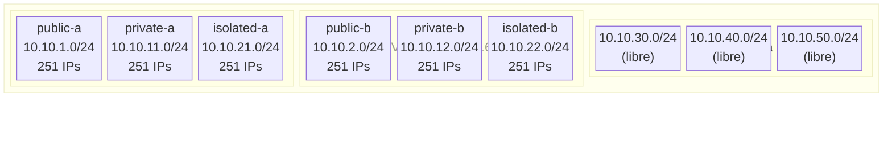

# Fase 0 — Planificación de Red

> **Tiempo:** ~20 min | **Coste:** 0€ | **Recursos creados:** ninguno

---

## Objetivo

Diseñar la red **antes** de tocar la consola. Un error de CIDR en producción implica redespliegue completo. Este paso simula lo que un arquitecto hace con papel y bolígrafo.

---

## Decisiones de diseño

### ¿Por qué /16 para la VPC?

| Opción | IPs disponibles | Subnets posibles (/24) | Veredicto |
|--------|----------------|------------------------|-----------|
| /24 | 251 | 1 | Demasiado pequeño |
| /20 | 4.091 | 16 | Ajustado para crecer |
| **/16** | **65.531** | **256** | **Estándar — suficiente headroom** |
| /8 | 16.7M | demasiado | Desperdicio |

AWS reserva 5 IPs por subnet (primera, segunda, tercera, cuarta y última). Con /24 tienes 251 IPs útiles. Suficiente para una subnet de propósito específico.

### ¿Por qué 2 AZs y no 3?

Para SAA-C03 y para este lab, 2 AZs cubren Alta Disponibilidad básica. Producción real en AWS suele usar 3 AZs para tolerancia a fallo de zona. La estructura que creamos es idéntica — solo añadirías un tercer bloque de subnets.

### ¿Por qué separar en 3 tiers?

```
public   → Recursos con IP pública (load balancers, bastions, NAT GW)
private  → Aplicación (no accesible directamente desde internet)
isolated → Base de datos / datos sensibles (sin ruta de salida a internet)
```

Este aislamiento es el patrón más común en SAA-C03 y en industria real. Cada tier tiene su propio route table y NACL.

---

## Tabla de CIDRs planificada



| Subnet | CIDR | AZ | Tier | IPs útiles | Uso |
|--------|------|-----|------|------------|-----|
| public-a | 10.10.1.0/24 | eu-west-1a | Pública | 251 | Bastion, NAT GW, futuros LBs |
| public-b | 10.10.2.0/24 | eu-west-1b | Pública | 251 | Redundancia pública |
| private-a | 10.10.11.0/24 | eu-west-1a | Privada | 251 | EC2 App, ECS Tasks, Lambda |
| private-b | 10.10.12.0/24 | eu-west-1b | Privada | 251 | Redundancia privada |
| isolated-a | 10.10.21.0/24 | eu-west-1a | Aislada | 251 | RDS, ElastiCache |
| isolated-b | 10.10.22.0/24 | eu-west-1b | Aislada | 251 | Réplica RDS |
| *reserva* | 10.10.30-99.0/24 | — | — | — | Expansión futura |

> **Regla nemotécnica:**
> - `10.10.1-2.x` → públicas (primer octeto bajo)
> - `10.10.11-12.x` → privadas (décimo)
> - `10.10.21-22.x` → aisladas (vigésimo)

---

## Route Tables planificadas

| Route Table | Destino | Target | Asociada a |
|-------------|---------|--------|------------|
| RT-Public | 0.0.0.0/0 | IGW | public-a, public-b |
| RT-Public | 10.10.0.0/16 | local | (automática) |
| RT-Private | 0.0.0.0/0 | NAT-GW-A | private-a, private-b |
| RT-Private | 10.10.0.0/16 | local | (automática) |
| RT-Private | pl-xxxxx (S3) | EP-S3 | private-a, private-b |
| RT-Isolated | 10.10.0.0/16 | local | isolated-a, isolated-b |
| RT-Isolated | pl-xxxxx (S3) | EP-S3 | isolated-a, isolated-b |

> ⚠️ **Atención:** RT-Isolated **no tiene ruta 0.0.0.0/0**. Esto es intencional — las bases de datos no deben salir a internet. La única salida es via VPC Endpoints privados.

---

## Security Groups planificados

| SG | Inbound | Desde | Outbound |
|----|---------|-------|----------|
| SG-Bastion | TCP 22 | Tu IP (`/32`) | TCP 22 → SG-App |
| SG-Web | TCP 80, 443 | 0.0.0.0/0 | TCP 8080 → SG-App |
| SG-App | TCP 8080 | SG-Web, SG-Bastion | TCP 5432 → SG-DB |
| SG-DB | TCP 5432 | SG-App | (ninguno necesario) |
| SG-Endpoints | TCP 443 | VPC CIDR (10.10.0.0/16) | — |

---

## Checklist de prerequisitos técnicos

Antes de continuar con Fase 1, verifica:

```bash
# 1. AWS CLI configurado
aws sts get-caller-identity

# 2. Región por defecto correcta
aws configure get region
# Esperado: eu-west-1

# 3. Permisos mínimos (debe devolver algo)
aws ec2 describe-vpcs --max-items 1

# 4. Quota de VPCs (límite default: 5 por región)
aws service-quotas get-service-quota \
  --service-code vpc \
  --quota-code L-F678F1CE \
  --query 'Quota.Value'
# Si tienes 5 VPCs creadas, borra una antes de continuar
```

✅ **Validación:** Los 4 comandos devuelven respuesta sin error de permisos.

---

## Pregunta de examen: Fase 0

> Una empresa tiene 3 VPCs con CIDR `10.0.0.0/24`. Quieren conectarlas via VPC Peering. ¿Cuál es el problema?

**Respuesta:** Los CIDRs se solapan. VPC Peering requiere CIDRs **no superpuestos**. Este es el motivo por el que planificar el espacio de direcciones antes de crear recursos es crítico — en AWS no puedes cambiar el CIDR principal de una VPC una vez creada (solo añadir secundarios).

---

**Siguiente fase:** [fase-01-red-basica.md](./fase-01-red-basica.md)
