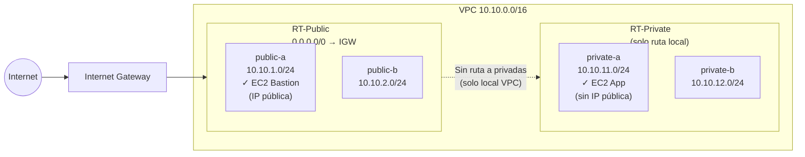

# Fase 1 — Red Básica 2-Tier

> **Tiempo:** ~45 min | **Coste:** 0€ | **Recursos creados:** VPC, 4 subnets, IGW, 2 Route Tables, 2 SGs, 1 EC2 (t3.micro)

---

## Objetivo

Construir la red de base: VPC, subnets públicas y privadas, Internet Gateway, Route Tables y Security Groups. Al final tendrás una EC2 en subnet pública accesible desde internet y otra en subnet privada sin acceso externo.

---

## Estado de la red al final de esta fase



---

## Paso 1 — Crear la VPC

**Consola:**
1. VPC > Your VPCs > **Create VPC**
2. Resources to create: **VPC only**
3. Name tag: `vpc-lab-dev`
4. IPv4 CIDR: `10.10.0.0/16`
5. IPv6: **No IPv6 CIDR block**
6. Tenancy: **Default**
7. Clic **Create VPC**

<details>
<summary>🔧 CLI equivalente</summary>

```bash
VPC_ID=$(aws ec2 create-vpc \
  --cidr-block 10.10.0.0/16 \
  --tag-specifications "ResourceType=vpc,Tags=[{Key=Name,Value=vpc-lab-dev},{Key=Project,Value=$PROJECT},{Key=Env,Value=$ENV}]" \
  --query 'Vpc.VpcId' \
  --output text)
echo "VPC_ID=$VPC_ID"

# Habilitar DNS hostnames (necesario para SSM y algunos servicios)
aws ec2 modify-vpc-attribute --vpc-id $VPC_ID --enable-dns-hostnames
aws ec2 modify-vpc-attribute --vpc-id $VPC_ID --enable-dns-support
```
</details>

✅ **Validación:** En VPC > Your VPCs aparece `vpc-lab-dev` con estado `Available` y CIDR `10.10.0.0/16`.

---

## Paso 2 — Crear las subnets

Crea las 4 subnets. Repite el proceso para cada una.

**Consola:** VPC > Subnets > **Create subnet** > selecciona `vpc-lab-dev`

| Nombre | CIDR | AZ | Auto-assign public IP |
|--------|------|-----|----------------------|
| `public-a` | 10.10.1.0/24 | eu-west-1a | **Sí** (solo en públicas) |
| `public-b` | 10.10.2.0/24 | eu-west-1b | **Sí** |
| `private-a` | 10.10.11.0/24 | eu-west-1a | No |
| `private-b` | 10.10.12.0/24 | eu-west-1b | No |

> ⚠️ **Atención:** El auto-assign de IP pública en subnets públicas es conveniente para el lab. En producción, se controla a nivel de instancia para ser más explícito.

<details>
<summary>🔧 CLI equivalente</summary>

```bash
# Públicas
SUBNET_PUB_A=$(aws ec2 create-subnet \
  --vpc-id $VPC_ID \
  --cidr-block 10.10.1.0/24 \
  --availability-zone eu-west-1a \
  --tag-specifications "ResourceType=subnet,Tags=[{Key=Name,Value=public-a},{Key=Project,Value=$PROJECT}]" \
  --query 'Subnet.SubnetId' --output text)

SUBNET_PUB_B=$(aws ec2 create-subnet \
  --vpc-id $VPC_ID \
  --cidr-block 10.10.2.0/24 \
  --availability-zone eu-west-1b \
  --tag-specifications "ResourceType=subnet,Tags=[{Key=Name,Value=public-b},{Key=Project,Value=$PROJECT}]" \
  --query 'Subnet.SubnetId' --output text)

# Privadas
SUBNET_PRIV_A=$(aws ec2 create-subnet \
  --vpc-id $VPC_ID \
  --cidr-block 10.10.11.0/24 \
  --availability-zone eu-west-1a \
  --tag-specifications "ResourceType=subnet,Tags=[{Key=Name,Value=private-a},{Key=Project,Value=$PROJECT}]" \
  --query 'Subnet.SubnetId' --output text)

SUBNET_PRIV_B=$(aws ec2 create-subnet \
  --vpc-id $VPC_ID \
  --cidr-block 10.10.12.0/24 \
  --availability-zone eu-west-1b \
  --tag-specifications "ResourceType=subnet,Tags=[{Key=Name,Value=private-b},{Key=Project,Value=$PROJECT}]" \
  --query 'Subnet.SubnetId' --output text)

# Habilitar auto-assign IP pública en públicas
aws ec2 modify-subnet-attribute --subnet-id $SUBNET_PUB_A --map-public-ip-on-launch
aws ec2 modify-subnet-attribute --subnet-id $SUBNET_PUB_B --map-public-ip-on-launch

echo "SUBNET_PUB_A=$SUBNET_PUB_A"
echo "SUBNET_PUB_B=$SUBNET_PUB_B"
echo "SUBNET_PRIV_A=$SUBNET_PRIV_A"
echo "SUBNET_PRIV_B=$SUBNET_PRIV_B"
```
</details>

✅ **Validación:** En VPC > Subnets aparecen las 4 subnets con su CIDR correcto y asociadas a `vpc-lab-dev`.

---

## Paso 3 — Crear y adjuntar el Internet Gateway

**Consola:**
1. VPC > Internet Gateways > **Create internet gateway**
2. Name tag: `igw-vpc-lab-dev`
3. Clic **Create internet gateway**
4. Acción: **Attach to VPC** → seleccionar `vpc-lab-dev`

<details>
<summary>🔧 CLI equivalente</summary>

```bash
IGW_ID=$(aws ec2 create-internet-gateway \
  --tag-specifications "ResourceType=internet-gateway,Tags=[{Key=Name,Value=igw-vpc-lab-dev},{Key=Project,Value=$PROJECT}]" \
  --query 'InternetGateway.InternetGatewayId' --output text)

aws ec2 attach-internet-gateway \
  --internet-gateway-id $IGW_ID \
  --vpc-id $VPC_ID

echo "IGW_ID=$IGW_ID"
```
</details>

✅ **Validación:** El IGW aparece con estado `Attached` a `vpc-lab-dev`.

---

## Paso 4 — Crear Route Tables

### RT-Public

**Consola:**
1. VPC > Route Tables > **Create route table**
2. Name: `rt-public`, VPC: `vpc-lab-dev`
3. Tras crearla: pestaña **Routes** > **Edit routes** > Add route:
   - Destination: `0.0.0.0/0`
   - Target: Internet Gateway → `igw-vpc-lab-dev`
4. Pestaña **Subnet associations** > **Edit subnet associations** → seleccionar `public-a` y `public-b`

### RT-Private

1. Crear route table: Name: `rt-private`, VPC: `vpc-lab-dev`
2. **No añadir ninguna ruta adicional** (solo la ruta `local` automática está bien por ahora)
3. Asociar: `private-a` y `private-b`

<details>
<summary>🔧 CLI equivalente</summary>

```bash
# RT-Public
RT_PUBLIC=$(aws ec2 create-route-table \
  --vpc-id $VPC_ID \
  --tag-specifications "ResourceType=route-table,Tags=[{Key=Name,Value=rt-public},{Key=Project,Value=$PROJECT}]" \
  --query 'RouteTable.RouteTableId' --output text)

aws ec2 create-route \
  --route-table-id $RT_PUBLIC \
  --destination-cidr-block 0.0.0.0/0 \
  --gateway-id $IGW_ID

aws ec2 associate-route-table --route-table-id $RT_PUBLIC --subnet-id $SUBNET_PUB_A
aws ec2 associate-route-table --route-table-id $RT_PUBLIC --subnet-id $SUBNET_PUB_B

# RT-Private
RT_PRIVATE=$(aws ec2 create-route-table \
  --vpc-id $VPC_ID \
  --tag-specifications "ResourceType=route-table,Tags=[{Key=Name,Value=rt-private},{Key=Project,Value=$PROJECT}]" \
  --query 'RouteTable.RouteTableId' --output text)

aws ec2 associate-route-table --route-table-id $RT_PRIVATE --subnet-id $SUBNET_PRIV_A
aws ec2 associate-route-table --route-table-id $RT_PRIVATE --subnet-id $SUBNET_PRIV_B

echo "RT_PUBLIC=$RT_PUBLIC"
echo "RT_PRIVATE=$RT_PRIVATE"
```
</details>

✅ **Validación:** RT-Public tiene 2 rutas (local + 0.0.0.0/0 → IGW). RT-Private tiene solo 1 ruta (local).

---

## Paso 5 — Crear Security Groups

### SG-Bastion

**Consola:** EC2 > Security Groups > **Create security group**

| Campo | Valor |
|-------|-------|
| Name | `sg-bastion` |
| VPC | `vpc-lab-dev` |
| Inbound | TCP 22, Source: **My IP** |
| Outbound | All traffic (default) |

### SG-App (para la EC2 en subnet privada)

| Campo | Valor |
|-------|-------|
| Name | `sg-app` |
| VPC | `vpc-lab-dev` |
| Inbound | TCP 22, Source: `sg-bastion` |
| Outbound | All traffic (default) |

<details>
<summary>🔧 CLI equivalente</summary>

```bash
# Tu IP pública actual
MY_IP=$(curl -s https://checkip.amazonaws.com)/32

# SG-Bastion
SG_BASTION=$(aws ec2 create-security-group \
  --group-name sgbastion \
  --description "SSH desde IP del admin" \
  --vpc-id $VPC_ID \
  --tag-specifications "ResourceType=security-group,Tags=[{Key=Name,Value=sg-bastion},{Key=Project,Value=$PROJECT}]" \
  --query 'GroupId' --output text)

aws ec2 authorize-security-group-ingress \
  --group-id $SG_BASTION \
  --protocol tcp --port 22 \
  --cidr $MY_IP

# SG-App
SG_APP=$(aws ec2 create-security-group \
  --group-name sgapp \
  --description "App tier - solo desde bastion" \
  --vpc-id $VPC_ID \
  --tag-specifications "ResourceType=security-group,Tags=[{Key=Name,Value=sg-app},{Key=Project,Value=$PROJECT}]" \
  --query 'GroupId' --output text)

aws ec2 authorize-security-group-ingress \
  --group-id $SG_APP \
  --protocol tcp --port 22 \
  --source-group $SG_BASTION

echo "SG_BASTION=$SG_BASTION"
echo "SG_APP=$SG_APP"
```
</details>

---

## Paso 6 — Lanzar EC2 en subnet pública (Bastion)

**Consola:** EC2 > Instances > **Launch instance**

| Campo | Valor |
|-------|-------|
| Name | `bastion-public-a` |
| AMI | Amazon Linux 2023 (x86_64) |
| Instance type | `t3.micro` |
| Key pair | Crear o seleccionar par de claves existente |
| VPC | `vpc-lab-dev` |
| Subnet | `public-a` |
| Auto-assign public IP | **Enable** |
| Security group | `sg-bastion` |
| Storage | 8 GiB gp3 (default) |

<details>
<summary>🔧 CLI equivalente</summary>

```bash
# AMI Amazon Linux 2023 más reciente en eu-west-1
AMI_ID=$(aws ec2 describe-images \
  --owners amazon \
  --filters "Name=name,Values=al2023-ami-2023*-x86_64" \
             "Name=state,Values=available" \
  --query 'sort_by(Images,&CreationDate)[-1].ImageId' \
  --output text)

# Crear key pair (si no tienes uno)
aws ec2 create-key-pair \
  --key-name vpc-lab-key \
  --query 'KeyMaterial' \
  --output text > ~/.ssh/vpc-lab-key.pem
chmod 400 ~/.ssh/vpc-lab-key.pem

# Lanzar bastion
BASTION_ID=$(aws ec2 run-instances \
  --image-id $AMI_ID \
  --instance-type t3.micro \
  --key-name vpc-lab-key \
  --subnet-id $SUBNET_PUB_A \
  --security-group-ids $SG_BASTION \
  --associate-public-ip-address \
  --tag-specifications "ResourceType=instance,Tags=[{Key=Name,Value=bastion-public-a},{Key=Project,Value=$PROJECT}]" \
  --query 'Instances[0].InstanceId' --output text)

echo "BASTION_ID=$BASTION_ID"

# Esperar hasta que esté running
aws ec2 wait instance-running --instance-ids $BASTION_ID

# Obtener IP pública
BASTION_IP=$(aws ec2 describe-instances \
  --instance-ids $BASTION_ID \
  --query 'Reservations[0].Instances[0].PublicIpAddress' \
  --output text)
echo "BASTION_IP=$BASTION_IP"
```
</details>

---

## Paso 7 — Lanzar EC2 en subnet privada

Igual que el paso anterior pero:
- Subnet: `private-a`
- Auto-assign public IP: **Disable**
- Security group: `sg-app`
- Name: `app-private-a`

<details>
<summary>🔧 CLI equivalente</summary>

```bash
APP_ID=$(aws ec2 run-instances \
  --image-id $AMI_ID \
  --instance-type t3.micro \
  --key-name vpc-lab-key \
  --subnet-id $SUBNET_PRIV_A \
  --security-group-ids $SG_APP \
  --no-associate-public-ip-address \
  --tag-specifications "ResourceType=instance,Tags=[{Key=Name,Value=app-private-a},{Key=Project,Value=$PROJECT}]" \
  --query 'Instances[0].InstanceId' --output text)

aws ec2 wait instance-running --instance-ids $APP_ID

APP_PRIV_IP=$(aws ec2 describe-instances \
  --instance-ids $APP_ID \
  --query 'Reservations[0].Instances[0].PrivateIpAddress' \
  --output text)
echo "APP_ID=$APP_ID"
echo "APP_PRIV_IP=$APP_PRIV_IP"
```
</details>

---

## Paso 8 — Validación completa

### 8.1 Conectar al bastion

```bash
ssh -i ~/.ssh/vpc-lab-key.pem ec2-user@$BASTION_IP
```

Desde el bastion, verifica que tiene acceso a internet:
```bash
curl -s https://checkip.amazonaws.com   # debe devolver la IP pública del bastion
ping -c 3 8.8.8.8                       # debe funcionar
```

### 8.2 Saltar al servidor privado (SSH agent forwarding)

```bash
# Desde tu máquina local (no desde el bastion)
ssh -i ~/.ssh/vpc-lab-key.pem \
    -J ec2-user@$BASTION_IP \
    ec2-user@$APP_PRIV_IP
```

Desde la EC2 privada, verifica que **NO** tiene salida a internet:
```bash
# Esto debe TIMEOUT (no hay ruta a internet desde la subnet privada aún)
curl --connect-timeout 5 https://checkip.amazonaws.com
# Error esperado: "Connection timed out" o "Network is unreachable"
```

✅ **Señales de éxito:**
- Bastion → internet: **funciona**
- Bastion → EC2 privada por SSH: **funciona**
- EC2 privada → internet: **NO funciona** (timeout) — esto es correcto, lo añadiremos en Fase 2

### 8.3 Verificar routing

```bash
# Verificar route tables desde CLI
aws ec2 describe-route-tables \
  --filters "Name=tag:Project,Values=$PROJECT" \
  --query 'RouteTables[*].[Tags[?Key==`Name`].Value|[0],Routes[*].[DestinationCidrBlock,GatewayId]]' \
  --output table
```

✅ **Validación final de fase:**

| Test | Esperado | Resultado |
|------|----------|-----------|
| SSH al bastion | Conecta | ☐ |
| curl internet desde bastion | Devuelve IP pública | ☐ |
| SSH a privada via bastion | Conecta | ☐ |
| curl internet desde privada | Timeout | ☐ |

---

> ⚠️ **Recuerda:** No borres las instancias EC2 al final de la sesión si vas a continuar con Fase 2 pronto. Si pausas más de un día, considera detenerlas (Stop, no Terminate) para ahorrar.

---

**Siguiente fase:** [fase-02-egress.md](./fase-02-egress.md)
