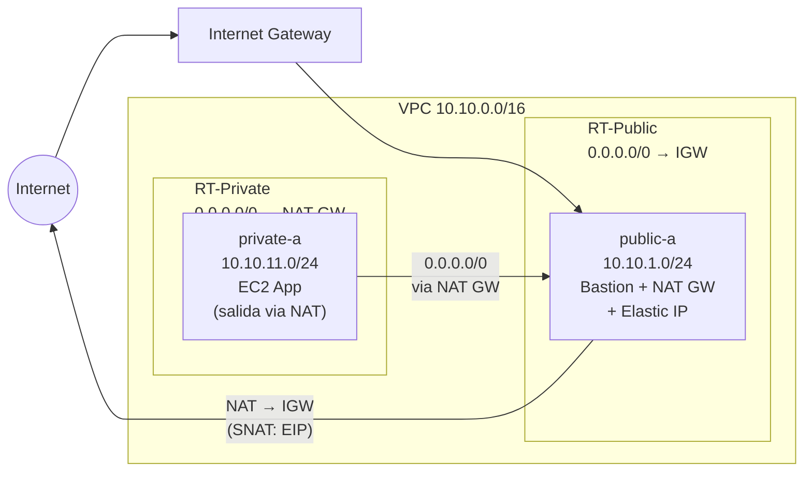

# Fase 2 — Egress Controlado (NAT Gateway)

> **Tiempo:** ~30 min | 💡 **COSTE:** ~0.048€/h NAT GW + 0.0045€/GB datos | **Borrar tras validar**

---

## Objetivo

Dar salida controlada a internet a las instancias en subnet privada mediante un NAT Gateway. Entender por qué el NAT GW vive en la subnet pública y la ruta por defecto apunta a él desde la privada.

---

## Estado de la red al final de esta fase



> **Concepto clave:** El NAT Gateway hace SNAT (Source NAT) — cambia la IP origen privada por la Elastic IP pública. Internet ve la EIP, no la IP de la EC2. Las respuestas vuelven a la EIP y el NAT las reenvía a la IP privada original.

---

## 💡 COSTE — Leer antes de crear

| Componente | Coste | Nota |
|------------|-------|------|
| NAT Gateway | 0.048 €/h | ~34€/mes si lo dejas encendido |
| Datos procesados | 0.0045 €/GB | Por cada GB que pase por el NAT |
| Elastic IP (sin asociar) | 0.005 €/h | Solo si queda sin asociar |

**Plan para este lab:** Crear el NAT GW, validar, y borrarlo. No lo dejes corriendo entre sesiones.

---

## Paso 1 — Allocate Elastic IP

**Consola:** EC2 > Elastic IPs > **Allocate Elastic IP address**
- Network border group: `eu-west-1`
- Tag Name: `eip-nat-public-a`
- Clic **Allocate**

<details>
<summary>🔧 CLI equivalente</summary>

```bash
EIP_ALLOC=$(aws ec2 allocate-address \
  --domain vpc \
  --tag-specifications "ResourceType=elastic-ip,Tags=[{Key=Name,Value=eip-nat-public-a},{Key=Project,Value=$PROJECT}]" \
  --query 'AllocationId' --output text)
echo "EIP_ALLOC=$EIP_ALLOC"
```
</details>

---

## Paso 2 — Crear NAT Gateway

**Consola:** VPC > NAT Gateways > **Create NAT gateway**

| Campo | Valor |
|-------|-------|
| Name | `nat-gw-public-a` |
| Subnet | `public-a` |
| Connectivity type | **Public** |
| Elastic IP | Seleccionar la EIP creada |

El NAT GW tarda ~1-2 minutos en estar `Available`.

<details>
<summary>🔧 CLI equivalente</summary>

```bash
NAT_GW_ID=$(aws ec2 create-nat-gateway \
  --subnet-id $SUBNET_PUB_A \
  --allocation-id $EIP_ALLOC \
  --tag-specifications "ResourceType=natgateway,Tags=[{Key=Name,Value=nat-gw-public-a},{Key=Project,Value=$PROJECT}]" \
  --query 'NatGateway.NatGatewayId' --output text)

echo "NAT_GW_ID=$NAT_GW_ID"
echo "Esperando a que el NAT GW esté disponible..."
aws ec2 wait nat-gateway-available --nat-gateway-ids $NAT_GW_ID
echo "NAT GW disponible."
```
</details>

---

## Paso 3 — Añadir ruta en RT-Private

**Consola:** VPC > Route Tables > seleccionar `rt-private`
- Pestaña **Routes** > **Edit routes** > **Add route**
- Destination: `0.0.0.0/0`
- Target: NAT Gateway → `nat-gw-public-a`
- Guardar

<details>
<summary>🔧 CLI equivalente</summary>

```bash
aws ec2 create-route \
  --route-table-id $RT_PRIVATE \
  --destination-cidr-block 0.0.0.0/0 \
  --nat-gateway-id $NAT_GW_ID
```
</details>

✅ **Validación:** RT-Private ahora tiene 2 rutas: `local` y `0.0.0.0/0 → nat-gw-public-a`.

---

## Paso 4 — Validar egress desde subnet privada

Conéctate a la EC2 en subnet privada (via bastion como en Fase 1):

```bash
ssh -i ~/.ssh/vpc-lab-key.pem \
    -J ec2-user@$BASTION_IP \
    ec2-user@$APP_PRIV_IP
```

Desde la EC2 privada:
```bash
# Debe funcionar ahora
curl -s https://checkip.amazonaws.com
# Resultado esperado: la Elastic IP del NAT GW (no la IP privada de la EC2)

# Resolución DNS también funciona
dig google.com +short

# Instalar paquete (para confirmar conectividad real)
sudo dnf install -y htop
# Debe descargarse sin errores
```

✅ **Señales de éxito:**
- `curl checkip.amazonaws.com` devuelve la EIP del NAT GW
- `dig` resuelve nombres de dominio
- `dnf install` descarga paquetes sin timeout

---

## Paso 5 — Entender el flujo con Flow Logs (preview)

Si miras los logs de la EC2 privada en este momento (lo haremos en Fase 5):
- La IP **origen** en paquetes salientes será `10.10.11.x` (IP privada)
- Pero en internet, la IP origen es la **EIP** del NAT GW
- Las respuestas vuelven a la EIP, el NAT GW las DNAT a `10.10.11.x`

---

## 🗑️ Borrar NAT GW AHORA (tras validar)

El NAT GW es el único recurso costoso de esta fase. Bórralo inmediatamente tras confirmar que funciona.

**Consola:** VPC > NAT Gateways > seleccionar `nat-gw-public-a` > Actions > **Delete NAT gateway**

Confirmar, y luego:
- EC2 > Elastic IPs > seleccionar `eip-nat-public-a` > Actions > **Release Elastic IP address**

<details>
<summary>🔧 CLI equivalente</summary>

```bash
# Borrar NAT GW
aws ec2 delete-nat-gateway --nat-gateway-id $NAT_GW_ID

# Esperar hasta que esté en estado 'deleted'
aws ec2 wait nat-gateway-deleted --nat-gateway-ids $NAT_GW_ID
echo "NAT GW borrado."

# Liberar EIP
aws ec2 release-address --allocation-id $EIP_ALLOC
echo "EIP liberada."

# Eliminar ruta 0.0.0.0/0 de RT-Private (opcional si vas directo a Fase 3)
aws ec2 delete-route \
  --route-table-id $RT_PRIVATE \
  --destination-cidr-block 0.0.0.0/0
```
</details>

---

## Conceptos de examen — Fase 2

### Pregunta frecuente: ¿Por qué el NAT GW en la subnet pública?

El NAT GW necesita:
1. Una **Elastic IP** (pública) para que internet pueda responder
2. Una **ruta a IGW** en su subnet para enviar el tráfico

Si lo pusieras en la subnet privada, no tendría ruta hacia internet → no funciona.

### Pregunta frecuente: ¿NAT GW vs NAT Instance?

| | NAT Gateway | NAT Instance |
|-|-------------|-------------|
| Gestión | Managed (AWS) | Self-managed (EC2) |
| Throughput | 45 Gbps | Limitado por tipo EC2 |
| Disponibilidad | Redundante en AZ | Single point of failure |
| Coste | Mayor | Menor (pero mantenimiento) |
| Security Groups | No aplica | Sí aplica |
| Recomendación SAA-C03 | **Sí (siempre)** | Solo si te preguntan por ahorro extremo |

### Trampa de examen: NAT GW y subnets privadas en distintas AZs

Si `private-b` (eu-west-1b) usa el NAT GW que está en `public-a` (eu-west-1a):
- **Funciona** técnicamente
- **Coste de tráfico inter-AZ:** 0.02€/GB
- **Recomendación producción:** un NAT GW por AZ

---

**Siguiente fase:** [fase-03-3tier.md](./fase-03-3tier.md)
