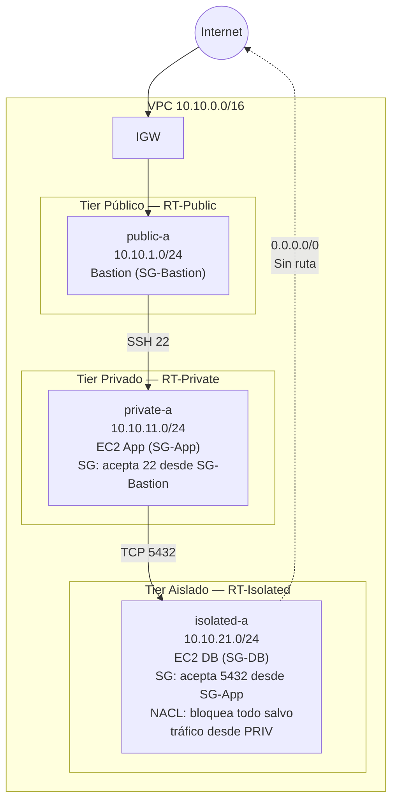

# Fase 3 — 3-Tier + Aislamiento (NACLs)

> **Tiempo:** ~45 min | 💡 **COSTE:** ~0.01€/h EC2 bastion (t3.micro spot) | **Coste total ~0.05€/sesión**

---

## Objetivo

Añadir la capa aislada (tier de base de datos) sin ruta a internet, y protegerla con NACLs stateless. Entender la diferencia práctica entre Security Groups (stateful) y NACLs (stateless) cuando coexisten.

---

## Estado de la red al final de esta fase



---

## Paso 1 — Crear subnets aisladas

**Consola:** VPC > Subnets > **Create subnet** > seleccionar `vpc-lab-dev`

| Nombre | CIDR | AZ | Auto-assign public IP |
|--------|------|-----|----------------------|
| `isolated-a` | 10.10.21.0/24 | eu-west-1a | **No** |
| `isolated-b` | 10.10.22.0/24 | eu-west-1b | **No** |

<details>
<summary>🔧 CLI equivalente</summary>

```bash
SUBNET_ISO_A=$(aws ec2 create-subnet \
  --vpc-id $VPC_ID \
  --cidr-block 10.10.21.0/24 \
  --availability-zone eu-west-1a \
  --tag-specifications "ResourceType=subnet,Tags=[{Key=Name,Value=isolated-a},{Key=Project,Value=$PROJECT}]" \
  --query 'Subnet.SubnetId' --output text)

SUBNET_ISO_B=$(aws ec2 create-subnet \
  --vpc-id $VPC_ID \
  --cidr-block 10.10.22.0/24 \
  --availability-zone eu-west-1b \
  --tag-specifications "ResourceType=subnet,Tags=[{Key=Name,Value=isolated-b},{Key=Project,Value=$PROJECT}]" \
  --query 'Subnet.SubnetId' --output text)

echo "SUBNET_ISO_A=$SUBNET_ISO_A"
echo "SUBNET_ISO_B=$SUBNET_ISO_B"
```
</details>

---

## Paso 2 — Crear RT-Isolated (sin ruta a internet)

**Consola:** VPC > Route Tables > **Create route table**
- Name: `rt-isolated`, VPC: `vpc-lab-dev`
- **No añadir ninguna ruta** (solo `local` es suficiente e intencional)
- Asociar: `isolated-a` e `isolated-b`

<details>
<summary>🔧 CLI equivalente</summary>

```bash
RT_ISOLATED=$(aws ec2 create-route-table \
  --vpc-id $VPC_ID \
  --tag-specifications "ResourceType=route-table,Tags=[{Key=Name,Value=rt-isolated},{Key=Project,Value=$PROJECT}]" \
  --query 'RouteTable.RouteTableId' --output text)

aws ec2 associate-route-table --route-table-id $RT_ISOLATED --subnet-id $SUBNET_ISO_A
aws ec2 associate-route-table --route-table-id $RT_ISOLATED --subnet-id $SUBNET_ISO_B

echo "RT_ISOLATED=$RT_ISOLATED"
```
</details>

✅ **Validación:** RT-Isolated tiene **solo una ruta**: `10.10.0.0/16 → local`. Ninguna ruta `0.0.0.0/0`.

---

## Paso 3 — Crear Security Group para la capa DB

**Consola:** EC2 > Security Groups > **Create security group**

| Campo | Valor |
|-------|-------|
| Name | `sg-db` |
| VPC | `vpc-lab-dev` |
| Inbound | TCP 22 desde `sg-app` (para la prueba con SSH; en prod sería 5432) |
| Outbound | All traffic (default) |

<details>
<summary>🔧 CLI equivalente</summary>

```bash
SG_DB=$(aws ec2 create-security-group \
  --group-name sg-db \
  --description "DB tier - solo desde app tier" \
  --vpc-id $VPC_ID \
  --tag-specifications "ResourceType=security-group,Tags=[{Key=Name,Value=sg-db},{Key=Project,Value=$PROJECT}]" \
  --query 'GroupId' --output text)

# Permitir SSH desde SG-App (para la prueba del lab)
aws ec2 authorize-security-group-ingress \
  --group-id $SG_DB \
  --protocol tcp --port 22 \
  --source-group $SG_APP

echo "SG_DB=$SG_DB"
```
</details>

---

## Paso 4 — Crear NACL para el tier aislado

Las NACLs son **stateless**: necesitas reglas tanto para entrada como para salida, incluyendo los puertos efímeros de respuesta.

**Consola:** VPC > Network ACLs > **Create network ACL**
- Name: `nacl-isolated`, VPC: `vpc-lab-dev`

### Reglas inbound (entrada a isolated)

**Consola:** Seleccionar NACL > pestaña **Inbound rules** > **Edit inbound rules**

| Rule # | Type | Protocol | Port | Source | Allow/Deny |
|--------|------|----------|------|--------|------------|
| 100 | Custom TCP | TCP | 22 | 10.10.11.0/24 (private-a) | **ALLOW** |
| 110 | Custom TCP | TCP | 22 | 10.10.12.0/24 (private-b) | **ALLOW** |
| 32767 | All traffic | All | All | 0.0.0.0/0 | **DENY** |

### Reglas outbound (salida desde isolated)

| Rule # | Type | Protocol | Port | Destination | Allow/Deny |
|--------|------|----------|------|-------------|------------|
| 100 | Custom TCP | TCP | 1024-65535 | 10.10.11.0/24 | **ALLOW** |
| 110 | Custom TCP | TCP | 1024-65535 | 10.10.12.0/24 | **ALLOW** |
| 32767 | All traffic | All | All | 0.0.0.0/0 | **DENY** |

> ⚠️ **Concepto clave — Puertos efímeros:** Las respuestas TCP se envían desde puertos **1024-65535** (el kernel elige el puerto efímero de respuesta). Como la NACL es stateless, debes permitir estos puertos en outbound para que las respuestas salgan. El Security Group no necesita esto porque es stateful.

### Asociar NACL a subnets aisladas

**Consola:** NACL `nacl-isolated` > pestaña **Subnet associations** > **Edit subnet associations** → seleccionar `isolated-a` e `isolated-b`

<details>
<summary>🔧 CLI equivalente</summary>

```bash
NACL_ISO=$(aws ec2 create-network-acl \
  --vpc-id $VPC_ID \
  --tag-specifications "ResourceType=network-acl,Tags=[{Key=Name,Value=nacl-isolated},{Key=Project,Value=$PROJECT}]" \
  --query 'NetworkAcl.NetworkAclId' --output text)

# Inbound: permitir SSH desde privadas
aws ec2 create-network-acl-entry --network-acl-id $NACL_ISO \
  --rule-number 100 --protocol tcp --rule-action allow \
  --ingress --cidr-block 10.10.11.0/24 \
  --port-range From=22,To=22

aws ec2 create-network-acl-entry --network-acl-id $NACL_ISO \
  --rule-number 110 --protocol tcp --rule-action allow \
  --ingress --cidr-block 10.10.12.0/24 \
  --port-range From=22,To=22

aws ec2 create-network-acl-entry --network-acl-id $NACL_ISO \
  --rule-number 32767 --protocol -1 --rule-action deny \
  --ingress --cidr-block 0.0.0.0/0

# Outbound: puertos efímeros hacia privadas (respuestas TCP)
aws ec2 create-network-acl-entry --network-acl-id $NACL_ISO \
  --rule-number 100 --protocol tcp --rule-action allow \
  --egress --cidr-block 10.10.11.0/24 \
  --port-range From=1024,To=65535

aws ec2 create-network-acl-entry --network-acl-id $NACL_ISO \
  --rule-number 110 --protocol tcp --rule-action allow \
  --egress --cidr-block 10.10.12.0/24 \
  --port-range From=1024,To=65535

aws ec2 create-network-acl-entry --network-acl-id $NACL_ISO \
  --rule-number 32767 --protocol -1 --rule-action deny \
  --egress --cidr-block 0.0.0.0/0

# Asociar a subnets aisladas
aws ec2 replace-network-acl-association \
  --network-acl-id $NACL_ISO \
  --association-id $(aws ec2 describe-network-acls \
    --filters "Name=association.subnet-id,Values=$SUBNET_ISO_A" \
    --query 'NetworkAcls[0].Associations[?SubnetId==`'$SUBNET_ISO_A'`].NetworkAclAssociationId' \
    --output text)

echo "NACL_ISO=$NACL_ISO"
```
</details>

---

## Paso 5 — Lanzar EC2 en subnet aislada

**Consola:** EC2 > Instances > **Launch instance**

| Campo | Valor |
|-------|-------|
| Name | `db-isolated-a` |
| AMI | Amazon Linux 2023 |
| Instance type | `t3.micro` |
| Key pair | `vpc-lab-key` |
| Subnet | `isolated-a` |
| Auto-assign public IP | **Disable** |
| Security group | `sg-db` |

<details>
<summary>🔧 CLI equivalente</summary>

```bash
DB_ID=$(aws ec2 run-instances \
  --image-id $AMI_ID \
  --instance-type t3.micro \
  --key-name vpc-lab-key \
  --subnet-id $SUBNET_ISO_A \
  --security-group-ids $SG_DB \
  --no-associate-public-ip-address \
  --tag-specifications "ResourceType=instance,Tags=[{Key=Name,Value=db-isolated-a},{Key=Project,Value=$PROJECT}]" \
  --query 'Instances[0].InstanceId' --output text)

aws ec2 wait instance-running --instance-ids $DB_ID

DB_PRIV_IP=$(aws ec2 describe-instances \
  --instance-ids $DB_ID \
  --query 'Reservations[0].Instances[0].PrivateIpAddress' \
  --output text)
echo "DB_ID=$DB_ID"
echo "DB_PRIV_IP=$DB_PRIV_IP"
```
</details>

---

## Paso 6 — Validación de aislamiento

### Desde bastion → privada → aislada (debe funcionar)

```bash
# Salto en cadena: local → bastion → app → db
ssh -i ~/.ssh/vpc-lab-key.pem \
    -J ec2-user@$BASTION_IP,ec2-user@$APP_PRIV_IP \
    ec2-user@$DB_PRIV_IP
```

Desde la EC2 aislada:
```bash
# Sin ruta a internet: debe dar timeout
curl --connect-timeout 5 https://google.com
# Esperado: "Connection timed out" ✓

# Sin DNS externo tampoco funciona (mismo motivo: no hay ruta)
dig google.com
# Esperado: timeout o SERVFAIL ✓

# Pero sí puede hacer ping dentro de la VPC
ping -c 3 $APP_PRIV_IP
# Esperado: funciona ✓ (ruta local en RT-Isolated)
```

### Verificar que NACL bloquea acceso directo desde pública

```bash
# Desde el bastion (public-a), intentar SSH directo a la DB (debe fallar)
ssh -i ~/.ssh/vpc-lab-key.pem ec2-user@$DB_PRIV_IP -o ConnectTimeout=5
# Esperado: timeout ✓ (NACL bloquea origen que no sea 10.10.11.0/24 o 10.10.12.0/24)
```

✅ **Tabla de validación:**

| Test | Esperado | Resultado |
|------|----------|-----------|
| bastion → app → db (doble salto SSH) | Conecta | ☐ |
| DB → internet (`curl google.com`) | Timeout | ☐ |
| Bastion → DB directo | Timeout (NACL) | ☐ |
| App → DB | Conecta (SG + NACL permiten) | ☐ |

---

## SG vs NACL — Comparativa práctica

Acabas de ver ambos mecanismos en acción. La diferencia clave:

| | Security Group | NACL |
|-|----------------|------|
| Estado | **Stateful** (respuestas automáticas) | **Stateless** (necesitas regla outbound) |
| Nivel | Instancia (ENI) | Subnet |
| Evaluación | Todas las reglas | Primera coincidencia (orden numérico) |
| Reglas | Solo ALLOW | ALLOW y DENY |
| Caso de uso | Control fino por servicio | Bloqueo por subnet/IP |

> ⚠️ **Trampa SAA-C03:** Si añades una NACL DENY en outbound para los puertos efímeros (1024-65535), el cliente recibirá el ACK TCP inicial del servidor pero nunca los datos de respuesta — la conexión parece "colgada". Los SGs nunca tienen este problema porque son stateful.

---

**Siguiente fase:** [fase-04-endpoints.md](./fase-04-endpoints.md)
