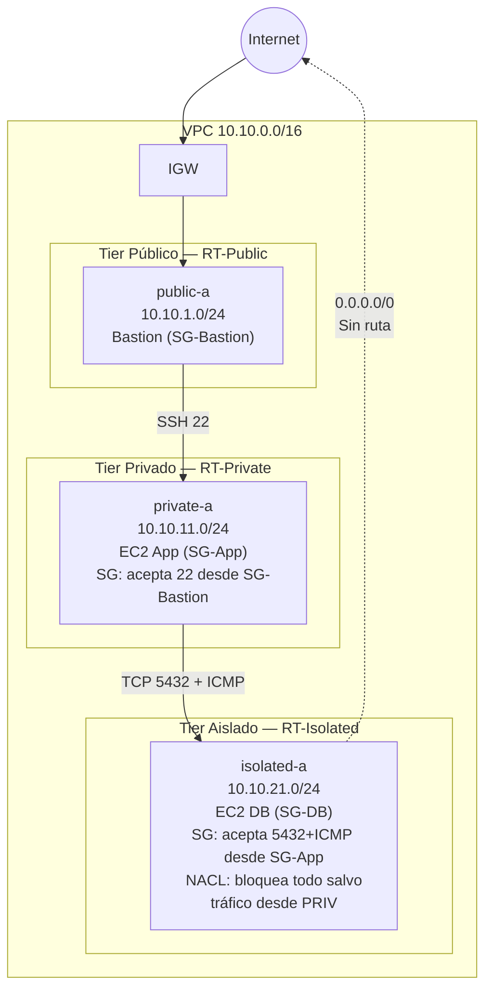

# Fase 3 — 3-Tier + Aislamiento (NACLs)

> **Tiempo:** ~45 min | 💡 **COSTE:** ~0.01€/h EC2 bastion (t3.micro spot) | **Coste total ~0.05€/sesión**

---

## Objetivo

Añadir la capa aislada (tier de base de datos) sin ruta a internet, y protegerla con NACLs stateless. Entender la diferencia práctica entre Security Groups (stateful) y NACLs (stateless) cuando coexisten.

---

## Estado de la red al final de esta fase



---

## Paso 1 — Crear subnets aisladas

**Consola:** VPC > Subnets > **Create subnet** > seleccionar `vpc-lab-dev`

| Nombre | CIDR | AZ | Auto-assign public IP |
|--------|------|-----|----------------------|
| `isolated-a` | 10.10.21.0/24 | eu-west-1a | **No** |
| `isolated-b` | 10.10.22.0/24 | eu-west-1b | **No** |

<details>
<summary>🔧 CLI equivalente</summary>

```bash
SUBNET_ISO_A=$(aws ec2 create-subnet \
  --vpc-id $VPC_ID \
  --cidr-block 10.10.21.0/24 \
  --availability-zone eu-west-1a \
  --tag-specifications "ResourceType=subnet,Tags=[{Key=Name,Value=isolated-a},{Key=Project,Value=$PROJECT}]" \
  --query 'Subnet.SubnetId' --output text)

SUBNET_ISO_B=$(aws ec2 create-subnet \
  --vpc-id $VPC_ID \
  --cidr-block 10.10.22.0/24 \
  --availability-zone eu-west-1b \
  --tag-specifications "ResourceType=subnet,Tags=[{Key=Name,Value=isolated-b},{Key=Project,Value=$PROJECT}]" \
  --query 'Subnet.SubnetId' --output text)

echo "SUBNET_ISO_A=$SUBNET_ISO_A"
echo "SUBNET_ISO_B=$SUBNET_ISO_B"
```
</details>

---

## Paso 2 — Crear RT-Isolated (sin ruta a internet)

**Consola:** VPC > Route Tables > **Create route table**
- Name: `rt-isolated`, VPC: `vpc-lab-dev`
- **No añadir ninguna ruta** (solo `local` es suficiente e intencional)
- Asociar: `isolated-a` e `isolated-b`

<details>
<summary>🔧 CLI equivalente</summary>

```bash
RT_ISOLATED=$(aws ec2 create-route-table \
  --vpc-id $VPC_ID \
  --tag-specifications "ResourceType=route-table,Tags=[{Key=Name,Value=rt-isolated},{Key=Project,Value=$PROJECT}]" \
  --query 'RouteTable.RouteTableId' --output text)

aws ec2 associate-route-table --route-table-id $RT_ISOLATED --subnet-id $SUBNET_ISO_A
aws ec2 associate-route-table --route-table-id $RT_ISOLATED --subnet-id $SUBNET_ISO_B

echo "RT_ISOLATED=$RT_ISOLATED"
```
</details>

✅ **Validación:** RT-Isolated tiene **solo una ruta**: `10.10.0.0/16 → local`. Ninguna ruta `0.0.0.0/0`.

---

## Paso 3 — Crear Security Group para la capa DB

**Consola:** EC2 > Security Groups > **Create security group**

| Campo | Valor |
|-------|-------|
| Name | `sg-db` |
| VPC | `vpc-lab-dev` |
| Inbound | TCP 5432 desde `sg-app` (puerto PostgreSQL — simula acceso real a BD) |
| Inbound | ICMP All desde `sg-app` (permite ping para validar conectividad) |
| Outbound | All traffic (default) |

> ⚠️ **Por qué 5432 y no 22:** El objetivo es simular la conectividad real de una capa de base de datos. El puerto SSH (22) pertenece a la capa de acceso operacional (bastion → SSM), no al tráfico de aplicación. Nada en `sg-db` escucha en 5432 durante el lab, pero `nc -zv` nos permite verificar que el tráfico llega a la instancia (responde "Connection refused") vs que está bloqueado por SG/NACL (responde con timeout).

<details>
<summary>🔧 CLI equivalente</summary>

```bash
SG_DB=$(aws ec2 create-security-group \
  --group-name sgdb \
  --description "DB tier - solo desde app tier" \
  --vpc-id $VPC_ID \
  --tag-specifications "ResourceType=security-group,Tags=[{Key=Name,Value=sg-db},{Key=Project,Value=$PROJECT}]" \
  --query 'GroupId' --output text)

# Permitir PostgreSQL desde SG-App (tráfico real de aplicación)
aws ec2 authorize-security-group-ingress \
  --group-id $SG_DB \
  --protocol tcp --port 5432 \
  --source-group $SG_APP

# Permitir ICMP desde SG-App (ping para validar conectividad)
aws ec2 authorize-security-group-ingress \
  --group-id $SG_DB \
  --protocol icmp --port -1 \
  --source-group $SG_APP

echo "SG_DB=$SG_DB"
```
</details>

---

## Paso 4 — Crear NACL para el tier aislado

Las NACLs son **stateless**: necesitas reglas tanto para entrada como para salida, incluyendo los puertos efímeros de respuesta.

**Consola:** VPC > Network ACLs > **Create network ACL**
- Name: `nacl-isolated`, VPC: `vpc-lab-dev`

### Reglas inbound (entrada a isolated)

**Consola:** Seleccionar NACL > pestaña **Inbound rules** > **Edit inbound rules**

| Rule # | Type | Protocol | Port | Source | Allow/Deny |
|--------|------|----------|------|--------|------------|
| 90  | Custom TCP | TCP | 1024-65535 | 0.0.0.0/0 (respuesta S3 vía Gateway EP) | **ALLOW** |
| 100 | Custom TCP | TCP | 5432 | 10.10.11.0/24 (private-a) | **ALLOW** |
| 110 | Custom TCP | TCP | 5432 | 10.10.12.0/24 (private-b) | **ALLOW** |
| 120 | All ICMP - IPv4 | ICMP | All | 10.10.11.0/24 (private-a) | **ALLOW** |
| 130 | All ICMP - IPv4 | ICMP | All | 10.10.12.0/24 (private-b) | **ALLOW** |
| 32767 | All traffic | All | All | 0.0.0.0/0 | **DENY** |

### Reglas outbound (salida desde isolated)

| Rule # | Type | Protocol | Port | Destination | Allow/Deny |
|--------|------|----------|------|-------------|------------|
| 90  | HTTPS | TCP | 443 | 0.0.0.0/0 (S3 vía Gateway Endpoint) | **ALLOW** |
| 100 | Custom TCP | TCP | 1024-65535 | 10.10.11.0/24 | **ALLOW** |
| 110 | Custom TCP | TCP | 1024-65535 | 10.10.12.0/24 | **ALLOW** |
| 120 | All ICMP - IPv4 | ICMP | All | 10.10.11.0/24 | **ALLOW** |
| 130 | All ICMP - IPv4 | ICMP | All | 10.10.12.0/24 | **ALLOW** |
| 32767 | All traffic | All | All | 0.0.0.0/0 | **DENY** |

> ℹ️ **Regla 90 y el Gateway Endpoint de S3:** Las NACLs no soportan prefix lists, por eso usamos `0.0.0.0/0`. Es seguro: `rt-isolated` no tiene ruta `0.0.0.0/0`, así que solo el tráfico que la VPC puede enrutar (S3 via prefix list) llega a su destino. El DENY implícito de la VPC hace el trabajo real.

> ⚠️ **Concepto clave — Puertos efímeros y ICMP en NACLs stateless:**
> - **TCP:** las respuestas salen por puertos efímeros **1024-65535**, necesitas permitirlos en outbound. Los SGs no necesitan esto porque son stateful.
> - **ICMP:** el echo-request llega (inbound) y el echo-reply sale (outbound). Como la NACL es stateless, necesitas permitir ICMP en **ambas direcciones**. Si solo abres inbound, el ping llega a la instancia pero la respuesta queda bloqueada y parece timeout.

### Asociar NACL a subnets aisladas

**Consola:** NACL `nacl-isolated` > pestaña **Subnet associations** > **Edit subnet associations** → seleccionar `isolated-a` e `isolated-b`

<details>
<summary>🔧 CLI equivalente</summary>

```bash
NACL_ISO=$(aws ec2 create-network-acl \
  --vpc-id $VPC_ID \
  --tag-specifications "ResourceType=network-acl,Tags=[{Key=Name,Value=nacl-isolated},{Key=Project,Value=$PROJECT}]" \
  --query 'NetworkAcl.NetworkAclId' --output text)

# Inbound: permitir PostgreSQL (5432) desde subnets privadas
aws ec2 create-network-acl-entry --network-acl-id $NACL_ISO \
  --rule-number 100 --protocol tcp --rule-action allow \
  --ingress --cidr-block 10.10.11.0/24 \
  --port-range From=5432,To=5432

aws ec2 create-network-acl-entry --network-acl-id $NACL_ISO \
  --rule-number 110 --protocol tcp --rule-action allow \
  --ingress --cidr-block 10.10.12.0/24 \
  --port-range From=5432,To=5432

# Inbound: permitir ICMP desde subnets privadas (ping hacia la DB)
aws ec2 create-network-acl-entry --network-acl-id $NACL_ISO \
  --rule-number 120 --protocol 1 --rule-action allow \
  --ingress --cidr-block 10.10.11.0/24 \
  --icmp-type-code Type=-1,Code=-1

aws ec2 create-network-acl-entry --network-acl-id $NACL_ISO \
  --rule-number 130 --protocol 1 --rule-action allow \
  --ingress --cidr-block 10.10.12.0/24 \
  --icmp-type-code Type=-1,Code=-1

# Inbound: respuestas TCP desde S3 vía Gateway Endpoint (puertos efímeros)
# NACLs no soportan prefix lists — 0.0.0.0/0 es seguro: rt-isolated no tiene ruta default
aws ec2 create-network-acl-entry --network-acl-id $NACL_ISO \
  --rule-number 90 --protocol tcp --rule-action allow \
  --ingress --cidr-block 0.0.0.0/0 \
  --port-range From=1024,To=65535

aws ec2 create-network-acl-entry --network-acl-id $NACL_ISO \
  --rule-number 32766 --protocol -1 --rule-action deny \
  --ingress --cidr-block 0.0.0.0/0

# Outbound: puertos efímeros hacia privadas (respuestas TCP de 5432)
aws ec2 create-network-acl-entry --network-acl-id $NACL_ISO \
  --rule-number 100 --protocol tcp --rule-action allow \
  --egress --cidr-block 10.10.11.0/24 \
  --port-range From=1024,To=65535

aws ec2 create-network-acl-entry --network-acl-id $NACL_ISO \
  --rule-number 110 --protocol tcp --rule-action allow \
  --egress --cidr-block 10.10.12.0/24 \
  --port-range From=1024,To=65535

# Outbound: ICMP hacia subnets privadas (echo-reply del ping)
# Necesario porque la NACL es stateless — sin esta regla el ping llega pero la respuesta queda bloqueada
aws ec2 create-network-acl-entry --network-acl-id $NACL_ISO \
  --rule-number 120 --protocol 1 --rule-action allow \
  --egress --cidr-block 10.10.11.0/24 \
  --icmp-type-code Type=-1,Code=-1

aws ec2 create-network-acl-entry --network-acl-id $NACL_ISO \
  --rule-number 130 --protocol 1 --rule-action allow \
  --egress --cidr-block 10.10.12.0/24 \
  --icmp-type-code Type=-1,Code=-1

# Outbound: HTTPS hacia S3 vía Gateway Endpoint
aws ec2 create-network-acl-entry --network-acl-id $NACL_ISO \
  --rule-number 90 --protocol tcp --rule-action allow \
  --egress --cidr-block 0.0.0.0/0 \
  --port-range From=443,To=443

aws ec2 create-network-acl-entry --network-acl-id $NACL_ISO \
  --rule-number 32766 --protocol -1 --rule-action deny \
  --egress --cidr-block 0.0.0.0/0

# Asociar a subnets aisladas
aws ec2 replace-network-acl-association \
  --network-acl-id $NACL_ISO \
  --association-id $(aws ec2 describe-network-acls \
    --filters "Name=association.subnet-id,Values=$SUBNET_ISO_A" \
    --query 'NetworkAcls[0].Associations[?SubnetId==`'$SUBNET_ISO_A'`].NetworkAclAssociationId' \
    --output text)

echo "NACL_ISO=$NACL_ISO"
```
</details>

---

## Paso 5 — Crear IAM Role para la instancia DB

La instancia aislada necesita un IAM role para poder registrarse con SSM y acceder a S3 (Fase 4). Crearlo **antes** de lanzar la instancia garantiza que el agente SSM arranca con credenciales disponibles y se registra en el primer intento.

**Consola:** IAM > Roles > **Create role**
- Trusted entity: **AWS service → EC2**
- Policies: `AmazonSSMManagedInstanceCore` + `AmazonS3ReadOnlyAccess`
- Name: `ec2-ssm-s3-role`

<details>
<summary>🔧 CLI equivalente</summary>

```bash
# Crear role con trust policy para EC2
aws iam create-role \
  --role-name ec2-ssm-s3-role \
  --assume-role-policy-document '{"Version":"2012-10-17","Statement":[{"Effect":"Allow","Principal":{"Service":"ec2.amazonaws.com"},"Action":"sts:AssumeRole"}]}'

aws iam attach-role-policy \
  --role-name ec2-ssm-s3-role \
  --policy-arn arn:aws:iam::aws:policy/AmazonSSMManagedInstanceCore

aws iam attach-role-policy \
  --role-name ec2-ssm-s3-role \
  --policy-arn arn:aws:iam::aws:policy/AmazonS3ReadOnlyAccess

aws iam create-instance-profile --instance-profile-name ec2-ssm-s3-profile
aws iam add-role-to-instance-profile \
  --instance-profile-name ec2-ssm-s3-profile \
  --role-name ec2-ssm-s3-role

echo "IAM role e instance profile listos."
```
</details>

> ⚠️ **Por qué dos policies:** `AmazonSSMManagedInstanceCore` da acceso a SSM Session Manager pero **no** incluye `s3:ListAllMyBuckets`. Para ejecutar `aws s3 ls` y demostrar que el Gateway Endpoint funciona en Fase 4, necesitamos también `AmazonS3ReadOnlyAccess`.

---

## Paso 6 — Lanzar EC2 en subnet aislada

**Consola:** EC2 > Instances > **Launch instance**

| Campo | Valor |
|-------|-------|
| Name | `db-isolated-a` |
| AMI | Amazon Linux 2023 |
| Instance type | `t3.micro` |
| Key pair | `vpc-lab-key` |
| Subnet | `isolated-a` |
| Auto-assign public IP | **Disable** |
| Security group | `sg-db` |
| IAM instance profile | `ec2-ssm-s3-profile` |

<details>
<summary>🔧 CLI equivalente</summary>

```bash
DB_ID=$(aws ec2 run-instances \
  --image-id $AMI_ID \
  --instance-type t3.micro \
  --key-name vpc-lab-key \
  --subnet-id $SUBNET_ISO_A \
  --security-group-ids $SG_DB \
  --no-associate-public-ip-address \
  --iam-instance-profile Name=ec2-ssm-s3-profile \
  --tag-specifications "ResourceType=instance,Tags=[{Key=Name,Value=db-isolated-a},{Key=Project,Value=$PROJECT}]" \
  --query 'Instances[0].InstanceId' --output text)

aws ec2 wait instance-running --instance-ids $DB_ID

DB_PRIV_IP=$(aws ec2 describe-instances \
  --instance-ids $DB_ID \
  --query 'Reservations[0].Instances[0].PrivateIpAddress' \
  --output text)
echo "DB_ID=$DB_ID"
echo "DB_PRIV_IP=$DB_PRIV_IP"
```
</details>

---

## Paso 7 — Validación de aislamiento

> ⚠️ **Prerequisito — instalar ncat en la EC2 app:** Amazon Linux 2023 no incluye `nc`. Instálalo antes de las pruebas:
> ```bash
> # Desde tu máquina local, entra a la EC2 app con ProxyJump:
> ssh -i ~/.ssh/vpc-lab-key.pem -J ec2-user@$BASTION_IP ec2-user@$APP_PRIV_IP
> # Dentro de la instancia app:
> sudo dnf install -y nmap-ncat
> ```

### Pruebas de conectividad desde la EC2 app hacia la DB

Usa `ssh -J` (ProxyJump) para llegar a la EC2 app directamente desde tu máquina local — la key y las variables (`$DB_PRIV_IP`) están disponibles en tu sesión local, no hace falta copiarlas al bastion:

```bash
# Acceder a la EC2 app con ProxyJump (desde tu máquina local)
ssh -i ~/.ssh/vpc-lab-key.pem -J ec2-user@$BASTION_IP ec2-user@$APP_PRIV_IP
```

Una vez dentro de la EC2 app, ejecutar con las IPs en texto plano (las variables no están disponibles en la sesión remota):

```bash
# Test 1: ping — valida que ICMP está permitido en SG-DB y en la NACL (ambas direcciones)
ping -c 3 <DB_PRIV_IP>
# Esperado: 3 packets transmitted, 3 received ✓

# Test 2: puerto 5432 — valida que el tráfico TCP de aplicación llega a la DB
# "Connection refused" = el tráfico LLEGA a la instancia pero no hay BD escuchando (correcto en el lab)
# "timeout"           = bloqueado por SG o NACL (problema de configuración)
ncat -zv <DB_PRIV_IP> 5432
# Esperado: Ncat: Connection refused ✓
```

> 💡 **"Connection refused" es una buena señal:** significa que el paquete llegó a la instancia destino y fue rechazado a nivel de aplicación (no hay proceso en 5432). Si hubiera un bloqueo a nivel de red (SG o NACL), el resultado sería timeout, no refused.

> ℹ️ **Verificar que la DB no tiene ruta a internet** se hace en **Fase 4, Validación combinada**, una vez que SSM esté operativo. Desde la sesión SSM: `curl --connect-timeout 5 https://google.com` → timeout ✓.

### Verificar que NACL bloquea acceso directo desde la subnet pública

Desde el bastion (ya conectado por SSH), intentar alcanzar la DB (debe dar timeout):

```bash
# Desde el bastion — usa las IPs en texto plano
ncat -zv -w 5 <DB_PRIV_IP> 5432
# Esperado: timeout ✓ (NACL solo permite origen 10.10.11.0/24 y 10.10.12.0/24)

ping -c 3 -W 3 <DB_PRIV_IP>
# Esperado: 100% packet loss ✓
```

✅ **Tabla de validación:**

| Test | Desde | Esperado | Resultado |
|------|-------|----------|-----------|
| `ping $DB_PRIV_IP` | EC2 app | 0% packet loss | ☐ |
| `nc -zv $DB_PRIV_IP 5432` | EC2 app | Connection refused (no timeout) | ☐ |
| `nc -zv $DB_PRIV_IP 5432` | Bastion | Timeout (NACL bloquea) | ☐ |
| `ping $DB_PRIV_IP` | Bastion | 100% packet loss (NACL bloquea) | ☐ |
| `curl https://google.com` desde la DB | EC2 db (via SSM) | Timeout | ☐ **Fase 4** |

---

## SG vs NACL — Comparativa práctica

Acabas de ver ambos mecanismos en acción. La diferencia clave:

| | Security Group | NACL |
|-|----------------|------|
| Estado | **Stateful** (respuestas automáticas) | **Stateless** (necesitas regla outbound) |
| Nivel | Instancia (ENI) | Subnet |
| Evaluación | Todas las reglas | Primera coincidencia (orden numérico) |
| Reglas | Solo ALLOW | ALLOW y DENY |
| Caso de uso | Control fino por servicio | Bloqueo por subnet/IP |

> ⚠️ **Trampa SAA-C03:** Si añades una NACL DENY en outbound para los puertos efímeros (1024-65535), el cliente recibirá el ACK TCP inicial del servidor pero nunca los datos de respuesta — la conexión parece "colgada". Los SGs nunca tienen este problema porque son stateful.

---

**Siguiente fase:** [fase-04-endpoints.md](./fase-04-endpoints.md)
