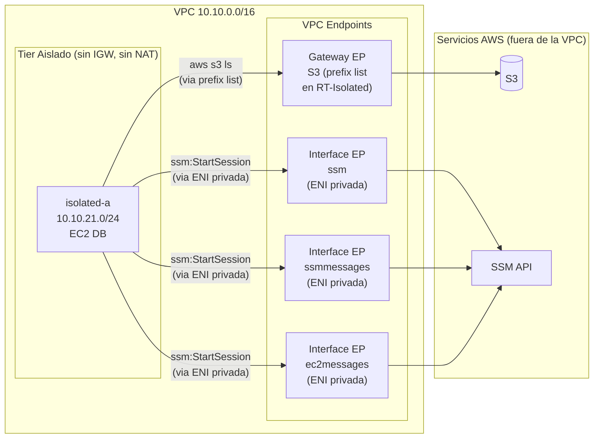

# Fase 4 — VPC Endpoints: Acceso Privado a AWS sin Internet

> **Tiempo:** ~40 min | 💡 **COSTE:** Interface Endpoints ~0.01€/h cada uno (x3 SSM = ~0.03€/h) | **Borrar tras validar**

---

## Objetivo

Demostrar que las instancias en la subnet **aislada** (sin ruta a internet) pueden acceder a servicios AWS mediante VPC Endpoints. Configuraremos:
- **Gateway Endpoint** para S3 (gratis, basado en route table)
- **Interface Endpoints** para SSM (reemplaza al bastion como método de acceso)

---

## Estado de la red al final de esta fase



---

## Parte A — Gateway Endpoint para S3

### ¿Por qué Gateway Endpoint?

| | Gateway Endpoint | Interface Endpoint |
|-|-----------------|-------------------|
| Servicios | S3, DynamoDB únicamente | Casi todos los servicios AWS |
| Coste | **Gratis** | ~0.01€/h por endpoint por AZ |
| Implementación | Entrada en route table (prefix list) | ENI privada en la subnet |
| DNS | Sin cambio DNS | Crea DNS privado |
| Uso recomendado | **S3/DynamoDB siempre** | Resto de servicios |

### Paso A1 — Crear Gateway Endpoint para S3

**Consola:** VPC > Endpoints > **Create endpoint**

| Campo | Valor |
|-------|-------|
| Name | `ep-s3-gateway` |
| Service category | **AWS services** |
| Service name | `com.amazonaws.eu-west-1.s3` (Type: **Gateway**) |
| VPC | `vpc-lab-dev` |
| Route tables | Seleccionar `rt-private` **y** `rt-isolated` |
| Policy | Full access (por ahora) |

> ⚠️ **Importante:** En la pantalla de creación verás que el endpoint modifica automáticamente las route tables seleccionadas añadiendo una entrada con prefix list (`pl-xxxxxxxx`) que apunta al endpoint. No necesitas añadir rutas manualmente.

<details>
<summary>🔧 CLI equivalente</summary>

```bash
# Obtener el prefix list ID de S3 en eu-west-1
S3_PREFIX=$(aws ec2 describe-prefix-lists \
  --filters "Name=prefix-list-name,Values=com.amazonaws.eu-west-1.s3" \
  --query 'PrefixLists[0].PrefixListId' --output text)

EP_S3=$(aws ec2 create-vpc-endpoint \
  --vpc-id $VPC_ID \
  --service-name com.amazonaws.eu-west-1.s3 \
  --vpc-endpoint-type Gateway \
  --route-table-ids $RT_PRIVATE $RT_ISOLATED \
  --tag-specifications "ResourceType=vpc-endpoint,Tags=[{Key=Name,Value=ep-s3-gateway},{Key=Project,Value=$PROJECT}]" \
  --query 'VpcEndpoint.VpcEndpointId' --output text)

echo "EP_S3=$EP_S3"
echo "S3_PREFIX=$S3_PREFIX"
```
</details>

✅ **Validación:** En rt-isolated aparece una nueva ruta: `pl-xxxxxxxx → vpce-xxxxxxxx`.

### Paso A2 — Validar acceso a S3 desde subnet aislada

```bash
# Conéctate a la EC2 aislada (via doble salto)
ssh -i ~/.ssh/vpc-lab-key.pem \
    -J ec2-user@$BASTION_IP,ec2-user@$APP_PRIV_IP \
    ec2-user@$DB_PRIV_IP

# Desde la EC2 aislada (sin internet), esto debe funcionar ahora:
aws s3 ls --region eu-west-1
# Debe listar tus buckets S3 (o devolver lista vacía sin error)

# Crear un archivo de prueba y subirlo
echo "test-desde-isolated" > /tmp/test.txt
aws s3 cp /tmp/test.txt s3://NOMBRE_TU_BUCKET/test.txt --region eu-west-1
# Debe funcionar sin NAT, sin IGW
```

✅ **Señales de éxito:**
- `aws s3 ls` devuelve respuesta (no timeout)
- El tráfico hacia S3 NO pasa por internet (puedes verificarlo en Flow Logs en Fase 5: verás `pl-` como destino, no `0.0.0.0/0`)

---

## Parte B — Interface Endpoints para SSM (sin Bastion)

SSM Session Manager permite acceder a EC2 sin SSH, sin bastions y sin IPs públicas. Necesita 3 endpoints:

| Endpoint | Para qué sirve |
|----------|---------------|
| `ssm` | API principal de SSM |
| `ssmmessages` | Canal de datos de Session Manager |
| `ec2messages` | Comunicación del agente SSM con la API EC2 |

### Paso B1 — Crear Security Group para los endpoints

Los Interface Endpoints son ENIs en tus subnets. Necesitan un SG que permita HTTPS desde la VPC.

**Consola:** EC2 > Security Groups > **Create security group**

| Campo | Valor |
|-------|-------|
| Name | `sg-endpoints` |
| VPC | `vpc-lab-dev` |
| Inbound | TCP 443 desde `10.10.0.0/16` (todo el CIDR VPC) |
| Outbound | All traffic (default) |

<details>
<summary>🔧 CLI equivalente</summary>

```bash
SG_ENDPOINTS=$(aws ec2 create-security-group \
  --group-name sg-endpoints \
  --description "HTTPS para Interface Endpoints" \
  --vpc-id $VPC_ID \
  --tag-specifications "ResourceType=security-group,Tags=[{Key=Name,Value=sg-endpoints},{Key=Project,Value=$PROJECT}]" \
  --query 'GroupId' --output text)

aws ec2 authorize-security-group-ingress \
  --group-id $SG_ENDPOINTS \
  --protocol tcp --port 443 \
  --cidr 10.10.0.0/16

echo "SG_ENDPOINTS=$SG_ENDPOINTS"
```
</details>

### Paso B2 — Actualizar NACL aislada para permitir HTTPS de retorno

Los Interface Endpoints responden por HTTPS (443). La NACL outbound de isolated necesita permitir los puertos efímeros hacia los endpoints. Como los endpoints están en la misma VPC, el tráfico es local:

**Consola:** VPC > Network ACLs > `nacl-isolated` > **Edit outbound rules**

Añadir (antes del DENY final):
| Rule # | Type | Protocol | Port | Destination | Allow/Deny |
|--------|------|----------|------|-------------|------------|
| 90 | Custom TCP | TCP | 1024-65535 | 10.10.21.0/24 | **ALLOW** |
| 91 | Custom TCP | TCP | 443 | 10.10.21.0/24 | **ALLOW** |

> **Nota:** Los endpoints SSM se crearán en `isolated-a` (10.10.21.0/24). Las respuestas HTTPS van a puertos efímeros del cliente.

### Paso B3 — Crear los 3 Interface Endpoints

💡 **COSTE:** Cada Interface Endpoint cuesta ~0.01€/h. Con 3 endpoints = ~0.03€/h ≈ 0.72€/día. Borrar tras validar.

**Consola:** Repetir para cada uno: VPC > Endpoints > **Create endpoint**

Configuración común:
| Campo | Valor |
|-------|-------|
| Service category | AWS services |
| VPC | `vpc-lab-dev` |
| Subnets | `isolated-a` (seleccionar la AZ eu-west-1a) |
| Security group | `sg-endpoints` |
| Enable DNS name | **Sí** (private DNS) |
| Policy | Full access |

| Endpoint | Service name |
|----------|-------------|
| `ep-ssm` | `com.amazonaws.eu-west-1.ssm` |
| `ep-ssmmessages` | `com.amazonaws.eu-west-1.ssmmessages` |
| `ep-ec2messages` | `com.amazonaws.eu-west-1.ec2messages` |

<details>
<summary>🔧 CLI equivalente</summary>

```bash
for SVC in ssm ssmmessages ec2messages; do
  EP_ID=$(aws ec2 create-vpc-endpoint \
    --vpc-id $VPC_ID \
    --service-name com.amazonaws.eu-west-1.$SVC \
    --vpc-endpoint-type Interface \
    --subnet-ids $SUBNET_ISO_A \
    --security-group-ids $SG_ENDPOINTS \
    --private-dns-enabled \
    --tag-specifications "ResourceType=vpc-endpoint,Tags=[{Key=Name,Value=ep-$SVC},{Key=Project,Value=$PROJECT}]" \
    --query 'VpcEndpoint.VpcEndpointId' --output text)
  echo "EP_${SVC}=$EP_ID"
done
```
</details>

### Paso B4 — Adjuntar IAM Role a la EC2 aislada

SSM requiere que la EC2 tenga el role `AmazonSSMManagedInstanceCore`.

**Consola:** EC2 > Instances > `db-isolated-a` > Actions > **Security** > **Modify IAM role**
- Si no tienes un Instance Profile con SSM, crea uno:
  - IAM > Roles > **Create role** > AWS service > EC2
  - Policy: `AmazonSSMManagedInstanceCore`
  - Name: `ec2-ssm-role`
- Asignar `ec2-ssm-role` a la instancia

<details>
<summary>🔧 CLI equivalente</summary>

```bash
# Crear role SSM si no existe
aws iam create-role \
  --role-name ec2-ssm-role \
  --assume-role-policy-document '{"Version":"2012-10-17","Statement":[{"Effect":"Allow","Principal":{"Service":"ec2.amazonaws.com"},"Action":"sts:AssumeRole"}]}'

aws iam attach-role-policy \
  --role-name ec2-ssm-role \
  --policy-arn arn:aws:iam::aws:policy/AmazonSSMManagedInstanceCore

# Crear instance profile
aws iam create-instance-profile --instance-profile-name ec2-ssm-profile
aws iam add-role-to-instance-profile \
  --instance-profile-name ec2-ssm-profile \
  --role-name ec2-ssm-role

# Asociar a la instancia DB (puede tardar 1-2 min en registrarse en SSM)
aws ec2 associate-iam-instance-profile \
  --instance-id $DB_ID \
  --iam-instance-profile Name=ec2-ssm-profile
```
</details>

### Paso B5 — Validar sesión SSM sin bastion

```bash
# Verificar que la instancia aparece en SSM (puede tardar 2-3 min)
aws ssm describe-instance-information \
  --filters "Key=InstanceIds,Values=$DB_ID" \
  --query 'InstanceInformationList[0].[InstanceId,PingStatus]' \
  --output text
# Esperado: DB_ID    Online

# Abrir sesión SSM (sin SSH, sin bastion, sin IP pública)
aws ssm start-session --target $DB_ID --region eu-west-1
# Aparece un shell en la instancia aislada
```

Desde dentro de la sesión SSM:
```bash
# Aún sin internet
curl --connect-timeout 3 https://google.com
# Timeout ✓

# Pero SSM funciona (por eso tienes este shell)
hostname && whoami
```

✅ **Tabla de validación:**

| Test | Esperado | Resultado |
|------|----------|-----------|
| `aws s3 ls` desde isolated (sin NAT) | Responde OK | ☐ |
| `aws ssm start-session` a DB | Abre shell | ☐ |
| `curl google.com` desde DB | Timeout | ☐ |
| Flow Logs: tráfico S3 sin internet | `pl-` en destino | ☐ (Fase 5) |

---

## 🗑️ Borrar Interface Endpoints tras validar

```bash
# Listar endpoints del proyecto
aws ec2 describe-vpc-endpoints \
  --filters "Name=tag:Project,Values=$PROJECT" \
             "Name=vpc-endpoint-type,Values=Interface" \
  --query 'VpcEndpoints[*].[VpcEndpointId,ServiceName,State]' \
  --output table

# Borrar (sustituir IDs)
aws ec2 delete-vpc-endpoints \
  --vpc-endpoint-ids vpce-xxx vpce-yyy vpce-zzz
```

> El Gateway Endpoint de S3 es gratis, puedes dejarlo.

---

## Conceptos de examen — Fase 4

### Endpoint Policy (control de acceso al endpoint)

Un Gateway Endpoint de S3 sin policy permite acceso a **cualquier bucket de S3**, incluso los de otras cuentas. Para restringirlo:

```json
{
  "Version": "2012-10-17",
  "Statement": [{
    "Effect": "Allow",
    "Principal": "*",
    "Action": ["s3:GetObject", "s3:PutObject"],
    "Resource": "arn:aws:s3:::mi-bucket-empresa/*",
    "Condition": {
      "StringEquals": {"aws:SourceVpc": "vpc-xxxxxxxxx"}
    }
  }]
}
```

### Trampa SAA-C03: Interface Endpoints y DNS

Cuando creas un Interface Endpoint con Private DNS habilitado, el nombre DNS de AWS (`ssm.eu-west-1.amazonaws.com`) resuelve a la IP **privada** de la ENI dentro de tu VPC. Si `enableDnsHostnames` o `enableDnsSupport` están desactivados en tu VPC, esto no funciona.

---

**Siguiente fase:** [fase-05-flowlogs.md](./fase-05-flowlogs.md)
