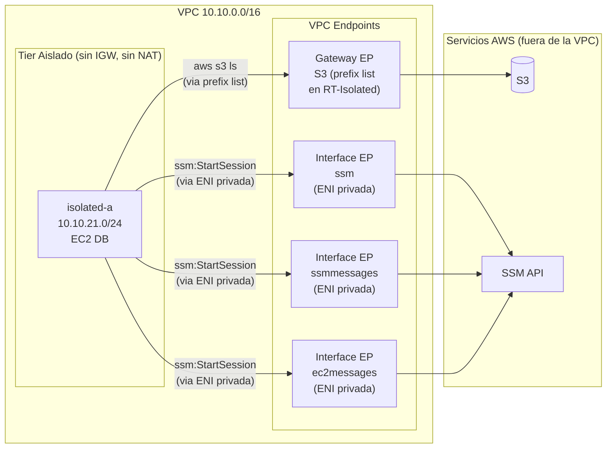

# Fase 4 — VPC Endpoints: Acceso Privado a AWS sin Internet

> **Tiempo:** ~40 min | 💡 **COSTE:** Interface Endpoints ~0.01€/h cada uno (x3 SSM = ~0.03€/h) | **Borrar tras validar**

---

## Objetivo

Demostrar que las instancias en la subnet **aislada** (sin ruta a internet) pueden acceder a servicios AWS mediante VPC Endpoints. Configuraremos:
- **Gateway Endpoint** para S3 (gratis, basado en route table)
- **Interface Endpoints** para SSM (reemplaza al bastion como método de acceso)

---

## Estado de la red al final de esta fase



---

## Prerequisito — IAM Role para la EC2 aislada

El IAM role `ec2-ssm-s3-role` y el instance profile `ec2-ssm-s3-profile` se crearon en **Fase 3, Paso 5** y se asociaron a la instancia DB en el momento de su lanzamiento. La instancia ya tiene credenciales disponibles desde el boot.

Verifica que el profile está correctamente asociado antes de continuar:

```bash
aws ec2 describe-iam-instance-profile-associations   --filters "Name=instance-id,Values=$DB_ID"   --query 'IamInstanceProfileAssociations[0].IamInstanceProfile.Arn'   --output text
# Esperado: arn:aws:iam::ACCOUNT_ID:instance-profile/ec2-ssm-s3-profile
```

> ⚠️ Si no ves el profile, vuelve a Fase 3 Paso 5 y créalo antes de continuar. Sin él, SSM no puede registrar la instancia y `aws s3 ls` fallará con error de credenciales.

---

## Parte A — Gateway Endpoint para S3

### ¿Por qué Gateway Endpoint?

| | Gateway Endpoint | Interface Endpoint |
|-|-----------------|-------------------|
| Servicios | S3, DynamoDB únicamente | Casi todos los servicios AWS |
| Coste | **Gratis** | ~0.01€/h por endpoint por AZ |
| Implementación | Entrada en route table (prefix list) | ENI privada en la subnet |
| DNS | Sin cambio DNS | Crea DNS privado |
| Uso recomendado | **S3/DynamoDB siempre** | Resto de servicios |

### Paso A1 — Crear Gateway Endpoint para S3

**Consola:** VPC > Endpoints > **Create endpoint**

| Campo | Valor |
|-------|-------|
| Name | `ep-s3-gateway` |
| Service category | **AWS services** |
| Service name | `com.amazonaws.eu-west-1.s3` (Type: **Gateway**) |
| VPC | `vpc-lab-dev` |
| Route tables | Seleccionar `rt-private` **y** `rt-isolated` |
| Policy | Full access (por ahora) |

> ⚠️ **Importante:** En la pantalla de creación verás que el endpoint modifica automáticamente las route tables seleccionadas añadiendo una entrada con prefix list (`pl-xxxxxxxx`) que apunta al endpoint. No necesitas añadir rutas manualmente.

<details>
<summary>🔧 CLI equivalente</summary>

```bash
# Obtener el prefix list ID de S3 en eu-west-1
S3_PREFIX=$(aws ec2 describe-prefix-lists \
  --filters "Name=prefix-list-name,Values=com.amazonaws.eu-west-1.s3" \
  --query 'PrefixLists[0].PrefixListId' --output text)

EP_S3=$(aws ec2 create-vpc-endpoint \
  --vpc-id $VPC_ID \
  --service-name com.amazonaws.eu-west-1.s3 \
  --vpc-endpoint-type Gateway \
  --route-table-ids $RT_PRIVATE $RT_ISOLATED \
  --tag-specifications "ResourceType=vpc-endpoint,Tags=[{Key=Name,Value=ep-s3-gateway},{Key=Project,Value=$PROJECT}]" \
  --query 'VpcEndpoint.VpcEndpointId' --output text)

echo "EP_S3=$EP_S3"
echo "S3_PREFIX=$S3_PREFIX"
```
</details>

✅ **Validación:** En rt-isolated aparece una nueva ruta: `pl-xxxxxxxx → vpce-xxxxxxxx`.

> ℹ️ La validación de acceso a S3 desde la instancia aislada se hace en la **sección de Validación combinada** al final de esta fase, una vez que los Interface Endpoints de SSM estén operativos. SSM es el mecanismo de acceso a la instancia aislada — sin él no podemos entrar a la EC2 para ejecutar el test.

---

## Parte B — Interface Endpoints para SSM (sin Bastion)

SSM Session Manager permite acceder a EC2 sin SSH, sin bastions y sin IPs públicas. Necesita 3 endpoints:

| Endpoint | Para qué sirve |
|----------|---------------|
| `ssm` | API principal de SSM |
| `ssmmessages` | Canal de datos de Session Manager |
| `ec2messages` | Comunicación del agente SSM con la API EC2 |

### Paso B1 — Crear Security Group para los endpoints

Los Interface Endpoints son ENIs en tus subnets. Necesitan un SG que permita HTTPS desde la VPC.

**Consola:** EC2 > Security Groups > **Create security group**

| Campo | Valor |
|-------|-------|
| Name | `sg-endpoints` |
| VPC | `vpc-lab-dev` |
| Inbound | TCP 443 desde `10.10.0.0/16` (todo el CIDR VPC) |
| Outbound | All traffic (default) |

<details>
<summary>🔧 CLI equivalente</summary>

```bash
SG_ENDPOINTS=$(aws ec2 create-security-group \
  --group-name sgendpoints \
  --description "HTTPS para Interface Endpoints" \
  --vpc-id $VPC_ID \
  --tag-specifications "ResourceType=security-group,Tags=[{Key=Name,Value=sg-endpoints},{Key=Project,Value=$PROJECT}]" \
  --query 'GroupId' --output text)

aws ec2 authorize-security-group-ingress \
  --group-id $SG_ENDPOINTS \
  --protocol tcp --port 443 \
  --cidr 10.10.0.0/16

echo "SG_ENDPOINTS=$SG_ENDPOINTS"
```
</details>

> 💡 **Por qué no necesitamos tocar la NACL para los Interface Endpoints:** Las NACLs actúan en el **borde de la subnet**, filtrando tráfico que entra o sale de ella. El tráfico entre la EC2 y la ENI del Interface Endpoint (ambos en `isolated-a`) es **intra-subnet** — nunca cruza el borde, por lo que la NACL no lo inspecciona. No hay ninguna regla adicional que añadir.

### Paso B2 — Crear los 3 Interface Endpoints

💡 **COSTE:** Cada Interface Endpoint cuesta ~0.01€/h. Con 3 endpoints = ~0.03€/h ≈ 0.72€/día. Borrar tras validar.

**Consola:** Repetir para cada uno: VPC > Endpoints > **Create endpoint**

Configuración común:
| Campo | Valor |
|-------|-------|
| Service category | AWS services |
| VPC | `vpc-lab-dev` |
| Subnets | `isolated-a` (seleccionar la AZ eu-west-1a) |
| Security group | `sg-endpoints` |
| Enable DNS name | **Sí** (private DNS) |
| Policy | Full access |

| Endpoint | Service name |
|----------|-------------|
| `ep-ssm` | `com.amazonaws.eu-west-1.ssm` |
| `ep-ssmmessages` | `com.amazonaws.eu-west-1.ssmmessages` |
| `ep-ec2messages` | `com.amazonaws.eu-west-1.ec2messages` |

<details>
<summary>🔧 CLI equivalente</summary>

```bash
for SVC in ssm ssmmessages ec2messages; do
  EP_ID=$(aws ec2 create-vpc-endpoint \
    --vpc-id $VPC_ID \
    --service-name com.amazonaws.eu-west-1.$SVC \
    --vpc-endpoint-type Interface \
    --subnet-ids $SUBNET_ISO_A \
    --security-group-ids $SG_ENDPOINTS \
    --private-dns-enabled \
    --tag-specifications "ResourceType=vpc-endpoint,Tags=[{Key=Name,Value=ep-$SVC},{Key=Project,Value=$PROJECT}]" \
    --query 'VpcEndpoint.VpcEndpointId' --output text)
  echo "EP_${SVC}=$EP_ID"
done
```
</details>

### Paso B3 — Verificar IAM Role en la instancia

El role `ec2-ssm-s3-role` ya se creó y asoció en el **Prerequisito** al inicio de esta fase. Verifica que está correctamente adjunto antes de continuar:

```bash
# Confirmar que la instancia tiene el instance profile
aws ec2 describe-iam-instance-profile-associations \
  --filters "Name=instance-id,Values=$DB_ID" \
  --query 'IamInstanceProfileAssociations[0].IamInstanceProfile.Arn' \
  --output text
# Esperado: arn:aws:iam::ACCOUNT_ID:instance-profile/ec2-ssm-s3-profile
```

> ⚠️ Si no ves el profile, vuelve al Prerequisito y ejecútalo antes de continuar. SSM no podrá contactar con la instancia sin el role.

### Paso B4 — Validar sesión SSM sin bastion

```bash
# Verificar que la instancia aparece en SSM (puede tardar 2-3 min)
aws ssm describe-instance-information \
  --filters "Key=InstanceIds,Values=$DB_ID" \
  --query 'InstanceInformationList[0].[InstanceId,PingStatus]' \
  --output text
# Esperado: DB_ID    Online

# Abrir sesión SSM (sin SSH, sin bastion, sin IP pública)
aws ssm start-session --target $DB_ID --region eu-west-1
# Aparece un shell en la instancia aislada
```

Desde dentro de la sesión SSM:
```bash
# SSM funciona (por eso tienes este shell)
hostname && whoami

# Sin internet (sin NAT, sin IGW)
curl --connect-timeout 3 https://google.com
# Timeout ✓
```

---

## Validación combinada — S3 desde la instancia aislada

Con SSM funcionando ya puedes entrar a la EC2 aislada sin bastion ni SSH. Desde la sesión SSM valida el Gateway Endpoint de S3:

```bash
# Abrir sesión SSM a la DB (desde tu máquina local)
aws ssm start-session --target $DB_ID --region eu-west-1

# Una vez dentro de la sesión SSM, ejecutar:

# Test 1: S3 accesible sin internet (via Gateway Endpoint)
aws s3 ls --region eu-west-1
# Debe listar tus buckets o devolver lista vacía — en ambos casos, SIN timeout ni error de credenciales ✓

# Test 2: sin internet (RT-Isolated no tiene ruta 0.0.0.0/0)
curl --connect-timeout 5 https://google.com
# Timeout ✓

# Test 3: SSM es el único canal — el agente del SSM usa los Interface Endpoints, no internet
hostname
# Muestra el hostname de db-isolated-a ✓
```

> 💡 **Distinción clave S3 vs internet:** `aws s3 ls` funciona porque S3 se alcanza por el prefix list en la route table (Gateway Endpoint). `curl google.com` falla porque no hay ruta `0.0.0.0/0` en RT-Isolated. Dos destinos diferentes, dos paths diferentes — uno dentro de la red AWS, el otro hacia internet.

✅ **Tabla de validación:**

| Test | Desde | Esperado | Resultado |
|------|-------|----------|-----------|
| `aws ssm start-session` a DB | Máquina local | Abre shell | ☐ |
| `aws s3 ls` dentro de SSM | EC2 db-isolated | Lista OK (no timeout) | ☐ |
| `curl google.com` dentro de SSM | EC2 db-isolated | Timeout (sin internet) | ☐ |
| Flow Logs: tráfico S3 sin IGW | — | `pl-` como destino, no `0.0.0.0/0` | ☐ (Fase 5) |

---

## 🗑️ Borrar Interface Endpoints tras validar

```bash
# Listar endpoints del proyecto
aws ec2 describe-vpc-endpoints \
  --filters "Name=tag:Project,Values=$PROJECT" \
             "Name=vpc-endpoint-type,Values=Interface" \
  --query 'VpcEndpoints[*].[VpcEndpointId,ServiceName,State]' \
  --output table

# Borrar (sustituir IDs)
aws ec2 delete-vpc-endpoints \
  --vpc-endpoint-ids vpce-xxx vpce-yyy vpce-zzz
```

> El Gateway Endpoint de S3 es gratis, puedes dejarlo.

---

## Conceptos de examen — Fase 4

### Endpoint Policy (control de acceso al endpoint)

Un Gateway Endpoint de S3 sin policy permite acceso a **cualquier bucket de S3**, incluso los de otras cuentas. Para restringirlo:

```json
{
  "Version": "2012-10-17",
  "Statement": [{
    "Effect": "Allow",
    "Principal": "*",
    "Action": ["s3:GetObject", "s3:PutObject"],
    "Resource": "arn:aws:s3:::mi-bucket-empresa/*",
    "Condition": {
      "StringEquals": {"aws:SourceVpc": "vpc-xxxxxxxxx"}
    }
  }]
}
```

### Trampa SAA-C03: Interface Endpoints y DNS

Cuando creas un Interface Endpoint con Private DNS habilitado, el nombre DNS de AWS (`ssm.eu-west-1.amazonaws.com`) resuelve a la IP **privada** de la ENI dentro de tu VPC. Si `enableDnsHostnames` o `enableDnsSupport` están desactivados en tu VPC, esto no funciona.

---

**Siguiente fase:** [fase-05-flowlogs.md](./fase-05-flowlogs.md)
