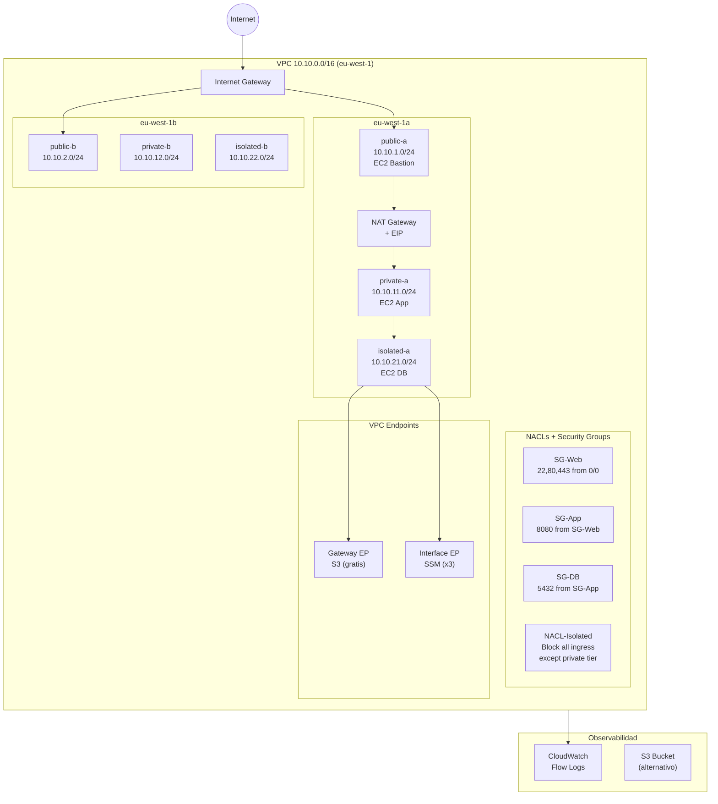

# Lab 01 — VPC desde Cero: 2-tier → 3-tier → PrivateLink → IaC

> **Nivel:** SAA-C03 Asociado
> **Región:** eu-west-1 (Irlanda)
> **Coste máximo estimado:** < 1€ por sesión completa (< 20€/mes)
> **Tiempo total:** ~4-5 horas (puede hacerse en sesiones independientes)

---

## Objetivo

Construir una VPC de producción paso a paso, entendiendo **por qué** cada decisión existe, no solo **cómo** ejecutarla. Al terminar habrás construido y destruido la misma infraestructura de tres formas: consola, CLI y Terraform con CI/CD.

---

## Prerequisitos

- Cuenta AWS con permisos de administrador (o política mínima: VPC, EC2, CloudWatch, IAM, S3)
- AWS CLI v2 configurado: `aws configure` con `default region = eu-west-1`
- Verificación: `aws sts get-caller-identity` debe devolver tu Account ID
- Para la Fase 6 (IaC): Terraform ≥ 1.12, Atmos 1.208.0, repositorio GitHub, secretos configurados

---

## Arquitectura final (todas las fases)



---

## Fases del lab

| Fase | Nombre | Duración | Coste sesión | Archivo |
|------|--------|----------|--------------|---------|
| 0 | Planificación de red | 20 min | 0€ | [fase-00-planning.md](./fase-00-planning.md) |
| 1 | Red básica 2-tier | 45 min | 0€ | [fase-01-red-basica.md](./fase-01-red-basica.md) |
| 2 | Egress controlado (NAT GW) | 30 min | ~0.10€ | [fase-02-egress.md](./fase-02-egress.md) |
| 3 | 3-tier + aislamiento (NACLs) | 45 min | ~0.05€ | [fase-03-3tier.md](./fase-03-3tier.md) |
| 4 | VPC Endpoints (sin internet) | 40 min | ~0.10€ | [fase-04-endpoints.md](./fase-04-endpoints.md) |
| 5 | Flow Logs + Troubleshooting | 50 min | ~0.05€ | [fase-05-flowlogs.md](./fase-05-flowlogs.md) |
| 6 | IaC: Terraform + CI/CD | 60 min | 0€ extra | [fase-06-iac.md](./fase-06-iac.md) |
| — | Limpieza (cleanup) | 15 min | libera coste | [cleanup.md](./cleanup.md) |

> **Nota sobre costes:** El único recurso costoso es el NAT Gateway (~0.048€/h + datos). Cada fase que lo usa indica explícitamente cuándo borrarlo. Los Interface Endpoints de SSM cuestan ~0.01€/h. El resto (VPC, subnets, IGW, route tables, SGs, Gateway Endpoints) es **gratuito**.

---

## Variables de entorno comunes

Exporta estas variables al inicio de cada sesión. Las fases posteriores las reutilizan:

```bash
# Identidad y región
export AWS_REGION="eu-west-1"
export AWS_ACCOUNT=$(aws sts get-caller-identity --query Account --output text)

# Proyecto (tag unificado para identificar todos los recursos)
export PROJECT="vpc-lab"
export ENV="dev"

# CIDRs (se rellenan en Fase 0, se exportan a partir de Fase 1)
export VPC_CIDR="10.10.0.0/16"

# IDs de recursos (se irán rellenando en cada fase)
export VPC_ID=""          # rellena en Fase 1
export SUBNET_PUB_A=""    # rellena en Fase 1
export SUBNET_PUB_B=""    # rellena en Fase 1
export SUBNET_PRIV_A=""   # rellena en Fase 1
export SUBNET_PRIV_B=""   # rellena en Fase 1
export SUBNET_ISO_A=""    # rellena en Fase 3
export SUBNET_ISO_B=""    # rellena en Fase 3
export IGW_ID=""
export RT_PUBLIC=""
export RT_PRIVATE=""
export RT_ISOLATED=""
export NAT_GW_ID=""       # temporal en Fase 2
export EIP_ALLOC=""       # temporal en Fase 2
```

---

## Convenciones del lab

| Icono | Significado |
|-------|-------------|
| 💡 **COSTE** | Recurso que genera coste — leer antes de crear |
| ✅ **Validación** | Señal de éxito esperada — si no la ves, revisa el paso anterior |
| 🗑️ **Borrar ya** | Borrar inmediatamente tras validar para no acumular coste |
| ⚠️ **Atención** | Error común del examen o del lab |
| 🔧 **CLI** | Bloque CLI equivalente a los pasos de consola |

---

## Limpieza

Antes de terminar cada sesión ejecuta siempre el [cleanup.md](./cleanup.md). El orden de borrado importa: los recursos con dependencias deben borrarse antes que sus dependencias.

---

## Relación con el concept map

Este lab es el complemento práctico de:
`../../concept-map/vpc-sa-associate-concept-map.md`

Las secciones relevantes por fase:
- Fase 1 → Secciones 3 (Subnets), 4 (Route Tables), 5 (IGW), 11 (Security Groups)
- Fase 2 → Sección 6 (NAT Gateway), Sección 7 (Egress patterns)
- Fase 3 → Sección 10 (NACLs)
- Fase 4 → Secciones 12 (Gateway Endpoints), 13 (Interface Endpoints / PrivateLink)
- Fase 5 → Sección 19 (Flow Logs troubleshooting)
